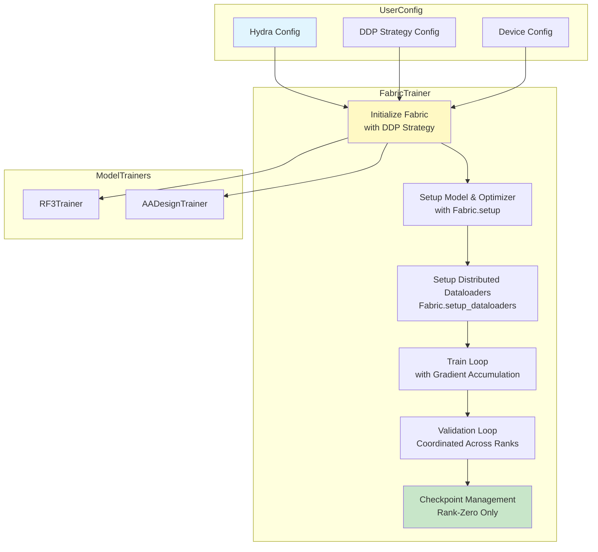

---
slug:15-distributed-training-with-ddp
blog_type:normal
---


Foundry 提供了一套基于 PyTorch Lightning Fabric 的分布式数据并行（DDP）策略构建的综合分布式训练基础设施。该实现抽象了多 GPU 训练的复杂性，同时提供了对分布式执行参数的细粒度控制，从而能够在多个设备和节点上高效地训练大规模蛋白质模型。

来源：[fabric.py](src/foundry/trainers/fabric.py#L52-L171)，[rf3.py](models/rf3/src/rf3/trainers/rf3.py#L36-L153)

## 架构概述

分布式训练架构以 `FabricTrainer` 抽象基类为中心，该类作为所有特定模型训练器的基础框架。此类集成了 PyTorch Lightning Fabric，以自动处理 DDP 初始化、梯度同步和分布式状态管理。

该架构遵循分层设计，其中 Fabric 管理底层的分布式原语，而特定模型的训练器实现领域训练逻辑。关键的架构组件包括策略选择逻辑、分布式数据加载器设置以及跨进程的协调检查点管理。



来源：[fabric.py](src/foundry/trainers/fabric.py#L1-L7)，[fabric.py](src/foundry/trainers/fabric.py#L52-L171)

## DDP 策略配置

`FabricTrainer` 构造函数通过几个关键参数提供了全面的 DDP 配置。`strategy` 参数接受 "ddp" 作为主要的分布式训练策略，并额外支持 "dp"、"ddp_spawn"、"deepspeed" 和 "fsdp"。当在非交互式多设备环境中选择 DDP 时，训练器会自动实例化具有可配置选项的自定义 `DDPStrategy`。

两个关键的 DDP 特定参数能够针对各种训练场景进行微调：`nccl_timeout`（默认：3200 秒）控制 NCCL 集合操作的超时时间，而 `find_unused_parameters`（默认：False）决定 DDP 是否应搜索并跳过对未接收梯度的参数的梯度同步。设置 `find_unused_parameters=True` 会带来性能损耗，但对于部分模型冻结等特定用例至关重要。

训练器基于运行时环境检测智能调整策略选择——在交互式环境或单设备设置中自动切换到 "auto"，而在生产多 GPU 训练中应用自定义 DDP 配置。

来源：[fabric.py](src/foundry/trainers/fabric.py#L125-L136)

| 参数 | 类型 | 默认值 | 描述 |
|-----------|------|---------|-------------|
| `strategy` | str | `"ddp"` | 分布式训练策略 |
| `devices_per_node` | int/list/str | `"auto"` | 每个节点的 GPU 数量或特定 GPU ID |
| `num_nodes` | int | `1` | 多节点训练的机器数量 |
| `accelerator` | str | `"auto"` | 硬件加速器 |
| `precision` | str | `"bf16-mixed"` | 精度模式 (64, 32, 16-mixed, bf16-mixed) |
| `nccl_timeout` | int | `3200` | NCCL 操作超时时间（秒），仅限 DDP |
| `find_unused_parameters` | bool | `False` | 允许 DDP 跳过未使用的参数梯度 |

来源：[fabric.py](src/foundry/trainers/fabric.py#L52-L124)

## 分布式设置与初始化

分布式训练生命周期始于通过 Fabric 的分布式上下文对模型、优化器和调度器进行的策略性设置。`setup_model_optimizers_and_schedulers()` 方法使用 `fabric.setup()` 封装模型和优化器组件，自动处理 DDP 模型封装和跨进程的优化器分布。此设置必须在模型构建之后但在训练开始之前进行。

数据加载器分布通过 `fabric.setup_dataloaders()` 管理，并带有关键的 `use_distributed_sampler=False` 标志。Foundry 的架构在数据加载器内部采用自定义分布式采样器，而不是依赖 Fabric 的默认采样器注入，从而实现针对蛋白质建模需求定制的更复杂的数据分布策略。

<CgxTip>训练器通过将配置的示例数乘以所有节点上的 GPU 数量来计算每个周期的有效示例数：`len(train_loader) * self.fabric.world_size`。这确保了无论分布式设置如何，周期定义保持一致，并且如果请求的示例数超过可用数据，会自动发出警告。</CgxTip>

来源：[fabric.py](src/foundry/trainers/fabric.py#L278-L302)，[fabric.py](src/foundry/trainers/fabric.py#L330-L351)

## 具有分布式协调的训练循环

分布式训练循环实现了跨进程的梯度累积和同步的复杂协调。`train_loop()` 方法处理支持梯度累积的批次，控制优化器步骤发生的时间以及通过 DDP 的 all-reduce 操作同步梯度的时间。

该循环跟踪传递给 `training_step()` 的 `is_accumulating` 状态，该状态指示当前批次是否属于累积序列。当累积完成（由 `batch_idx + 1 % grad_accum_steps == 0` 确定）时，优化器执行步骤并在所有进程间同步梯度。这种模式允许有效批次大小超过 GPU 内存容量，同时保持 DDP 的高效梯度聚合。

Fabric 自动处理关键的分布式细节：在迭代数据加载器时调用 `set_sampler_epoch()` 确保每个周期使用不同的随机排列，而 `_FabricOptimizer` 封装器在优化器步骤期间触发适当的回调。训练器还维护感知 rank 的全局步数跟踪，每个进程在优化后独立增加其步数计数器。

来源：[fabric.py](src/foundry/trainers/fabric.py#L477-L563)

## 分布式上下文中的验证

验证循环在所有分布式 rank 上以相同方式执行，每个 rank 处理其验证数据集的分片。`validation_loop()` 方法接受命名验证加载器的字典，从而能够在单个分布式传递中进行全面的多指标评估。

与训练不同，验证不涉及梯度同步或优化器步骤，使其更简单，但仍需要协调以进行指标聚合。Fabric 的上下文管理器确保每个 rank 独立处理其分配的验证样本，在需要时通常由 rank-zero 日志记录处理输出聚合。

`validate_every_n_epochs` 参数控制训练期间的验证频率，并支持在第一个训练周期之前进行可选的预验证。这允许在不影响训练计划的情况下收集基线指标和早期问题检测。

来源：[fabric.py](src/foundry/trainers/fabric.py#L565-L626)，[fabric.py](src/foundry/trainers/fabric.py#L920-L923)

## 分布式检查点管理

在 DDP 环境中，检查点管理需要仔细协调以确保跨进程的状态一致。Foundry 实现了 rank-zero 检查点策略，其中仅主进程将检查点写入磁盘，从而防止因并发写入导致文件损坏。

`save_checkpoint()` 方法使用 `ranked_logger`（配置为 `rank_zero_only=True`）确保检查点操作仅在指定的主进程上执行。保存的状态包括模型权重、优化器状态、调度器状态以及当前周期和全局步数等训练元数据。Fabric 的 `save()` 方法处理底层序列化，自动在注册的组件上调用 `state_dict()`。

在检查点加载期间，`load_checkpoint()` 方法接受检查点文件的路径或预加载的字典，支持训练恢复和推理场景。加载过程通过 `reset_optimizer` 和 `weight_loading_config` 参数提供灵活控制，从而实现诸如从预训练权重进行微调而不恢复优化器状态等场景。权重加载策略通过感知大小的部分加载优雅地处理架构不匹配。

来源：[fabric.py](src/foundry/trainers/fabric.py#L782-L895)

## 配置示例

DDP 配置通常通过使用 Hydra 组合系统的 YAML 配置文件指定。RF3 和 RFD3 模型都提供 `ddp.yaml` 模板，可以将其与训练配置组合。

### RF3 DDP 配置

```yaml
# models/rf3/configs/trainer/ddp.yaml
strategy: ddp
accelerator: gpu
devices_per_node: 1
num_nodes: 1
```

此配置随后被组合到完整的训练器配置中：

```yaml
# models/rf3/configs/trainer/rf3.yaml
defaults:
  - ddp
  - loss: structure_prediction
  - metrics: structure_prediction

_target_: rf3.trainers.rf3.RF3Trainer
validate_every_n_epochs: 1
max_epochs: 10_000
n_examples_per_epoch: 24000
precision: bf16-mixed
```

### RFD3 DDP 配置

RFD3 提供类似的配置，并针对特定设计的训练增加了额外的超参数：

```yaml
# models/rfd3/configs/trainer/ddp.yaml
strategy: ddp
accelerator: gpu
devices_per_node: 1
num_nodes: 1
```

```yaml
# models/rfd3/configs/trainer/rfd3_base.yaml
defaults:
  - ddp
  - loss/losses/diffusion_loss@loss.diffusion_loss
  - metrics: design_metrics

_target_: rfd3.trainer.rfd3.AADesignTrainer
n_examples_per_epoch: 2400
checkpoint_every_n_epochs: 10
validate_every_n_epochs: 4
max_epochs: 100_000
grad_accum_steps: 3
skip_optimizer_loading: True
precision: bf16-mixed
```

来源：[ddp.yaml](models/rf3/configs/trainer/ddp.yaml)，[rf3.yaml](models/rf3/configs/trainer/rf3.yaml)，[ddp.yaml](models/rfd3/configs/trainer/ddp.yaml)，[rfd3_base.yaml](models/rfd3/configs/trainer/rfd3_base.yaml)

## 特定模型的训练器实现

特定模型的训练器扩展 `FabricTrainer` 以实现领域逻辑，同时继承所有分布式训练功能。`RF3Trainer` 类实现了 AF3 风格的结构预测训练，具有专门的损失计算和指标收集方法。

`RF3Trainer` 中的 `training_step()` 方法处理前向传播、损失计算和反向传播，同时遵循 DDP 的累积状态。类似地，`validation_step()` 在不进行梯度计算的情况下执行推理和指标收集。这些方法从训练循环接收 `is_accumulating` 参数，从而在需要时为累积步骤启用条件逻辑。

RFD3 的 `AADesignTrainer` 遵循相同的模式，但实现了针对序列生成和结构指标的设计特定逻辑。这两个训练器都展示了领域专业知识如何与分布式训练基础无缝集成，而无需实现 DDP 特定的逻辑。

来源：[rf3.py](models/rf3/src/rf3/trainers/rf3.py#L36-L486)，[rfd3.py](models/rfd3/src/rfd3/trainer/rfd3.py#L32-L486)

## 性能优化考虑因素

几个关键因素会影响 Foundry 架构中 DDP 训练的性能。梯度累积有效地增加了批次大小，同时减少了内存压力，代价是参数更新之间的有效延迟更长。应根据每 GPU 批次大小、GPU 数量和累积步数的乘积仔细校准 `n_examples_per_epoch` 参数。

混合精度训练（`precision: "bf16-mixed"` 或 `"16-mixed"`）在现代 GPU 上提供显著的速度提升和内存节省，且对精度影响最小。`clip_grad_max_norm` 参数启用梯度裁剪以进行训练稳定性，这在分布式场景中的大批次情况下尤为重要。

<CgxTip>使用 `find_unused_parameters=True` 训练时（对于部分冻结的模型是必要的），请仔细监控性能，因为 DDP 会产生额外的开销来在每个步骤中识别未使用的参数。如果性能下降显著，请考虑参数过滤等替代方法。</CgxTip>

对于多节点训练，确保网络基础设施高效支持 NCCL 集合操作。可以增加 `nccl_timeout` 参数以进行大规模部署，但这可能会掩盖潜在的连接问题。使用 `nccl-tests` 等工具进行系统分析有助于在生产训练运行之前识别瓶颈。

来源：[fabric.py](src/foundry/trainers/fabric.py#L52-L124)，[rf3.yaml](models/rf3/configs/trainer/rf3.yaml#L15-L21)

## 常见 DDP 问题故障排除

**超时错误**：NCCL 超时错误通常表示网络连接问题或进程受阻。增加 `nccl_timeout` 以进行调试，但应调查潜在的网络问题。确保防火墙规则允许所有必要的端口，并且所有节点具有相同版本的 PyTorch 和 CUDA。

**梯度同步问题**：当模型具有冻结或部分使用的参数时，设置 `find_unused_parameters=True` 以防止 DDP 错误。但是，请注意性能影响。对于具有未使用参数的生产训练，请考虑架构重构以避免此标志。

**指标不一致**：如果验证指标在不同 rank 之间不同，请确保数据加载器采样器使用一致的随机种子或实现 rank-zero 指标聚合。配置了 `rank_zero_only=True` 的 `ranked_logger` 有助于协调输出，但不聚合计算。

**检查点加载失败**：使用不同的 GPU 数量或架构恢复训练时，请使用 `reset_optimizer=True` 和 `weight_loading_config` 参数来优雅地处理状态不匹配。系统为丢失或多余的键提供详细日志记录以诊断问题。

来源：[fabric.py](src/foundry/trainers/fabric.py#L114-L117)，[fabric.py](src/foundry/trainers/fabric.py#L835-L895)

## 与训练流水线的集成

DDP 实现与 Foundry 的广泛训练基础设施无缝集成。`FabricTrainer` 通过 Fabric 的 hook 系统与回调、记录器和指标系统协调。诸如 `on_train_epoch_start`、`on_train_batch_end` 和 `on_save_checkpoint` 之类的回调为自定义分布式行为提供了扩展点。

训练框架还与用于状态持久化的 [检查点管理系统](8-checkpoint-management-system) 以及用于监控分布式训练进度的 [回调和指标记录](17-callbacks-and-metrics-logging) 集成。Hydra 的配置系统使得在不同训练场景中灵活组合 DDP 参数与特定模型设置成为可能。