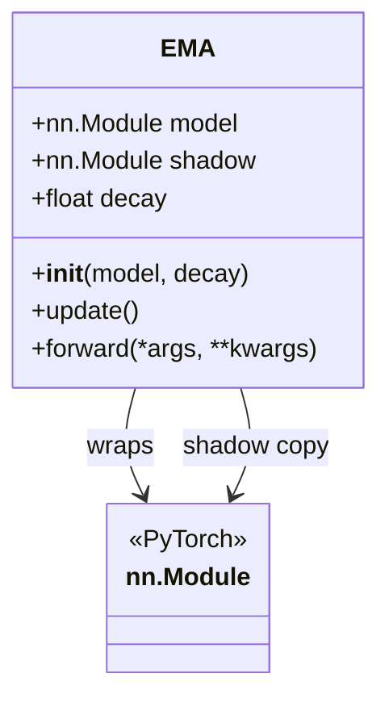
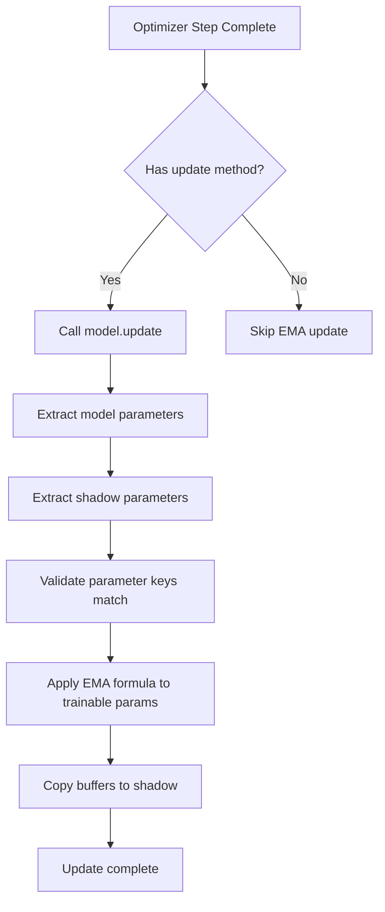
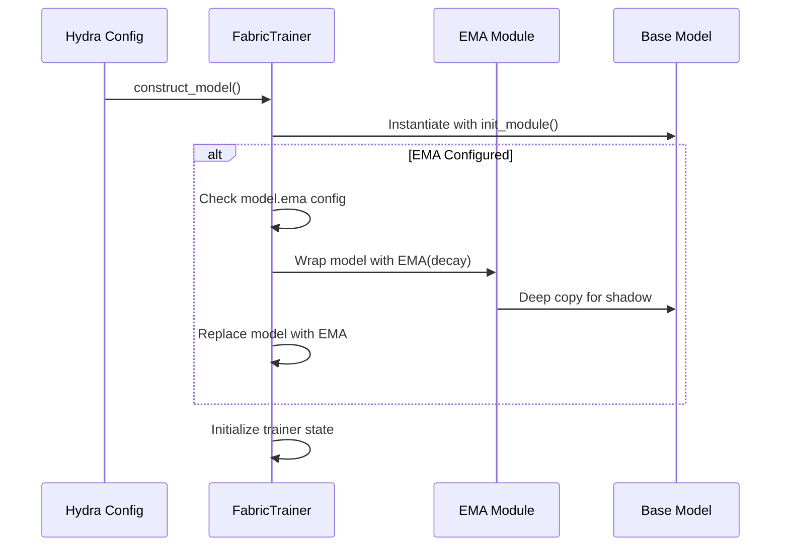
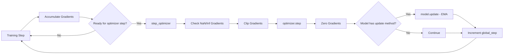
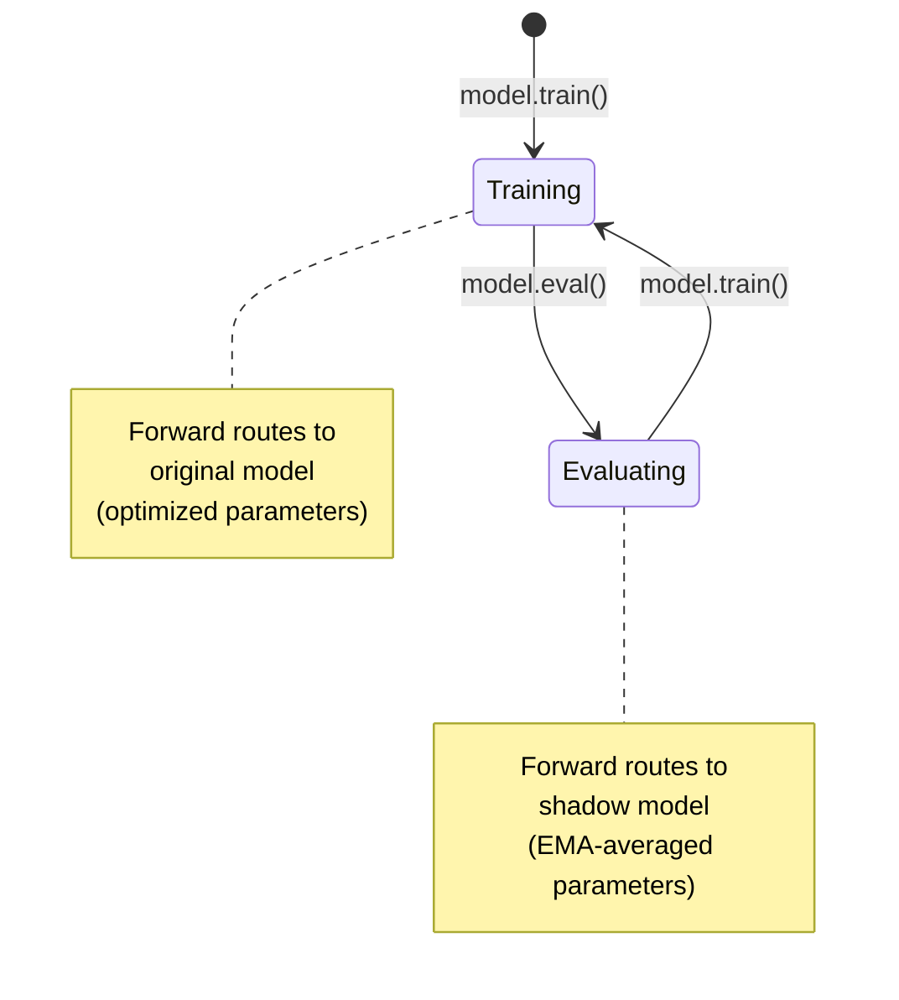
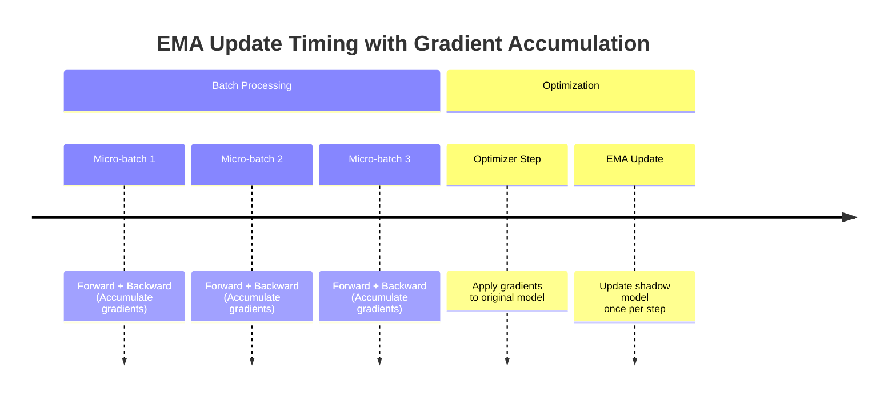

---
slug:16-exponential-moving-average-implementation
blog_type:normal
---


Foundry 中的指数移动平均（EMA）系统提供了一种强大的机制，用于在训练期间维护模型参数的平滑阴影副本。该实现通过在训练迭代中对参数进行平均来增强模型的稳定性和泛化能力，这对于像 RFdiffusion3 这样的生成模型和像 RosettaFold3 这样的结构预测网络尤其有价值。

## 数学基础

EMA 算法维护一个模型参数的阴影副本，该副本根据指数移动平均公式进行更新：

```
shadow_t = decay × shadow_{t-1} + (1 - decay) × θ_t
```

其中 `θ_t` 表示第 `t` 次迭代时的当前模型参数，`decay`（通常为 0.999）控制平滑因子。该公式确保了最近的参数更新具有更强的影响力，同时保持了对参数轨迹的长期记忆。

来源：[EMA.py](src/foundry/training/EMA.py#L8-L24)

## 核心实现架构

EMA 系统实现为一个 PyTorch `nn.Module` 包装器，它通过透明的接口与现有模型无缝集成。该架构由三个主要组件组成：EMA 包装器类、更新机制和动态调度逻辑。

### EMA 模块结构



EMA 类维护两个模型实例：原始模型（通过标准优化进行训练）和阴影模型（通过 EMA 算法进行更新）。两个模型共享相同的架构，但维护独立的参数状态。

来源：[EMA.py](src/foundry/training/EMA.py#L8-L23)

### 参数更新机制

更新过程在每次优化器步骤之后进行，并遵循系统化的方法：



更新机制区分了可训练参数和缓冲区。可训练参数接收 EMA 转换，而缓冲区（如批归一化统计信息等不可训练状态）则被直接复制以保持一致性。

来源：[EMA.py](src/foundry/training/EMA.py#L30-L60)

### 动态调度模式

EMA 模块根据模型的训练状态实现智能路由：

| 训练状态 | 前向行为 | 用例 |
|---------------|------------------|----------|
| `model.train()` | 路由到原始模型 | 标准训练迭代 |
| `model.eval()` | 路由到阴影模型 | 验证、推理、检查点保存 |

这种设计实现了自动模型选择，而无需训练代码进行显式干预，确保评估始终使用经过 EMA 平滑的参数。

来源：[EMA.py](src/foundry/training/EMA.py#L62-L68)

## 与训练框架的集成

FabricTrainer 通过无缝集成模式提供原生 EMA 支持，该模式处理模型包装、参数更新和检查点管理。

### 模型包装工作流



模型构建过程会自动检测 EMA 配置，并在训练器状态初始化之前包装模型。此过程发生在 Fabric 的 `init_module()` 上下文中，以确保正确的设备放置和精度处理。

来源：[fabric.py](src/foundry/trainers/fabric.py#L255-L280)

### 训练循环集成

EMA 更新在训练循环中每次优化器步骤后自动触发：



训练器的 `step_optimizer()` 方法在优化器步骤和梯度清零后执行 EMA 更新，确保阴影模型反映最新的参数状态。

来源：[fabric.py](src/foundry/trainers/fabric.py#L697-L755)

### 验证模式切换

验证循环通过 `eval()` 模式转换自动切换到阴影模型：



这种自动模式切换确保验证指标始终反映 EMA 平滑后的参数，而无需手动干预。

来源：[fabric.py](src/foundry/trainers/fabric.py#L565-L630)

## 配置系统

EMA 配置遵循 Foundry 的分层 Hydra 结构，支持每个模型的自定义，同时在整个训练流程中保持一致性。

### 配置结构

```yaml
# models/rfd3/configs/model/components/ema.yaml
decay: 0.999  # From AF-3
```

EMA 配置通过 Hydra 的组合机制组合到基础模型配置中：

```yaml
# models/rfd3/configs/model/rfd3_base.yaml
defaults:
  - optimizers/adam@optimizer
  - schedulers/af3@lr_scheduler
  - samplers/edm@net.inference_sampler
  - components/ema@ema        # EMA configuration
  - components/rfd3_net@net
  - _self_
```

来源：[ema.yaml](models/rfd3/configs/model/components/ema.yaml#L1), [rfd3_base.yaml](models/rfd3/configs/model/rfd3_base.yaml#L1-L9)

### 配置参数

| 参数 | 类型 | 默认值 | 描述 |
|-----------|------|---------|-------------|
| `decay` | float | 0.999 | 控制平均窗口的 EMA 衰减率。值越高 = 记忆越长。 |

继承自 AlphaFold 3 的 0.999 衰减率提供了大约 1,000 次迭代的有效平均窗口。该数值在稳定性与对参数变化的响应能力之间取得了平衡。

<CgxTip>
调整衰减率时，请考虑你的数据集大小和训练时长。较小的数据集或较短的训练运行可能会受益于较低的衰减值（例如 0.995），以允许更快的适应，而大规模训练通常使用 0.999 或更高。
</CgxTip>

## 检查点和状态管理

EMA 系统与 Foundry 的检查点基础架构集成，自动保存原始模型和阴影模型状态。

### 检查点保存策略

保存检查点时，EMA 包装器的状态字典包含两个模型状态：

```python
# Checkpoint structure for EMA models
checkpoint = {
    "model": {
        # Contains both original and shadow parameters
        "model": original_model_state_dict,
        "shadow": shadow_model_state_dict,
    },
    "optimizer": optimizer_state_dict,
    "scheduler": scheduler_state_dict,
    # ... other state
}
```

检查点保存过程通过标准的 `save_checkpoint()` 方法进行，并通过 PyTorch 的 state_dict 机制自动保留 EMA 状态。

来源：[fabric.py](src/foundry/trainers/fabric.py#L782-L800)

### 检查点加载注意事项

加载包含 EMA 模型的检查点时，系统处理两种场景：

| 场景 | 行为 |
|----------|----------|
| 从 EMA 检查点加载 | 原始状态和阴影状态均恢复 |
| 从非 EMA 检查点加载 | 仅加载原始状态，阴影通过 deepcopy 初始化 |

加载过程使用 Foundry 的权重加载工具来处理潜在的参数不匹配和架构之间的尺寸差异。

来源：[fabric.py](src/foundry/trainers/fabric.py#L820-L850)

## 高级使用模式

### 选择性 EMA 应用

对于具有冻结参数的模型，EMA 更新机制自动遵守 `requires_grad` 标志：

```python
# Only parameters with requires_grad=True are updated via EMA
for name, param in model_params.items():
    if param.requires_grad:
        shadow_params[name].sub_(
            (1.0 - self.decay) * (shadow_params[name] - param)
        )
```

此行为支持混合训练场景，其中只有特定的模型组件（例如微调层）接收 EMA 平滑。

来源：[EMA.py](src/foundry/training/EMA.py#L46-L50)

### 多模型考虑

在使用 GAN 或其他多模型架构时，每个模型都可以拥有独立的 EMA 配置：

```python
# Example: Generator and Discriminator with different EMA settings
generator = EMA(generator_model, decay=0.9999)  # Slower decay for stability
discriminator = EMA(discriminator_model, decay=0.999)  # Standard decay
```

FabricTrainer 的架构通过专用训练器中的自定义 `construct_model()` 实现支持此模式。

### 梯度累积兼容性

EMA 更新发生在优化器步骤级别，而不是微批次级别，确保与梯度累积的一致性：



这种设计确保 EMA 更新反映累积的梯度方向，而不是单个微批次的更新。

来源：[fabric.py](src/foundry/trainers/fabric.py#L477-L550)

## 性能和内存考虑

### 内存开销

EMA 系统大约需要 2 倍的模型参数内存：

| 组件 | 内存需求 |
|-----------|-------------------|
| 原始模型 | 1.0 × 参数大小 |
| 阴影模型 | 1.0 × 参数大小 |
| **总计** | **2.0 × 参数大小** |

对于大型模型（例如具有数十亿参数的 RFdiffusion3），这代表了一个重要的内存考虑因素。然而，阴影模型不维护梯度缓冲区，从而减少了训练期间的整体内存开销。

### 计算影响

EMA 更新增加了最小的计算开销：

- **参数更新**：O(n)，其中 n 是参数数量
- **操作计数**：每个参数单次融合操作
- **频率**：每次优化器步骤一次（而非每个微批次）

与前向/反向传递相比，计算成本通常可以忽略不计，尤其是对于大型模型。

## 最佳实践和建议

### 衰减率选择

<CgxTip>
选择衰减率时，请考虑有效平均窗口：effective_window = 1 / (1 - decay)。对于 decay=0.999，这大约是 1,000 次迭代。根据你的数据集大小和训练稳定性要求进行调整。
</CgxTip>

### 验证和推理

始终使用 EMA 平滑的参数进行评估和部署：

```python
# Validation automatically uses EMA model
trainer.validate(val_loaders, ckpt_path="path/to/checkpoint")

# Inference should set model to eval mode
model.eval()  # Routes to EMA shadow
predictions = model(inputs)
```

### 监控 EMA 有效性

跟踪比较训练和验证性能的指标：

| 指标 | 解释 |
|--------|---------------|
| 训练-验证差距大 | 可能受益于 EMA |
| 验证指标稳定 | EMA 正在提供正则化益处 |
| 验证指标下降 | 检查衰减率和训练稳定性 |

### 故障排除

| 问题 | 诊断 | 解决方案 |
|-------|-----------|----------|
| 训练期间内存不足 | 阴影模型超出 GPU 容量 | 减小模型大小或使用梯度检查点 |
| 验证指标不稳定 | 衰减率过低或过高 | 试验衰减值（0.995-0.9999） |
| 训练速度慢 | 意外的 EMA 开销 | 验证 EMA 更新发生在步骤级别，而非批次级别 |

## 后续步骤

如需深入了解 Foundry 的训练基础架构，请探索以下文档：

- [使用 FabricTrainer 的训练框架](7-training-harness-with-fabrictrainer) - 训练系统架构的全面概述
- [检查点管理系统](8-checkpoint-management-system) - 状态持久化和恢复的详细信息
- [回调和指标日志记录](17-callbacks-and-metrics-logging) - 高级监控和检测技术

有关使用 EMA 的特定模型实现，请参阅：

- [RFdiffusion3：全原子生成模型](9-rfdiffusion3-all-atom-generative-model) - 扩散模型的 EMA 配置
- [RosettaFold3：结构预测网络](10-rosettafold3-structure-prediction-network) - 结构预测中的 EMA 使用