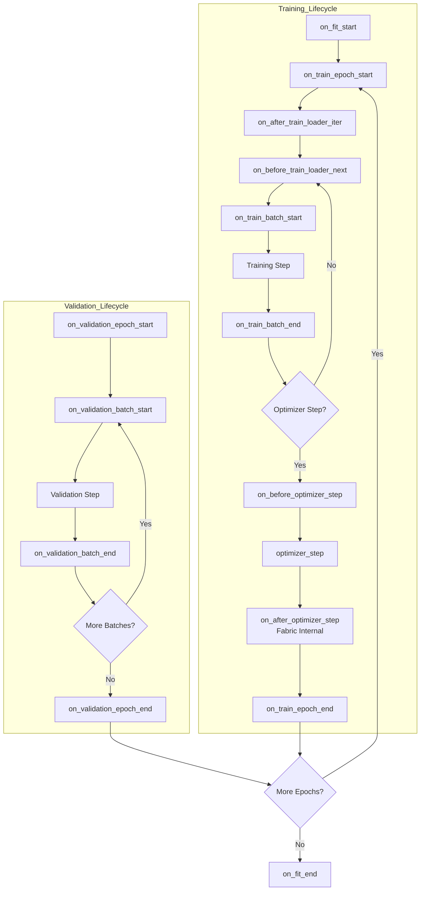
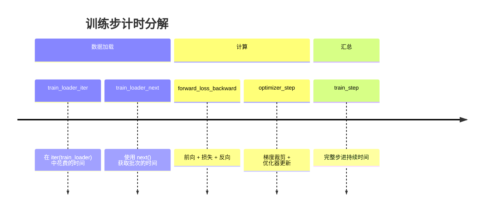
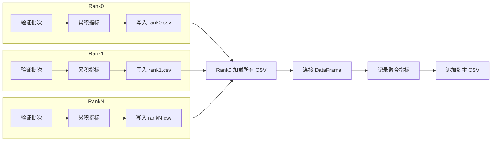

---
slug:17-callbacks-and-metrics-logging
blog_type:normal
---


本页面深入探讨了 Foundry 中的回调和指标记录基础设施，该基础设施提供了一个灵活的、基于钩子的系统，用于监控训练进度、收集验证指标以及记录模型行为。该架构遵循 PyTorch Lightning 约定，同时与 PyTorch Lightning Fabric 无缝集成，以支持分布式训练场景。

## 回调架构概述

Foundry 的回调系统以 `BaseCallback` 抽象基类为核心，该类定义了一套全面的生命周期钩子，`FabricTrainer` 会在训练和验证期间的策略节点调用这些钩子。这种设计允许开发者在特定阶段注入自定义逻辑，而无需修改核心训练循环。
来源：[callback.py](/src/foundry/callbacks/callback.py#L9-L116)

回调钩子涵盖三大类别：**周期级钩子**（fit 开始/结束，epoch 开始/结束）、**训练循环钩子**（batch 开始/结束，优化器步进时机，数据加载）和 **验证循环钩子**（epoch/batch 开始/结束）。关键在于，`on_after_optimizer_step` 钩子由 Fabric 内部调用，并且**不**接收 trainer 对象，因此开发者对于需要访问 trainer 的逻辑，必须使用 `on_before_optimizer_step` 或 `optimizer_step` 钩子。
来源：[callback.py](/src/foundry/callbacks/callback.py#L27-L78)



`FabricTrainer` 通过 `self.fabric.call()` 调用这些钩子，这确保了回调在分布式训练设置中的所有 rank 上一致执行。该机制自动处理 rank 同步，并允许回调访问 trainer 状态、底层 Fabric 实例和模型组件。
来源：[fabric.py](/src/foundry/trainers/fabric.py#L477-L560)

## 指标计算框架

Foundry 提供了一个灵活的指标计算系统，该系统围绕 `Metric` 抽象基类和 `MetricManager` 容器构建。各个 `Metric` 子类根据模型输出计算特定的评估指标，而 `MetricManager` 协调多个指标的计算并处理错误管理。
来源：[metric.py](/src/foundry/metrics/metric.py#L179-L320)

`Metric` 类支持基于输入批次中标签的**条件计算**。指标可以指定三种类型的标签约束：`required_tags_all`（所有标签都必须存在）、`required_tags_any`（至少一个标签必须存在）和 `prohibited_tags`（标签必须不存在）。这允许将同一指标选择性地应用于不同类型的批次（例如，仅蛋白质批次与蛋白质-配体复合物批次）。
来源：[metric.py](/src/foundry/metrics/metric.py#L193-L220)

```python
from foundry.metrics import Metric

class RMSDMetric(Metric):
    def __init__(self):
        super().__init__(
            required_tags_any={"protein", "ligand"}
        )
    
    def compute(self, predicted_coords, target_coords):
        # 计算预测结构和目标结构之间的 RMSD
        rmsd = np.sqrt(np.mean((predicted_coords - target_coords)**2))
        return {"rmsd": rmsd}
```

`MetricManager` 提供了多种实例化模式。`instantiate_from_hydra()` 类方法从配置字典创建指标，使得在 Hydra 配置中声明式定义指标变得简单。`from_metrics()` 类方法接受预实例化的指标对象用于编程式构造。当调用 `MetricManager` 时，它会计算所有适用的指标，并将结果作为映射指标名称到计算值的字典返回。
来源：[metric.py](/src/foundry/metrics/metric.py#L62-L125), [metric.py](/src/foundry/metrics/metric.py#L244-L270)

<CgxTip>在构造 `MetricManager` 时使用 `raise_errors=False` 参数，如果你希望指标计算失败被记录但不中断训练。这在单个指标可能不稳定的开发阶段特别有用。</CgxTip>

## 用于训练监控的内置回调

Foundry 包含几个预构建的回调，用于监控训练过程的不同方面。这些回调可以根据监控需求单独添加或成组添加。
来源：[train_logging.py](/src/foundry/callbacks/train_logging.py#L26-L279)

| Callback | 用途 | 使用的钩子 | 输出格式 |
|----------|---------|-----------|---------------|
| `LogModelParametersCallback` | 显示模型参数数量 | `on_fit_start` | 控制台表格 |
| `LogLearningRateCallback` | 监控优化器学习率 | `optimizer_step` | 日志记录器/表格 |
| `LogDatasetSamplingRatiosCallback` | 跟踪数据集采样分布 | `on_train_epoch_end` | 控制台表格 |
| `PrintExampleIDBeforeForwardPassCallback` | 调试批次组成 | `on_train_batch_start` | 控制台输出 |
| `LogAF3TrainingLossesCallback` | 跟踪 AlphaFold3 的训练损失 | `on_train_batch_end`, `on_train_epoch_end` | 日志记录器 |

`LogLearningRateCallback` 展示了一种常见模式：它挂载到 `optimizer_step` 生命周期（该生命周期接收 trainer 访问权限），而不是 Fabric 内部的 `on_after_optimizer_step`。这允许它同时访问优化器状态和 trainer 的日志记录基础设施。该回调以可配置的间隔记录学习率，从而实现学习率调度的可视化。
来源：[train_logging.py](/src/foundry/callbacks/train_logging.py#L93-L115)

对于像 AlphaFold3 这样的复杂训练场景，`LogAF3TrainingLossesCallback` 提供了详细的损失跟踪。它可以记录扩散批次内的单个结构损失（用于调试每个样本的行为）或聚合的批次损失。该回调跨批次累积损失，并计算跨所有分布式 rank 同步的 epoch 级统计信息。
来源：[train_logging.py](/src/foundry/callbacks/train_logging.py#L116-L279)

## 计时和性能监控

`TimingCallback` 通过测量训练流水线不同阶段花费的时间，提供了对计算瓶颈的深入洞察。它跟踪六个关键阶段：数据加载器迭代、从加载器获取批次、前向传播/反向传播、优化器步进以及整个训练步。
来源：[timing_logging.py](/src/foundry/callbacks/timing_logging.py#L9-L68)



计时机制使用支持嵌套计时上下文的 `Timers` 工具——这对于理解数据加载如何与计算重叠至关重要。计时结果在可配置数量的步数（默认：100）上聚合，以减少单步变异性带来的噪声。回调将计时统计信息记录到配置的日志记录器（例如 TensorBoard, Weights & Biases），并打印格式化的表格以提供即时反馈。
来源：[timing_logging.py](/src/foundry/callbacks/timing_logging.py#L12-L68)

<CgxTip>计时回调的分层测量可以揭示是数据加载（通常是 CPU 密集型）还是前向/反向传播（GPU 密集型）限制了训练吞吐量。如果 `train_loader_iter` 占主导地位，请考虑预取或优化数据增强流水线。</CgxTip>

## 健康监控：梯度、权重和激活

`ActivationsGradientsWeightsTracker` 回调通过跟踪模型参数和中间激活的统计信息和分布，提供了全面的健康监控。这对于检测训练不稳定性、梯度消失/爆炸以及死神经元非常有价值。
来源：[health_logging.py](/src/foundry/callbacks/health_logging.py#L45-L244)

该回调使用可配置的统计信息跟踪三类张量：

| 张量类别 | 默认统计信息 | 默认直方图 |
|-----------------|-------------------|-------------------|
| 梯度 | mean, std, min, max, norm | 每个参数的分布 |
| 权重 | mean, std, min, max, norm | 每个参数的分布 |
| 激活 | mean, std, min, max, norm | 每层的分布 |

该回调使用**前向钩子**捕获激活值，并在优化器步进之前检查模型参数以捕获梯度信息。统计信息和直方图均以可配置的频率间隔记录，允许开发者在日志记录粒度和 I/O 开销之间取得平衡。
来源：[health_logging.py](/src/foundry/callbacks/health_logging.py#L18-L74), [health_logging.py](/src/foundry/callbacks/health_logging.py#L161-L194)

过滤函数允许根据名称模式或模块类型选择性地跟踪特定参数或激活。对于记录每个参数都代价过高的大型模型，这一点尤为重要。在验证期间，回调会暂时停用钩子，以防止验证指标污染训练统计信息。
来源：[health_logging.py](/src/foundry/callbacks/health_logging.py#L195-L212)

## 验证指标聚合

`StoreValidationMetricsInDFCallback` 解决了分布式训练中的一个关键挑战：将每个 rank 的验证输出聚合为统一的分析。在验证期间，每个 rank 独立计算指标，但有意义的分析需要结合整个验证集的结果。
来源：[metrics_logging.py](/src/foundry/callbacks/metrics_logging.py#L16-L212)



该回调分两个阶段运行。在验证期间，每个 rank 在 pandas DataFrame 中累积批次级指标，通过递归展平处理标量指标和嵌套字典。在验证 epoch 结束时，每个 rank 将其部分结果写入特定于 rank 的 CSV 文件，并显式刷新以确保数据完整性。
来源：[metrics_logging.py](/src/foundry/callbacks/metrics_logging.py#L27-L124)

在第二阶段，rank 0 加载所有特定于 rank 的 CSV，将它们连接成单个 DataFrame，记录按数据集分组的聚合统计信息，并将结果追加到跨越所有 epoch 的主 CSV 文件。该主文件提供了完整的验证历史，可以在训练后分析或在 TensorBoard 等工具中可视化。临时的特定于 rank 的文件在聚合后被清理。
来源：[metrics_logging.py](/src/foundry/callbacks/metrics_logging.py#L124-L206)

该回调通过 `metrics_to_save` 参数支持选择性指标保存，该参数接受 "all" 或前缀字符串列表。这种灵活性允许研究人员专注于感兴趣的特定指标，同时避免无关输出导致的磁盘使用。
来源：[metrics_logging.py](/src/foundry/callbacks/metrics_logging.py#L19-L24)

## 将回调与 FabricTrainer 集成

回调通过构造函数的 `callbacks` 参数与 `FabricTrainer` 集成，该参数接受单个 `BaseCallback` 实例或回调列表。这些回调直接传递给底层的 PyTorch Lightning Fabric 实例，该实例管理它们的生命周期并确保在适当的点调用钩子。
来源：[fabric.py](/src/foundry/trainers/fabric.py#L61-L63), [fabric.py](/src/foundry/trainers/fabric.py#L124-L130)

```python
from foundry.trainers import FabricTrainer
from foundry.callbacks import (
    TimingCallback,
    LogLearningRateCallback,
    ActivationsGradientsWeightsTracker,
    StoreValidationMetricsInDFCallback
)

trainer = FabricTrainer(
    max_epochs=100,
    output_dir="./checkpoints",
    callbacks=[
        TimingCallback(log_every_n=50),
        LogLearningRateCallback(log_every_n=10),
        ActivationsGradientsWeightsTracker(
            log_freq=100,
            log_grads={"mean": np.mean, "norm": lambda x: np.linalg.norm(x)},
            keep_cache=False
        ),
        StoreValidationMetricsInDFCallback(
            save_dir="./validation_outputs",
            metrics_to_save=["rmsd", "lddt"]
        )
    ],
    loggers=[...]  # Lightning Fabric 日志记录器
)
```

trainer 支持**基于步数**和**基于周期**的回调执行频率。例如，计时和学习率回调通常每 N 个优化器步记录一次，而参数记录仅在 fit 开始时进行一次。这种灵活性确保了监控开销与所收集信息的价值成正比。
来源：[timing_logging.py](/src/foundry/callbacks/timing_logging.py#L12-L17), [train_logging.py](/src/foundry/callbacks/train_logging.py#L26-L29)

对于分布式训练，Foundry 提供了来自 PyTorch Lightning 的 `@rank_zero_only` 装饰器，它确保日志记录操作仅在主进程上执行。这可以防止在写入共享资源（如日志文件或可视化工具）时出现重复日志和竞争条件。
来源：[timing_logging.py](/src/foundry/callbacks/timing_logging.py#L4), [timing_logging.py](/src/foundry/callbacks/timing_logging.py#L18-L19)

## 后续步骤

- 要了解回调如何与更广泛的训练基础设施集成，请参阅 [Training Harness with FabricTrainer](7-training-harness-with-fabrictrainer)
- 要了解检查点管理以及回调如何与保存模型状态交互，请参考 [Checkpoint Management System](8-checkpoint-management-system)
- 有关使用回调时的分布式训练注意事项，请探索 [Distributed Training with DDP](15-distributed-training-with-ddp)