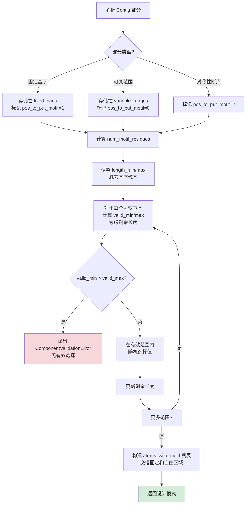
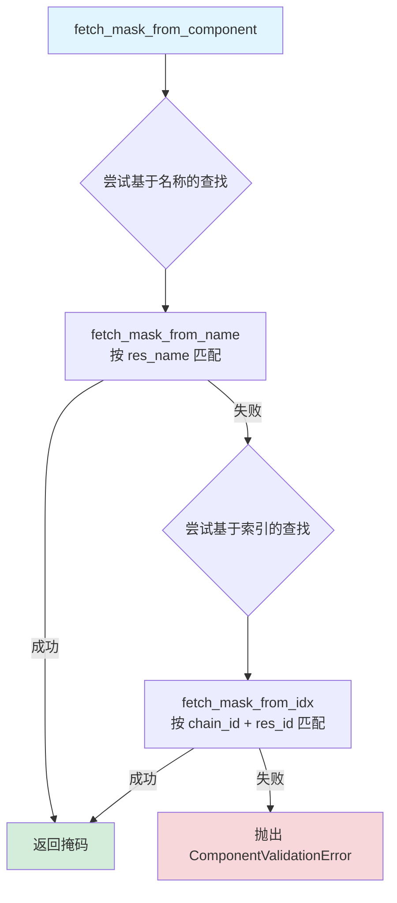
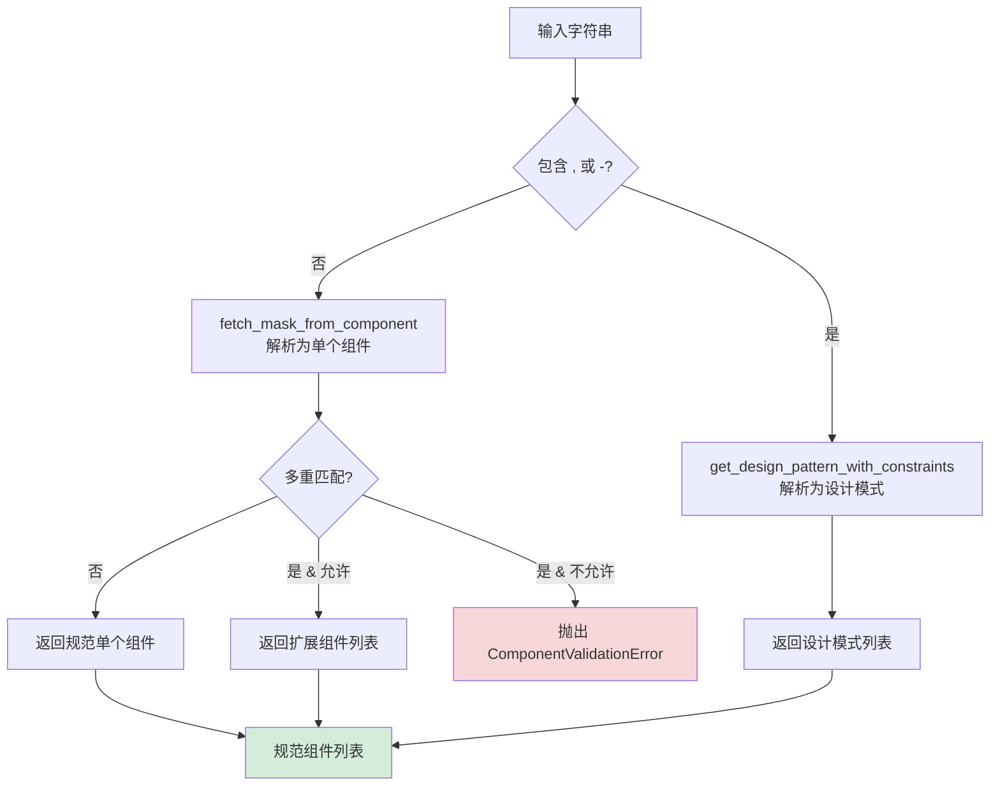

---
slug:18-component-parsing-and-validation
blog_type:normal
---


组件解析和验证构成了在 Foundry 蛋白质设计工作流中指定结构设计约束的基础设施。该系统通过强大的解析和验证框架，能够精确指定在模型推理过程中哪些残基和原子应该被固定、取消索引或进行修改。

## 架构概览

组件解析系统运行于用户指定的设计约束与模型输入分词的交汇点。它将 contig 字符串（残基范围和组件选择的紧凑规范）处理为推理引擎可以解释的结构化设计模式。该架构采用分层验证方法，确保每个组件被正确解析，根据可用的结构数据进行验证，并转换为适当的原子掩码。

```mermaid
flowchart TD
    A[用户输入<br>Contig 字符串] --> B[split_contig<br>解析链+残基ID]
    A --> C[extract_pn_unit_info<br>解析范围]
    A --> D[get_design_pattern_with_constraints<br>转换为模式]
    
    B --> E[ComponentStr<br>类型安全标识符]
    C --> E
    D --> F[设计模式<br>[int, str, /0] 列表]
    
    F --> G[get_motif_components_and_breaks<br>提取组件+断点]
    G --> H[组件列表]
    H --> I[fetch_mask_from_component<br>生成原子掩码]
    
    I --> J[AtomArray 掩码<br>准备好用于模型输入]
    
    style A fill:#e1f5ff
    style J fill:#d4edda
    style E fill:#fff3cd
```

解析流程将人类可读的规范转换为机器可读的掩码，并在每个阶段进行验证以确保结构一致性。

## 核心组件类型

Foundry 识别三种主要组件类型，每种类型都有独特的解析和验证规则：

| 组件类型 | 格式 | 示例 | 描述 |
|----------------|--------|---------|-------------|
| **单残基** | `ChainID + ResID` | `A20`, `B1051` | 通过链 ID 和残基编号引用特定残基 |
| **残基范围** | `ChainID + Start-End` | `A20-25`, `B1051-1051` | 跨越多个连续残基；单残基范围折叠为单残基 |
| **非蛋白质配体** | `ResName` | `HEM`, `ATP` | 通过残基名称引用配体或非标准残基 |

解析系统通过模式匹配来区分这些类型：包含字母和数字的组件被解释为基于链的引用，而仅包含大写字母的字符串则被视为配体或非蛋白质标识符。
来源: [components.py](src/foundry/utils/components.py#L42-L63), [components.py](src/foundry/utils/components.py#L66-L82)

## 解析基础设施

### 组件字符串验证

`ComponentStr` 类为组件标识符提供类型安全的包装器，并与 `split_contig` 函数集成以进行结构验证：

```python
class ComponentStr(str):
    """组件标识符，例如残基为 "A1"，"B12" 等。"""
```

`split_contig` 函数使用类似正则表达式的模式匹配来验证和解析单残基引用。它提取链 ID（第一个字符）和残基 ID（剩余数字），对于格式错误的输入或负残基索引，会抛出 `ComponentValidationError`。
来源: [components.py](src/foundry/utils/components.py#L42-L63)

<CgxTip>
组件验证是严格的——负残基索引、格式错误的字符串或不存在的残基会立即抛出 `ComponentValidationError`，并包含有关失败的上下文详细信息。这种快速失败方法可以防止管道中出现级联错误。
</CgxTip>

### 范围解析

对于残基范围，`extract_pn_unit_info` 处理单残基（`A20`）和多残基范围（`A20-25`）。正则表达式模式 `([A-Za-z])(\d+)(?:-(\d+))?` 捕获：
- 第 1 组：链标识符（字母）
- 第 2 组：起始残基编号
- 第 3 组：结束残基编号（可选）

当省略可选的结束残基时，该函数会将单残基范围折叠为单残基。
来源: [components.py](src/foundry/utils/components.py#L66-L82)

## 设计模式生成

`get_design_pattern_with_constraints` 函数将复杂的 contig 规范转换为满足约束的设计模式。此函数支持混合模式设计，结合固定基序（现有结构）和柔性区域（生成序列）。

### Contig 语法

Contig 字符串使用逗号分隔的段，包含三种语义类型：

| 段类型 | 语法 | 示例 | 语义 |
|--------------|--------|---------|-----------|
| **可变长度** | `min-max` 或 `number` | `0-40`, `10` | 指定柔性区域的边界或精确长度 |
| **固定基序** | `ChainIDStart-End` | `A20-21`, `B25-25` | 引用要保留的现有结构 |
| **对称性断点** | `/0` | `/0` | 标记对称组边界 |

### 约束求解算法

该算法使用贪心分配策略执行有界约束满足：



关键创新在于**有效范围计算**，它确保每个可变段在满足自身边界的同时，能够适应剩余长度要求。对于可变范围中的每个位置 `i`：

```
valid_min = max(min_value_i, remaining_length_min - sum(后续范围的 min_values))
valid_max = min(max_value_i, remaining_length_max - sum(后续范围的 max_values))
```

这种前向约束确保了在随机选择之前的可行性。
来源: [components.py](src/foundry/utils/components.py#L85-L174)

### 转换示例

输入：`'1-5,A20-21,1-5,A25-25,1-5'`，条件为 `length=10-10`

| 段 | 类型 | 解释 |
|---------|------|----------------|
| `1-5` | 可变 | 1-5 个新残基 |
| `A20-21` | 固定 | 保留残基 A20, A21 |
| `1-5` | 可变 | 1-5 个新残基 |
| `A25-25` | 固定 | 保留残基 A25 |
| `1-5` | 可变 | 1-5 个新残基 |

输出（一种可能的解）：`[2, 'A20', 'A21', 2, 'A25', 3]`

此模式表示：2 个新残基，然后是 A20，然后是 A21，然后是 2 个新残基，然后是 A25，最后是 3 个新残基。整数之和为 7，固定残基贡献 3，与总长度 10 相匹配。
来源: [components.py](src/foundry/utils/components.py#L85-L89)

## 基序组件提取

对于未索引的分词处理（用于部分设计和条件生成），`get_motif_components_and_breaks` 将 contig 字符串分离为带有位置关系元数据的独立组件。

### 断点语义

断点指示连续残基是否应一起索引或被视为独立单元：

| 输入 | 组件 | 断点 | 解释 |
|-------|------------|--------|----------------|
| `A14,A15,A16` | `[A14, A15, A16]` | `[True, True, True]` | 三个独立残基 |
| `A14-15,A16` | `[A14, A15, A16]` | `[True, False, True]` | 残基 A14-15 耦合，A16 独立 |

断点数组控制模型分词方案中残基之间的位置编码泄漏。
来源: [components.py](src/foundry/utils/components.py#L177-L230)

<CgxTip>
设置 `index_all=True` 以禁用所有断点（`[False, False, ...]`），从而启用对连接分词的完全索引。当你希望模型将所有基序残基视为单个连续单元时，这非常有用。
</CgxTip>

## 原子掩码生成

最后的验证阶段将组件规范转换为底层 `AtomArray` 结构的原子级掩码。这个三层系统可以精确控制哪些原子参与模型操作。

### 掩码检索层级



通用 `fetch_mask_from_component` 函数首先尝试配体名称查找，然后回退到残基索引查找。
来源: [components.py](src/foundry/utils/components.py#L368-L379)

### 基于名称的掩码

`fetch_mask_from_name` 通过残基名称（例如 `HEM`, `ATP`）匹配非蛋白质组件。它通过检查可用的非蛋白质残基名称进行验证，并在匹配失败时提供列出可用选项的有用错误消息。
来源: [components.py](src/foundry/utils/components.py#L349-L365)

### 基于索引的掩码

`fetch_mask_from_idx` 通过链标识符和残基编号匹配残基，返回属于该残基的原子布尔掩码。这是蛋白质残基选择的主要方法。
来源: [components.py](src/foundry/utils/components.py#L333-L346)

## 原子名称选择

`get_name_mask` 在组件内提供分层原子选择，允许指定主链、侧链或自定义原子集。

### 选择模式

| 模式 | 语法 | 选定的原子 | 用例 |
|------|--------|-----------------|----------|
| **所有原子** | `"ALL"` | 组件中的所有原子 | 完全约束 |
| **主链** | `"BKBN"` | `N, CA, C, O` | 固定主链的构象灵活性 |
| **TIP** | `"TIP"` | 特定于残基的末端原子 | 保持几何形状的部分固定 |
| **显式列表** | `"N,CA,C,O,CB"` | 仅指定的原子 | 精确控制 |

### TIP（末端重要部分）原子

TIP 系统选择特定于残基的原子集，这些原子在保持几何约束的同时最大化灵活性。这些在 `constants.py` 中定义，代表了维持侧链取向和旋转异构体状态所需的最小原子集。
来源: [constants.py](src/foundry/constants.py#L1-L29), [components.py](src/foundry/utils/components.py#L266-L277)

TIP 集示例：

| 残基 | TIP 原子 | 基本原理 |
|---------|-----------|-----------|
| HIS | CG, ND1, CD2, CE1, NE2 | 固定咪唑环 |
| TRP | CG, CD1, CD2, NE1, CE2, CE3, CZ2, CZ3, CH2 | 固定两个芳香环 |
| TYR | CZ, OH | 环保持可旋转 |
| ARG | CD, NE, CZ, NH1, NH2 | 固定胍基 |

<CgxTip>
像 ALA、GLY 和 PRO 这样的残基，其 TIP 原子为 `None`，因为它们缺乏有意义的侧链几何形状可以保留。为这些残基指定 TIP 时，请改用 `BKBN` 或 `ALL`。
</CgxTip>

### 验证规则

该函数执行严格的验证：

1. **唯一性**：选择中的原子名称必须唯一
2. **存在性**：所有请求的原子必须存在于组件中
3. **多重性**：匹配原子的数量必须是请求名称的倍数（处理具有相同名称的多个残基/配体）
4. **非空**：逗号分隔的列表中不能有空原子名称

验证失败会抛出 `ComponentValidationError`，并在匹配失败时提供包含可用原子的详细上下文。
来源: [components.py](src/foundry/utils/components.py#L238-L330)

## 组件展开

`unravel_components` 提供了一个安全接口，用于将字符串输入转换为规范组件列表，处理简单组件和复杂设计模式。

### 解析策略



该函数处理组件字符串映射到多个残基的对称情况（例如，用于对称配体的 `LIG_NAME`）。当 `allow_multiple_matches=False` 时，这会引发错误；当 `allow_multiple=True` 时，它返回所有匹配的残基作为单独的组件。
来源: [components.py](src/foundry/utils/components.py#L382-L415)

## 错误处理架构

`ComponentValidationError` 异常类提供带有上下文信息的结构化错误报告：

```python
raise ComponentValidationError(
    "Could not find requested atoms 'N,CA,C,O' in atom array.",
    component="A20",
    details={"available_atoms": ["N", "CA", "C", "O", "CB"]}
)
```

错误消息格式会自动添加组件标识符前缀，并在提供时附加详细信息字典，从而能够精确调试解析失败。
来源: [components.py](src/foundry/utils/components.py#L25-L39)

## 与设计工作流的集成

组件解析系统通过 RFD3 中的 `DesignInputSpecification` 类与 Foundry 的推理引擎集成。典型的使用模式包括：

```python
spec = DesignInputSpecification(
    input='protein.pdb',
    length='10-10',
    ligand='L:G',
    unindex='A92-96,B2,E5',
    select_fixed_atoms={
        'B2': 'ND1,CG,NE2,CD2,CB,CE1',
        'E5': "OH,CZ,CE1,CE2,CD2,CD1,CG,CB"
    }
)
```

`unindex` 参数为 `get_motif_components_and_breaks` 指定残基，而 `select_fixed_atoms` 使用 `get_name_mask` 进行基于 TIP 的原子选择。
来源: [enzymes.ipynb](examples/enzymes.ipynb#L27-L33)

## 关键设计原则

1. **快速失败验证**：立即检测并报告错误，并提供上下文信息
2. **类型安全**：`ComponentStr` 包装器提供 IDE 感知的类型检查
3. **约束满足**：设计模式生成在启用局部灵活性的同时遵守全局长度约束
4. **精细控制**：原子级掩码能够精确指定固定与灵活的自由度
5. **有用的错误**：验证错误包含可用的替代项和建议的更正

有关高级模式使用和掩码生成策略，请参阅 [Design Pattern with Constraints](19-design-pattern-with-constraints)。有关掩码应用于原子数组的实现详细信息，请参阅 [Mask Generation for Partial Design](20-mask-generation-for-partial-design)。