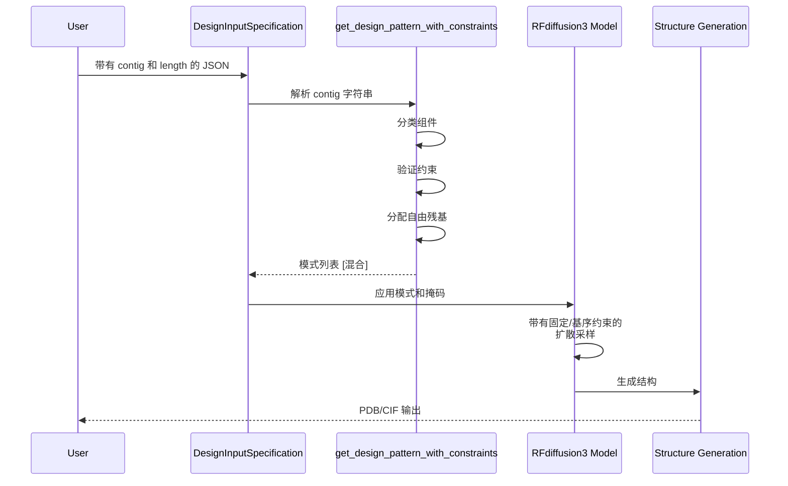

---
slug:19-design-pattern-with-constraints
blog_type:normal
---


Foundry 中的带约束设计模式系统为在蛋白质设计问题中指定结构蓝图提供了一种强大的机制。该系统使得能够精确控制哪些残基是固定的（从输入结构中保留）以及哪些由模型自由生成，同时支持复杂的长度约束和链终止符。基于约束的模式转换位于 RFdiffusion3 在精确结构规范下设计生物分子相互作用能力的核心。

## 架构和核心概念

设计模式系统作为一个**约束满足引擎**运行，将人类可读的 contig 字符串转换为可执行的设计规范。其基础在于将**固定片段**（从输入结构中明确保留的残基）与**可变范围**（由模型生成的自由残基）分离的原则，同时确保所有长度约束在数学上都是可满足的。

系统在 contig 字符串中支持三种基本的组件类型：

| 组件类型 | 格式 | 示例 | 含义 |
|---------------|--------|---------|---------|
| 固定残基 | `{ChainID}{ResidueIndex}` | `A20` | 链 A 中位置 20 的单个残基 |
| 固定范围 | `{ChainID}{Start}-{End}` | `A20-21` | 链 A 中的多个残基（位置 20-21） |
| 可变范围 | `{Start}-{End}` | `1-5` | 要生成的自由残基（1-5 个残基） |
| 链终止符 | `/0` | `/0` | 标记多肽链的结束 |
| 单变量 | `{Number}` | `3` | 恰好 N 个自由残基 |

**Contig 字符串**是定义完整结构蓝图的逗号分隔规范。例如，`'1-5,A20-21,1-5,A25-25,1-5,A30-30,/0,1-5'` 指定了一个具有交替自由区域和固定基序残基的模式，其中整数代表自由残基的数量，`A20`、`A21` 等代表要从输入结构中保留的特定残基。附带的 `length` 参数（例如 `'10-10'`）约束了所有可变范围内的自由残基总数。

## 模式转换算法

`get_design_pattern_with_constraints()` 函数实现了一种复杂的算法，用于将 contig 字符串转换为可执行的设计模式。转换过程遵循多阶段流水线，确保在生成最终模式之前所有约束在数学上都是一致的。

```mermaid
flowchart TD
    A[输入: Contig 字符串] --> B[解析与分类组件]
    B --> C{组件类型?}
    C -->|包含字母| D[固定片段<br>提取: ChainID, Start, End]
    C -->|/0| E[链终止符]
    C -->|数字| F[可变范围<br>提取: Min, Max]
    
    D --> G[跟踪固定位置: 1]
    E --> H[跟踪终止符位置: 2]
    F --> I[跟踪可变位置: 0]
    
    G --> J[计算总基序残基数]
    H --> J
    I --> J
    
    J --> K[调整长度约束<br>length -= motif_residues]
    K --> L{验证可行性<br>valid_min ≤ valid_max?}
    
    L -->|无效| M[抛出 ComponentValidationError]
    L -->|有效| N[分配自由残基<br>在边界内随机分配]
    
    N --> O[重组模式<br>合并固定、自由、终止符]
    O --> P[输出: List[str]]
```

### 第一阶段：组件分类

算法首先解析 contig 字符串并将每个组件分类为三种类别之一：固定片段、可变范围或链终止符。这种分类使系统能够使用其特定逻辑处理每种组件类型。

对于包含字母的组件，系统使用 `extract_pn_unit_info()` 函数提取蛋白质/核酸单元标识符（`pn_unit_id`）、起始位置和结束位置，该函数使用正则表达式模式 `r"([A-Za-z])(\d+)(?:-(\d+))?"` 来解析链标识符和残基范围。匹配 `/0` 的组件被标记为链终止符，而数字组件则被解析为具有最小和最大边界的可变范围。

来源: [components.py#L85-L109](/src/foundry/utils/components.py#L85-L109)

### 第二阶段：约束调整

分类后，系统通过汇总所有固定片段的长度（每个固定范围的 `end - start + 1`）来计算基序残基的总数。然后从用户指定的长度约束中减去此计数，以确定自由残基的剩余长度预算。

长度参数支持单个值（例如 `'10'`）和范围（例如 `'10-15'`）。如果未指定，系统默认为 `0-9999`，实际上移除了长度约束。此调整确保最终设计的总长度等于固定基序残基加上随机分配的自由残基的总和。

来源: [components.py#L111-L122](/src/foundry/utils/components.py#L111-L122)

### 第三阶段：自由残基分配

算法的核心是在所有可变范围内分配可用的自由残基预算。对于每个可变范围，系统通过考虑以下因素来计算**有效分配窗口**：

1. 范围的固有最小值和最大值边界
2. 后续可变范围所需的最小剩余长度
3. 后续可变范围所允许的最大剩余长度

范围的有效最小值是其固有最小值与（剩余最小长度减去所有后续范围的最小值之和）的最大值。类似地，有效最大值是其固有最大值与（剩余最大长度减去所有后续范围的最大值之和）的最小值。

此计算确保为当前范围在有效窗口内分配一个值，会为所有剩余范围留下可行的分配窗口。如果在任何时候 `valid_min > valid_max`，系统将抛出 `ComponentValidationError`，表明指定的约束在数学上是不可能满足的。

来源: [components.py#L124-L148](/src/foundry/utils/components.py#L124-L148)

### 第四阶段：随机分配和重组

一旦为所有可变范围建立了有效的分配窗口，系统就会使用 `random.randint(valid_min, valid_max)` 在每个窗口内随机选择一个值。选定的值将附加到 `num_free_atoms` 列表中，并相应地减少剩余长度预算。

最后，系统通过按顺序遍历原始 contig 字符串来重组设计模式。对于每个位置：
- 固定片段（位置标记 = 1）：从 `fixed_parts` 中弹出下一个固定片段并附加每个单独的残基（例如 `A20`、`A21`）
- 可变范围（位置标记 = 0）：从 `num_free_atoms` 中弹出下一个自由残基数
- 链终止符（位置标记 = 2）：附加 `/0`

输出是一个混合列表，其中整数代表自由残基计数，字符串代表固定残基或终止符（例如 `[2, 'A20', 'A21', 2, 'A25', 3, 'A30', '/0', 3]`）。

来源: [components.py#L150-L176](/src/foundry/utils/components.py#L150-L176)

## 组件验证和错误处理

设计模式系统通过 `ComponentValidationError` 异常类包含强大的错误处理。此专用异常捕获有关验证失败的详细上下文，包括有问题的组件和其他诊断信息。

例如，在解析 contig 组件时，`split_contig()` 验证残基索引是否为非负整数，如果验证失败，则抛出带有组件字符串和解释性消息的 `ComponentValidationError`。类似地，`extract_pn_unit_info()` 验证正则表达式匹配，并对格式错误的 contig 格式抛出错误。

掩码检索函数（`fetch_mask_from_idx()`、`fetch_mask_from_name()`、`fetch_mask_from_component()`）通过检查指定组件是否存在于输入原子数组中来执行验证。如果未找到组件，这些函数将抛出 `ComponentValidationError`，其中包含有关可用的非蛋白质残基名称的详细信息，有助于调试并提供可操作的反馈。

来源: [components.py#L25-L48](/src/foundry/utils/components.py#L25-L48), [components.py#L333-L375](/src/foundry/utils/components.py#L333-L375)

## 组件解析和规范化

`unravel_components()` 函数提供了一个**安全的规范化层**，将各种输入规范转换为标准化的组件字符串。此函数处理三种不同的输入模式：

1. **复杂模式**：包含逗号或连字符的字符串被解释为完整的设计模式，并通过 `get_design_pattern_with_constraints()` 进行处理
2. **单组件字符串**：像 `'Z9'` 或 `'L:G'` 这样的简单字符串通过尝试从原子数组中获取掩码来解决，然后提取唯一的链和残基标识符以形成规范的组件字符串
3. **错误处理**：如果组件映射到多个残基且 `allow_multiple_matches` 为 False，则函数抛出 `ComponentValidationError`。当启用时（例如，对于对称设计），它将所有匹配的残基作为去重列表返回

此规范化对于确保整个设计流水线中一致的组件引用至关重要，允许用户通过链-位置标识符、非蛋白质残基名称或通过复杂的设计模式来指定残基，并具有相同的可靠性。

来源: [components.py#L382-L416](/src/foundry/utils/components.py#L382-L416)

<CgxTip>
处理对称设计时，始终在 `unravel_components()` 中设置 `allow_multiple_matches=True`。对称性会生成多个等效链，否则严格验证将拒绝解析为多个对称位置的组件。
</CgxTip>

## 基序组件和中断

对于需要对 contig 之间的位置编码进行选择性控制的高级设计场景，`get_motif_components_and_breaks()` 函数提供了对基序区域中断的精细管理。此函数将 contig 字符串转换为两个并行列表：`components`（单独的残基标识符）和 `breaks`（布尔标志，指示是否插入位置中断）。

中断逻辑遵循以下规则：
- 单个固定残基（例如 `A14`）：始终插入中断（`True`）
- 固定范围（例如 `A14-15`）：在范围开头插入中断（`True`），随后对后续残基不插入中断（`False`）
- 链终止符（`/0`）：中断值为 `None`（特殊处理）
- 可变范围：中断值为 `None`

`index_all` 参数通过将所有非 `None` 中断设置为 `False` 来覆盖此行为，从而实现对连接标记的完整索引。这对于应该将基序标记视为连续块而不是单独残基的场景特别有用。

来源: [components.py#L177-L237](/src/foundry/utils/components.py#L177-L237)

## 实际应用和示例

带约束的设计模式系统是 RFdiffusion3 在多个应用领域能力的核心。以下示例展示了从测试套件和文档中提取的实际使用模式。

### 具有催化基序的酶设计

酶设计任务通常涉及保留催化残基，同时生成周围支架。Contig 模式指定了用于支架生成的可变区域中散布的固定催化残基：

```json
{
  "unindex": "A108,A139,A152,A156",
  "length": "180-200"
}
```

在这里，残基 A108、A139、A152 和 A156 被固定为催化基序，而长度约束指定生成的自由残基总数应在 180-200 之间。`unindex` 参数指示这些残基的位置应由模型推断，而不是在输入中预先指定。

来源: [enzyme_design.md](/models/rfd3/docs/enzyme_design.md)

### 测试用例：选择规范化

测试套件演示了不同组件规范方法的等效性。通过链-位置（`Z9`）、非蛋白质名称（`L:G`）或字典格式（`{name: atom_names}`）指定的残基都解析为相同的规范组件并生成相同的原子掩码：

```python
canonical_components_0 = unravel_components("Z9", atom_array=atom_array_ref)
canonical_components_1 = unravel_components("L:G", atom_array=atom_array_ref)
# 两者都解析为相同的规范残基
assert canonical_components_0[0] == canonical_components_1[0]
```

这种灵活性允许用户使用对其任务最方便的表示法来指定组件，同时系统保持内部一致性。

来源: [test_selections.py#L27-L70](/models/rfd3/tests/test_selections.py#L27-L70)

## 与设计流水线的集成

设计模式系统在 RFdiffusion3 的更广泛架构内运行，与输入规范、掩码生成和轨迹生成集成。模式转换发生在流水线的早期，在扩散采样之前建立结构蓝图。



由 `get_design_pattern_with_constraints()` 生成的模式列表用于创建二进制掩码，指定哪些原子是固定的（基序），哪些应由扩散过程采样。这些掩码通过 Transformer 架构传播，引导生成过程以满足指定的约束。

要全面了解输入规范系统，请参阅 [Component Parsing and Validation](18-component-parsing-and-validation)。有关掩码生成策略，请参阅 [Mask Generation for Partial Design](20-mask-generation-for-partial-design)。

<CgxTip>
在运行昂贵的推理之前，请始终根据输入结构的原子数组验证您的 contig 模式。`fetch_mask_from_component()` 函数提供起飞前检查，以便在扩散采样开始之前捕获缺失的残基或无效引用。
</CgxTip>

## 关键实现细节

### 随机分配策略

算法使用 Python 的 `random.randint()` 在有效窗口内分配自由残基。这引入了随机性——使用相同 contig 和长度约束的不同运行将在可变范围内产生不同的自由残基分布。对于可重现的设计，请在调用 `get_design_pattern_with_constraints()` 之前设置随机种子。

### ComponentStr 子类

`ComponentStr` 类专门为组件标识符扩展了 Python 的 `str` 类型。此类型注释使整个代码库中能够清晰地区分通用字符串和经验证的组件字符串。`split_component()` 类方法提供了提取链和残基信息的便捷接口。

### AtomWorks 集成

掩码检索函数依赖于 AtomWorks 的 `AtomArray` 数据结构，该结构为原子、残基和链提供了高效的布尔索引。`res_id`、`chain_id`、`res_name` 和 `atom_name` 属性广泛用于组件解析和掩码生成。

来源: [components.py#L42-L48](/src/foundry/utils/components.py#L42-L48)

## 错误场景和故障排除

| 错误场景 | 根本原因 | 解决方案 |
|----------------|------------|------------|
| `ComponentValidationError: No valid selections possible` | 可变范围的长度约束太紧 | 增加 `length` 参数或调整 contig 可变范围 |
| `ComponentValidationError: Residue not found` | 指定的组件在原子数组中不存在 | 验证链 ID 和残基编号与输入结构匹配 |
| `ComponentValidationError: Component maps to multiple residues` | 非 `allow_multiple_matches` 的非唯一组件引用 | 使用特定的链-位置或启用对称的多重匹配 |
| `ComponentValidationError: Invalid contig format` | 格式错误的链-残基语法 | 使用 `{ChainID}{Residue}` 或 `{ChainID}{Start}-{End}` 格式 |

## 后续步骤

带约束的设计模式系统为生物分子设计中的精确结构控制提供了基础。要加深您的理解：

- 探索如何从这些模式生成掩码，请参阅 [Mask Generation for Partial Design](20-mask-generation-for-partial-design)
- 了解完整的输入规范系统，请参阅 [Component Parsing and Validation](18-component-parsing-and-validation)
- 了解这些模式如何与 RFdiffusion3 的架构集成，请参阅 [RFdiffusion3: All-Atom Generative Model](9-rfdiffusion3-all-atom-generative-model)
- 查看 RFD3 文档中的实际示例，包括 [酶设计](/models/rfd3/docs/enzyme_design.md) 和 [对称性](/models/rfd3/docs/symmetry.md)

为了进行动手实验，请检查 `models/rfd3/tests/test_selections.py` 中的测试套件，该套件演示了各种场景下的规范化、掩码生成和未索引中断功能。