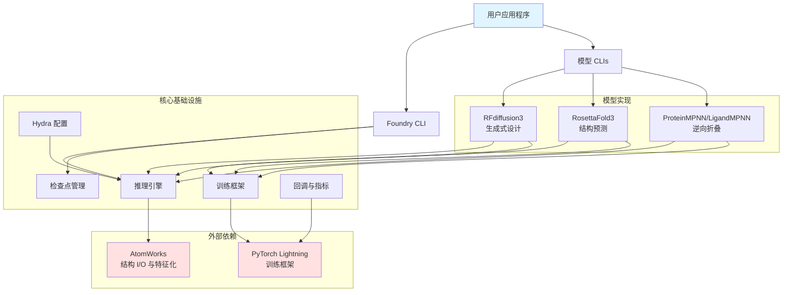
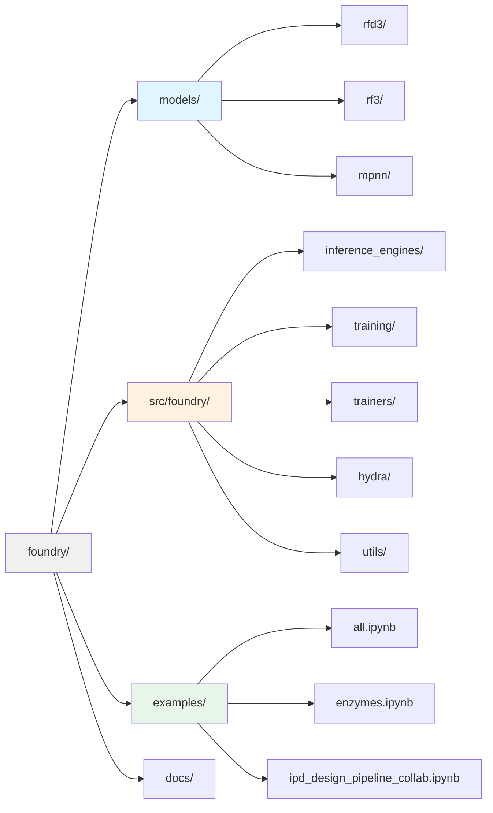

---
slug:2-quick-start
blog_type:normal
---


Foundry 是一个统一框架，提供用于使用和训练最先进的蛋白质设计模型的工具和基础设施，包括生成式设计 (RFdiffusion3)、逆向折叠 (ProteinMPNN 和 LigandMPNN) 以及结构预测 (RosettaFold3)。Foundry 中的所有模型在训练和推理期间都依赖 AtomWorks 进行结构操作、预处理和特征化。本快速入门指南将引导你完成所有支持模型的安装、模型设置和基本使用。

来源：[README.md](/README.md#L1-L6), [pyproject.toml](/pyproject.toml#L24-L51)

## 架构概览

Foundry 遵循严格的依赖层次结构，其中核心框架提供共享基础设施，并由特定模型的实现进行扩展。该架构设计考虑了模块化，允许你使用单个模型或将它们组合成完整的蛋白质设计流程。



该架构显示 Foundry 提供了所有模型都利用的统一训练和推理基础设施。核心模块处理配置管理、检查点加载和分布式训练等常见问题，而特定模型的代码则实现每种模型类型的独特架构和推理逻辑。

来源：[README.md](/README.md#L59-L64), [checkpoint_registry.py](/src/foundry/inference_engines/checkpoint_registry.py#L33-L70)

## 安装

Foundry 支持 Python 3.12 或更高版本，可以安装所有模型依赖项，也可以为特定模型安装可选附加项。推荐的安装方法取决于你的预期用例。

### 安装选项

| 安装类型 | 命令 | 用例 |
|-------------------|---------|----------|
| **完整安装** | `pip install rc-foundry[all]` | 包含所有模型的完整流程（推荐给初学者） |
| **仅 RFdiffusion3** | `pip install rc-foundry[rfd3]` | 生成式蛋白质设计工作流 |
| **仅 RosettaFold3** | `pip install rc-foundry[rf3]` | 结构预测任务 |
| **仅 MPNN** | `pip install rc-foundry[mpnn]` | 逆向折叠和序列设计 |

对于开发工作流，你可以以可编辑模式安装 Foundry 和模型：

```bash
# 以可编辑模式安装 foundry 和所有模型
uv pip install -e . -e ./models/rf3 -e ./models/rfd3 -e ./models/mpnn

# 或者仅安装 foundry（不包含模型）
uv pip install -e .
```

可编辑安装允许你修改 Foundry 中的共享工具并立即查看更改，处理特定模型而无需安装所有模型，并将新模型作为独立包添加到 `models/` 目录中。

来源：[README.md](/README.md#L8-L12), [pyproject.toml](/pyproject.toml#L54-L66), [README.md](/README.md#L68-L81)

## 项目结构

了解仓库结构有助于你浏览代码库并定位所需的资源。



<details>
<summary>📁 详细目录结构</summary>

```
foundry/
├── models/                          # 特定模型的实现
│   ├── rfd3/                       # RFdiffusion3 生成式模型
│   │   ├── configs/                 # Hydra 配置
│   │   ├── docs/                    # 模型文档和示例
│   │   └── src/rfd3/               # 模型源代码
│   ├── rf3/                        # RosettaFold3 结构预测
│   │   ├── configs/                # Hydra 配置
│   │   ├── docs/                   # 模型文档
│   │   └── src/rf3/                # 模型源代码
│   └── mpnn/                       # ProteinMPNN/LigandMPNN
│       ├── configs/                # Hydra 配置
│       └── src/mpnn/               # 模型源代码
├── src/foundry/                    # 核心基础设施
│   ├── inference_engines/          # 基础推理引擎和检查点注册表
│   ├── training/                   # 训练工具 (EMA, checkpointing)
│   ├── trainers/                   # FabricTrainer 实现
│   ├── hydra/                      # 自定义 Hydra 解析器
│   ├── callbacks/                  # PyTorch Lightning 回调
│   └── utils/                      # 共享工具 (DDP, alignment, etc.)
├── examples/                       # 交互式笔记本
│   ├── all.ipynb                   # 所有模型演示
│   ├── enzymes.ipynb               # 酶设计示例
│   └── ipd_design_pipeline_collab.ipynb  # 完整流程教程
└── src/foundry_cli/                # 命令行界面
    └── download_checkpoints.py     # 检查点安装 CLI
```

</details>

`models/` 目录包含所有特定于模型的代码、配置和文档。`src/foundry/` 中的核心 Foundry 基础设施提供训练、推理和工具的共享功能。`examples/` 目录包含演示使用模式和完整工作流的 Jupyter 笔记本。

来源：[README.md](/README.md#L59-L64), [get_repo_structure](/get_repo_structure), [checkpoint_registry.py](/src/foundry/inference_engines/checkpoint_registry.py#L1-L20)

## 模型概览

Foundry 支持三个主要的模型系列，每个系列服务于不同的蛋白质设计和分析任务。


| 模型 | 类别 | 主要功能 | 关键能力 |
|-------|----------|-------------------|----------------|
| **RFdiffusion3 (RFD3)** | 生成式设计 | 创建新颖的蛋白质结构 | 在复杂约束下设计（配体、核酸、对称性） |
| **RosettaFold3 (RF3)** | 结构预测 | 从序列预测 3D 结构 | 可与领先的闭源模型竞争，支持复合物 |
| **ProteinMPNN/LigandMPNN** | 逆向折叠 | 为固定骨架设计序列 | 处理配体、DNA/RNA 和自定义约束 |


这些模型可以组合成完整的设计流程：RFD3 生成骨架结构，MPNN 设计序列，RF3 验证或优化设计。

来源：[README.md](/README.md#L29-L52), [rfd3/README.md](/models/rfd3/README.md#L3-L7), [rf3/README.md](/models/rf3/README.md#L1-L14)

## 下载模型权重

所有模型检查点都可以使用 Foundry CLI 下载，它为检查点管理提供统一的界面，具有进度跟踪和可选的哈希验证。

### 基本下载命令

下载所有模型（完整流程）：

```bash
foundry install all --checkpoint-dir /path/to/ckpt/dir
```

下载推荐的初学者模型：

```bash
foundry install rfd3 ligandmpnn rf3 --checkpoint-dir /path/to/ckpt/dir
```

下载单个模型：

```bash
# RFdiffusion3 (生成式设计)
foundry install rfd3 --checkpoint-dir /path/to/ckpt/dir

# RosettaFold3 (结构预测)
foundry install rf3 --checkpoint-dir /path/to/ckpt/dir

# ProteinMPNN (逆向折叠)
foundry install proteinmpnn --checkpoint-dir /path/to/ckpt/dir

# LigandMPNN (感知配体的逆向折叠)
foundry install ligandmpnn --checkpoint-dir /path/to/ckpt/dir
```

<CgxTip>
检查点目录是可选的，如果未指定，默认为 `~/.foundry/checkpoints`。下载后，CLI 会在你的 `.env` 文件中设置 `FOUNDRY_CHECKPOINTS_DIR` 环境变量，允许你在未来的运行中运行推理而无需提供检查点路径。
</CgxTip>

### 可用的检查点

| 模型名称 | 文件名 | 描述 | 大小 |
|------------|----------|-------------|------|
| `rfd3` | `rfd3_latest.ckpt` | 最新的 RFdiffusion3 检查点 | ~3GB |
| `rf3` | `rf3_foundry_01_24_latest_remapped.ckpt` | 最新的 RF3（数据截至 2024 年 1 月） | ~2GB |
| `rf3_preprint_921` | `rf3_foundry_09_21_preprint_remapped.ckpt` | 用于基准测试的 RF3（数据截至 2021 年 9 月） | ~2GB |
| `rf3_preprint_124` | `rf3_foundry_01_24_preprint_remapped.ckpt` | 原始预印本 RF3 | ~2GB |
| `proteinmpnn` | `proteinmpnn_v_48_020.pt` | ProteinMPNN 权重（48 个邻居，σ=0.20） | ~500MB |
| `ligandmpnn` | `ligandmpnn_v_32_010_25.pt` | LigandMPNN 权重（32 个邻居，σ=0.10） | ~500MB |
| `solublempnn` | `solublempnn_v_48_020.pt` | SolubleMPNN 权重 | ~500MB |

下载过程包括自动进度跟踪和可选的哈希验证，以确保文件完整性。使用 `--force` 标志覆盖现有的检查点。

来源：[download_checkpoints.py](/src/foundry_cli/download_checkpoints.py#L122-L150), [checkpoint_registry.py](/src/foundry/inference_engines/checkpoint_registry.py#L33-L70)

## 运行你的第一次推理

每个模型都提供用于推理的命令行界面。以下示例假设你已将检查点下载到你的检查点目录。

### RFdiffusion3：设计蛋白质结构

RFdiffusion3 接受 JSON 格式的设计规范，并生成满足你约束的新颖蛋白质结构。

```bash
rfd3 design out_dir=logs/inference_outs/demo/0 \
  inputs=models/rfd3/docs/demo.json \
  ckpt_path=null \
  skip_existing=False \
  dump_trajectories=True \
  align_trajectory_structures=True
```

关键参数：
- `out_dir`：结果的输出目录（自动创建）
- `inputs`：指定设计约束的 JSON 文件路径
- `ckpt_path`：检查点路径（使用 `null` 使用 `FOUNDRY_CHECKPOINTS_DIR` 中的默认值）
- `dump_trajectories`：保存中间扩散步骤（用于可视化）
- `align_trajectory_structures`：对齐轨迹结构以进行比较


RFdiffusion3 支持多种设计场景，包括核酸结合剂、小分子结合剂、蛋白质-蛋白质界面、酶活性位点和对称组装。

来源：[rfd3/README.md](/models/rfd3/README.md#L24-L38), [rfd3/README.md](/models/rfd3/README.md#L40-L48)

### RosettaFold3：从序列预测结构

RosettaFold3 根据氨基酸序列预测 3D 结构，并提供用于质量评估的置信度指标。

```bash
rf3 fold inputs='tests/data/5vht_from_json.json'
```

指定自定义检查点：

```bash
rf3 fold inputs='tests/data/5vht_from_json.json' \
  ckpt_path='/path/to/rf3_checkpoint.ckpt'
```

输出包括：
- `{input}_metrics.csv` - 整体置信度指标（pTM, ptm_threshold 等）
- `{input}.score` - 每个残基的细粒度置信度指标
- `{input}_model_{N}.cif.gz` - 每个扩散种子的压缩结构预测

对于高置信度预测，即使没有多序列比对，预期 pTM 值也 > 0.8。

来源：[rf3/README.md](/models/rf3/README.md#L55-L78), [rf3/README.md](/models/rf3/README.md#L29-L50)

### ProteinMPNN/LigandMPNN：设计序列

ProteinMPNN 和 LigandMPNN 为固定的骨架结构设计序列，LigandMPNN 还支持感知配体的设计。

```bash
# 对于仅蛋白质设计
mpnn inference model_type=protein_mpnn \
  backbone_path=/path/to/structure.pdb \
  out_dir=/path/to/output

# 对于感知配体的设计
mpnn inference model_type=ligand_mpnn \
  backbone_path=/path/to/complex.pdb \
  out_dir=/path/to/output
```

旧版权重的重要设置：
- `model_type`：设置为 `"protein_mpnn"` 或 `"ligand_mpnn"`
- `is_legacy_weights`：对于原始模型权重设置为 `True`

<CgxTip>
如果你正在根据原始的 ProteinMPNN/LigandMPNN 模型进行基准测试，请使用旧仓库，直到 Foundry API 和公共权重完全稳定。Foundry 团队正在积极验证重新实现，并欢迎对差异的反馈。
</CgxTip>

来源：[mpnn/README.md](/models/mpnn/README.md#L34-L40), [mpnn/README.md](/models/mpnn/README.md#L63-L70), [pyproject.toml](/pyproject.toml#L86-L88)

## 交互式示例

该仓库提供交互式 Jupyter 笔记本，演示使用模式和完整的设计流程。

| 笔记本 | 描述 | 涵盖的主题 |
|----------|-------------|----------------|
| `all.ipynb` | 所有模型演示 | 每种模型类型的基本推理 |
| `enzymes.ipynb` | 酶设计 | 带约束的活性位点设计 |
| `ipd_design_pipeline_collab.ipynb` | 完整流程 | 从设计到验证的完整工作流 |

启动笔记本以探索交互式示例：

```bash
jupyter notebook examples/all.ipynb
```

有关使用 RFD3、MPNN 和 RF3 进行基本设计流程的交互式 Google Colab 笔记本，请参阅 [IPD Design Pipeline Tutorial](https://colab.research.google.com/drive/1ZwIMV3n9h0ZOnIXX0GyKUuoiahgifBxh?usp=sharing)。

来源：[README.md](/README.md#L24-L27), [get_repo_structure](/get_repo_structure)

## 后续步骤

既然你已经安装了 Foundry 并了解了基础知识，可以考虑探索这些资源以加深你的知识：

- **[End-to-End Design Pipeline Tutorial](3-end-to-end-design-pipeline-tutorial)** - 了解如何将 RFD3、MPNN 和 RF3 组合成完整的蛋白质设计工作流
- **[Google Colab Quick Start](4-google-colab-quick-start)** - 在云端运行交互式示例，无需本地安装
- **[Architecture and Design Philosophy](5-architecture-and-design-philosophy)** - 了解指导 Foundry 设计的架构原则

如果你有兴趣扩展 Foundry 或自定义模型：
- **[Inference Engine Architecture](6-inference-engine-architecture)** - 深入探究推理框架
- **[Hydra Configuration System](12-hydra-configuration-system)** - 学习有效地配置模型
- **[Adding New Models to Foundry](21-adding-new-models-to-foundry)** - 实现自定义模型的指南