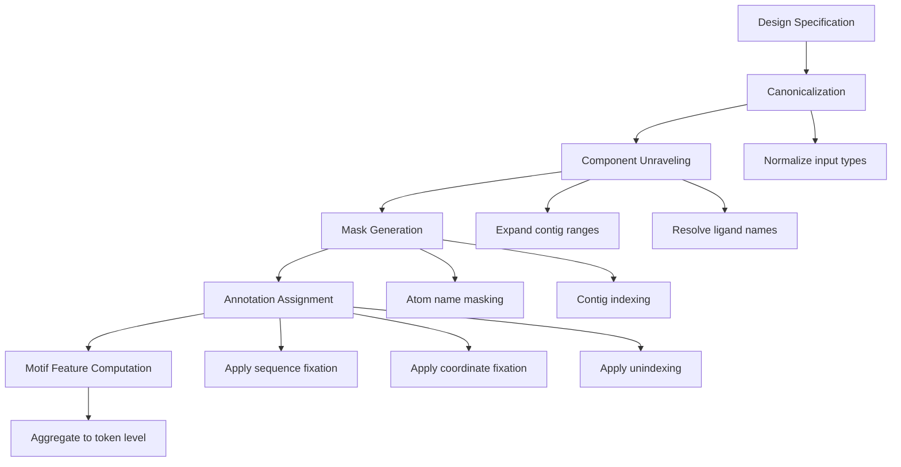
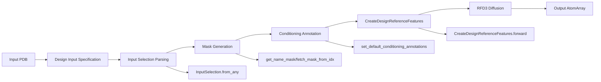

---
slug:20-mask-generation-for-partial-design
blog_type:normal
---


部分设计的掩码生成是 Foundry 中的一项基础机制，它允许在蛋白质生成过程中选择性固定结构元件。该系统能够精确控制哪些原子和残基保持固定，而哪些则由自由设计，从而支持从骨架保留到表位移植等多种工作流。

**架构上下文**：掩码生成系统通过一个分层流水线运行：规范解析 → 组件解析 → 原子级掩码生成 → 条件标注分配。每一层都建立在前一层之上，将高层设计意图转化为精确的原子级布尔掩码，从而驱动扩散过程。


## 核心掩码生成函数

掩码生成 API 提供了三个主要函数，用于在 AtomArray 结构中选择原子。每个函数返回一个与输入原子数组长度相同的布尔掩码，其中 `True` 表示被选中的原子。

### 基于原子名称的掩码

`get_name_mask()` 函数支持通过原子名称进行选择，并具有灵活的规范：

```python
def get_name_mask(
    source_names: np.ndarray, 
    query_names: str, 
    source_resname: str | None = None
) -> np.ndarray
```

该函数支持多种查询格式：

| 查询类型 | 示例 | 描述 |
|------------|---------|-------------|
| `"ALL"` | `"ALL"` | 选择 token 中的所有原子 |
| `"BKBN"` | `"BKBN"` | 选择骨架原子 (N, CA, C, O) |
| `"TIP"` | `"TIP"` | 选择距离骨架最远的原子以进行几何约束 |
| 逗号分隔 | `"N,CA,C,O,CB"` | 精确的原子名称查询 |
| 列表 | `["N", "CA", "C", "O"]` | 原子名称列表 |

来源: [components.py](src/foundry/utils/components.py#L115-L196)

TIP 选择需要一个残基名称，以确定在 `TIP_BY_RESTYPE` 常量中定义的特定几何原子。这支持配体感知的掩码生成，即选择结构上最关键的原子以保留结合几何。

### 基于 Contig 的掩码

对于残基级选择，`fetch_mask_from_idx()` 函数将 contig 字符串转换为原子掩码：

```python
def fetch_mask_from_idx(contig_str, *, atom_array) -> np.ndarray
```

Contig 字符串遵循 `ChainIDResID` 格式（例如 `"A20"`，`"B15"`）。该函数验证 contig 格式并返回同时匹配链 ID 和残基 ID 的原子。

来源: [components.py](src/foundry/utils/components.py#L199-L213)

### 基于组件的掩码

`fetch_mask_from_component()` 函数提供了一个统一接口，用于处理蛋白质残基和非蛋白质组件：

```python
def fetch_mask_from_component(component, *, atom_array) -> np.ndarray
```

该函数首先尝试将组件作为配体/残基名称进行匹配，然后回退到基于 contig 的匹配。这使得能够无缝处理混合的蛋白质-配体系统。

来源: [components.py](src/foundry/utils/components.py#L229-L239)

## 条件标注系统

Foundry 使用一个全面的标注系统来控制多粒度级别的扩散过程。这些标注是分配给每个原子的布尔标志，用于确定生成模型如何处理该原子。

### 必需的条件标注

系统定义了三个必需的标注，用于控制基本的扩散行为：

| 标注 | 目的 | 默认值 |
|------------|---------|---------------|
| `is_motif_atom_with_fixed_seq` | 原子序列在生成期间固定 | `True` |
| `is_motif_atom_with_fixed_coord` | 原子 3D 坐标在生成期间固定 | `True` |
| `is_motif_atom_unindexed` | 原子属于未索引区域（无位置编码） | `False` |

来源: [constants.py](models/rfd3/src/rfd3/constants.py#L18-L25)

这些标注组合在一起定义了四种扩散模式：

- **固定模体**：序列和坐标均固定（骨架保留）
- **固定序列，扩散结构**：序列固定但坐标扩散（重骨架化）
- **扩散序列，固定结构**：坐标固定但序列扩散（固定骨架上的序列设计）
- **完全扩散**：序列和坐标均不固定（从头生成）

### 标注传播

`set_default_conditioning_annotations()` 函数高效地在原子数组上应用标注：

```python
def set_default_conditioning_annotations(
    atom_array,
    motif=False,
    unindexed=False,
    mask=None,
    dtype=bool,
    additional: set | list = None
) -> AtomArray
```

该函数支持全局应用（无掩码）和选择性应用（带掩码），从而能够精细控制哪些区域接收哪种条件。

来源: [conditioning_base.py](models/rfd3/src/rfd3/transforms/conditioning_base.py#L89-L130)

### 模体特征提取

`get_motif_features()` 函数从原子级标注计算模体级布尔特征：

```python
def get_motif_features(atom_array) -> dict:
    returns: {
        "is_motif_atom": boolean array,
        "is_motif_token": boolean array (aggregated to token level)
    }
```

该函数识别具有任何条件（固定序列、固定坐标或未索引）的原子，并使用逻辑或运算将此信息聚合到 token（残基）级别。

来源: [conditioning_base.py](models/rfd3/src/rfd3/transforms/conditioning_base.py#L67-L78)

<CgxTip>Token 级别的聚合对于高效的扩散处理至关重要。系统使用 `apply_and_spread_token_wise()` 将原子级掩码转换为 token 级特征，使扩散模型能够将残基作为内聚单元而非单个原子进行处理。</CgxTip>

## 输入规范和解析

`DesignInputSpecification` 类提供了一个声明性接口，用于通过配置指定部分设计约束。

### 选择参数

该规范支持针对不同条件方面的多个选择参数：

```python
class DesignInputSpecification(BaseModel):
    # Coordinate fixation
    select_fixed_atoms: Optional[InputSelection]
    
    # Sequence fixation
    select_unfixed_sequence: Optional[InputSelection]
    
    # RASA accessibility conditioning
    select_buried: Optional[InputSelection]
    select_partially_buried: Optional[InputSelection]
    select_exposed: Optional[InputSelection]
    
    # Hydrogen bond conditioning
    select_hbond_acceptor: Optional[InputSelection]
    select_hbond_donor: Optional[InputSelection]
    
    # Protein-protein interface conditioning
    select_hotspots: Optional[InputSelection]
```

来源: [input_parsing.py](models/rfd3/src/rfd3/inference/input_parsing.py#L88-L138)

### InputSelection 规范化

`InputSelection` 类将各种输入格式规范化为一致的内部表示：

```python
class InputSelection(BaseModel):
    def from_any(cls, v: Union[str, bool, dict, None], atom_array: AtomArray)
```

支持的输入格式包括：

| 输入类型 | 示例 | 规范化结果 |
|------------|---------|------------------------|
| String contig | `"A10-20"` | A 链残基 10-20 中的所有原子 |
| Boolean `True` | `True` | 结构中的所有原子 |
| Boolean `False` | `False` | 无原子 |
| Dictionary | `{"A10": "N,CA,C", "A11": "BKBN"}` | 每个残基的特定原子选择 |

来源: [parsing.py](models/rfd3/src/rfd3/inference/parsing.py#L29-L74)

`canonicalize_()` 函数处理转换逻辑，调用 `unravel_components()` 扩展 contig 范围并调用 `fetch_mask_from_idx()` 解析单个组件。

来源: [parsing.py](models/rfd3/src/rfd3/inference/parsing.py#L113-L166)

### 互斥验证

该规范包含验证以确保选择在适当的地方互斥：

```python
@model_validator(mode="after")
def assert_exclusivity(self):
    # Assert indexed and unindexed do not overlap
    # Assert RASA binning is mutually exclusive
```

这可以防止冲突的条件，即同一原子受到相互矛盾的扩散约束。

来源: [input_parsing.py](models/rfd3/src/rfd3/inference/input_parsing.py#L329-L365)

## 掩码生成流水线

完整的掩码生成流水线通过一系列定义良好的步骤将设计规范转化为原子级掩码：



### 阶段 1：规范化

输入规范通过 `canonicalize_()` 进行规范化，它转换：
- 布尔值为原子级掩码
- Contig 字符串为残基范围
- 原子名称规范为规范化列表

来源: [parsing.py](models/rfd3/src/rfd3/inference/parsing.py#L113-L166)

### 阶段 2：组件展开

`unravel_components()` 函数将紧凑的规范展开为显式的组件列表：

```python
def unravel_components(
    v: str, 
    *, 
    atom_array: AtomArray = None, 
    allow_multiple_matches: bool = False
) -> List[str]
```

例如，`"A10-12"` 被展开为 `["A10", "A11", "A12"]`，在保持紧凑输入语法的同时实现了每个残基的控制。

来源: [components.py](src/foundry/utils/components.py#L256-L310)

### 阶段 3：掩码生成

掩码根据选择类型通过专用函数生成：
- **坐标掩码**：`get_name_mask()` 用于原子级选择
- **序列掩码**：`fetch_mask_from_idx()` 用于残基级选择
- **组件掩码**：`fetch_mask_from_component()` 用于配体选择

来源: [components.py](src/foundry/utils/components.py#L199-L239)

### 阶段 4：标注分配

生成的掩码通过 `set_default_conditioning_annotations()` 分配给原子数组标注，该函数使用可配置的默认值将掩码应用于不同区域。

来源: [conditioning_base.py](models/rfdry/src/rfd3/transforms/conditioning_base.py#L89-L130)

### 阶段 5：特征计算

最终的模体特征通过 `get_motif_features()` 计算，将原子级标注聚合为扩散模型使用的 token 级特征。

来源: [conditioning_base.py](models/rfd3/src/rfd3/transforms/conditioning_base.py#L67-L78)

## 实际使用模式

### 固定骨架设计

保留骨架结构同时设计新序列：

```python
spec = DesignInputSpecification(
    input="scaffold.pdb",
    select_fixed_atoms=True,  # All coordinates fixed
    select_unfixed_sequence="A1-100",  # Redesign all sequence
    contig="A1-100"  # Define design region
)
```

来源: [input_parsing.py](models/rfd3/src/rfd3/inference/input_parsing.py#L88-L138)

### 表位移植

设计新蛋白质同时保留结合界面：

```python
spec = DesignInputSpecification(
    input="epitope.pdb",
    contig="A1-10",  # Include epitope
    select_fixed_atoms={"A1": "BKBN", "A2-10": "ALL"},  # Fix backbone of A1, all of A2-10
    select_unfixed_sequence=True  # Design surrounding scaffold
)
```

来源: [parsing.py](models/rfd3/src/rfd3/inference/parsing.py#L113-L166)

### 配体结合设计

围绕固定配体设计蛋白质：

```python
spec = DesignInputSpecification(
    input="complex.pdb",
    ligand="LIG",
    select_fixed_atoms={"LIG": "TIP"},  # Fix ligand geometry-constraining atoms
    contig="A10-20,LIG",  # Include ligand in design
    length="80-100"  # Design surrounding scaffold
)
```

来源: [components.py](src/foundry/utils/components.py#L115-L196)

### 部分扩散

对现有结构应用有限的噪声：

```python
spec = DesignInputSpecification(
    input="structure.pdb",
    partial_t=5.0,  # Add 5Å of noise
    select_fixed_atoms="A1-50",  # Keep N-terminus fixed
    select_unfixed_sequence="A51-100"  # Redesign C-terminus
)
```

来源: [input_parsing.py](models/rfd3/src/rfd3/inference/input_parsing.py#L145-L148)

<CgxTip>处理配体时，对于固定原子，请始终使用 "TIP" 原子选择而不是 "ALL"。TIP 选择保留结合取向的几何约束原子，同时允许生成模型对较不关键的原子具有更大的灵活性。</CgxTip>

## 设计参考特征

`CreateDesignReferenceFeatures` 变换将掩码生成的信息与扩散模型的参考特征系统集成：

```python
class CreateDesignReferenceFeatures(Transform):
    def __init__(
        self,
        generate_conformers,
        provide_reference_conformer_when_unmasked,
        ground_truth_conformer_policy,
        provide_elements_for_unindexed_components,
        **kwargs
    )
```

该变换为条件原子创建参考构象信息，同时为非条件区域保留零参考特征，从而在扩散期间实现无分类器指导。

来源: [design_transforms.py](models/rfd3/src/rfd3/transforms/design_transforms.py#L76-L125)

## 验证和错误处理

掩码生成系统通过 `ComponentValidationError` 异常包含全面的验证：

| 错误类型 | 触发条件 | 解决方案 |
|------------|---------|------------|
| 无效的 contig 格式 | Contig 中存在非字母数字字符 | 使用格式 `ChainIDResID` |
| 未找到残基 | Contig 与输入结构不匹配 | 验证链 ID 和残基编号 |
| 未找到原子名称 | 查询的原子在残基中不存在 | 检查残基类型和可用原子 |
| 重叠选择 | 同一原子在多个互斥选择中 | 确保选择是不相交的 |

来源: [components.py](src/foundry/utils/components.py#L22-L46)

## 高级掩码技术

### 条件掩码

使用字典语法组合多个选择标准：

```python
select_fixed_atoms={
    "A1-10": "BKBN",  # Backbone only for N-terminus
    "A11-20": "ALL",  # All atoms for core
    "A21-30": "N,CA,C,O,CB,CG"  # Specific atoms for interface
}
```

来源: [parsing.py](models/rfd3/src/rfd3/inference/parsing.py#L113-L166)

### 顺序掩码

按顺序应用掩码以进行复杂设计：

```python
# First fix ligand
atom_array = set_default_conditioning_annotations(
    atom_array, 
    motif=True, 
    mask=fetch_mask_from_component("LIG", atom_array=atom_array)
)

# Then unfix scaffold sequence
atom_array = set_default_conditioning_annotations(
    atom_array,
    motif=False,  # Diffuse
    mask=fetch_mask_from_idx("A10-20", atom_array=atom_array)
)
```

来源: [conditioning_base.py](models/rfd3/src/rfd3/transforms/conditioning_base.py#L89-L130)

### 断点插入

使用取消索引控制位置编码中断：

```python
unindexed = get_motif_components_and_breaks("A10,A11-12,A13", index_all=False)
# Returns: components=["A10", "A11", "A12", "A13"], breaks=[True, True, False, True]
```

这允许控制在生成期间哪些区域共享位置编码信息。

来源: [components.py](src/foundry/utils/components.py#L129-L186)

## 与设计流水线集成

掩码生成系统与更广泛的 Foundry 设计流水线集成：



生成的掩码流经推理流水线，最终控制哪些区域被保留，哪些区域由扩散模型生成。

来源: [design_transforms.py](models/rfd3/src/rfd3/transforms/design_transforms.py#L76-L125)

## 后续步骤

- **组件解析**：了解 contig 字符串如何解析为组件规范，请参阅 [Component Parsing and Validation](18-component-parsing-and-validation)
- **设计模式**：了解掩码如何与长度约束结合，请参阅 [Design Pattern with Constraints](19-design-pattern-with-constraints)
- **推理引擎**：查看掩码如何在推理流水线中使用，请参阅 [Implementing Custom Inference Engines](23-implementing-custom-inference-engines)
- **RFdiffusion3 模型**：了解模型如何使用条件标注，请参阅 [RFdiffusion3: All-Atom Generative Model](9-rfdiffusion3-all-atom-generative-model)

掩码生成系统为精确控制蛋白质生成提供了基础，从而能够在多样化的蛋白质工程应用中实现创意设计和严格的约束保留。