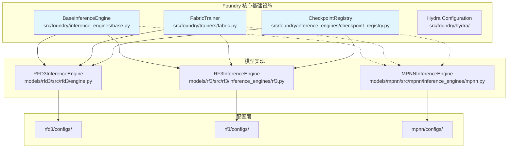
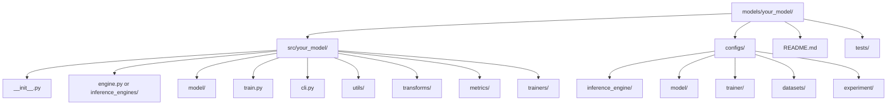

---
slug:21-adding-new-models-to-foundry
blog_type:normal
---


本指南提供了将新的生物分子 AI 模型集成到 Foundry 模块化架构中的全面框架。Foundry 被设计为一个共享的训练和推理基础设施，通过一个公共基类支持多个模型，允许你在实现特定模型逻辑的同时利用现有组件。

## 架构概览

Foundry 遵循分层集成模式，其中模型被组织为继承自核心基础设施组件的独立包。该架构将关注点分为三层：基础基础设施、模型特定实现和训练工具。



基础 `BaseInferenceEngine` 类提供基本功能，包括检查点加载、训练器构建和管道初始化。模型扩展此基类以实现推理特定逻辑，同时重用基础设施工代码。

**来源：** [BaseInferenceEngine](src/foundry/inference_engines/base.py#L32-L154), [CheckpointRegistry](src/foundry/inference_engines/checkpoint_registry.py#L1-L71)

## 集成先决条件

在集成新模型之前，请确保你理解 Foundry 的核心抽象概念并已准备好必要的组件。集成需要架构决策，确定你的模型是遵循标准模式（扩展 `BaseInferenceEngine`）还是需要自定义推理引擎（如 MPNN）。

### 必需组件

| 组件 | 目的 | 实现要求 |
|-----------|---------|-------------------------|
| **模型包** | 包含所有模型特定代码 | 创建 `models/{your_model}/` 目录结构 |
| **推理引擎** | 处理模型加载和推理 | 扩展 `BaseInferenceEngine` 或实现自定义类 |
| **配置文件** | 基于 Hydra 的参数管理 | 创建 `models/{your_model}/configs/` 层级结构 |
| **模型架构** | 神经网络定义 | 在 `models/{your_model}/src/{your_model}/model/` 中实现 |
| **训练器** | 训练编排 | 扩展 `FabricTrainer` 或创建模型特定训练器 |
| **输出容器** | 标准化结果格式 | 为模型输出实现数据类 |

### 目录结构模板



**来源：** [RFD3 结构](models/rfd3/), [RF3 结构](models/rf3/), [MPNN 结构](models/mpnn/)

## 步骤 1：创建模型包结构

首先为你的模型建立目录结构。这遵循现有模型建立的模式，确保与 Foundry 的打包系统兼容。

```bash
mkdir -p models/your_model/src/your_model
mkdir -p models/your_model/src/your_model/model
mkdir -p models/your_model/src/your_model/inference_engines
mkdir -p models/your_model/src/your_model/trainers
mkdir -p models/your_model/src/your_model/transforms
mkdir -p models/your_model/src/your_model/metrics
mkdir -p models/your_model/src/your_model/utils
mkdir -p models/your_model/configs/inference_engine
mkdir -p models/your_model/configs/model
mkdir -p models/your_model/configs/trainer
mkdir -p models/your_model/configs/datasets
mkdir -p models/your_model/tests
```

使用最小的 `__init__.py` 文件初始化包，声明你的模型和版本：

```python
"""Your Model - 关于其功能的简要描述。"""

__version__ = "0.1.0"
```

**来源：** [RFD3 Init](models/rfd3/src/rfd3/__init__.py#L1-L13), [RF3 Init](models/rf3/src/rf3/__init__.py#L1-L4)

## 步骤 2：实现或扩展推理引擎

根据你的模型是否能利用 Foundry 的标准检查点和训练基础设施来选择集成方法。

### 选项 A：扩展 BaseInferenceEngine（推荐）

如果你的模型使用 PyTorch 检查点、需要标准训练器初始化并受益于 Foundry 的转换管道，请使用此方法。这是 RFdiffusion3 和 RosettaFold3 采用的路径。

在 `models/your_model/src/your_model/engine.py` 中创建推理引擎类：

```python
from foundry.inference_engines import BaseInferenceEngine
from dataclasses import dataclass

@dataclass
class YourModelOutput:
    """你的模型预测的输出容器。"""
    example_id: str
    predictions: Any
    # 在此添加模型特定字段
    
    def dump(self, out_dir, **kwargs):
        """将输出保存到磁盘。"""
        pass

class YourModelInferenceEngine(BaseInferenceEngine):
    """你的模型的推理引擎。"""
    
    def __init__(
        self,
        *,
        # 模型特定参数
        batch_size: int = 1,
        num_steps: int = 100,
        # 输出控制参数
        dump_predictions: bool = True,
        **kwargs,
    ):
        # 使用转换和训练器覆盖初始化基类
        super().__init__(
            transform_overrides={
                "batch_size": batch_size,
                # 添加转换特定覆盖
            },
            inference_sampler_overrides={
                "num_timesteps": num_steps,
            },
            **kwargs,
        )
        
        # 存储模型特定配置
        self.batch_size = batch_size
        self.dump_predictions = dump_predictions
    
    def run(
        self,
        inputs,
        **kwargs,
    ):
        """对提供的输入运行推理。"""
        # 如果尚未初始化，则初始化模型
        self.initialize()
        
        # 处理输入
        # 运行模型推理
        # 生成输出
        pass
```

`BaseInferenceEngine` 提供了你可以利用的几个关键方法：

- `initialize()`: 加载检查点，构建训练器和管道
- `_construct_trainer()`: 实例化训练器并加载模型权重
- `_construct_pipeline()`: 从配置构建转换管道
- `_override_checkpoint_config()`: 将运行时覆盖与检查点配置合并

**来源：** [BaseInferenceEngine](src/foundry/inference_engines/base.py#L32-L154), [RFD3 实现](models/rfd3/src/rfd3/engine.py#L135-L200), [RF3 实现](models/rf3/src/rf3/inference_engines/rf3.py#L222-L340)

### 选项 B：自定义推理引擎

如果你的模型有独特的要求，例如不同的检查点格式、不需要训练器基础设施或自定义加载逻辑，请使用此方法。ProteinMPNN 使用此模式。

创建独立的推理引擎类：

```python
from dataclasses import dataclass

class YourModelInferenceEngine:
    """你的模型的自定义推理引擎。"""
    
    def __init__(
        self,
        *,
        checkpoint_path: str,
        model_type: str = "default",
        device: str | torch.device | None = None,
        **kwargs,
    ):
        """初始化引擎并加载模型。"""
        self.checkpoint_path = checkpoint_path
        self.model_type = model_type
        self.device = device
        
        self._build_and_load_model()
    
    def _build_and_load_model(self):
        """构建模型架构并加载权重。"""
        pass
    
    def run(self, *, inputs, **kwargs):
        """运行推理。"""
        pass
```

**来源：** [MPNN 实现](models/mpnn/src/mpnn/inference_engines/mpnn.py#L37-L94)

## 步骤 3：配置 Hydra 集成

Foundry 使用 Hydra 进行配置管理。创建遵循既定模式的结构化配置层次结构。

### 推理引擎配置

创建 `models/your_model/configs/inference_engine/base.yaml`：

```yaml
# @package _global_
defaults:
  - _self_

_target_: your_model.engine.YourModelInferenceEngine

# 检查点配置
ckpt_path: null  # 检查点路径或注册名称

# 模型参数
batch_size: 1
num_steps: 100

# 输出控制
out_dir: ???
dump_predictions: true
verbose: false
seed: null
```

在 `models/your_model/configs/inference_engine/your_model.yaml` 中创建模型特定配置：

```yaml
# @package _global_
defaults:
  - base
  - _self_

_target_: your_model.engine.YourModelInferenceEngine

# 模型特定默认值
batch_size: 8
num_steps: 50

# 特定于你的模型的其他参数
parameter_1: value_1
parameter_2: value_2
```

**来源：** [RFD3 配置](models/rfd3/configs/inference_engine/rfdiffusion3.yaml#L1-L66), [RF3 配置](models/rf3/configs/inference_engine/rf3.yaml#L1-L33)

### 模型配置

创建模型架构配置：

```yaml
# models/your_model/configs/model/your_model.yaml
net:
  _target_: your_model.model.YourModel
  
  # 架构参数
  hidden_dim: 256
  num_layers: 12
  num_heads: 8
  
  # 优化器配置
  optimizer:
    _target_: torch.optim.AdamW
    _partial_: true
    lr: 0.001
    weight_decay: 0.01
  
  # 调度器配置
  scheduler:
    _target_: torch.optim.lr_scheduler.CosineAnnealingLR
    _partial_: true
    T_max: 100000
```

### 训练器配置

创建扩展基础训练器的训练器配置：

```yaml
# models/your_model/configs/trainer/your_model.yaml
defaults:
  - ddp
  
model:
  _target_: your_model.trainers.YourModelTrainer
  
# 训练特定参数
max_epochs: 1000
n_examples_per_epoch: 24000
grad_accum_steps: 1
precision: bf16-mixed
```

**来源：** [RFD3 训练器配置](models/rfd3/configs/trainer/rfd3_base.yaml), [RF3 训练器配置](models/rf3/configs/trainer/rf3.yaml)

## 步骤 4：实现训练器类

你的模型需要一个扩展 `FabricTrainer` 的训练器类来编排训练。创建 `models/your_model/src/your_model/trainers/your_trainer.py`：

```python
from foundry.trainers import FabricTrainer
from typing import Any

class YourModelTrainer(FabricTrainer):
    """你的模型的训练器。"""
    
    def __init__(self, **kwargs):
        super().__init__(**kwargs)
    
    def construct_model(self):
        """实例化模型。"""
        # 从状态获取模型配置
        model_cfg = self.state["train_cfg"].model
        
        # 实例化模型
        model = hydra.utils.instantiate(model_cfg.net)
        
        # 如果配置了 EMA，则使用 EMA 包装
        if self.state["train_cfg"].model.ema is not None:
            from foundry.training import EMA
            ema = hydra.utils.instantiate(self.state["train_cfg"].model.ema)
            model = ema(model)
        
        # 在状态中存储模型
        self.initialize_or_update_trainer_state({"model": model})
    
    @abstractmethod
    def training_step(self, batch: Any, batch_idx: int, is_accumulating: bool) -> None:
        """执行单个训练步骤。"""
        model = self.state["model"]
        
        # 前向传播
        outputs = model(batch)
        
        # 计算损失
        loss = outputs["loss"]
        
        # 反向传播
        self.fabric.backward(loss)
        
        # 记录指标
        if not is_accumulating and self.trainer_should_log:
            self.log_dict({"train_loss": loss}, step=self.global_step)
    
    @abstractmethod
    def validation_step(self, batch: Any, batch_idx: int, val_loader_name: str = None) -> dict:
        """执行单个验证步骤。"""
        model = self.state["model"]
        
        # 前向传播
        outputs = model(batch)
        
        # 计算验证指标
        metrics = {
            "val_loss": outputs["loss"],
            # 添加模型特定指标
        }
        
        return metrics
```

**来源：** [FabricTrainer 基类](src/foundry/trainers/fabric.py#L52-L154), [FabricTrainer 方法](src/foundry/trainers/fabric.py#L627-L654)

## 步骤 5：创建模型架构

在 `models/your_model/src/your_model/model/` 中实现你的神经网络架构。这取决于你的模型，取决于你的架构选择。

**来源：** [RFD3 模型](models/rfd3/src/rfd3/model/), [RF3 模型](models/rf3/src/rf3/model/)

## 步骤 6：注册检查点

将模型的检查点添加到 `src/foundry/inference_engines/checkpoint_registry.py` 中的中央注册表中：

```python
REGISTERED_CHECKPOINTS = {
    # 现有模型...
    "your_model": RegisteredCheckpoint(
        url="https://your-server.com/your_model.ckpt",
        filename="your_model_latest.ckpt",
        description="Your Model checkpoint description",
        sha256=None,  # 可选：添加校验和以进行验证
    ),
}
```

这允许用户通过名称引用你的模型而无需指定完整路径：

```python
engine = YourModelInferenceEngine(ckpt_path="your_model")
```

**来源：** [CheckpointRegistry](src/foundry/inference_engines/checkpoint_registry.py#L33-L71)

## 步骤 7：创建训练入口点

创建 `models/your_model/src/your_model/train.py` 以启动训练：

```python
from lightning.pytorch.cli import LightningCLI

class YourModelCLI(LightningCLI):
    def add_arguments_to_parser(self, parser):
        parser.add_argument(
            "--experiment",
            type=str,
            default=None,
            help="要使用的实验配置"
        )

if __name__ == "__main__":
    cli = YourModelCLI(
        model_class=None,  # 模型由训练器构建
        subclass_mode_model=True,
    )
```

**来源：** [RFD3 训练](models/rfd3/src/rfd3/train.py), [RF3 训练](models/rf3/src/rf3/train.py)

## 步骤 8：添加 CLI 入口点

在 `models/your_model/src/your_model/cli.py` 中创建命令行界面：

```python
import typer
from your_model.engine import YourModelInferenceEngine

app = typer.Typer()

@app.command()
def predict(
    inputs: str = typer.Argument(..., help="输入文件路径"),
    out_dir: str = typer.Option("./outputs", "--out_dir", "-o", help="输出目录"),
    ckpt_path: str = typer.Option("your_model", "--ckpt_path", "-c", help="检查点路径"),
    batch_size: int = typer.Option(1, "--batch-size", "-b", help="批次大小"),
):
    """使用你的模型运行推理。"""
    engine = YourModelInferenceEngine(
        ckpt_path=ckpt_path,
        batch_size=batch_size,
    )
    
    results = engine.run(inputs=inputs, out_dir=out_dir)
    print(f"Results saved to {out_dir}")

if __name__ == "__main__":
    app()
```

**来源：** [RFD3 CLI](models/rfd3/src/rfd3/cli.py), [RF3 CLI](models/rf3/src/rf3/cli.py)

## 步骤 9：更新包配置

修改 `pyproject.toml` 以在构建系统中包含你的新模型：

```toml
[project.optional-dependencies]
your_model = [
    "your-dependency>=1.0.0",
]
all = [
    "rc-foundry[rfd3]",
    "rc-foundry[rf3]",
    "rc-foundry[mpnn]",
    "rc-foundry[your_model]",
]

[project.scripts]
# 现有条目...
your_model = "your_model.cli:app"

[tool.hatch.build.targets.wheel]
packages = [
  "src/foundry",
  "src/foundry_cli",
  "models/rf3/src/rf3",
  "models/rfd3/src/rfd3",
  "models/mpnn/src/mpnn",
  "models/your_model/src/your_model",  # 添加你的模型
]

[tool.hatch.build.targets.wheel.force-include]
# 现有条目...
"models/your_model/configs" = "your_model/configs"  # 添加你的模型配置
```

**来源：** [pyproject.toml](pyproject.toml#L1-L194)

## 步骤 10：创建文档和示例

按照既定模式在 `models/your_model/README.md` 中编写全面的文档：

```markdown
# Your Model

简要描述你的模型的作用及其关键功能。

## 入门指南
1. 安装 Your Model:
```bash
pip install rc-foundry[your_model]
```

2. 下载检查点:
```bash
foundry install your_model --checkpoint-dir /path/to/ckpt/dir
```

## 运行推理
```bash
your_model predict inputs=path/to/input.json out_dir=./outputs
```

## 训练
从头开始训练或微调的说明。

## 引用
BibTeX 引用信息。
```

**来源：** [RFD3 README](models/rfd3/README.md#L1-L175), [RF3 README](models/rf3/README.md#L1-L200)

<CgxTip>
在实现推理引擎时，请仔细考虑哪些配置参数应该在 `__init__` 级别暴露，哪些应该保留在检查点配置中。用户经常覆盖的参数（如批次大小、步数）应该是初始化参数，而模型架构细节通常保留在检查点配置中。
</CgxTip>

## 步骤 11：实现测试

在 `models/your_model/tests/` 中为你的模型创建测试以确保集成正常工作：

```python
import pytest
from your_model.engine import YourModelInferenceEngine

def test_engine_initialization():
    """测试推理引擎是否正确初始化。"""
    engine = YourModelInferenceEngine(
        ckpt_path="your_model",
        batch_size=1,
    )
    assert engine.batch_size == 1

def test_run_inference():
    """测试推理是否无错误运行。"""
    engine = YourModelInferenceEngine(
        ckpt_path="your_model",
        batch_size=1,
    )
    # 添加实际推理测试
    pass
```

**来源：** [测试结构](tests/conftest.py)

## 步骤 12：添加依赖管理

更新 `pyproject.toml` 以添加模型特定的依赖项：

```toml
[project.optional-dependencies]
your_model = [
    "required-package>=1.0.0",
    "another-package>=2.0.0",
]
```

<CgxTip>
考虑使用可选依赖项以保持基础安装轻量。仅要求对模型功能至关重要的包。特定于测试的依赖项应放在 `dev` extra 中。
</CgxTip>

## 集成检查清单

使用此检查清单验证模型集成是否完成：

| 组件 | 状态 | 备注 |
|-----------|--------|-------|
| 已创建包目录结构 | ☐ | 遵循 `models/your_model/` 模式 |
| 带有版本声明的 `__init__.py` | ☐ | 包含版本和文档字符串 |
| 已实现推理引擎 | ☐ | 扩展 Base 或自定义类 |
| 输出容器数据类 | ☐ | 包括 `dump()` 方法 |
| 已创建 Hydra 配置 | ☐ | inference_engine, model, trainer |
| 已实现训练器类 | ☐ | 扩展 FabricTrainer |
| 已实现模型架构 | ☐ | 位于 `model/` 目录中 |
| 已注册检查点 | ☐ | 添加到 `checkpoint_registry.py` |
| 训练入口点 | ☐ | 已创建 `train.py` |
| CLI 入口点 | ☐ | 已创建 `cli.py` |
| 已更新 pyproject.toml | ☐ | 包、脚本、依赖项 |
| README 文档 | ☐ | 安装和使用说明 |
| 已实现测试 | ☐ | 基本集成测试 |
| 已测试构建系统 | ☐ | 包构建并正确安装 |

## 常见模式和最佳实践

### 转换管道集成

Foundry 使用转换管道进行数据预处理。你的模型应在 `models/your_model/src/your_model/transforms/` 中定义转换并在你的配置中引用它们：

```yaml
# models/your_model/configs/datasets/val.yaml
dataset:
  _target_: atomworks.datasets.AtomStructureDataset
  
  transform:
    _target_: your_model.transforms.YourTransform
    
    # 转换参数
    parameter_1: value_1
```

`BaseInferenceEngine._construct_pipeline()` 方法自动从配置中的第一个验证数据集加载并实例化转换。

**来源：** [BaseInferenceEngine 管道](src/foundry/inference_engines/base.py#L209-L230)

### 指标集成

如果你的模型产生置信度指标或其他质量评估，请在 `models/your_model/src/your_model/metrics/` 中实现指标并进行配置：

```yaml
# models/your_model/configs/inference_engine/your_model.yaml
metrics_cfg:
  metric_1:
    _target_: your_model.metrics.YourMetric
  metric_2:
    _target_: your_model.metrics.AnotherMetric
```

`RF3InferenceEngine` 使用 PTM、IPTM 和冲突链指标演示了此模式。

**来源：** [RF3 指标](models/rf3/src/rf3/inference_engines/rf3.py#L49-L90), [RF3 指标配置](models/rf3/configs/inference_engine/rf3.yaml#L24-L32)

### 回调集成

Foundry 提供用于记录和监控的回调系统。在 `models/your_model/src/your_model/callbacks/` 中创建自定义回调：

```python
from foundry.callbacks import BaseCallback

class YourModelCallback(BaseCallback):
    def on_train_batch_end(self, trainer, batch_idx, outputs):
        """在每个训练批次之后调用。"""
        pass
```

**来源：** [回调基类](src/foundry/callbacks/callback.py), [RFD3 回调](models/rfd3/src/rfd3/callbacks.py)

## 集成问题故障排除

### 常见挑战

| 问题 | 症状 | 解决方案 |
|-------|---------|----------|
| 检查点加载失败 | `FileNotFoundError` 或 `KeyError` | 验证检查点路径和结构与训练检查点格式匹配 |
| 找不到 Hydra 配置 | `ConfigCompositionException` | 检查 YAML 中的配置文件路径和默认引用 |
| 导入错误 | `ModuleNotFoundError` | 确保包在 `pyproject.toml` 包列表中并已安装 |
| 训练器初始化失败 | 缺少训练器状态键 | 验证 `initialize_or_update_trainer_state()` 调用与检查点结构匹配 |
| 分布式训练错误 | NCCL 或 DDP 问题 | 检查 `num_nodes` 和 `devices_per_node` 配置 |

### 调试模式

启用详细日志记录以对问题进行故障排除：

```python
engine = YourModelInferenceEngine(
    ckpt_path="your_model",
    verbose=True,  # 启用详细日志记录和配置树打印
)
```

**来源：** [BaseInferenceEngine 详细](src/foundry/inference_engines/base.py#L62-L64)

## 后续步骤

完成模型集成后，请考虑以下高级主题：

- **[模型特定配置结构](22-model-specific-configuration-structure)**：深入探讨组织复杂的模型配置
- **[实现自定义推理引擎](23-implementing-custom-inference-engines)**：对于需要非标准推理模式的模型
- **[检查点管理系统](8-checkpoint-management-system)**：高级检查点处理和版本控制
- **[使用 FabricTrainer 的训练工具](7-training-harness-with-fabrictrainer)**：扩展训练功能和优化技术

**来源：** [导航目录](#NAVIGATION_CONTEXT)