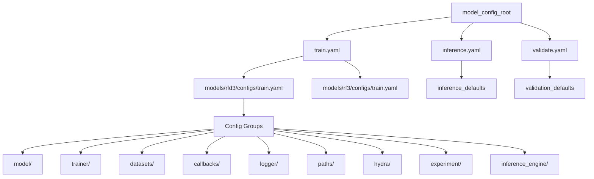

---
slug:22-model-specific-configuration-structure
blog_type:normal
---


Found采用了一种**分层、可组合的配置架构**，其中每个模型在 `models/{model_name}/configs/` 下维护独立的配置命名空间。这种设计在保持代码库中一致的组织模式的同时，实现了特定于模型的定制。该系统利用 Hydra 的配置组合，从模块化组件组装完整的运行时配置，从而允许对推理、训练和验证工作流进行细粒度控制。

来源：[models/rfd3/configs/train.yaml](models/rfd3/configs/train.yaml#L1-L28), [models/rf3/configs/train.yaml](models/rf3/configs/train.yaml#L1-L43)

## 配置命名空间架构

每个模型驻留在一个具有标准化结构的专用配置目录中。入口点 `train.yaml`、`inference.yaml` 和 `validate.yaml` 通过 Hydra 的默认列表定义组合层次结构，编排来自功能目录的子配置组装。



配置组合遵循**分层覆盖模式**，其中优先级较高的配置（在默认列表中较低）覆盖优先级较低的配置。这使得在保持合理默认值的同时，能够进行特定于实验的定制。

来源：[models/rfd3/configs/train.yaml](models/rfd3/configs/train.yaml#L5-L22), [models/rf3/configs/train.yaml](models/rf3/configs/train.yaml#L9-L30)

## RFD3 配置结构

RFdiffusion3 通过跨多个领域的广泛定制选项，展示了全面的配置模式。

### 核心入口点

训练配置通过显式默认值组装组件：

```yaml
defaults:
  - model: rfd3_base
  - trainer: rfd3_base
  - datasets: design_base
  - callbacks: design_callbacks
  - dataloader: fast
  - paths: default
  - hydra: default
  - logger: default
  - _self_
```

每个默认值引用一个配置组，该配置组本身可能组合进一步的子配置，从而创建一个深度但可导航的层次结构。

来源：[models/rfd3/configs/train.yaml](models/rfd3/configs/train.yaml#L5-L14)

### 模型组件组合

`rfd3_base.yaml` 模型配置展示了嵌套组合：

```yaml
defaults:
  - optimizers/adam@optimizer
  - schedulers/af3@lr_scheduler
  - samplers/edm@net.inference_sampler
  - components/ema@ema
  - components/rfd3_net@net
  - _self_
```

`@` 语法将加载的配置放置在输出配置中的特定路径下，从而实现对嵌套参数的结构化组织。例如，EDM 采样器配置嵌套在 `net.inference_sampler` 下。

来源：[models/rfd3/configs/model/rfd3_base.yaml](models/rfd3/configs/model/rfd3_base.yaml#L1-L9)

### 推理引擎配置

RFD3 的推理引擎配置定义了扩散采样的广泛参数：

| 参数类别 | 关键参数 | 用途 |
|-------------------|----------------|---------|
| **扩散参数** | `num_timesteps: 200`, `step_scale: 1.5`, `noise_scale: 1.003` | 控制去噪轨迹 |
| **CFG 引导** | `use_classifier_free_guidance`, `cfg_scale: 1.5`, `cfg_features` | 启用条件生成 |
| **空间控制** | `center_option: "all"`, `s_trans: 1.0` | 管理坐标变换 |
| **输出控制** | `cleanup_guideposts`, `read_sequence_from_sequence_head` | 配置结果格式化 |

<CgxTip>`center_option` 参数决定了扩散过程中哪些残基被中心化：`"all"` 中心化整个复合物，`"motif"` 仅中心化固定区域，`"diffuse"` 仅中心化设计的区域。</CgxTip>

来源：[models/rfd3/configs/inference_engine/rfdiffusion3.yaml](models/rfd3/configs/inference_engine/rfdiffusion3.yaml#L17-L66)

### 数据集配置层次结构

`design_base.yaml` 数据集配置组合了多个训练和验证数据集，并带有条件转换：

```yaml
defaults:
  - train/pdb/rfd3_train_interface@train.pdb.sub_datasets.interface
  - train/pdb/rfd3_train_pn_unit@train.pdb.sub_datasets.pn_unit
  - val/unconditional@val.unconditional
  - val/unconditional_deep@val.unconditional_deep
  - val/indexed@val.indexed
  - conditions/unconditional@global_transform_args.train_conditions.unconditional
  # ... 其他条件
```

训练条件为不同的设计任务指定**频率加权采样**：

```yaml
train_conditions:
  unconditional:
    frequency: 5.0
  sequence_design:
    frequency: 2.0
  island:
    frequency: 1.0
  tipatom:
    frequency: 0.0
  ppi:
    frequency: 0.0
```

较高的频率表示某个条件在训练期间出现的频率更高，从而实现对多样化设计场景的均衡暴露。

来源：[models/rfd3/configs/datasets/design_base.yaml](models/rfd3/configs/datasets/design_base.yaml#L1-L98)

## RF3 配置结构

RosettaFold3 遵循相同的架构模式，但针对结构预测进行了特定于模型的调整。

### 模型架构配置

RF3 定义了全面的模型参数，包括通道维度、特征嵌入配置和扩散模块规范：

```yaml
# 通道维度
c_s: 384
c_z: 128
c_atom: 128
c_atompair: 16
c_s_inputs: 449

# 带有原子级嵌入的特征初始化器
feature_initializer:
  input_feature_embedder:
    atom_attention_encoder:
      c_atom_1d_features: 393  # 392 + 1 has_atom_level_embedding
      use_atom_level_embedding: true
      atom_level_embedding_dim: 384
```

该配置支持基础版本和**置信度增强变体**，后者添加了用于预测误差估计的额外头部。

来源：[models/rf3/configs/model/rf3.yaml](models/rf3/configs/model/rf3.yaml#L1-L43), [models/rf3/configs/experiment/pretrained/rf3.yaml](models/rf3/configs/experiment/pretrained/rf3.yaml#L1-L51)

### 推理引擎参数

RF3 的推理配置强调特定于结构预测的参数：

```yaml
n_recycles: 10
diffusion_batch_size: 5
num_steps: 50
template_noise_scale: 1e-5
early_stopping_plddt_threshold: 0.5
```

`metrics_cfg` 部分动态实例化置信度指标：

```yaml
metrics_cfg:
  ptm:
    _target_: rf3.metrics.predicted_error.ComputePTM
  iptm:
    _target_: rf3.metrics.predicted_error.ComputeIPTM
  count_clashing_chains:
    _target_: rf3.metrics.clashing_chains.CountClashingChains
```

这种模式能够在运行时使用可配置参数实例化指标对象。

来源：[models/rf3/configs/inference_engine/rf3.yaml](models/rf3/configs/inference_engine/rf3.yaml#L1-L33)

## 实验配置模式

实验配置提供**版本化的超参数集**，用于覆盖基础配置。它们遵循一致的模式：

```yaml
# @package _global_

name: train-base
tags: [print-model]
project: aa_design

defaults:
  - override /datasets: pdb_and_distillation
  - override /model: rf3
  - override /trainer: rf3

# 特定于实验的覆盖
datasets:
  diffusion_batch_size_train: 16
  crop_size: 256
```

`@package _global_` 指令确保配置被放置在合并后的输出配置的根目录下。`override` 语法显式替换默认组选择。

来源：[models/rfd3/configs/experiment/pretrain.yaml](models/rfd3/configs/experiment/pretrain.yaml#L1-L31), [models/rf3/configs/experiment/pretrained/rf3.yaml](models/rf3/configs/experiment/pretrained/rf3.yaml#L1-L51)

## 配置组参考

| 组 | 用途 | RFD3 | RF3 | MPNN |
|-------|---------|------|-----|------|
| **model/** | 网络架构、优化器、调度器 | ✓ | ✓ | 计划中 |
| **trainer/** | 训练循环、验证、损失函数 | ✓ | ✓ | 计划中 |
| **datasets/** | 数据源、转换、验证集 | ✓ | ✓ | 计划中 |
| **inference_engine/** | 推理参数、采样、I/O | ✓ | ✓ | 计划中 |
| **callbacks/** | 训练回调、指标日志记录 | ✓ | ✓ | 不适用 |
| **logger/** | 实验跟踪 | ✓ | ✓ | 不适用 |
| **paths/** | 目录结构、检查点位置 | ✓ | ✓ | 不适用 |
| **hydra/** | Hydra 运行时行为 | ✓ | ✓ | 不适用 |
| **experiment/** | 版本化的超参数集 | ✓ | ✓ | 不适用 |

来源：[get_repo_structure](models/rfd3/configs), [get_repo_structure](models/rf3/configs)

## 路径管理策略

路径配置集中管理所有目录引用，并使用 Hydra 的运行时插值：

```yaml
defaults:
  - _self_
  - data: default

root_dir: ${oc.env:PROJECT_ROOT}
log_dir: /net/scratch/${oc.env:USER}/training/logs
output_dir: ${hydra:runtime.output_dir}
work_dir: ${hydra:runtime.cwd}
```

`${oc.env:VAR}` 语法访问环境变量，而 `${hydra:runtime}` 引用 Hydra 生成的路径。这实现了**可移植配置**，使其能够适应不同的部署环境而无需修改代码。

来源：[models/rfd3/configs/paths/default.yaml](models/rfd3/configs/paths/default.yaml#L1-L22)

## 调试和开发配置

特殊配置支持开发期间的快速迭代：

```yaml
defaults:
  - inference_engine: dev
  - _self_
```

`dev.yaml` 推理引擎配置通常会降低计算需求以进行快速测试。同样，实验配置可以覆盖批大小和数据集大小：

```yaml
trainer:
  limit_train_batches: 4
  limit_val_batches: 4

model:
  net:
    inference_sampler:
      num_timesteps: 50  # 从默认的 200 减少
```

来源：[models/rfd3/configs/dev.yaml](models/rfd3/configs/dev.yaml#L1-L10), [models/rf3/configs/experiment/quick-rf3.yaml](models/rf3/configs/experiment/quick-rf3.yaml#L1-L62)

## 扩展指南

要为新模型添加配置支持：

1. **创建模型目录**：`models/{model_name}/`
2. **建立配置结构**：复制标准的 `configs/` 子目录布局
3. **定义入口点**：创建 `train.yaml`、`inference.yaml`、`validate.yaml`
4. **实现组件**：在 `model/` 和 `trainer/` 下添加特定于模型的配置
5. **向 Hydra 注册**：确保配置搜索路径包含新目录

<CgxTip>在顶级配置中使用 `@package _global_` 指令，并使用 `@` 语法进行嵌套组合，以与现有模型保持一致。这确保了可预测的配置合并和覆盖行为。</CgxTip>

来源：[models/rfd3/configs/train.yaml](models/rfd3/configs/train.yaml#L1-L3), [models/rf3/configs/train.yaml](models/rf3/configs/train.yaml#L1-L3)

## 后续步骤

要深入了解配置系统：

- **Hydra 集成**：在 [Hydra 配置系统](12-hydra-configuration-system) 中了解组合机制和解析器系统
- **自定义解析器**：在 [动态配置的自定义解析器](13-custom-resolvers-for-dynamic-configs) 中了解动态值解析
- **模型实现**：在 [向 Foundry 添加新模型](21-adding-new-models-to-foundry) 中查看配置如何映射到具体架构

关于实际模型使用：

- **RFD3 设计**：在 [RFdiffusion3：全原子生成模型](9-rfdiffusion3-all-atom-generative-model) 中探索全原子生成模型功能
- **RF3 预测**：在 [RosettaFold3：结构预测网络](10-rosettafold3-structure-prediction-network) 中了解结构预测工作流