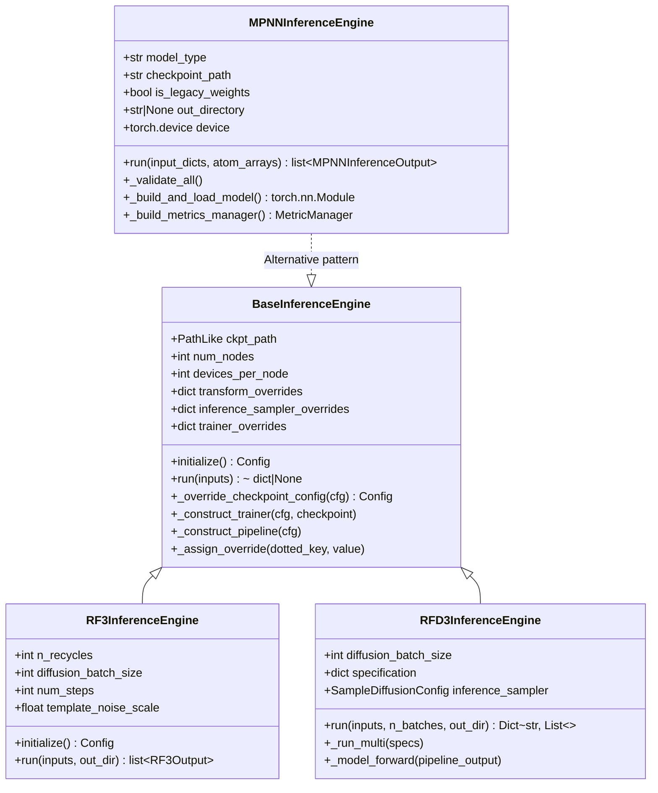
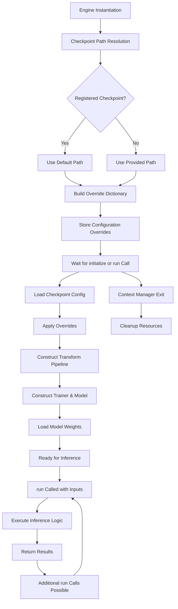
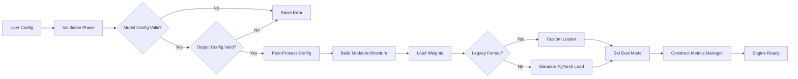

---
slug:23-implementing-custom-inference-engines
blog_type:normal
---


本指南提供了一份全面的架构蓝图，用于在 Foundry 的模块化设计系统中实现自定义推理引擎。推理引擎作为训练模型与生产推理工作流之间的关键桥梁，将昂贵的模型初始化与高效的重复推理操作分离开来。

## 架构概览

Foundry 的推理引擎架构围绕两种截然不同的实现模式构建：**BaseInferenceEngine 继承模式**适用于需要集成分布式训练基础设施的复杂模型，而**独立引擎模式**适用于推理要求较简单的模型。这种双重方法优化了开发复杂度和运行时效率。



BaseInferenceEngine 为利用 Foundry 的 FabricTrainer 基础设施的模型提供了基础，包括自动分布式推理、检查点加载和配置管理。MPNNInferenceEngine 展示了一种自定义实现，针对不需要完整训练基础设施的轻量级推理需求进行了优化。

来源：[base.py](src/foundry/inference_engines/base.py#L32-L50), [rf3.py](models/rf3/src/rf3/inference_engines/rf3.py#L208-L235), [mpnn.py](models/mpnn/src/mpnn/inference_engines/mpnn.py#L37-L50)

## 核心架构模式

### BaseInferenceEngine 继承模式

BaseInferenceEngine 建立了复杂的初始化与推理分离机制，从而优化内存使用和启动时间。该架构遵循清晰的生命周期：配置解析、延迟初始化、可选的重复推理以及资源清理。



初始化过程利用了复杂的配置覆盖系统，该系统使用点分路径表示法来精确定位嵌套配置值。这实现了细粒度控制，而无需修改完整的配置文件。覆盖系统在三个不同级别应用更改：转换流水线配置、推理采样器参数和训练器设置。

来源：[base.py](src/foundry/inference_engines/base.py#L125-L143), [base.py](src/foundry/inference_engines/base.py#L160-L213)

### 配置覆盖系统

覆盖机制通过分层字典结构实现运行时自定义。覆盖按特定顺序应用，以确保正确的优先级：首先是基础覆盖，然后是训练器覆盖，最后是推理采样器覆盖。

| 覆盖类别 | 点分路径前缀 | 典型参数 |
|------------------|-------------------|-------------------|
| Transform Pipeline | None (direct) | `diffusion_batch_size`, `n_recycles`, `undesired_res_names` |
| Trainer Settings | `trainer.` | `num_nodes`, `devices_per_node`, `metrics` |
| Inference Sampler | `model.net.inference_sampler.` | `num_timesteps`, `cfg_scale`, `step_scale` |

`_assign_override` 方法实现了基于路径的字典变更，根据需要自动创建中间字典，并在指定键处设置最终值。这种方法允许直观的配置，例如 `"trainer.num_nodes": 4` 或 `"model.net.inference_sampler.num_timesteps": 100`。

来源：[base.py](src/foundry/inference_engines/base.py#L104-L123), [base.py](src/foundry/inference_engines/base.py#L199-L207)

<CgxTip>
在实现自定义推理引擎时，请仔细设计覆盖结构以与模型训练配置中的配置树对齐。不匹配的点分路径将无法应用覆盖，从而导致推理时出现意外行为。
</CgxTip>

## 实施策略

### 第 1 步：选择实现模式

根据模型的复杂度在 BaseInferenceEngine 继承和独立实现之间进行选择：

| 因素 | BaseInferenceEngine 继承 | 独立实现 |
|--------|-------------------------------|---------------------------|
| **模型复杂度** | 高（需要分布式训练基础设施） | 低至中等 |
| **推理速度** | 初始化较慢（fabric trainer 设置） | 启动较快（直接模型加载） |
| **配置** | 基于 Hydra 并带有检查点覆盖 | 手动配置管理 |
| **用例** | RF3, RFD3（扩散模型） | MPNN（序列设计） |
| **分布式推理** | 通过 Fabric 内置支持 | 需要手动实现 |

当你的模型需要以下条件时，BaseInferenceEngine 模式是理想选择：
- 跨多个 GPU 或节点的分布式推理
- 与 Foundry 的训练基础设施集成
- 从检查点配置加载复杂的转换流水线
- 无缝的检查点管理和权重加载

独立模式适用于具有以下特征的模型：
- 简单的前向传播要求
- 不需要分布式推理
- 自定义权重加载逻辑（例如，旧格式）
- 轻量级初始化要求

来源：[rf3.py](models/rf3/src/rf3/inference_engines/rf3.py#L208-L235), [mpnn.py](models/mpnn/src/mpnn/inference_engines/mpnn.py#L37-L90)

### 第 2 步：使用 BaseInferenceEngine 实现

#### 初始化和覆盖构建

子类初始化应覆盖特定参数，同时将所有其他参数传递给基类。RF3InferenceEngine 演示了此模式，它设置了循环次数、批次大小和模板噪声的转换覆盖，同时将检查点路径和分布式设置委托给基类构造函数。

来源：[rf3.py](models/rf3/src/rf3/inference_engines/rf3.py#L272-L316)

#### 流水线和训练器构建

基类的 `_construct_pipeline` 方法从检查点配置中的第一个验证数据集中提取转换配置，应用任何覆盖，并通过 Hydra 实例化流水线。这确保了训练和推理数据预处理之间的一致性。`_construct_trainer` 方法使用 Hydra 实例化训练器，启动 Fabric 加速器，加载检查点，并通过移除优化器状态准备模型进行评估。

来源：[base.py](src/foundry/inference_engines/base.py#L209-L229), [base.py](src/foundry/inference_engines/base.py#L165-L197)

#### 自定义 run() 方法

子类必须实现 `run()` 方法来定义其推理逻辑。该方法签名支持多种输入类型：输入规范字典、AtomArray 对象或文件路径。RF3InferenceEngine 实现演示了直接处理 AtomArray 输入以及为批次推理管理输出目录创建。

来源：[base.py](src/foundry/inference_engines/base.py#L144-L151), [rf3.py](models/rf3/src/rf3/inference_engines/rf3.py#L350-L450)

### 第 3 步：实现独立引擎

MPNNInferenceEngine 为独立实现提供了全面的模板。该架构强调配置验证、模型加载和指标管理，而不依赖 BaseInferenceEngine 基础设施。



验证阶段对模型类型、检查点路径存在性和输出目录配置进行全面检查。后处理步骤将路径标准化为绝对形式。模型构建根据 model_type 参数实例化适当的架构类，然后使用旧版或现代 PyTorch 检查点格式加载权重。

来源：[mpnn.py](models/mpnn/src/mpnn/inference_engines/mpnn.py#L91-L183)

#### 流水线和批次管理

独立引擎必须实现自己的流水线构建逻辑。MPNNInferenceEngine 为每个批次动态构建转换流水线，允许对占用阈值和不必要的残基名称等参数进行每个输入的自定义。`_run_batch` 方法编排流水线执行、特征整理、模型前向传播和指标计算。

来源：[mpnn.py](models/mpnn/src/mpnn/inference_engines/mpnn.py#L278-L450)

#### 输入处理和输出写入

`run()` 方法接受 `input_dicts` 或 `atom_arrays`，为不同的工作流创建灵活的接口。对于每个输入，它构造一个 `MPNNInferenceInput` 对象，该对象处理 RNG 种子设定以实现跨批次的确定性采样。`_write_outputs` 方法根据引擎级别的配置标志处理 CIF 和 FASTA 文件生成。

来源：[mpnn.py](models/mpnn/src/mpnn/inference_engines/mpnn.py#L204-L276), [mpnn.py](models/mpnn/src/mpnn/inference_engines/mpnn.py#L492-L557)

## 配置管理

### 检查点注册

Foundry 提供了检查点注册系统，可实现模型发现和自动路径解析。`RegisteredCheckpoint` 数据类封装了检查点元数据，包括 URL、文件名、描述和可选的 SHA256 校验和。`get_default_checkpoint_dir()` 函数通过首先检查 `FOUNDRY_CHECKPOINTS_DIR` 环境变量，然后默认为 `~/.foundry/checkpoints` 来确定检查点存储位置。

注册的检查点使用户能够通过名称而不是完整路径来引用模型。例如，将 `"rfd3"` 作为 `ckpt_path` 传递会自动解析为默认安装目录。

来源：[checkpoint_registry.py](src/foundry/inference_engines/checkpoint_registry.py#L8-L33), [base.py](src/foundry/inference_engines/base.py#L68-L82)

### Hydra 配置集成

特定于模型的推理配置通过 Hydra 的分层配置系统进行管理。每个模型包含一个 `inference_engine` 配置目录，用于定义特定于引擎的参数。

**RF3 配置结构：**
```yaml
defaults:
  - base
  - _self_

_target_: rf3.inference_engines.rf3.RF3InferenceEngine

ckpt_path: rf3_foundry_01_24_latest.ckpt
n_recycles: 10
diffusion_batch_size: 5
num_steps: 50
template_noise_scale: 1e-5
metrics_cfg:
  ptm: {_target_: rf3.metrics.predicted_error.ComputePTM}
  iptm: {_target_: rf3.metrics.predicted_error.ComputeIPTM}
```

**RFD3 配置结构：**
```yaml
defaults:
  - base
  - _self_

_target_: rfd3.engine.RFD3InferenceEngine

diffusion_batch_size: 8
inference_sampler:
  kind: "default"
  use_classifier_free_guidance: false
  cfg_scale: 1.5
  num_timesteps: 200
  step_scale: 1.5
```

这些配置既支持 CLI 使用，也支持具有合理默认值的程序化实例化，同时允许运行时覆盖。

来源：[rf3.yaml](models/rf3/configs/inference_engine/rf3.yaml#L1-L33), [rfdiffusion3.yaml](models/rf3/configs/inference_engine/rfdiffusion3.yaml#L1-L66)

## 分布式推理支持

BaseInferenceEngine 通过 Lightning Fabric 提供内置的分布式推理功能。`num_nodes` 和 `devices_per_node` 参数控制分布式配置。在训练器构建期间，使用指定的分布式设置启动 Fabric 加速器，从而实现跨 GPU 和节点的自动数据并行。

分布式推理需要仔细构建数据加载器。RFD3InferenceEngine 使用 `assemble_distributed_inference_loader_from_json` 演示了此模式，该模式根据世界大小和排名创建分片数据集和适当的分布式采样器。

来源：[base.py](src/foundry/inference_engines/base.py#L42-L44), [base.py](src/foundry/inference_engines/base.py#L175-L176), [engine.py](models/rfd3/src/rfd3/engine.py#L248-L260)

## 输出管理和指标

### 输出数据结构

设计良好的推理引擎定义结构化输出容器，用于封装预测和元数据。RF3InferenceEngine 使用 `RF3Output`，其中包括：

- `atom_array`：预测的原子坐标
- `summary_confidences`：聚合的置信度指标
- `confidences`：每个原子的置信度数据
- `example_id`：样本标识符
- `sample_idx`：多样本推理的批次索引
- `seed`：用于生成的随机种子

`dump()` 方法处理序列化为多种文件格式（CIF、压缩 CIF、JSON），并可选择输出置信度。

来源：[rf3.py](models/rf3/src/rf3/inference_engines/rf3.py#L95-L131)

### 指标集成

BaseInferenceEngine 通过训练器的指标系统集成指标。子类可以在初始化期间提供 `metrics_cfg` 参数，以指定要计算的指标。RF3InferenceEngine 默认为 pTM、ipTM 和冲突计数指标。在推理期间计算指标，并将其包含在输出置信度文件中。

像 MPNNInferenceEngine 这样的独立引擎直接构造 `MetricManager`，添加序列恢复和配体包含结构的界面序列恢复等指标。

来源：[rf3.py](models/rf3/src/rf3/inference_engines/rf3.py#L40-L60), [mpnn.py](models/mpnn/src/mpnn/inference_engines/mpnn.py#L184-L199)

## 最佳实践和常见模式

### 输入验证和规范化

健壮的推理引擎实现全面的输入验证。RF3InferenceEngine 使用 `prepare_inference_inputs_from_paths` 将文件路径转换为结构化的 `InferenceInput` 对象。RFD3InferenceEngine 提供了 `_canonicalize_inputs`，用于处理多种输入类型（JSON 文件、AtomArrays、规范）并将其标准化为一致的内部表示。

MPNNInferenceEngine 分别验证模型配置（类型、检查点路径、旧版标志）和输出配置（目录路径、写入标志），为配置错误提供清晰的错误消息。

来源：[rf3.py](models/rf3/src/rf3/inference_engines/rf3.py#L1-L200), [engine.py](models/rfd3/src/rfd3/engine.py#L350-L410), [mpnn.py](models/mpnn/src/mpnn/inference_engines/mpnn.py#L91-L133)

### 确定性推理

为了获得可重现的结果，引擎应支持种子设定。BaseInferenceEngine 接受一个 `seed` 参数，当该参数不为 None 时，调用 `seed_everything` 来设置全局 RNG 状态。MPNNInferenceEngine 通过输入字典扩展了此功能，支持每个输入的种子设定，从而实现跨批次的确定性采样，同时允许输入之间存在变化。

来源：[base.py](src/foundry/inference_engines/base.py#L48-L49), [base.py](src/foundry/inference_engines/base.py#L88-L91), [mpnn.py](models/mpnn/src/mpnn/inference_engines/mpnn.py#L254-L265)

### 资源管理

BaseInferenceEngine 实现上下文管理器协议，当与 `with` 语句一起使用时，能够自动清理资源。`__exit__` 方法清除训练器和流水线引用，并重置初始化标志，从而允许正确的内存清理。

<CgxTip>
在实现长期运行的推理流水线时，请考虑使用上下文管理器模式以确保正确的资源清理，尤其是在 GPU 内存碎片可能成为问题的分布式环境中。
</CgxTip>

来源：[base.py](src/foundry/inference_engines/base.py#L238-L246)

### 错误处理和日志记录

推理引擎应使用分级日志记录，以确保在分布式设置中仅 rank zero 产生输出。`foundry.utils.ddp` 中的 `RankedLogger` 实用程序提供了此功能。引擎应记录关键事件：检查点加载、模型初始化、推理进度和输出写入。

来源：[base.py](src/foundry/inference_engines/base.py#L20-L24), [mpnn.py](models/mpnn/src/mpnn/inference_engines/mpnn.py#L34)

## 测试策略

全面的测试可确保推理引擎的可靠性。MPNN 测试套件提供了引擎级测试的模式：

**配置验证测试**：验证无效的模型类型、缺少的检查点或配置错误的输出设置是否会引发适当的错误并显示清晰的消息。

**端到端集成测试**：使用真实的结构文件测试完整的推理工作流，验证输出结构生成、序列设计和指标计算。

**行为测试**：验证特定行为，例如温度对熵的影响、设计范围注释和固定残基处理。

测试应使用基于装置的检查点生成，以避免依赖外部文件，并使用最小的 AtomArray 构造以进行快速单元测试。

来源：[test_inference_engine.py](models/mpnn/tests/test_inference_engine.py#L1-L200)

## 从现有实现迁移

将自定义推理代码迁移到 Foundry 架构时，请考虑以下映射：

| 现有组件 | Foundry 等效项 |
|-------------------|-------------------|
| Manual model loading | BaseInferenceEngine._construct_trainer |
| Custom data preprocessing | Transform pipeline with overrides |
| Manual checkpoint management | Checkpoint registry system |
| Ad-hoc configuration | Hydra configs with override system |
| Direct PyTorch loops | Trainer.validation_step or model.forward |

迁移应保留现有功能，同时获得 Foundry 的基础设施优势：分布式推理、检查点管理和配置一致性。

## 后续步骤

要完全理解推理引擎架构，请参阅：

- [Inference Engine Architecture](6-inference-engine-architecture) - 深入探讨基础设计原则
- [Training Harness with FabricTrainer](7-training-harness-with-fabrictrainer) - BaseInferenceEngine 使用的训练器基础设施
- [Checkpoint Management System](8-checkpoint-management-system) - 检查点发现和加载机制

有关特定模型的实现详细信息：

- [RosettaFold3: Structure Prediction Network](10-rosettafold3-structure-prediction-network) - RF3InferenceEngine 实现
- [ProteinMPNN and LigandMPNN: Inverse Folding](11-proteinmpnn-and-ligandmpnn-inverse-folding) - 独立引擎模式

有关使用新模型扩展 Foundry：

- [Adding New Models to Foundry](21-adding-new-models-to-foundry) - 完整的模型集成指南
- [Model-Specific Configuration Structure](22-model-specific-configuration-structure) - Hydra 配置模式