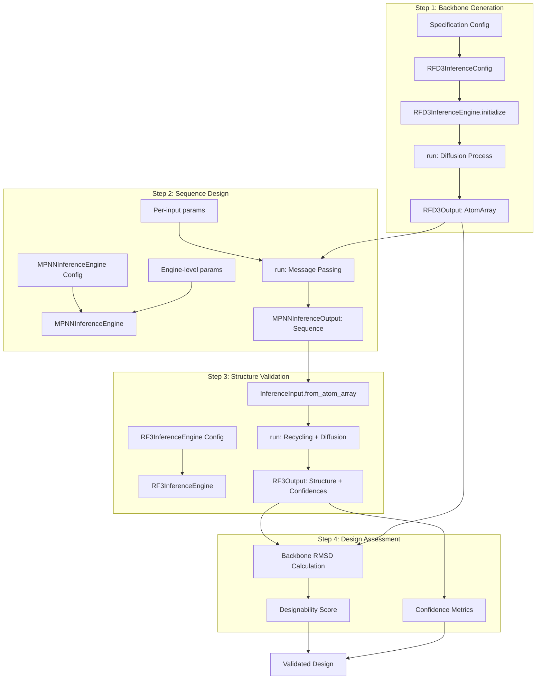

---
slug:3-end-to-end-design-pipeline-tutorial
blog_type:normal
---


本教程将指导你完成使用 Foundry 三个核心深度学习模型的完整 *从头* 蛋白质设计工作流程：用于骨架生成的 RFdiffusion3 (RFD3)、用于序列设计的 ProteinMPNN 以及用于结构验证的 RosettaFold3 (RF3)。该流程演示了如何集成这些模型以生成具有高可设计性的新型蛋白质。


来源：[README.md](/README.md#L1-L30)

## 流程概述

端到端的设计流程遵循三阶段工作流程，将结构概念转化为已验证的蛋白质设计。每个模型都有特定用途：RFD3 生成新型骨架构象，MPNN 设计针对这些骨架优化的氨基酸序列，RF3 重新折叠所设计的序列，并通过结构预测验证可设计性。

| 阶段 | 模型 | 用途 | 输入 | 输出 |
|-------|-------|---------|-------|--------|
| 1. **骨架生成** | RFD3 | 生成新型蛋白质结构 | 条件规范 | AtomArray 结构 |
| 2. **序列设计** | MPNN | 为骨架设计序列 | 骨架 AtomArrays | 带有结构的已设计序列 |
| 3. **结构验证** | RF3 | 从序列预测结构 | 已设计序列 | 预测结构 + 置信度指标 |

来源：[all.ipynb](/examples/all.ipynb#L9-L23), [ipd_design_pipeline_collab.ipynb](/examples/ipd_design_pipeline_collab.ipynb#L21-L35)

```mermaid
flowchart LR
    A[Input Specifications] --> B[RFD3 Backbone Generation]
    B --> C[Generated Backbones<br/>AtomArray]
    C --> D[MPNN Sequence Design]
    D --> E[Designed Sequences<br/>with structures]
    E --> F[RF3 Structure Validation]
    F --> G[Refolded Structures<br/>+ Confidence Metrics]
    G --> H[RMSD Comparison]
    H --> I[Validated Design]
    
    style B fill:#e1f5fe
    style D fill:#fff3e0
    style F fill:#f3e5f5
```



来源：[all.ipynb](/examples/all.ipynb#L17-L18), [base.py](/src/foundry/inference_engines/base.py#L32-L36)

## 先决条件和设置

在运行流程之前，你必须安装 Foundry 及其所有模型依赖项，并下载所需的 checkpoint 文件。安装过程大约需要 6GB 的存储空间用于存放模型权重（RFD3 需 3GB，RF3 需 3GB，MPNN 需 <100MB）。

```bash
# 安装包含所有模型的 Foundry
pip install 'rc-foundry[all]'

# 下载模型 checkpoint
foundry install rfd3 ligandmpnn rf3
```

对于 Jupyter notebook 用户，请注册你的 foundry 环境以启用模型导入：
```bash
python -m ipykernel install --user --name=foundry --display-name "foundry"
```

<CgxTip>
在导入之前，为可选的镜像路径设置环境变量：用于化学组分定义的 `CCD_MIRROR_PATH` 和用于结构模板的 `PDB_MIRROR_PATH`。这可以实现离线操作和更快的数据访问。</CgxTip>

来源：[all.ipynb](/examples/all.ipynb#L40-L44), [ipd_design_pipeline_collab.ipynb](/examples/ipd_design_pipeline_collab.ipynb#L14-L30)

## 步骤 1：使用 RFD3 生成骨架

RFdiffusion3 (RFD3) 是一个全原子生成模型，通过扩散过程生成新型蛋白质结构。该模型接受定义设计约束的条件规范，例如目标长度、固定区域、对称性要求或结合配体。

### 配置和参数

`RFD3InferenceConfig` 类通过几个关键参数提供对生成过程的全面控制：

| 参数 | 类型 | 默认值 | 描述 |
|-----------|------|---------|-------------|
| `specification` | dict | `{}` | 条件规范（长度、contigs、对称性） |
| `diffusion_batch_size` | int | 16 | 每批生成的结构数量 |
| `ckpt_path` | str/Path | `"rfd3"` | Checkpoint 路径或注册的模型名称 |
| `inference_sampler` | dict | `{}` | 扩散采样配置 |
| `cleanup_virtual_atoms` | bool | `True` | 从输出中移除虚拟路标原子 |
| `dump_trajectories` | bool | `False` | 保存中间扩散步骤 |

来源：[engine.py](/models/rfd3/src/rfd3/engine.py#L38-L77)

### 运行骨架生成

使用你的规范初始化 RFD3 推理引擎并运行生成。模型输出一个字典，将示例 ID 映射到 `RFD3Output` 对象列表，每个对象包含一个 `AtomArray` 结构和相关元数据。

```python
from lightning.fabric import seed_everything
from rfd3.engine import RFD3InferenceConfig, RFD3InferenceEngine

# 设置种子以保证可重复性
seed_everything(0)

# 配置 RFD3 推理
config = RFD3InferenceConfig(
    specification={
        'length': 80,  # 生成 80 个残基的蛋白质
    },
    diffusion_batch_size=2,  # 每批生成 2 个结构
)

# 初始化引擎并运行生成
model = RFD3InferenceEngine(**config)
outputs = model.run(
    inputs=None,      # None 表示无条件生成
    out_dir=None,     # None 表示在内存中返回（无文件输出）
    n_batches=1,      # 生成 1 批
)
```

提取并可视化生成的骨架以供后续使用：
```python
# 提取第一个生成的骨架
first_key = next(iter(outputs.keys()))
atom_array = outputs[first_key][0].atom_array

# 可视化生成的骨架
view(atom_array)
```

来源：[all.ipynb](/examples/all.ipynb#L68-L107), [engine.py](/models/rfd3/src/rfd3/engine.py#L200-L264)

### 输出结构

每个 `RFD3Output` 包含以下组件：
- **atom_array**：作为 Biotite `AtomArray` 的完整原子结构
- **metadata**：生成元数据和条件信息的字典
- **example_id**：生成结构的唯一标识符
- **denoised_trajectory_stack**：中间结构堆栈（如果 `dump_trajectories=True`）

`RFD3Output` 类提供了一个 `dump()` 方法，可将结构保存为 CIF 格式，并附带可选的 JSON 元数据文件，从而方便在 PyMOL 或 ChimeraX 等工具中进行外部分析和可视化。

来源：[engine.py](/models/rfd3/src/rfd3/engine.py#L86-L130)

## 步骤 2：使用 MPNN 进行序列设计

ProteinMPNN 和 LigandMPNN 是逆折叠模型，设计能够折叠成目标骨架结构的优化氨基酸序列。MPNN 使用消息传递神经网络基于结构上下文预测残基身份，支持仅蛋白质设计和配体感知设计场景。

### 模型选择和配置

MPNN 提供了两种具有不同功能的模型类型：

| 模型类型 | 描述 | 用例 |
|------------|-------------|----------|
| `protein_mpnn` | 原始 ProteinMPNN | 标准仅蛋白质设计 |
| `ligand_mpnn` | 支持配体的扩展模型 | 蛋白质-配体复合物设计 |

`MPNNInferenceEngine` 接受引擎级配置（在所有输入之间共享）和每输入配置（针对每个结构自定义）：

```python
from mpnn.inference_engines.mpnn import MPNNInferenceEngine

# 配置 MPNN 推理引擎
engine_config = {
    "model_type": "ligand_mpnn",  # 或 "protein_mpnn"
    "is_legacy_weights": True,    # 当前权重所必需
    "out_directory": None,        # 在内存中返回结果
    "write_structures": False,
    "write_fasta": False,
}

# 配置每输入推理选项
input_configs = [
    {
        "batch_size": 10,         # 每个结构生成 10 个序列
        "remove_waters": True,    # 排除水分子
        "temperature": 0.1,       # 采样温度
    }
]

# 运行序列设计
model = MPNNInferenceEngine(**engine_config)
mpnn_outputs = model.run(input_dicts=input_configs, atom_arrays=[atom_array])
```

来源：[all.ipynb](/examples/all.ipynb#L112-L145), [mpnn.py](/models/mpnn/src/mpnn/inference_engines/mpnn.py#L40-L49)

### 关键推理参数

MPNN 推理流程通过每输入参数支持广泛的自定义：

| 参数 | 类型 | 默认值 | 描述 |
|-----------|------|---------|-------------|
| `batch_size` | int | 1 | 要生成的序列数量 |
| `temperature` | float | 0.1 | 采样温度（越低 = 越有信心） |
| `remove_waters` | bool | `None` | 从上下文中排除水分子 |
| `fixed_residues` | list | `None` | 保持固定的残基索引 |
| `designed_residues` | list | `None` | 要设计的残基索引（如果为 `None` 则为全部） |
| `decode_type` | str | `"auto_regressive"` | 解码策略 |
| `structure_noise` | float | 0.0 | 向骨架坐标添加噪声 |

来源：[inference.py](/models/mpnn/src/mpnn/utils/inference.py#L36-L73)

### 提取已设计序列

MPNN 返回一个 `MPNNInferenceOutput` 对象列表，每个对象包含已设计的序列和相应的结构。将残基名称转换为单字母代码进行分析：

```python
from biotite.structure import get_residue_starts
from biotite.sequence import ProteinSequence

# 提取并显示已设计的序列
for i, item in enumerate(mpnn_outputs):
    res_starts = get_residue_starts(item.atom_array)
    # 将 3 字母代码转换为 1 字母
    seq_1letter = ''.join(
        ProteinSequence.convert_letter_3to1(res_name)
        for res_name in item.atom_array.res_name[res_starts]
    )
    print(f"Sequence {i+1}: {seq_1letter}")
```

来源：[all.ipynb](/examples/all.ipynb#L147-L159)

<CgxTip>
对于需要特定氨基酸偏好的设计任务，请使用 `bias` 和 `omit` 参数。`bias` 分配每个残基的偏好（将位置映射到氨基酸概率的字典），而 `omit` 在全局范围内排除特定残基。</CgxTip>

来源：[inference.py](/models/mpnn/src/mpnn/utils/inference.py#L63-L68)

## 步骤 3：使用 RF3 进行结构验证

RosettaFold3 (RF3) 根据氨基酸序列预测蛋白质结构，验证 MPNN 设计的序列是否将采用预期的骨架构象。通过将 RF3 预测的结构与原始 RFD3 骨架进行比较，你可以通过 RMSD 和置信度指标评估可设计性。

### RF3 推理配置

`RF3InferenceEngine` 通过采样和回收参数控制预测质量：

| 参数 | 类型 | 默认值 | 描述 |
|-----------|------|---------|-------------|
| `n_recycles` | int | 10 | 回收迭代次数 |
| `diffusion_batch_size` | int | 5 | 每批处理的序列数 |
| `num_steps` | int | 50 | 结构预测的扩散步数 |
| `template_noise_scale` | float | 1e-5 | 添加到模板结构的噪声 |
| `early_stopping_plddt_threshold` | float | `None` | 如果 pLDDT 降至阈值以下则停止回收 |

```python
from rf3.inference_engines.rf3 import RF3InferenceEngine
from rf3.utils.inference import InferenceInput

# 初始化 RF3 推理引擎
inference_engine = RF3InferenceEngine(ckpt_path='rf3', verbose=False)

# 根据 MPNN 设计的结构创建输入
input_structure = InferenceInput.from_atom_array(atom_array, example_id="example_protein")
rf3_outputs = inference_engine.run(inputs=input_structure)
```

来源：[all.ipynb](/examples/all.ipynb#L177-L195), [rf3.py](/models/rf3/src/rf3/inference_engines/rf3.py#L241-L256)

### 置信度指标

RF3 提供用于评估预测质量的全面置信度指标：

| 指标 | 描述 | 范围 |
|--------|-------------|-------|
| `overall_plddt` | 每残基置信度（平均值） | 0-1（越高越好） |
| `overall_pae` | 预测对齐误差（平均值） | Å（越低越好） |
| `ptm` | 预测 TM-score | 0-1（越高越好） |
| `iptm` | 接口 pTM（多链） | 0-1（越高越好） |
| `ranking_score` | 组合质量指标 | 越高越好 |
| `has_clash` | 检测到空间碰撞 | 布尔值 |

排名分数结合了多个指标：`0.8 * ipTM + 0.2 * pTM - 100 * has_clash`，为模型选择提供单一质量分数。

```python
# 提取排名最高的预测
rf3_output = rf3_outputs["example_protein"][0]

# 访问摘要置信度
summary = rf3_output.summary_confidences
print(f"Overall pLDDT: {summary['overall_plddt']:.3f}")
print(f"pTM: {summary['ptm']:.3f}")
print(f"Ranking score: {summary['ranking_score']:.3f}")
```

来源：[all.ipynb](/examples/all.ipynb#L165-L182, #L197-L216), [rf3.py](/models/rf3/src/rf3/inference_engines/rf3.py#L79-L90, #L98-L146)

### 每原子置信度详细信息

RF3 输出详细的置信度指标用于详细分析：

```python
conf = rf3_output.confidences

# 访问每原子/残基置信度
print(f"atom_plddts: {len(conf['atom_plddts'])} 个值")
print(f"PAE 矩阵: {len(conf['pae'])}x{len(conf['pae'][0])}")

# 预览前 10 个原子 pLDDT
import numpy as np
print(f"前 10 个原子 pLDDT: {np.round(conf['atom_plddts'][:10], 2).tolist()}")
```

`atom_plddts` 数组提供每原子置信度分数，可以映射到 B-factor 列，以便在结构分析工具中进行可视化。

来源：[all.ipynb](/examples/all.ipynb#L218-L230)

## 验证和设计评估

最终的验证步骤使用骨架 RMSD 将 RF3 预测的结构与原始 RFD3 生成的骨架进行比较。低 RMSD (< 2.0 Å) 表明所设计的序列可能折叠成预期的构象（高可设计性）。

```python
from biotite.structure import rmsd, superimpose
from atomworks.constants import PROTEIN_BACKBONE_ATOM_NAMES
import numpy as np

# 获取用于比较的结构
aa_generated = atom_array              # 原始 RFD3 骨架
aa_refolded = rf3_output.atom_array    # RF3 预测结构

# 筛选骨架原子 (N, CA, C, O)
bb_generated = aa_generated[np.isin(aa_generated.atom_name, PROTEIN_BACKBONE_ATOM_NAMES)]
bb_refolded = aa_refolded[np.isin(aa_refolded.atom_name, PROTEIN_BACKBONE_ATOM_NAMES)]

# 叠加结构并计算 RMSD
bb_refolded_fitted, _ = superimpose(bb_generated, bb_refolded)
rmsd_value = rmsd(bb_generated, bb_refolded_fitted)

print(f"Backbone RMSD: {rmsd_value:.2f} Å")
print(f"Designability: {'Excellent' if rmsd_value < 1.0 else 'Good' if rmsd_value < 2.0 else 'Moderate'}")
```

### RMSD 解释指南

| RMSD 范围 | 解释 | 可设计性 |
|------------|----------------|---------------|
| < 1.0 Å | 高度一致 | 高信心 |
| 1.0 - 2.0 Å | 良好一致 | 中等到高信心 |
| 2.0 - 3.0 Å | 中等一致 | 考虑重新设计 |
| > 3.0 Å | 一致性差 | 低信心，需要重新设计 |

来源：[all.ipynb](/examples/all.ipynb#L232-L260)

### 导出结果

将结构导出为 CIF 格式，以便进行外部可视化和分析：

```python
from atomworks.io.utils.io_utils import to_cif_file

# 导出结构
to_cif_file(aa_generated, "generated.cif")
to_cif_file(aa_refolded, "refolded.cif")
```


来源：[all.ipynb](/examples/all.ipynb#L262-L273)

## 高级流程配置

### 批处理

通过调整所有模型的批处理大小并行处理多个结构：

```python
# RFD3: 生成多个骨架
rfd3_config = RFD3InferenceConfig(
    specification={'length': 80},
    diffusion_batch_size=4,  # 每批 4 个骨架
)

# MPNN: 为每个骨架设计多个序列
mpnn_input_configs = [
    {"batch_size": 20} for _ in range(4)  # 每个骨架 20 个序列
]

# RF3: 为每个序列预测多个模型
rf3_engine = RF3InferenceEngine(ckpt_path='rf3', diffusion_batch_size=5)
```

### 条件设计

RFD3 通过规范字典支持复杂的条件设置：

```python
# 基于片段的设计和固定区域
specification = {
    'contigmap': 'A20-30,B1-10,A31-40',  # 固定区域
    'length': 80,
}

# 对称性约束
specification = {
    'symmetry': 'C3',  # 三重对称
    'length': 120,
}

# 配体结合设计
specification = {
    'ligand': 'path/to/ligand.cif',
    'hotspot_res': ['A10', 'A15', 'A20'],  # 接口残基
}
```

来源：[engine.py](/models/rfd3/src/rfd3/engine.py#L425-L525)

## 故障排除指南

| 问题 | 症状 | 解决方案 |
|-------|----------|-----------|
| **内存不足** | 生成期间出现 CUDA OOM 错误 | 减少所有模型的 `diffusion_batch_size`；在 RFD3 中启用 `low_memory_mode=True` |
| **置信度低** | pLDDT < 0.7，高 PAE 值 | 增加 RFD3 长度规范；添加更多固定区域；以更高的 MPNN `temperature` 重新设计 |
| **RMSD 高** | 重新折叠后 RMSD > 3.0 Å | 生成更多 RFD3 骨架；使用更高的 MPNN `batch_size`；检查设计约束冲突 |
| **找不到 Checkpoint** | `Invalid checkpoint` 错误 | 运行 `foundry install <model>` 或提供 checkpoint 的绝对路径 |
| **推理缓慢** | 生成时间长 | 增加批处理大小以提高 GPU 利用率；减少 RF3 中的 `n_recycles`；禁用 `dump_trajectories` |

<CgxTip>
对于内存受限的环境，请使用 RFD3 的 `low_memory_mode=True` 启用高效分词。这会减少峰值内存使用量，代价是初始化时间稍长。</CgxTip>

来源：[engine.py](/models/rfd3/src/rfd3/engine.py#L68-L70), [rf3.py](/models/rf3/src/rf3/inference_engines/rf3.py#L244-L246)

## 流程流程图

完整的端到端工作流程集成了所有三个模型以及数据流转换：



来源：[base.py](/src/foundry/inference_engines/base.py#L125-L151), [all.ipynb](/examples/all.ipynb#L9-L23)

## 后续步骤

完成本教程后，请探索这些高级主题：

- **架构深入探究**：在 [推理引擎架构](6-inference-engine-architecture) 中了解推理引擎架构
- **自定义模型集成**：使用 [向 Foundry 添加新模型](21-adding-new-models-to-foundry) 扩展 Foundry
- **高级 RFD3 功能**：在 [RFdiffusion3：全原子生成模型](9-rfdiffusion3-all-atom-generative-model) 中掌握基于片段的设计和对称性
- **训练你自己的模型**：使用 [使用 DDP 进行分布式训练](15-distributed-training-with-ddp) 设置分布式训练
- **组件系统**：通过 [组件解析和验证](18-component-parsing-and-validation) 了解设计约束

对于动手实验，请尝试 [enzymes.ipynb](/examples/enzymes.ipynb) notebook，它演示了活性位点设计场景。