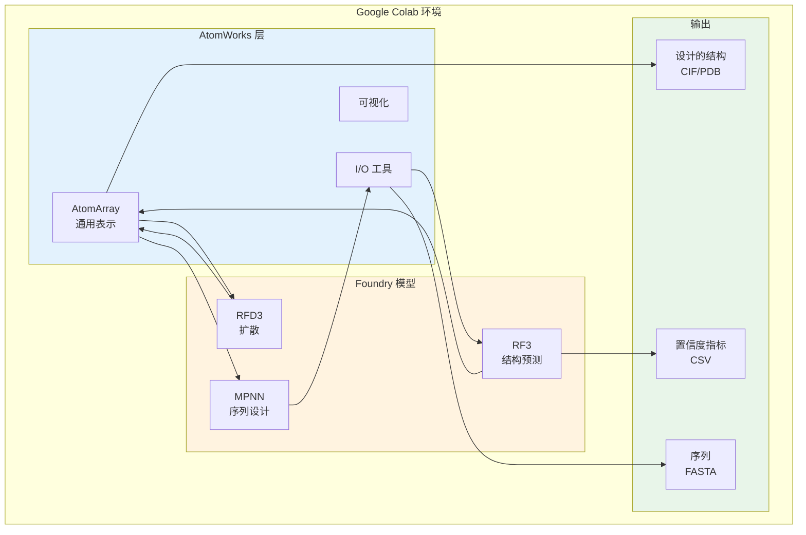

---
slug:4-google-colab-quick-start
blog_type:normal
---


通过 Google Colab 立即开始使用 Foundry 的蛋白质设计流程——无需本地安装。本交互式教程将带你了解结合了三种最先进的蛋白质设计深度学习模型的端到端工作流，所有操作均在浏览器中运行，并提供免费的 GPU 访问权限。


本指南非常适合想要在不配置本地环境的情况下探索 Foundry 功能的开发者，或者那些在进行完整安装前需要快速进行概念验证的用户。

## 为什么选择 Google Colab？

Google Colab 为蛋白质设计实验提供了理想的平台：

| 优势 | 描述 |
|-----------|-------------|
| **免费 GPU 访问** | 免费提供 T4 GPU——深度学习模型的必备条件 |
| **零配置** | 预配置环境，包含 Python 3.12+ |
| **即时设置** | 5 分钟内完成安装和运行 |
| **交互式探索** | 修改参数并立即查看结果 |
| **无资源占用** | 无需占用本地磁盘空间（所有模型约 6GB） |

来源：[README.md](README.md#L15-L25)

## 端到端流程

Colab 教程展示了一个完整的蛋白质设计工作流，该流程映射了蛋白质设计研究所使用的专业工作流：

```mermaid
flowchart LR
    A[GPU 运行时设置] --> B[安装<br/>rc-foundry[all]]
    B --> C[下载权重<br/>总计~6GB]
    C --> D[RFD3<br/>全原子生成]
    D --> E[MPNN<br/>序列设计]
    E --> F[RF3<br/>结构验证]
    F --> G[RMSD 分析]
    G --> H[导出结构<br/>CIF 格式]
    
    style D fill:#e1f5ff
    style E fill:#fff4e1
    style F fill:#e8f5e9
```

**核心模型：**

| 模型 | 角色 | 关键参数 | 输出 |
|-------|------|----------------|--------|
| **RFD3** (RFdiffusion3) | 骨架生成 | `length`, `diffusion_batch_size`, `n_batches` | 以 AtomArray 表示的新颖蛋白质结构 |
| **MPNN** (ProteinMPNN/LigandMPNN) | 序列设计 | `batch_size`, `remove_waters`, `model_type` | 设计的氨基酸序列 |
| **RF3** (RosettaFold3) | 结构验证 | 置信度指标 (pLDDT, PAE, pTM) | 预测结构 + 置信度分数 |

来源：[ipd_design_pipeline_collab.ipynb](examples/ipd_design_pipeline_collab.ipynb#L47-L60), [all.apynb](examples/all.ipynb#L11-L20)

## 先决条件和设置

### 1. 启用 GPU 运行时

运行 notebook 之前，请确保已启用 GPU 加速：

1. 前往 **Runtime（运行时） → Change runtime type（更改运行时类型）**
2. 选择 **T4 GPU**（或更好的配置——A100/V100 以获得更快的运行速度）
3. 点击 **Save（保存）**

<CgxTip>GPU 是强制要求的。在 CPU 上运行这些模型将会极其缓慢，并且对于较大的结构可能会超时。</CgxTip>

来源：[ipd_design_pipeline_collab.ipynb](examples/ipd_design_pipeline_collab.ipynb#L5-L10)

### 2. 安装过程

Colab notebook 会自动处理安装：

```python
import os

# 为 AtomWorks 镜像设置环境变量
os.environ['CCD_MIRROR_PATH'] = ''
os.environ['PDB_MIRROR_PATH'] = ''

if not os.path.isfile("FOUNDRY_READY"):
    print("正在安装 rc-foundry...")
    
    # 首先卸载 torchvision 以避免算子冲突
    os.system("pip uninstall -y torchvision")
    
    # 安装 rc-foundry 及所有模型依赖项
    os.system("pip install -q 'rc-foundry[all]'")
    
    # 标记为已就绪，以跳过重新安装
    os.system("touch FOUNDRY_READY")
    
    print("完成!")
else:
    print("rc-foundry 已安装。")
```

**关键点：**
- 安装在每个会话中仅发生一次（由 `FOUNDRY_READY` 文件标记）
- `rc-foundry[all]` 包含 RFD3、MPNN 和 RF3 包
- 卸载 Torchvision 以防止版本冲突
- 在 Colab 上安装通常需要 2-3 分钟

来源：[ipd_design_pipeline_collab.ipynb](examples/ipd_design_pipeline_collab.ipynb#L13-L31)

### 3. 下载模型权重

```python
# 下载模型权重（总计约 6GB，跳过已下载的模型）
os.system("foundry install rfd3 ligandmpnn rf3")
```

**下载详情：**

| 模型 | 大小 | 时间（典型连接） |
|-------|------|---------------------------|
| RFD3 | ~3GB | 2-3 分钟 |
| RF3 | ~3GB | 2-3 分钟 |
| MPNN | <100MB | <30 秒 |
| **总计** | **~6GB** | **~5-7 分钟** |

<CgxTip>权重下载到 Colab 的临时存储中。当运行时断开连接时，它们会被清除，因此每次新会话都需要重新下载。</CgxTip>

来源：[ipd_design_pipeline_collab.ipynb](examples/ipd_design_pipeline_collab.ipynb#L33-L36), [README.md](README.md#L16-L22)

## 分步流程详解

### 步骤 1：使用 RFD3 进行全原子生成

RFD3 通过扩散生成新颖的蛋白质结构，能够在复杂的约束条件下进行设计：

```python
from lightning.fabric import seed_everything
from rfd3.engine import RFD3InferenceConfig, RFD3InferenceEngine

# 设置种子以确保可重复性
seed_everything(0)

# 配置 RFD3 推理
config = RFD3InferenceConfig(
    specification={
        'length': 80,  # 生成 80 个残基的蛋白质
    },
    diffusion_batch_size=2,  # 每批生成 2 个结构
)

# 初始化引擎并运行生成
model = RFD3InferenceEngine(**config)
outputs = model.run(
    inputs=None,      # None 表示无条件生成
    out_dir=None,     # None 表示在内存中返回（无文件输出）
    n_batches=1,      # 生成 1 批
)
```

**理解输出：**

```python
# 提取第一个生成的结构以供下游使用
first_key = next(iter(outputs.keys()))
atom_array = outputs[first_key][0].atom_array

# 可视化生成的结构
view(atom_array)
```

`atom_array` 是一个 Biotite `AtomArray` 对象——这是 Foundry 的通用结构表示形式，可以在流程的所有模型之间无缝流动。

来源：[ipd_design_pipeline_collab.ipynb](examples/ipd_design_pipeline_collab.ipynb#L61-L91), [rfd3/README.md](models/rfd3/README.md#L1-L10)

### 步骤 2：使用 MPNN 进行序列设计

MPNN 设计能够折叠成目标骨架的氨基酸序列：

```python
from mpnn.inference_engines.mpnn import MPNNInferenceEngine

# 配置 MPNN 推理引擎
engine_config = {
    "model_type": "ligand_mpnn",  # 或 "protein_mpnn"
    "is_legacy_weights": True,    # 当前权重所必需
    "out_directory": None,        # 在内存中返回结果
    "write_structures": False,
    "write_fasta": False,
}

# 配置每个输入的推理选项
input_configs = [
    {
        "batch_size": 10,         # 每个结构生成 10 个序列
        "remove_waters": True,
    }
]

# 在 RFD3 生成的骨架上运行序列设计
model = MPNNInferenceEngine(**engine_config)
mpnn_outputs = model.run(input_dicts=input_configs, atom_arrays=[atom_array])
```

**提取设计的序列：**

```python
from biotite.structure import get_residue_starts
from biotite.sequence import ProteinSequence

# 提取并显示设计的序列
print(f"已生成 {len(mpnn_outputs)} 个设计序列:\n")

for i, item in enumerate(mpnn_outputs):
    res_starts = get_residue_starts(item.atom_array)
    # 使用 Biotite 将 3 字母代码转换为 1 字母代码
    seq_1letter = ''.join(
        ProteinSequence.convert_letter_3to1(res_name)
        for res_name in item.atom_array.res_name[res_starts]
    )
    print(f"序列 {i+1}: {seq_1letter}")
```

**MPNN 变体：**

| 模型 | 用例 | 主要特性 |
|-------|----------|--------------|
| `protein_mpnn` | 仅蛋白质设计 | 原始 ProteinMPNN |
| `ligand_mpnn` | 配体感知设计 | 处理小分子、离子、DNA/RNA |
| `soluble_mpnn` | 可溶性蛋白质设计 | 针对可溶性进行了优化 |

来源：[ipd_design_pipeline_collab.ipynb](examples/ipd_design_pipeline_collab.ipynb#L119-L159), [mpnn/README.md](models/mpnn/README.md#L1-L30)

### 步骤 3：使用 RF3 进行结构预测

RF3 通过从设计的序列预测结构来验证你的设计：

```python
from rf3.inference_engines.rf3 import RF3InferenceEngine
from rf3.utils.inference import InferenceInput

# 初始化 RF3 推理引擎
inference_engine = RF3InferenceEngine(ckpt_path='rf3', verbose=False)

# 从 MPNN 设计的结构创建输入
input_structure = InferenceInput.from_atom_array(atom_array, example_id="example_protein")
rf3_outputs = inference_engine.run(inputs=input_structure)

# 提取排名最高的预测
rf3_output = rf3_outputs["example_protein"][0]
```

**置信度指标：**

```python
summary = rf3_output.summary_confidences

print("=== 置信度摘要 ===")
print(f"  整体 pLDDT:    {summary['overall_plddt']:.3f}")
print(f"  整体 PAE:      {summary['overall_pae']:.2f} A")
print(f"  pTM:              {summary['ptm']:.3f}")
print(f"  排名分数:    {summary['ranking_score']:.3f}")
```

| 指标 | 范围 | 解释 |
|--------|-------|----------------|
| **pLDDT** | 0-1 | 每残基置信度 (>0.9 = 高) |
| **PAE** | 0-∞ Å | 预测对齐误差 (<2Å = 良好) |
| **pTM** | 0-1 | 预测 TM-score (>0.8 = 高置信度) |

来源：[ipd_design_pipeline_collab.ipynb](examples/ipd_design_pipeline_collab.ipynb#L193-L236), [rf3/README.md](models/rf3/README.md#L1-L20)

### 步骤 4：验证和导出

最后的验证步骤将 RF3 的预测与原始 RFD3 骨架进行比较：

```python
from biotite.structure import rmsd, superimpose
from atomworks.constants import PROTEIN_BACKBONE_ATOM_NAMES

# 获取用于比较的结构
aa_generated = atom_array              # 原始 RFD3 骨架
aa_refolded = rf3_output.atom_array    # RF3 预测的结构

# 筛选出骨架原子 (N, CA, C, O)
bb_generated = aa_generated[np.isin(aa_generated.atom_name, PROTEIN_BACKBONE_ATOM_NAMES)]
bb_refolded = aa_refolded[np.isin(aa_refolded.atom_name, PROTEIN_BACKBONE_ATOM_NAMES)]

# 叠加结构并计算 RMSD
bb_refolded_fitted, _ = superimpose(bb_generated, bb_refolded)
rmsd_value = rmsd(bb_generated, bb_refolded_fitted)

print(f"骨架 RMSD: {rmsd_value:.2f} A")
```

**RMSD 解读：**

| RMSD (Å) | 可设计性 | 操作 |
|----------|---------------|--------|
| <1.0 | 优秀 | 放心继续 |
| 1.0-2.0 | 良好 | 对许多应用来说可接受 |
| 2.0-3.0 | 中等 | 考虑优化或重新设计 |
| >3.0 | 差 | 重新设计或调整参数 |

**导出以供下游分析：**

```python
from atomworks.io.utils.io_utils import to_cif_file

# 将结构导出为 CIF 格式，以便在 PyMOL/ChimeraX 中可视化
to_cif_file(aa_generated, "generated.cif")
to_cif_file(aa_refolded, "refolded.cif")
```

来源：[ipd_design_pipeline_collab.ipynb](examples/ipd_design_pipeline_collab.ipynb#L254-L290)

## 架构概览



所有这三个模型通过 [AtomWorks](https://github.com/RosettaCommons/atomworks) 共享一个通用架构，提供：
- 通过 `AtomArray` 实现统一的结构表示
- 所有模型一致的 I/O
- 共享的可视化工具
- 流程阶段之间无缝的数据流

来源：[README.md](README.md#L8-L11)

## 常见问题和故障排除

| 问题 | 原因 | 解决方案 |
|-------|-------|----------|
| **内存不足** | GPU 无法满足批次大小要求 | 将 `diffusion_batch_size` 减少到 1 |
| **下载缓慢** | 网络连接不佳 | 单独下载模型，而不是一次性下载 `all` |
| **Torchvision 冲突** | 版本不兼容 | 确保在安装之前运行 torchvision 卸载程序 |
| **运行时断开连接** | 会话超时 | 频繁保存检查点；降低模型复杂度 |

## 访问 Colab Notebook

交互式 Google Colab notebook 可在此处获取：

**🔗 [IPD 设计流程教程](https://colab.research.google.com/drive/1ZwIMV3n9h0ZOnIXX0GyKUuoiahgifBxh?usp=sharing)**

这个实时的 notebook 包含上述描述的所有代码，并提供：
- 预配置的 GPU 设置
- 自动安装脚本
- 交互式 3D 可视化
- 用于比较的预计算示例

来源：[README.md](README.md#L26-L28)

## 后续步骤

完成 Colab 教程后，探索这些资源以加深你的理解：

### 紧接着的后续步骤
- **[快速入门](2-quick-start)**：用于持久化开发的本地安装指南
- **[端到端设计流程教程](3-end-to-end-design-pipeline-tutorial)**：包含高级功能的扩展教程

### 深入研究模型
- **[RFdiffusion3：全原子生成模型](9-rfdiffusion3-all-atom-generative-model)**：全面的 RFD3 文档和高级条件设置
- **[RosettaFold3：结构预测网络](10-rosettafold3-structure-prediction-network)**：RF3 架构和 API 参考
- **[ProteinMPNN 和 LigandMPNN：逆向折叠](11-proteinmpnn-and-ligandmpnn-inverse-folding)**：MPNN 变体和参数调整

### 基础设施
- **[推理引擎架构](6-inference-engine-architecture)**：了解引擎如何编排模型
- **[Hydra 配置系统](12-hydra-configuration-system)**：高级配置管理
- **[向 Foundry 添加新模型](21-adding-new-models-to-foundry)**：使用自定义模型扩展 Foundry

## 总结

本 Google Colab 快速入门指南让你无需本地安装即可立即使用 Foundry 完整的蛋白质设计流程。你已经学会了如何：

1. **在 5 分钟内设置 GPU 加速的 Colab 环境**
2. **使用 RFD3 的扩散模型生成新颖结构**
3. **使用 MPNN 的逆向折叠设计序列**
4. **使用 RF3 的结构预测验证设计**
5. **导出结果以供 PyMOL/ChimeraX 中的下游分析**

该流程展示了 Foundry 的核心理念：**通过 AtomWorks 实现统一架构，使多样化的蛋白质设计模型（从生成到验证）能够无缝集成**。

准备进行下一步了吗？在本地安装 Foundry 并探索 [快速入门](2-quick-start) 指南中描述的完整功能。