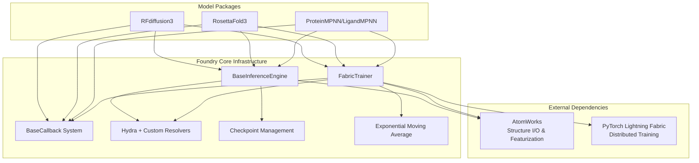

---
slug:5-architecture-and-design-philosophy
blog_type:normal
---

Foundry 体现了一种模块化、可扩展的架构，旨在支持多样化的生物分子建模任务，同时保持关注点的清晰分离。该框架为多个蛋白质设计模型提供了训练和推理的共享基础设施，使开发者能够以最少的代码重复添加新模型。

## 基础架构原则

该架构遵循严格的依赖层次结构：**foundry → atomworks**。这种清晰的分离定义了职责边界——atomworks 处理所有结构 I/O、预处理和特征化操作，而 foundry 提供模型架构、训练框架和推理端点。这种设计确保了结构操作逻辑与建模逻辑保持解耦，允许各层独立演进。

该框架采用 **“一模型一包”架构**，其中每个模型（RF3、RFD3、MPNN）都以独立包的形式存在于 `models/` 目录中。每个模型包包含其自己的 `pyproject.toml`、`src/` 中的源代码、配置文件和测试。这种结构支持选择性安装——用户可以仅安装他们需要的模型，开发者可以专注于特定模型而不会影响其他模型。

**通过抽象实现模块化** 体现在两个关键的基类中。`BaseInferenceEngine` 将昂贵的模型初始化与推理执行分离，允许以最小的开销进行多次推理运行。`FabricTrainer` 提供了一个基于 PyTorch Lightning Fabric 构建的可复用训练框架，实现了梯度累积、混合精度训练、分布式数据并行以及原生 EMA 支持。这两个类都采用模板方法模式，定义操作的骨架，同时允许子类自定义特定步骤。

来源：[pyproject.toml](/pyproject.toml#L1-L194), [README.md](/README.md#L58-L85), [base.py](/src/foundry/inference_engines/base.py#L32-L246), [fabric.py](/src/foundry/trainers/fabric.py#L52-L924)

## 核心基础设施组件

### 训练框架架构

`FabricTrainer` 类作为所有模型训练的基础，编排完整的训练生命周期，同时提供扩展点。训练框架遵循清晰的流程：初始化 → 模型/优化器/调度器构建 → Fabric 设置 → 训练循环 → 验证循环 → 检查点保存。这种线性流程确保了可预测的行为，同时允许通过抽象方法和回调在每个阶段进行自定义。

该框架透明地实现了 **梯度累积**，处理在优化器步骤前跨多个批次累积梯度的复杂逻辑。使用 bfloat16 或 float16 的混合精度训练在保持数值稳定性的同时减少了内存占用。通过 DDP 支持的分布式训练实现了多节点和多 GPU 扩展，并具有可配置的 NCCL 超时和参数发现设置，以适应生产环境。

**指数移动平均（EMA）** 集成提供了模型权重平滑功能，而无需用户实现复杂的跟踪逻辑。EMA 模块维护一个使用衰减因子更新的影子模型，在验证期间根据训练阶段自动在训练权重和 EMA 权重之间切换。

来源：[fabric.py](/src/foundry/trainers/fabric.py#L1-L8), [EMA.py](/src/foundry/training/EMA.py#L8-L68)

### 推理引擎架构

`BaseInferenceEngine` 建立了 **两阶段生命周期**：初始化和执行。在初始化阶段，引擎加载检查点，使用 Hydra 配置构建模型流水线，应用转换和采样器的配置覆盖，并在需要时设置分布式上下文。在执行阶段，引擎通过流水线处理输入，运行模型推理，并返回结构化输出。

这种分离优化了资源使用——模型加载等昂贵的操作仅发生一次，而推理可以重复运行而无需重新初始化。引擎支持灵活的输入格式，包括 `AtomArray` 对象、文件路径和字典，通过流水线系统自动处理转换。上下文管理器支持通过 `with BaseInferenceEngine(...) as engine:` 语法实现自动清理。

**配置覆盖机制** 提供了精细控制，而无需修改检查点配置。用户可以通过点分键路径覆盖转换参数、推理采样器设置和训练器选项，从而能够在保留原始检查点配置的同时试验不同的配置。

来源：[base.py](/src/foundry/inference_engines/base.py#L32-L246), [checkpoint_registry.py](/src/foundry/inference_engines/checkpoint_registry.py#L1-L71)

### 回调系统

回调架构在训练和推理中实现了 **可组合的生命周期钩子**。`BaseCallback` 类在拟合边界、周期边界、批次边界、优化器步骤和检查点操作处定义了全面的钩子点。这种设计将日志记录、指标计算和健康监控等横切关注点与核心训练逻辑分离开来。

回调在训练生命周期中的确定点执行，具有清晰的排序语义。训练器在每个定义点按顺序调用钩子，传递训练器上下文以使回调能够检查和修改训练状态。这使得无需修改训练器代码即可实现提前停止、学习率调整、指标日志记录和梯度监控等用例。

来源：[callback.py](/src/foundry/callbacks/callback.py#L9-L117)

## 配置管理理念

Foundry 通过深度集成 Hydra 拥抱 **配置驱动开发**。配置文件定义模型、转换、采样器、优化器和调度器，由 Hydra 处理组合、继承和覆盖。这种方法实现了无需代码更改的可重现实验——不同的配置可以代表完全不同的训练运行或推理场景。

**自定义 Hydra 解析器** 通过运行时动态解析扩展配置能力。`register_resolvers()` 函数注册了解析器，用于动态导入模块和将链类型信息转换为正则表达式模式。这使得配置文件可以通过字符串路径引用类和函数，消除了配置文件中的硬编码导入。

解析器系统体现了框架的设计理念：**通过组合实现灵活性**。Foundry 不是在核心框架中构建复杂的配置逻辑，而是通过有针对性的自定义解析器扩展 Hydra 的功能，以解决特定的领域问题，例如按链类型过滤数据集。

来源：[resolvers.py](/src/foundry/hydra/resolvers.py#L1-L78)

## 依赖和包组织

单体仓库结构遵循通过包布局强制执行的 **严格依赖边界**。`src/foundry/` 目录包含共享基础设施，没有特定于模型的代码。`models/<model>/src/` 中的每个模型从 foundry 导入，但保持与其他模型的隔离。这种循环依赖预防确保了干净的升级，并实现了模型包的独立版本控制。

**基于 Hatch 的构建系统** 从单个仓库打包多个 Python 分发包。`pyproject.toml` 中的 `packages` 列表定义了哪些子包成为可安装的分发包，而 `force-include` 指令确保配置文件与模型一起打包。这使得开发者可以使用 `uv pip install -e . -e ./models/rf3` 等工作流，而最终用户可以安装 `rc-foundry[all]` 或单个模型包。

构建系统通过 VCS 集成支持 **动态版本控制**，自动从 git 标签派生版本号。这消除了手动版本管理，同时确保了开发和生产环境之间的可重现构建。

来源：[pyproject.toml](/pyproject.toml#L78-L111), [README.md](/README.md#L66-L85)

## 扩展模式

Foundry 通过 **具有清晰扩展点的抽象基类** 实现可扩展性。新模型扩展 `BaseInferenceEngine` 和 `FabricTrainer`，实现 `training_step()` 和 `validation_step()` 等抽象方法，同时继承完整的训练基础设施。这消除了分布式训练、检查点保存和日志记录的样板代码。

用于数据转换的 **流水线架构** 提供了可组合的预处理方法。转换是模块化组件，可以链接在一起、有条件地应用，并独立配置。每个模型包在 `transforms/` 目录中定义自己的转换库，仅重用 foundry 中的模式，而不是实现。

<CgxTip>
在使用新模型扩展 Foundry 时，通过将转换定义为具有清晰输入/输出契约的独立模块来利用现有的流水线系统。这保持了可测试性，并使转换即使在底层架构差异显著时也能在不同模型间重用。
</CgxTip>

来源：[base.py](/src/foundry/inference_engines/base.py#L32-L246), [fabric.py](/src/foundry/trainers/fabric.py#L627-L654)

## 系统架构概述

该图展示了分层架构，其中模型包仅依赖于 foundry 的抽象接口，从不相互依赖。foundry 核心提供共享实现，而 AtomWorks 和 PyTorch Lightning 等外部依赖构成了基础。

## 关键设计权衡

**简单性与灵活性**：Foundry 优先考虑配置驱动的灵活性，而非代码简单性。分布式训练、混合精度和 EMA 等复杂行为由框架处理，而不需要用户实现它们。这降低了常见用例的学习曲线，同时允许高级用户通过配置覆盖默认值。

**性能与抽象**：回调系统在提供最大可扩展性的同时引入了最小的开销。钩子在定义明确的点执行，没有复杂的条件判断，在实现横切关注点的同时保持训练循环性能。两阶段推理引擎架构针对单次昂贵初始化后的多次推理运行进行了优化。

**模块化与集成**：每个模型包保持严格隔离，实现独立开发和测试。然而，共享的 foundry 基础设施确保了所有模型在训练行为、检查点格式和日志记录方面的一致性。这种平衡使新模型的快速原型设计成为可能，同时保留了生产级可靠性。

来源：[README.md](/README.md#L1-L50), [common.py](/src/foundry/common.py#L8-L109)

## 架构原则总结

| 原则 | 实现 | 好处 |
|-----------|---------------|---------|
| **关注点分离** | atomworks (structures) → foundry (models) | 结构处理和建模逻辑独立演进 |
| **一模型一包** | `models/` 中的隔离包 | 选择性安装、独立版本控制、减少耦合 |
| **抽象基类** | `BaseInferenceEngine`, `FabricTrainer` | 一致的接口、减少样板代码、强制模式 |
| **配置驱动** | Hydra 配置 + 自定义解析器 | 可重现的实验、不同运行无需代码更改 |
| **可组合回调** | `BaseCallback` 生命周期钩子 | 横切关注点而不修改核心逻辑 |
| **两阶段推理** | 初始化一次，运行多次 | 批量推理的最佳资源利用 |

来源：[README.md](/README.md#L58-L85), [pyproject.toml](/pyproject.toml#L1-L72)

## 下一步

此处描述的架构为理解 Foundry 的系统级设计提供了基础。要深入了解特定组件：

- 探索 [推理引擎架构](6-inference-engine-architecture) 以了解完整的推理流水线以及模型如何处理输入
- 检查 [使用 FabricTrainer 的训练框架](7-training-harness-with-fabrictrainer) 以了解分布式训练、梯度处理和检查点管理的详细信息
- 查看 [Hydra 配置系统](12-hydra-configuration-system) 以了解配置组合和覆盖如何在实践中工作
- 参阅 [向 Foundry 添加新模型](21-adding-new-models-to-foundry) 以获取使用自定义模型扩展架构的实用指南