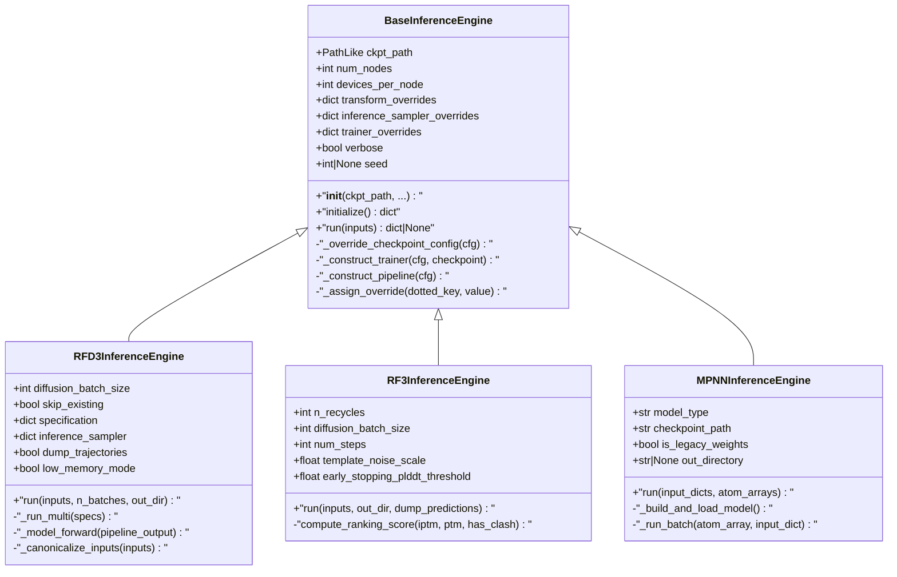
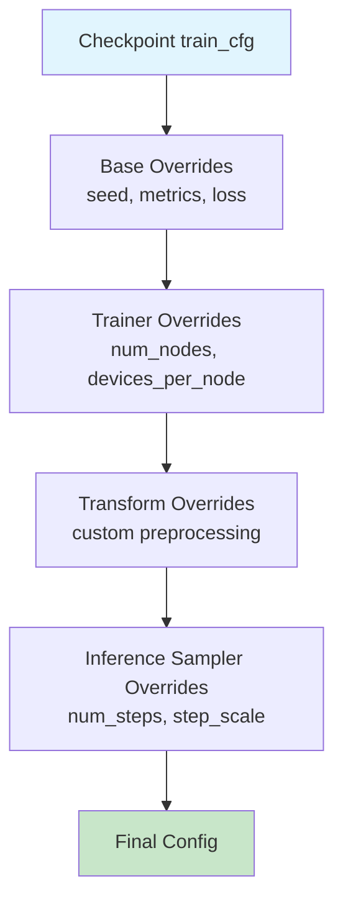

---
slug:6-inference-engine-architecture
blog_type:normal
---

推理引擎架构为在 Foundry 中运行深度学习模型提供了统一的抽象层，将昂贵的模型初始化与高效的多样本推理分离开来。这种设计实现了跨不同模型架构的一致接口，包括基于扩散的生成模型（RFdiffusion3、RosettaFold3）和逆向折叠网络（ProteinMPNN、LigandMPNN）。

## 核心抽象层

该架构以 `BaseInferenceEngine` 为中心，这是一个抽象基类，建立了对生产工作负载至关重要的初始化-推理分离模式。该类负责管理检查点加载、配置合并和分布式设置，同时将特定于模型的推理逻辑委托给子类。

来源：[base.py](src/foundry/inference_engines/base.py#L32-L50)

### 初始化阶段

基础引擎实现了两阶段生命周期，其中 `__init__` 接受配置覆盖而不加载模型权重，而 `initialize()` 执行昂贵的检查点加载和训练器构造。这种分离使得以下功能成为可能：

- 高效的检查点路径解析，支持显式路径和注册的模型名称
- 可重复性的随机种子配置
- 配置覆盖系统，将用户提供的设置与检查点默认值合并
- 加速器检测和分布式策略设置

`initialize()` 方法加载检查点配置，应用覆盖，构造数据处理管道，并在模型周围实例化 FabricTrainer 包装器。

来源：[base.py](src/foundry/inference_engines/base.py#L125-L143), [base.py](src/foundry/inference_engines/base.py#L165-L198)

### 推理阶段

子类实现 `run()` 方法，该方法接收灵活的输入类型（字典、AtomArrays 或文件路径）并返回模型预测。基类保证在推理执行前已完成初始化。

来源：[base.py](src/foundry/inference_engines/base.py#L144-L157)

<CgxTip>BaseInferenceEngine 将配置覆盖存储在嵌套的 `self.overrides` 字典中，使用点分键（例如 "trainer.seed", "model.net.inference_sampler.num_steps"），这些键随后通过 OmegaConf.merge 应用。这可以在不修改检查点文件的情况下进行细粒度的参数调整。</CgxTip>

## 检查点管理系统

检查点注册表提供了集中的模型检查点管理，具有 URL 解析和默认路径处理功能。每个注册的检查点包括：

- 用于下载的远程 URL
- 用于存储的本地文件名
- 人类可读的描述
- 用于验证的可选 SHA256 校验和

注册表支持通过名称查找检查点，使用户能够在不知道显式文件路径的情况下引用模型（如 "rfd3" 或 "rf3"）。默认存储优先考虑 `FOUNDRY_CHECKPOINTS_DIR` 环境变量，并回退到 `~/.foundry/checkpoints`。

来源：[checkpoint_registry.py](src/foundry/inference_engines/checkpoint_registry.py#L22-L71)

| 模型 | 检查点名称 | 用例 |
|-------|----------------|----------|
| RFdiffusion3 | `rfd3` | 全原子生成设计 |
| RosettaFold3 | `rf3` | 结构预测 |
| RosettaFold3 | `rf3_preprint_124` | 结构预测（预印本） |
| ProteinMPNN | `proteinmpnn` | 蛋白质逆向折叠 |
| LigandMPNN | `ligandmpnn` | 蛋白质-配体界面设计 |
| SolubleMPNN | `solublempnn` | 可溶性蛋白质设计 |

来源：[checkpoint_registry.py](src/foundry/inference_engines/checkpoint_registry.py#L33-L71)

## 特定模型的引擎实现

### RFD3InferenceEngine

扩展了 RFdiffusion3 的基类，增加了对扩散采样、轨迹跟踪和设计规范覆盖的支持。该引擎引入了：

- `RFD3InferenceConfig`：包含推理参数的数据类，包括扩散设置、输出控制标志和批次规范
- `RFD3Output`：输出容器，存储 AtomArray 结构、元数据和可选的轨迹堆栈（包括噪声和去噪）
- 输入归一化，支持 JSON 文件、PDB 文件或内存中的 AtomArray 对象
- 当目标目录中已存在输出时自动跳过检查点
- 用于内存受限环境的低内存模式

推理管道处理规范验证、管道构造、批处理和输出格式化，并支持路标清理、虚拟原子去除和轨迹对齐。

来源：[engine.py](models/rfd3/src/rfd3/engine.py#L135-L200), [engine.py](models/rfd3/src/rfd3/engine.py#L38-L93)

### RF3InferenceEngine

扩展了 RosettaFold3 结构预测的基类，增加了置信度度量计算和模型排名。主要功能：

- 排名分数计算：`0.8 * ipTM + 0.2 * pTM - 100 * has_clash`，用于单链和多链预测
- 当平均 pLDDT 低于可配置阈值时触发提前停止
- 模板噪声缩放和 MSA 处理配置
- 大型输出的压缩支持
- 兼容 AlphaFold3 的 JSON 输出格式，具有紧凑的数组序列化

该引擎生成 `RF3Output` 对象，包含预测结构、摘要置信度度量和可选的完整每原子置信度数据。

来源：[rf3.py](models/rf3/src/rf3/inference_engines/rf3.py#L222-L395), [rf3.py](models/rf3/src/rf3/inference_engines/rf3.py#L79-L90)

### MPNNInferenceEngine

为 ProteinMPNN 和 LigandMPNN 模型实现了独立的推理引擎，采用针对序列设计任务优化的更简单架构。与基于扩散的引擎不同，MPNN：

- 使用直接的 PyTorch 模型加载，无需 FabricTrainer 包装器
- 支持传统权重格式以实现向后兼容
- 输出 CIF 结构和 FASTA 序列文件
- 在推理期间计算序列恢复度量
- 处理聚合物-配体界面设计上下文

该引擎接受输入字典（解析的结构）或原始 AtomArrays，返回包含预测序列和结构的 `MPNNInferenceOutput` 对象。

来源：[mpnn.py](models/mpnn/src/mpnn/inference_engines/mpnn.py#L37-L210)

## 配置覆盖层次结构

推理引擎实现了分层配置系统，其中不同级别的设置按照定义的优先级进行组合：

1. **检查点默认值**：存储在检查点的 `train_cfg` 中的基础配置
2. **基础覆盖**：引擎范围的设置，如随机种子和设备配置
3. **训练器覆盖**：训练线束参数（num_nodes, devices_per_node, metrics）
4. **转换覆盖**：数据转换管道配置
5. **推理采样器覆盖**：特定于模型的采样参数（num_steps, step_scale, gamma_0）

`_assign_override()` 方法使用点分路径表示法来设置嵌套配置值，从而能够通过简单的关键字参数进行精确的参数调整。

来源：[base.py](src/foundry/inference_engines/base.py#L38-L118), [base.py](src/foundry/inference_engines/base.py#L199-L208)

<CgxTip>推理引擎在初始化期间接受 `verbose=True`，以通过 `print_config_tree()` 打印完整的配置树。这对于调试参数解析和理解应用所有覆盖后的最终配置非常有价值。</CgxTip>

## 分布式推理支持

该架构通过 FabricTrainer 集成支持跨多个节点和设备的分布式推理。主要功能：

- 通过 DDP 策略进行多 GPU 推理
- 用于大批量处理的多节点扩展
- 自动加速器检测（CUDA、MPS、CPU）
- 仅从 rank-0 进程输出的排序日志记录
- 工作进程之间的随机种子同步

`num_nodes` 和 `devices_per_node` 参数控制资源分配，由 FabricTrainer 处理设备初始化和分布式通信。

来源：[base.py](src/foundry/inference_engines/base.py#L39-L50), [fabric.py](src/foundry/trainers/fabric.py#L52-L80)

| 参数 | 类型 | 默认值 | 描述 |
|-----------|------|---------|-------------|
| `num_nodes` | int | 1 | 用于分布式推理的计算节点数 |
| `devices_per_node` | int | 1 | 每个节点的 GPU/CPU 设备数 |
| `strategy` | str | "ddp" | 分布式策略 |
| `precision` | str | "bf16-mixed" | 混合精度模式 |

## 输出处理和持久化

每个推理引擎实现特定于模型的输出格式化，具有标准化的持久化模式：

- **RFD3InferenceEngine**：保存压缩的 CIF 文件，包含可选的轨迹堆栈和 JSON 元数据
- **RF3InferenceEngine**：输出兼容 AlphaFold3 的格式，置信度度量以 JSON 格式呈现
- **MPNNInferenceEngine**：生成结构 (CIF) 和序列 (FASTA) 输出

输出文件命名遵循 `{example_id}_{seed}_{sample_idx}` 模式用于 RF3，而 RFD3 默认使用 `{jsonfilebasename}_{jsonkey}_{batch}_{model}`，并支持可选的 `global_prefix` 覆盖。

来源：[engine.py](models/rfd3/src/rfd3/engine.py#L94-L132), [rf3.py](models/rf3/src/rf3/inference_engines/rf3.py#L112-L146)

## 后续步骤

理解推理引擎架构为实现自定义模型集成奠定了基础。对于实际应用：

- 请参阅[向 Foundry 添加新模型](21-adding-new-models-to-foundry)以使用自定义架构扩展系统
- 探索[实现自定义推理引擎](23-implementing-custom-inference-engines)以了解详细的子类化模式
- 查看特定模型的实现：[RFdiffusion3](9-rfdiffusion3-all-atom-generative-model), [RosettaFold3](10-rosettafold3-structure-prediction-network), [ProteinMPNN](11-proteinmpnn-and-ligandmpnn-inverse-folding)
- 检查[带有 FabricTrainer 的训练线束](7-training-harness-with-fabrictrainer)以了解训练器-推理引擎关系