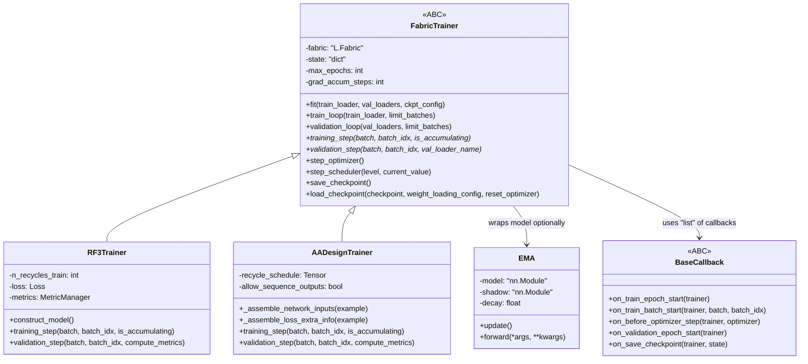

---
slug:7-training-harness-with-fabrictrainer
blog_type:normal
---

FabricTrainer 是 Foundry 的核心训练基础设施——这是一个构建在 PyTorch Lightning Fabric 之上的通用、可扩展的框架，提供了分布式训练能力、检查点管理以及与特定模型实现的无缝集成。这个抽象基类在消除样板代码的同时，为 RosettaFold3、RFdiffusion3 和其他蛋白质设计模型的多样化训练场景保持了灵活性。

来源：[fabric.py](src/foundry/trainers/fabric.py#L1-L9)

## 架构基础

FabricTrainer 利用 Lightning Fabric 的底层 API 构建自定义训练循环，对梯度累积、混合精度训练和分布式策略管理进行显式控制。与强加僵化抽象的 Lightning Trainer 类不同，Fabric 提供了轻量级原语，Foundry 将其组装成针对大规模蛋白质结构预测和设计任务优化的专用训练工作流。

该架构遵循模板方法模式：`FabricTrainer` 通过 `fit()`、`train_loop()` 和 `validation_loop()` 等方法定义训练算法的骨架，而抽象方法 `training_step()` 和 `validation_step()` 需要在特定模型的子类中实现。这种设计确保了跨模型的一致训练行为，同时允许核心计算的完全定制。

来源：[fabric.py](src/foundry/trainers/fabric.py#L52-L623)

## 核心基础设施组件

### 分布式训练配置

FabricTrainer 使用可配置的分布式策略初始化 Lightning Fabric，支持 DDP（Distributed Data Parallel）、DeepSpeed 和 FSDP（Fully Sharded Data Parallel）。对于多节点 GPU 训练，该框架会自动配置带有 NCCL 超时管理和参数发现设置的 DDP。`strategy` 参数决定了分布方法：`"ddp"` 用于具有自定义超时配置的标准 DDP，`"auto"` 用于交互式或单设备环境，或使用显式策略对象进行高级配置。

<CgxTip>在使用部分冻结参数进行训练时，请设置 `find_unused_parameters=True` 以允许 DDP 跳过冻结层的梯度同步。这会带来轻微的性能损失，但允许只有模型子集接收梯度的训练场景。</CgxTip>

加速器规范支持 `"cpu"`、`"cuda"`、`"mps"`、`"gpu"`、`"tpu"` 或 `"auto"` 以进行自动硬件检测。精度选项包括全精度（`"32-true"`）、半精度 AMP（`"16-mixed"`）或 bfloat16 AMP（`"bf16-mixed"`），后者在现代 GPU 架构上默认以获得最佳性能。

来源：[fabric.py](src/foundry/trainers/fabric.py#L53-L172)

### 训练状态管理

`state` 字典作为训练组件的中央存储库，维护对模型、优化器、调度器和训练指标的引用。该字典支持完整训练状态的检查点和恢复，包括 epoch 计数器、全局步数跟踪和优化器动量状态。`initialize_or_update_trainer_state()` 方法提供了一个受控接口来更新状态条目，避免了就地修改的反模式。

状态管理遵循构建管道序列：`construct_model()` → `construct_optimizer()` → `construct_scheduler()` → `setup_model_optimizers_and_schedulers()`。每个方法更新 state 字典，最终的 `setup_model_optimizers_and_schedulers()` 使用 Fabric 包装这些组件以启用分布式训练、自动混合精度和梯度检查点。

来源：[fabric.py](src/foundry/trainers/fabric.py#L172-L284)

### 指数移动平均 (EMA)

Foundry 的 EMA 实现维护一个影子模型，该模型在整个训练过程中跟踪原始模型参数的衰减加权平均值。`EMA` 类包装基础模型，提供动态调度，将训练调用路由到原始模型，将推理调用路由到影子模型。这种设计实现了无缝的 EMA 集成，而无需模型级别的修改。

更新机制应用公式：`shadow_variable -= (1 - decay) * (shadow_variable - variable)`，这平滑了参数轨迹并通常提高泛化能力。当模型具有 `update()` 方法时，EMA 更新会在每次优化器步骤后自动发生，并且参数和缓冲区（不可训练状态）都会被同步。

来源：[EMA.py](src/foundry/training/EMA.py#L8-L68)

### 回调系统

`BaseCallback` 抽象类定义了在训练循环中特定点执行的钩子，实现了在不修改核心训练逻辑的情况下注入模块化功能。回调接收训练器实例作为第一个参数，提供对训练器状态、Fabric 实例和模型组件的访问。

回调钩子涵盖整个训练生命周期：epoch 级钩子（`on_train_epoch_start`，`on_train_epoch_end`）、batch 级钩子（`on_train_batch_start`，`on_train_batch_end`）、优化器钩子（`on_before_optimizer_step`，`optimizer_step`）、验证钩子和检查点钩子。值得注意的是，`on_after_optimizer_step` 由 Fabric 在没有训练器访问权限的情况下内部调用，因此 `optimizer_step` 应用于需要训练器上下文的逻辑。

来源：[callback.py](src/foundry/callbacks/callback.py#L9-L117)

## 训练循环执行

### 主训练流程

`fit()` 方法作为主要入口点，编排完整的训练生命周期。它验证模型构建，使用 Fabric 配置数据加载器，初始化检查点加载，并管理 epoch 级训练循环。如果数据集包含的示例少于配置的目标，该方法会自动调整 `n_examples_per_epoch`。

训练循环遍历 epoch，根据 `validate_every_n_epochs` 有条件地执行验证。每个 epoch 调用 `train_loop()`，它通过支持梯度累积的 batch 进行迭代。在每个 epoch 之后，如果触发则运行验证，随后在达到检查点间隔时保存检查点。

来源：[fabric.py](src/foundry/trainers/fabric.py#L304-L475)

### 梯度累积和优化

`train_loop()` 方法实现复杂的批处理，具有梯度累积功能。它根据 `grad_accum_steps` 跟踪当前 batch 是否需要优化器步骤，仅在累积计数器达到目标时同步梯度并更新参数。这种方法通过在多次前向-后向传递中分散计算，使有效 batch 大小能够超过 GPU 内存。

对于每个 batch，循环调用 `training_step()`，必须由子类实现以执行前向和后向传递。`is_accumulating` 参数指示是否正在累积梯度，并且在累积阶段的实现应跳过梯度同步。

来源：[fabric.py](src/foundry/trainers/fabric.py#L477-L564)

### 优化器步骤执行

`step_optimizer()` 方法封装了完整的优化器步骤序列：NaN/Inf 梯度检查、梯度裁剪、优化器步进、梯度清零和 EMA 更新。当启用 `skip_nan_grad` 时，该方法检测非有限梯度并完全跳过更新，记录警告并清零梯度以防止状态损坏。

梯度裁剪使用 Fabric 的 `clip_gradients()` 方法，具有可配置的最大范数和错误处理。该方法可以静默裁剪非有限梯度，也可以根据 `error_if_grad_nonfinite` 引发错误。在优化器步进和梯度清零之后，如果模型包装在 EMA 实例中，则会自动发生 EMA 更新。

来源：[fabric.py](src/foundry/trainers/fabric.py#L697-L753)

### 调度器步进

`step_scheduler()` 方法提供在 epoch 和 step 级别的灵活调度器调用。`SchedulerConfig` 数据类封装调度器实例、间隔（`"epoch"` 或 `"step"`）和频率（默认为 1 表示每次间隔发生）。该方法在执行步骤之前检查配置与当前级别和频率的兼容性。

这种设计实现了复杂的调度场景：每步调整的 warmup 调度、每 epoch 更新的余弦退火，或具有任意频率的自定义模式。调度器状态保存在检查点中，并在训练恢复期间恢复。

来源：[schedulers.py](src/foundry/training/schedulers.py#L65-L91)

## 验证工作流

### 验证循环执行

`validation_loop()` 方法在一个或多个验证数据集上运行评估，支持命名的验证加载器以进行差异化指标计算。该方法将模型切换到评估模式，禁用梯度计算，并遍历每个验证加载器，为每个 batch 调用 `validation_step()`。

与训练循环不同，验证不累积梯度或更新参数。它执行所有注册的验证回调，通过配置的记录器记录结果，并在完成后将模型恢复到训练模式。该循环支持用于调试目的的 batch 限制，但这不应在生产训练中使用。

来源：[fabric.py](src/foundry/trainers/fabric.py#L565-L623)

### 独立验证模式

`validate()` 方法无需训练即可启用独立的模型验证，适用于模型评估或基准测试。它接受验证加载器字典和检查点路径，加载指定的检查点并在所有提供的数据集上运行验证。该方法促进了检查点比较、超参数分析和生产模型评估。

来源：[fabric.py](src/foundry/trainers/fabric.py#L666-L697)

## 特定模型实现

### RosettaFold3 Trainer

`RF3Trainer` 实现了 AlphaFold 3 风格结构预测模型的训练。训练器管理回收计划、针对结构预测的损失计算和指标计算。`construct_model()` 方法根据配置实例化 RF3 架构，可选择 EMA 包装。

`training_step()` 方法从 batch 数据组装网络输入，使用可配置的回收执行前向传递，并计算结构感知损失，包括坐标预测、置信度估计和模板感知项。`validation_step()` 使用完整回收执行完整推理，并计算全面的结构预测指标。

来源：[rf3.py](models/rf3/src/rf3/trainers/rf3.py#L36-L290)

### RFdiffusion3 Design Trainer

`AADesignTrainer` 实现了 RFdiffusion3 的氨基酸设计模型的训练。该训练器处理扩散特定问题，包括噪声计划、时间步调节和路标管理。`_assemble_network_inputs()` 方法构建具有适当调节特征的噪声坐标。

训练器实现复杂的输入组装，验证张量形状并处理训练期间坐标中的 NaN 值。它支持路标和虚拟原子的各种清理选项，并管理残基类型预测的序列头输出。回收计划遵循课程学习方法，根据训练进度按示例安排回收。

来源：[rfd3.py](models/rfd3/src/rfd3/trainer/rfd3.py#L32-L250)

## 配置选项

| 参数 | 类型 | 默认值 | 描述 |
|-----------|------|---------|-------------|
| `accelerator` | str | `"auto"` | 硬件加速器：cpu、cuda、mps、gpu、tpu、auto |
| `strategy` | str | `"ddp"` | 分布式策略：ddp、deepspeed、fsdp、auto |
| `devices_per_node` | int \| list \| str | `"auto"` | 多 GPU 训练的每节点设备数 |
| `num_nodes` | int | 1 | 分布式训练的计算节点数 |
| `precision` | str | `"bf16-mixed"` | 混合精度：32-true、16-mixed、bf16-mixed |
| `max_epochs` | int | 1000 | 最大训练 epoch 数 |
| `grad_accum_steps` | int | 1 | 每个优化器步骤的 batch 数 |
| `validate_every_n_epochs` | int | 1 | 验证运行频率 |
| `n_examples_per_epoch` | int | 24,000 | 每个 epoch 在所有 GPU 上处理的示例数 |
| `checkpoint_every_n_epochs` | int | 1 | 以 epoch 为单位的检查点频率 |
| `checkpoint_every_n_steps` | int \| None | None | 可选的基于步骤的检查点频率 |
| `clip_grad_max_norm` | float \| None | None | 梯度裁剪阈值 |
| `skip_nan_grad` | bool | False | 跳过具有 NaN 梯度的优化器更新 |
| `error_if_grad_nonfinite` | bool | False | 遇到非有限梯度时引发错误 |

来源：[fabric.py](src/foundry/trainers/fabric.py#L53-L172)

## 检查点管理

### 检查点保存

`save_checkpoint()` 方法将完整的训练状态持久化到配置的输出目录。检查点包括模型参数（如果适用，包括 EMA 影子模型）、优化器状态、调度器状态、epoch 计数器、全局步数和自定义状态条目。该方法在 `output_dir` 的 `ckpt/` 子目录中创建检查点，使用 Fabric 的分布式检查点以确保跨进程的一致性。

来源：[fabric.py](src/foundry/trainers/fabric.py#L782-L805)

### 检查点加载

`load_checkpoint()` 方法处理具有灵活配置的检查点恢复。它接受文件路径（到特定检查点）或字典（预加载的检查点），并通过 `WeightLoadingConfig` 支持权重加载策略。该方法加载模型、优化器和调度器状态，优雅地处理 EMA 模型恢复和参数大小不匹配。

`reset_optimizer` 参数允许加载模型权重而不恢复优化器状态，这对于训练动力学应该是全新的迁移学习场景很有用。权重加载策略实现了诸如“严格”加载（需要精确参数匹配）、“复制”（加载匹配参数，忽略不匹配）或“重新初始化”（加载匹配参数，重新初始化不匹配参数）等策略。

来源：[fabric.py](src/foundry/trainers/fabric.py#L835-L896)

## 最佳实践

### 分布式训练配置

配置多节点训练时，请确保 `devices_per_node` 指定的是每节点 GPU 而不是总 GPU 数。例如，一个每节点 8 个 GPU 的 2 节点集群应使用 `devices_per_node=8` 和 `num_nodes=2`，而不是 `devices_per_node=16`。为大规模训练设置适当的 `nccl_timeout` 值，以防止在长时间操作中过早终止。

仅在部分冻结模型必要时设置 `find_unused_parameters=True`，因为这会产生性能开销。对于完全训练的模型，保持此参数为 `False` 以获得最佳梯度同步效率。

### 梯度累积策略

根据内存约束和 batch 大小要求选择 `grad_accum_steps`。计算有效 batch 大小为 `grad_accum_steps × batch_size × num_gpus × num_nodes`。监控 GPU 内存利用率以避免内存不足错误，同时保持足够的 batch 多样性。

当使用梯度累积与混合精度时，请注意梯度缩放在累积步骤中可能表现不同。内置的 NaN 梯度检测有助于识别由于激进的累积或混合精度训练而产生的数值不稳定性。

### EMA 配置

对于稳定收敛，EMA 衰减率通常在 0.999 到 0.9999 之间。较低的衰减率更紧密地跟踪模型参数，但提供的平滑较少。较高的衰减率提供更强的平滑，但在早期训练阶段可能滞后于快速改进。

对于大型模型，考虑减少 EMA 检查点保存频率以减少 I/O 开销，因为 EMA 参数是增量变化的，并且可以从最近的模型状态重建。

## 后续步骤

了解训练框架是使用新模型扩展 Foundry 和优化现有模型训练工作流的基础。以下文档提供了补充信息：

- [使用 DDP 进行分布式训练](15-distributed-training-with-ddp) - 深入探讨分布式训练细节和多节点设置
- [指数移动平均实现](16-exponential-moving-average-implementation) - 详细的 EMA 配置和调整策略
- [回调和指标记录](17-callbacks-and-metrics-logging) - 自定义回调开发和指标集成
- [Hydra 配置系统](12-hydra-configuration-system) - 训练实验的配置管理
- [向 Foundry 添加新模型](21-adding-new-models-to-foundry) - 实现新模型训练器的完整指南