---
slug:8-checkpoint-management-system
blog_type:normal
---

Foundry 中的检查点管理系统提供了一个全面的基础设施，用于在训练和推理工作流中管理模型检查点。该系统处理三个关键方面：检查点的获取和存储、基于策略配置的灵活权重加载，以及与训练和推理流水线的无缝集成。该架构旨在支持大规模蛋白质设计模型，同时保持可重复性并实现对模型状态管理的细粒度控制。

来源：[checkpoint_registry.py](src/foundry/inference_engines/checkpoint_registry.py#L1-L71)、[weights.py](src/foundry/utils/weights.py#L1-L272)、[fabric.py](src/foundry/trainers/fabric.py#L782-L900)

## 架构概述

检查点管理系统通过三个相互连接的层运行，形成了一条从模型获取到推理的连贯流水线。基础层提供了所有可用模型检查点的集中式注册表，包含其元数据和下载 URL。权重管理层提供了处理参数加载、形状不匹配和参数冻结的高级策略。集成层将这些组件连接到训练框架和推理引擎，在不同上下文中提供无缝的检查点操作。

```mermaid
flowchart TB
    subgraph CLI["CLI Layer"]
        install[install]
        list[list]
        show[show]
        clean[clean]
    end
    
    subgraph Registry["Checkpoint Registry"]
        REGISTERED[REGISTERED_CHECKPOINTS]
        get_dir[get_default_checkpoint_dir]
        Registered[RegisteredCheckpoint]
    end
    
    subgraph Weight["Weight Management"]
        WeightConfig[WeightLoadingConfig]
        FreezeConfig[ParameterFreezingConfig]
        load_weights[load_weights_with_policies]
        freeze_params[freeze_parameters_with_config]
    end
    
    subgraph Integration["Integration Layer"]
        BaseEngine[BaseInferenceEngine]
        FabricTrainer[FabricTrainer]
        save_ckpt[save_checkpoint]
        load_ckpt[load_checkpoint]
    end
    
    install --> REGISTERED
    list --> REGISTERED
    show --> get_dir
    clean --> get_dir
    
    BaseEngine --> get_dir
    BaseEngine --> Registered
    
    FabricTrainer --> load_weights
    FabricTrainer --> freeze_params
    FabricTrainer --> save_ckpt
    FabricTrainer --> load_ckpt
```

该系统遵循明确的关注点分离原则：CLI 处理面向用户的操作，注册表管理元数据和路径解析，权重策略控制参数加载语义，集成组件在训练和推理工作流中协调这些服务。

来源：[download_checkpoints.py](src/foundry_cli/download_checkpoints.py#L1-L274)、[checkpoint_registry.py](src/foundry/inference_engines/checkpoint_registry.py#L1-L71)

## 检查点注册表与元数据

检查点注册表作为所有可用模型检查点的中央真实来源，维护基本元数据，包括下载 URL、文件名、描述以及用于完整性验证的可选 SHA256 校验和。注册表定义了 `RegisteredCheckpoint` 数据类，封装了此信息并提供 `get_default_path()` 方法用于解析文件位置。

路径解析遵循明确的优先级层次：首先检查是否设置了 `FOUNDRY_CHECKPOINTS_DIR` 环境变量，然后默认使用用户主目录下的 `~/.foundry/checkpoints`。这种设计既支持系统级和用户特定的检查点存储策略，又提供了开箱即用的合理默认值。

来源：[checkpoint_registry.py](src/foundry/inference_engines/checkpoint_registry.py#L8-L71)

### 注册的模型检查点

注册表当前维护三个蛋白质设计系统中六个模型变体的条目：

| 模型名称 | 描述 | 文件名 |
|-----------|-------------|----------|
| `rfd3` | RFdiffusion3 检查点 | rfd3_latest.ckpt |
| `rf3` | 使用截至 2024 年 1 月的数据训练的最新 RF3 检查点 | rf3_foundry_01_24_latest_remapped.ckpt |
| `proteinmpnn` | ProteinMPNN 检查点 | proteinmpnn_v_48_020.pt |
| `ligandmpnn` | LigandMPNN 检查点 | ligandmpnn_v_32_010_25.pt |
| `rf3_preprint_921` | 使用截至 2021 年 9 月的数据训练的 RF3 预印本检查点 | rf3_foundry_09_21_preprint_remapped.ckpt |
| `rf3_preprint_124` | 使用截至 2024 年 1 月的数据训练的 RF3 预印本检查点 | rf3_foundry_01_24_preprint_remapped.ckpt |
| `solublempnn` | SolubleMPNN 检查点 | solublempnn_v_48_020.pt |

每个检查点条目包含一个描述字段，用于传达关键细节，例如训练数据截止日期，帮助用户为其用例选择合适的检查点。注册表结构可扩展，允许随着生态系统的发展直接添加新的模型变体。

来源：[checkpoint_registry.py](src/foundry/inference_engines/checkpoint_registry.py#L33-L71)

## 检查点管理的 CLI

Foundry 为检查点管理提供了一个全面的命令行界面，可通过 `foundry` 命令访问。该界面简化了下载、列出、显示和清理检查点文件等常见操作，并具有丰富的进度反馈和错误处理功能。

来源：[download_checkpoints.py](src/foundry_cli/download_checkpoints.py#L28-L274)

### 安装命令

`foundry install` 命令下载模型检查点，可选择进行哈希验证。用户可以按名称单独指定模型，或使用 `all` 关键字安装所有可用检查点。该命令支持通过 `--checkpoint-dir` 标志指定自定义检查点目录，并支持使用 `--force` 标志强制重新安装。

下载过程具有进度条功能，显示下载速度、剩余时间和已传输字节数。当注册表中提供 SHA256 哈希值时，CLI 会自动验证下载文件的完整性，如果验证失败，将删除损坏的文件并报告错误。

来源：[download_checkpoints.py](src/foundry_cli/download_checkpoints.py#L32-L137)

### 列出和显示检查点

`foundry list` 命令显示所有可用的模型检查点及其描述，提供可用模型的快速参考。`foundry show` 命令报告检查点目录中当前已安装的检查点，以 GB 为单位显示文件名和大小。这对于监控磁盘使用情况和验证安装是否成功特别有用。

来源：[download_checkpoints.py](src/foundry_cli/download_checkpoints.py#L180-L221)

### 清理操作

`foundry clean` 命令从检查点目录中删除所有已下载的检查点文件。默认情况下，删除前需要确认，但可以使用 `--no-confirm` 标志绕过此确认。该命令显示要删除文件的总大小，在执行删除操作前提供透明度。

来源：[download_checkpoints.py](src/foundry_cli/download_checkpoints.py#L222-L274)

## 权重加载策略

权重加载系统对检查点参数如何传输到模型提供了细粒度的控制，解决了架构修改、形状不匹配和选择性参数更新等常见挑战。`WeightLoadingPolicy` 枚举定义了四种策略，可全局应用、逐参数应用或通过模式匹配应用。

来源：[weights.py](src/foundry/utils/weights.py#L23-L115)

### 策略类型

| 策略 | 行为 | 用例 |
|--------|----------|----------|
| `REINIT` | 始终保持默认初始化 | 不应使用检查点权重的参数 |
| `ZERO_INIT` | 始终零初始化 | 无论检查点如何都需要全新初始化的参数 |
| `COPY` | 仅在形状完全匹配时从检查点复制 | 需要架构兼容性的严格加载 |
| `COPY_AND_ZERO_PAD` | 如果秩相同则复制，对形状不匹配的部分进行零填充 | 加载到具有扩展维度的修改架构中 |

该系统使用两层策略应用：首先尝试指定的策略，如果主策略失败，则回退到配置的回退策略。这在处理略微修改的架构或缺失参数时提供了鲁棒性。

来源：[weights.py](src/foundry/utils/weights.py#L23-L37)

### 基于模式的配置

`WeightLoadingConfig` 类支持 glob 风格的模式匹配，用于将策略应用于参数组。模式使用标准通配符：`*` 匹配任意序列，`?` 匹配单个字符，`[abc]` 匹配方括号中的任何字符。`_PatternPolicyMixin` 提供模式编译和匹配逻辑，支持精确参数名称匹配和基于通配符的模式应用。

例如，`"model.*.weight"` 匹配模型中的任何权重参数，而 `"model.encoder?.weight"` 匹配 encoder1.weight、encoder2.weight 等。这在多个参数共享加载需求时实现了简洁的配置。

来源：[weights.py](src/foundry/utils/weights.py#L39-L115)

<CgxTip>
模式匹配系统默认将 `.` 视为字面点，将其在正则表达式中转换为 `\.`。要匹配参数名称中的实际点，必须在模式中显式包含它们。这可以防止跨模块层次结构进行意外的通配符匹配。
</CgxTip>

## 参数冻结

除了权重加载外，系统还通过 `ParameterFreezingConfig` 类提供参数冻结功能。这使得可以在检查点加载后有选择地禁用特定参数的梯度计算，支持迁移学习场景，其中主干层应保持冻结，而任务特定的头进行训练。

与权重加载策略类似，冻结配置支持精确参数名称和 glob 模式。`freeze_by_default` 参数反转默认行为，冻结所有参数，除非通过匹配模式显式解冻。`freeze_parameters_with_config()` 函数将配置应用于模型参数，并可选提供详细日志记录以报告非默认策略的应用。

来源：[weights.py](src/foundry/utils/weights.py#L118-L163)

## 训练中的检查点加载

`FabricTrainer` 类通过 `load_checkpoint()` 方法提供了全面的检查点加载功能，该方法接受文件路径或预加载的检查点字典。加载过程处理三个不同的状态组件：模型权重、优化器状态和调度器状态。

来源：[fabric.py](src/foundry/trainers/fabric.py#L835-L895)

### 模型权重加载

`_load_model()` 方法委托给 `load_weights_with_policies()` 函数，应用配置的权重加载策略将检查点权重传输到模型。这使得能够通过上述策略系统灵活处理架构差异、形状不匹配和选择性参数更新。

来源：[fabric.py](src/foundry/trainers/fabric.py#L820-L830)

### 优化器和调度器加载

如果检查点中存在优化器和调度器状态，并且训练器状态中存在相应的对象，`_load_optimizer()` 和 `_load_scheduler()` 方法会加载这些状态。`load_checkpoint()` 中的 `reset_optimizer` 参数控制是否加载这些组件，从而实现使用新优化器对预训练权重进行微调等场景。

来源：[fabric.py](src/foundry/trainers/fabric.py#L806-L818)

### 状态管理

检查点加载过程仔细管理状态键，显式忽略 `train_cfg` 键以防止配置冲突。系统为缺失和多余的键提供详细日志记录，有助于在出现检查点兼容性问题时进行调试。最终加载的状态包括当前 epoch 和全局步数，从而实现无缝的训练恢复。

来源：[fabric.py](src/foundry/trainers/fabric.py#L835-L895)

## 检查点保存

`FabricTrainer` 中的 `save_checkpoint()` 方法处理训练期间的检查点持久化。检查点保存到 `output_dir/ckpt/`，文件名包含当前 epoch 编号，格式为 `epoch-XXXX.ckpt`。该方法在保存前调用 `on_save_checkpoint` 钩子，允许回调根据需要修改检查点状态。

如果未配置输出目录，该方法将跳过检查点保存并记录警告。这种设计允许进行不进行检查点持久化的训练运行，用于调试或验证目的。

来源：[fabric.py](src/foundry/trainers/fabric.py#L782-L791)

## 推理引擎集成

`BaseInferenceEngine` 类将检查点管理集成到推理流水线中。构造函数接受文件路径或注册的模型名称，通过注册表自动解析检查点路径。当提供模型名称时，引擎使用注册表确定默认检查点位置，并在继续之前验证文件是否存在。

来源：[base.py](src/foundry/inference_engines/base.py#L38-L120)

### 检查点路径解析

路径解析逻辑检查提供的路径是否包含点。如果不包含，则假定它是注册的模型名称并查询 `REGISTERED_CHECKPOINTS` 字典。这实现了便捷的用法，如 `BaseInferenceEngine("rfd3")`，而无需指定完整路径。引擎记录解析的检查点路径以提供透明度，并在文件缺失时提供清晰的错误消息。

来源：[base.py](src/foundry/inference_engines/base.py#L70-L83)

### 初始化和加载

在初始化期间，`initialize()` 方法加载检查点文件并提取训练配置。使用此配置构建训练器，并通过训练器的 `load_checkpoint()` 方法加载权重。加载后，优化器状态显式设置为 `None`，以确保推理使用评估模式下的模型，而不使用优化器状态。

来源：[base.py](src/foundry/inference_engines/base.py#L125-L170)

## 配置结构

检查点管理行为通过 `CheckpointConfig` 数据类进行配置，该类聚合了检查点路径和加载选项。此配置支持 `weight_loading_config` 和 `parameter_freezing_config` 参数，通过单个配置对象实现对检查点加载行为的全面控制。

来源：[weights.py](src/foundry/utils/weights.py#L261-L272)

## 最佳实践

使用检查点管理系统时，几种做法可确保可靠运行：

1. **使用注册的模型名称进行推理**：注册表系统简化了检查点管理，允许使用模型名称代替完整路径。使用 `BaseInferenceEngine("rfd3")` 而不是手动指定路径。

2. **集中设置 FOUNDRY_CHECKPOINTS_DIR**：配置此环境变量以控制所有 foundry 操作的检查点存储位置，确保训练和推理之间的一致性。

3. **对架构修改使用 COPY_AND_ZERO_PAD**：将检查点加载到修改后的架构中时，此策略提供了最大的灵活性，复制兼容的维度，同时零初始化扩展的维度。

4. **验证检查点完整性**：当哈希值可用时，CLI 会自动执行 SHA256 验证。对于大型下载，这可以防止损坏的文件导致细微问题。

5. **清理旧检查点**：使用 `foundry clean` 删除不必要的检查点文件。该命令在删除前显示总大小，有助于管理磁盘使用情况。

来源：[checkpoint_registry.py](src/foundry/inference_engines/checkpoint_registry.py#L8-L15)、[download_checkpoints.py](src/foundry_cli/download_checkpoints.py#L84-L137)、[weights.py](src/foundry/utils/weights.py#L35-L36)

## 延伸阅读

检查点管理系统与其他 Foundry 基础设施组件集成。为了深入理解，请探索[使用 FabricTrainer 的训练框架](7-training-harness-with-fabrictrainer)以了解训练期间的检查点保存，[Hydra 配置系统](12-hydra-configuration-system)以了解配置管理，以及[实现自定义推理引擎](23-implementing-custom-inference-engines)以了解将检查点管理集成到自定义推理流水线中。