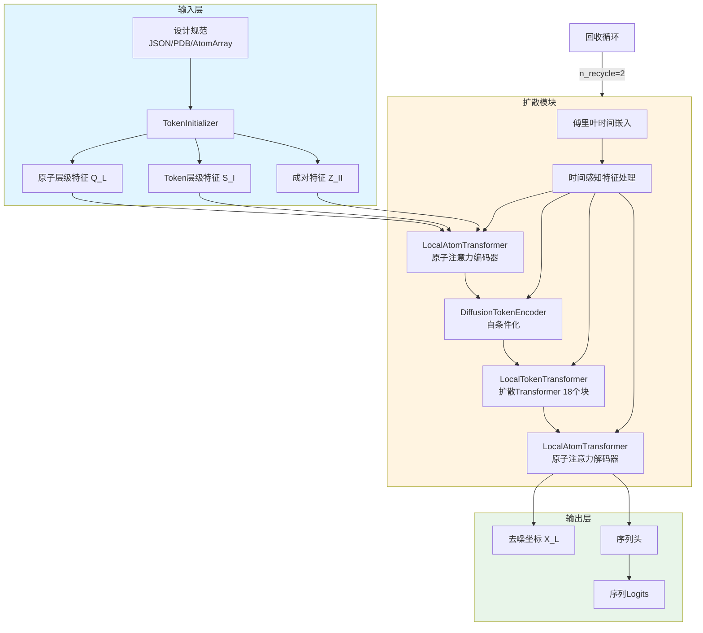
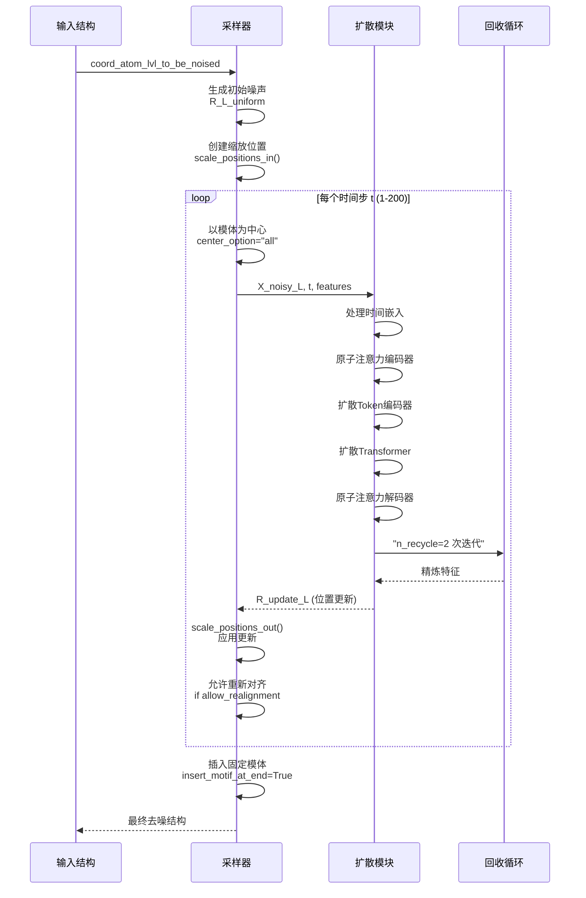

---
slug:9-rfdiffusion3-all-atom-generative-model
blog_type:normal
---


RFdiffusion3 (RFD3) 是一个复杂的基于扩散的生成模型，专为在复杂约束下进行**全原子生物分子结构设计**而设计。作为 AlphaFold 3 的精简衍生版本，RFD3 专注于扩散去噪模块，能够以原子级精度高效地从头设计蛋白质、核酸结合剂、小分子结合剂和酶。

## 架构概述

RFdiffusion3 采用**多尺度类 UNet 架构**，通过迭代去噪处理原子和 Token 层级的信息。该模型运行在一个扩散框架中，其中原子坐标从随机噪声逐渐去噪为物理上现实的结构，并以设计约束为条件。



### 核心模型组件

RFD3 模型 ([`RFD3.py`](models/rfd3/src/rfd3/model/RFD3.py#L18-L106)) 协调三个主要模块：

- **TokenInitializer**：使用相对位置编码、Token层级特征（残基类型、模体信息）和原子层级特征（元素、电荷、引导特征如氢键供体/受体、溶剂可及性）将输入结构转换为多尺度特征表示。
- **RFD3DiffusionModule**：具有 UNet 架构的去噪核心，包含 3 层原子注意力编码器、2 块扩散 Token 编码器、18 块扩散 Transformer 和 3 层原子注意力解码器。
- **ConditionalDiffusionSampler**：管理迭代扩散采样过程，支持模体对齐、对称约束和无分类器引导。

扩散模块 ([`RFD3_diffusion_module.py`](models/rfd3/src/rfd3/model/RFD3_diffusion_module.py#L32-L388)) 实现了一个复杂的注意力机制，通过交叉注意力上转换/下转换操作实现原子和 Token 表示之间的信息流。关键架构参数包括通道维度 c_s=384, c_z=128, c_atom=128, c_atompair=16，Token层级处理的 c_token=768。

来源：[`RFD3.py`](models/rfd3/src/rfd3/model/RFD3.py#L18-L106), [`RFD3_diffusion_module.py`](models/rfd3/src/rfd3/model/RFD3_diffusion_module.py#L32-L388), [`rfd3_net.yaml`](models/rfd3/configs/model/components/rfd3_net.yaml#L1-L132)

## 扩散过程和采样

RFdiffusion3 使用**Euler-Maruyama 求解器**，其随机采样参数针对结构设计质量进行了优化。扩散过程遵循由 sigma_data=16 控制的噪声调度，可配置参数包括 num_timesteps（默认 200）、step_scale (1.5)、gamma_0 (0.6) 和 noise_scale (1.003)。



### 采样策略

推理采样器 ([`inference_sampler.py`](models/rfd3/src/rfd3/model/inference_sampler.py#L18-L636)) 支持多种采样策略：

- **默认采样**：保留模体的标准扩散，具有平移增强 (s_trans=1.0) 和以模体、所有或扩散区域为中心的对齐方式。
- **对称采样**：扩展默认采样，增加对称约束，在扩散过程的 fraction_sym_steps=0.9 之后应用对称变换。
- **无分类器引导 (CFG)**：通过从参考特征计算引导比例（默认 cfg_scale=1.5）来提高设计保真度，可选择性地与 t_max 截止值一起应用。

采样器通过 is_motif_atom_with_fixed_coord 和 is_motif_token_with_fully_fixed_coord 掩码实现**模体保留**，允许指定区域保持固定的部分扩散。在采样期间，固定模体在每个步骤重新居中，以维持结构上下文。

来源：[`inference_sampler.py`](models/rfd3/src/rfd3/model/inference_sampler.py#L18-L636), [`rfdiffusion3.yaml`](models/rfd3/configs/inference_engine/rfdiffusion3.yaml#L1-L66)

## 条件系统

RFdiffusion3 支持丰富的**条件注释系统**，将设计约束直接编码到原子数组中。必需的注释包括组件来源 (`src_component`)、设计意图 (`contig`)、固定/扩散状态 (`inpainting`) 和模体信息 (`is_motif`)。

<CgxTip>
条件系统通过一个复杂的注释管道运行，其中原子通过必需的注释（inpainting、contig、is_motif、src_component）和可选的引导特征（active_donor、active_acceptor、ref_atomwise_rasa、is_atom_level_hotspot）标记设计约束。这些注释流经整个管道，从输入规范到特征初始化再到扩散模块，确保约束在整个生成过程中得到保留。
</CgxTip>

### 特征编码

在 TokenInitializer 中编码的 Token层级特征 ([`rfd3_net.yaml`](models/rfd3/configs/model/components/rfd3_net.yaml#L9-L18)) 包括：

| 特征 | 维度 | 目的 |
|---------|-----------|---------|
| ref_motif_token_type | 3 | 区分模体、扩散和固定区域 |
| restype | 32 | 氨基酸 One-hot 编码 |
| ref_plddt | 1 | 来自参考结构的置信度分数 |
| is_non_loopy | 1 | 识别非环区域以进行二级结构引导 |

原子层级特征 ([`rfd3_net.yaml`](models/rfd3/configs/model/components/rfd3_net.yaml#L19-L36)) 包括化学性质（ref_element、ref_charge）、结构信息（ref_pos、ref_atom_name_chars）以及用于氢键结合（active_donor、active_acceptor）、溶剂可及性（ref_atomwise_rasa）和热点识别（is_atom_level_hotspot）的引导特征。

来源：[`constants.py`](models/rfd3/src/rfd3/constants.py#L1-L213), [`rfd3_net.yaml`](models/rfd3/configs/model/components/rfd3_net.yaml#L9-L36)

## 推理引擎

RFD3InferenceEngine ([`engine.py`](models/rfd3/src/rfd3/engine.py#L135-L403)) 提供了一个统一的接口，用于运行具有灵活输入规范和输出处理的设计任务。

### 输入规范

引擎通过 `_canonicalize_inputs` 方法 ([`engine.py`](models/rfd3/src/rfd3/engine.py#L330-L368)) 接受多种输入格式：

- **JSON 文件**：用于具有多个 contigs 和约束的复杂设计规范的主要方法。
- **PDB/AtomArray**：用于简单设计任务的结构直接输入。
- **DesignInputSpecification**：用于自动化工作流的编程 Python 对象。

输入解析系统 ([`input_parsing.py`](models/rfd3/src/rfd3/inference/input_parsing.py)) 根据必需注释验证规范，并处理用于组件组装的 contig 解析。

### 执行管道

推理工作流 ([`engine.py`](models/rfd3/src/rfd3/engine.py#L200-L262)) 遵循以下步骤：

1. 输入规范化和验证。
2. 用于批处理的规范倍增。
3. 使用 Atom14 数据转换构建管道。
4. 通过模型前向传播进行扩散采样。
5. 将输出组装为 AtomArray 结构。
6. 可选的轨迹转储和对齐。

引擎支持使用 `diffusion_batch_size` 配置的批处理，通过 `n_batches` 参数的多批执行，以及用于恢复中断运行的自动检查点管理。

来源：[`engine.py`](models/rfd3/src/rfd3/engine.py#L135-L403), [`rfdiffusion3.yaml`](models/rfd3/configs/inference_engine/rfdiffusion3.yaml#L1-L66)

## 训练基础设施

RFdiffusion3 提供完整的训练代码，通过 AADesignTrainer ([`trainer/rfd3.py`](models/rfd3/src/rfd3/trainer/rfd3.py#L32-L486)) 扩展 Foundry 的 FabricTrainer。

### 训练循环

训练步骤 ([`trainer/rfd3.py`](models/rfd3/src/rfd3/trainer/rfd3.py#L131-L185)) 实现单步去噪，并对从噪声坐标到去噪坐标的预测进行损失计算。与推理不同，训练不运行完整的扩散展开，而是在随机时间步的噪声下学习去噪函数。

### 条件训练

RFD3 在训练期间动态创建的各种条件任务上进行训练 ([`README.md`](models/rfd3/README.md#L134-L175))：

- 随机模体 Token 分配和部分掩码。
- TIP 原子条件（原子级约束的特定预设）。
- 蛋白质-蛋白质相互作用热点条件。
- 二级结构岛条件。
- 核酸和小分子接触条件。

训练配置 ([`train.yaml`](models/rfd3/configs/train.yaml#L1-L28)) 通过 Hydra 组合指定模型架构、训练器设置、数据集配置、回调和路径。

来源：[`trainer/rfd3.py`](models/rfd3/src/rfd3/trainer/rfd3.py#L32-L486), [`train.py`](models/rfd3/src/rfd3/train.py#L25-L193), [`train.yaml`](models/rfd3/configs/train.yaml#L1-L28)

## 设计应用

RFdiffusion3 擅长各种生物分子设计任务，并具有专门的示例配置。

### 支持的应用

| 应用 | 描述 | 示例配置 |
|-------------|-------------|----------------|
| 蛋白质结合剂 | 设计结合目标蛋白质表面的蛋白质 | `protein_binder_design.json` |
| 小分子结合剂 | 设计结合配体和辅因子的蛋白质 | `sm_binder_design.json` |
| 核酸结合剂 | 设计结合 DNA/RNA 的蛋白质 | `na_binder_design.json` |
| 酶设计 | 设计具有催化几何形状的活性位点 | `enzyme_design.json` |
| 对称设计 | 生成环状、二面体和更高阶的对称性 | `symmetry.md` |
| 氢键条件 | 使用特定的氢键网络约束设计 | 需要安装 HBPLUS |

### 配置示例

基本推理命令：
```bash
rfd3 design out_dir=logs/inference_outs/demo/0 inputs=models/rfd3/docs/demo.json ckpt_path=null skip_existing=False dump_trajectories=True align_trajectory_structures=True
```

关键推理参数 ([`rfdiffusion3.yaml`](models/rfd3/configs/inference_engine/rfdiffusion3.yaml#L1-L66)) 包括：
- `step_scale`：控制多样性与可设计性（越高 = 多样性越低，可设计性越高）。
- `center_option`：指定是否以 "all"、"motif" 或 "diffuse" 区域为中心。
- `cfg_scale`：无分类器引导强度。
- `num_timesteps`：去噪步数。

来源：[`README.md`](models/rfd3/README.md#L1-L175), [docs/](models/rfd3/docs/)

## 高级功能

### 内存优化

RFD3 为大型结构提供**低内存模式** ([`engine.py`](models/rfd3/src/rfd3/engine.py#L68-L70))，通过设置 `low_memory_mode=True` 或环境变量 `RFD3_LOW_MEMORY_MODE=1`。这通过 `chunked_pairwise_embedder` 参数启用分块成对嵌入计算，以计算成本为代价降低峰值内存使用。

### 轨迹分析

引擎支持完整的轨迹转储 ([`engine.py`](models/rfd3/src/rfd3/engine.py#L64-L66))，设置 `dump_trajectories=True` 和 `align_trajectory_structures=True`，保存中间去噪步骤以进行分析、可视化和调试。`_reshape_trajectory` 函数处理轨迹对齐和重组。

### 分布式训练

RFD3 与 Foundry 的 DDP 支持集成 ([`README.md`](models/rfd3/README.md#L132-L157))，用于多 GPU 和多节点训练。训练器接受 `devices_per_node` 和 `num_nodes` 参数，并根据目标批大小自动配置梯度累积。

来源：[`engine.py`](models/rfd3/src/rfd3/engine.py#L68-L70), [`README.md`](models/rfd3/README.md#L132-L157)

## 配置系统

RFdiffusion3 使用分层 Hydra 配置系统进行模块化组合：

### 配置结构

```
configs/
├── inference_engine/rfdiffusion3.yaml    # 主推理配置
├── inference.yaml                         # 推理入口点
├── model/
│   ├── rfd3_base.yaml                    # 模型组合
│   └── components/
│       ├── rfd3_net.yaml                 # 网络架构
│       └── ema.yaml                      # EMA 配置
├── trainer/
│   └── rfd3_base.yaml                    # 训练器组合
├── datasets/
│   └── design_base.yaml                  # 数据集基础配置
└── experiment/
    ├── pretrain.yaml                     # 预训练覆盖
    ├── test-uncond.yaml                  # 无条件测试
    └── debug.yaml                        # 调试配置
```

[`rfd3_net.yaml`](models/rfd3/configs/model/components/rfd3_net.yaml#L1-L132) 中的关键配置参数：
- 通道维度：`c_s`、`c_z`、`c_atom`、`c_atompair`、`c_token`
- 注意力配置：`n_head`、`kq_norm`、`dropout`
- 架构深度：`n_pairformer_blocks`、`n_block`（扩散 Transformer 为 18）
- 回收：`n_recycle=2`
- 下转换/上转换：具有可配置块的交叉注意力方法

来源：[`rfd3_base.yaml`](models/rfd3/configs/model/rfd3_base.yaml#L1-L9), [`inference.yaml`](models/rfd3/configs/inference.yaml#L1-L10)

## 与 Foundry 集成

RFdiffusion3 与 Foundry 的基础设施深度集成：

- **检查点管理**：使用 Foundry 的检查点系统，将 `ckpt_path` 解析为 `FOUNDRY_CHECKPOINTS_DIR`。
- **训练框架**：使用 RFD3 特定的验证和指标扩展 `FabricTrainer` ([`FabricTrainer`](7-training-harness-with-fabrictrainer))。
- **回调**：用于设计指标、结构转储和训练记录的自定义回调。
- **配置**：利用 Hydra 配置系统 ([`Hydra Configuration System`](12-hydra-configuration-system)) 和自定义解析器。
- **数据集系统**：使用与 AtomWorks 兼容的数据集实例化 ([`Dataset Instantiation`](14-dataset-instantiation-and-sampling))。

该模型遵循 Foundry 的推理引擎模式 ([`Inference Engine Architecture`](6-inference-engine-architecture))，实现具有批处理和输出处理的标准 `run()` 方法。

来源：[`__init__.py`](models/rfd3/src/rfd3/__init__.py#L1-L13), [`README.md`](models/rfd3/README.md#L13-L35)

## 后续步骤

要了解全面的设计工作流，请探索：

- **RosettaFold3**：通过 [RosettaFold3: Structure Prediction Network](10-rosettafold3-structure-prediction-network) 进行设计支架的结构预测。
- **序列设计**：使用 [ProteinMPNN and LigandMPNN: Inverse Folding](11-proteinmpnn-and-ligandmpnn-inverse-folding) 优化 RFdiffusion3 输出。
- **高级配置**：使用 [Model-Specific Configuration Structure](22-model-specific-configuration-structure) 自定义模型。
- **扩展**：通过 [Adding New Models to Foundry](21-adding-new-models-to-foundry) 添加新模型。

有关训练定制，请参阅 [Distributed Training with DDP](15-distributed-training-with-ddp) 和 [Exponential Moving Average Implementation](16-exponential-moving-average-implementation)。