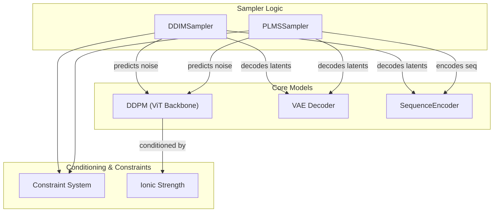
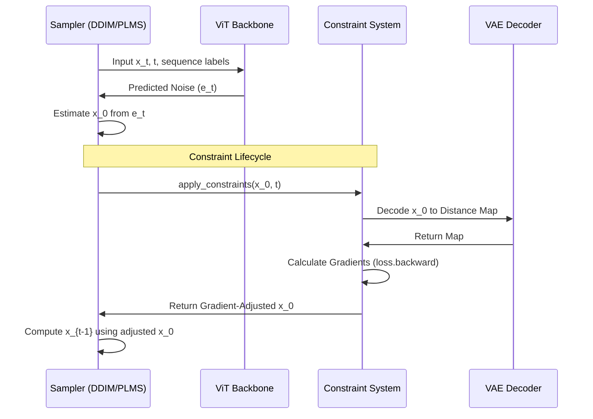

# Accelerated Samplers: DDIM and PLMS

> **Relevant source files**
> - [starling/samplers/ddim\_sampler\.py](https://github.com/idptools/starling/blob/4b98d2fe/starling/samplers/ddim_sampler.py)
> - [starling/samplers/plms\_sampler\.py](https://github.com/idptools/starling/blob/4b98d2fe/starling/samplers/plms_sampler.py)

 STARLING provides two accelerated sampling algorithms, **DDIM** \(Denoising Diffusion Implicit Models\) and **PLMS** \(Pseudo Linear Multi\-Step\), designed to significantly reduce the number of inference steps required to generate high\-quality protein ensembles\. While standard DDPM typically requires 1000 steps, these samplers can produce comparable results in 25–100 steps [ddim\_sampler\.py L30-L33](https://github.com/idptools/starling/blob/4b98d2fe/starling/samplers/ddim_sampler.py#L30-L33)

## Overview of Accelerated Sampling

 Both samplers operate by discretizing the diffusion process into a smaller subset of timesteps than those used during training [ddim\_sampler\.py L44-L45](https://github.com/idptools/starling/blob/4b98d2fe/starling/samplers/ddim_sampler.py#L44-L45) They leverage the `ddpm_model` for noise prediction and the `encoder_model` \(VAE\) for decoding latents back into distance maps [ddim\_sampler\.py L20-L23](https://github.com/idptools/starling/blob/4b98d2fe/starling/samplers/ddim_sampler.py#L20-L23)

### Discretization Schedules

 The samplers support two primary methods for selecting the subset of timesteps $t$:

 - **Uniform**: Steps are spaced evenly across the training range [ddim\_sampler\.py L73-L75](https://github.com/idptools/starling/blob/4b98d2fe/starling/samplers/ddim_sampler.py#L73-L75)
- **Quad**: Steps are spaced quadratically, placing more density near $t=0$ to refine structural details [ddim\_sampler\.py L76-L79](https://github.com/idptools/starling/blob/4b98d2fe/starling/samplers/ddim_sampler.py#L76-L79)

### Component Interaction Diagram

 The following diagram illustrates how the sampler classes interact with the core model components and the constraint system\.

 **Sampler\-Model Interaction**

 **Sources:** [ddim\_sampler\.py L19-L28](https://github.com/idptools/starling/blob/4b98d2fe/starling/samplers/ddim_sampler.py#L19-L28) [plms\_sampler\.py L62-L72](https://github.com/idptools/starling/blob/4b98d2fe/starling/samplers/plms_sampler.py#L62-L72)

---

## DDIM: Denoising Diffusion Implicit Models

 `DDIMSampler` implements a non\-Markovian forward process that allows for deterministic sampling when `ddim_eta` is set to 0\.0 [ddim\_sampler\.py L48-L52](https://github.com/idptools/starling/blob/4b98d2fe/starling/samplers/ddim_sampler.py#L48-L52)

### Key Parameters

 - **ddim\_eta**: Interpolates between deterministic \(0\.0\) and stochastic \(1\.0\) processes [ddim\_sampler\.py L48-L52](https://github.com/idptools/starling/blob/4b98d2fe/starling/samplers/ddim_sampler.py#L48-L52)
- **temperature**: Scales the noise injected during stochastic sampling [ddim\_sampler\.py L152-L153](https://github.com/idptools/starling/blob/4b98d2fe/starling/samplers/ddim_sampler.py#L152-L153)

### Implementation Details

 The sampler pre\-calculates the variance schedule \($\\sigma$\) and cumulative products \($\\alpha$\) based on the chosen discretization [ddim\_sampler\.py L83-L100](https://github.com/idptools/starling/blob/4b98d2fe/starling/samplers/ddim_sampler.py#L83-L100) During each step, it predicts the noise $\\epsilon\_\\theta$, estimates the original latent $x\_0$, and computes the next latent $x\_\{t\-1\}$ using the DDIM update rule [ddim\_sampler\.py L246-L276](https://github.com/idptools/starling/blob/4b98d2fe/starling/samplers/ddim_sampler.py#L246-L276)

 **Sources:** [ddim\_sampler\.py L19-L100](https://github.com/idptools/starling/blob/4b98d2fe/starling/samplers/ddim_sampler.py#L19-L100) [ddim\_sampler\.py L246-L276](https://github.com/idptools/starling/blob/4b98d2fe/starling/samplers/ddim_sampler.py#L246-L276)

---

## PLMS: Pseudo Linear Multi\-Step Sampler

 `PLMSSampler` uses an Adams\-Bashforth multi\-step method to improve the accuracy of the ODE trajectory\. It maintains a history of noise predictions to calculate a higher\-order update [plms\_sampler\.py L265-L275](https://github.com/idptools/starling/blob/4b98d2fe/starling/samplers/plms_sampler.py#L265-L275)

### Multi\-Step Logic

 For the first three steps, the sampler uses a standard DDIM update to populate the prediction history [plms\_sampler\.py L255-L263](https://github.com/idptools/starling/blob/4b98d2fe/starling/samplers/plms_sampler.py#L255-L263) From the fourth step onwards, it uses a linear combination of the current and previous three noise estimates to compute the "Pseudo\-Improved" noise [plms\_sampler\.py L265-L275](https://github.com/idptools/starling/blob/4b98d2fe/starling/samplers/plms_sampler.py#L265-L275)

### Dynamic Thresholding

 PLMS utilizes `dynamic_thresholding_fn` to stabilize the generation of VAE latents\. It calculates a per\-sample quantile threshold \(default $p=0\.995$\) to clamp and rescale predicted $x\_0$ values, preventing numerical instability in the latent space [plms\_sampler\.py L26-L46](https://github.com/idptools/starling/blob/4b98d2fe/starling/samplers/plms_sampler.py#L26-L46)

 **Sources:** [plms\_sampler\.py L26-L46](https://github.com/idptools/starling/blob/4b98d2fe/starling/samplers/plms_sampler.py#L26-L46) [plms\_sampler\.py L255-L275](https://github.com/idptools/starling/blob/4b98d2fe/starling/samplers/plms_sampler.py#L255-L275)

---

## Constraint Application Lifecycle

 Both samplers support guided diffusion via the `Constraint` framework\. Constraints are applied to the predicted $x\_0$ at every timestep to steer the generation toward specific physical properties \(e\.g\., $R\_g$, helicity\) [ddim\_sampler\.py L228-L244](https://github.com/idptools/starling/blob/4b98d2fe/starling/samplers/ddim_sampler.py#L228-L244)

 **Constraint Data Flow**

### Lifecycle Steps:

 1. **Initialization**: Before sampling, `constraint.initialize` is called to set up the encoder and scaling factors [ddim\_sampler\.py L201-L206](https://github.com/idptools/starling/blob/4b98d2fe/starling/samplers/ddim_sampler.py#L201-L206)
2. **Prediction**: The model predicts noise $\\epsilon$ and derives the latent $x\_0$ [ddim\_sampler\.py L220-L226](https://github.com/idptools/starling/blob/4b98d2fe/starling/samplers/ddim_sampler.py#L220-L226)
3. **Guidance**: If constraints are present, `constraint.apply_constraints` is called\. This typically involves decoding the latent to a distance map, calculating a loss against the target constraint, and updating the latent via the gradient of that loss [ddim\_sampler\.py L228-L244](https://github.com/idptools/starling/blob/4b98d2fe/starling/samplers/ddim_sampler.py#L228-L244)
4. **Logging**: `ConstraintLogger` tracks the satisfaction of constraints across the denoising trajectory [ddim\_sampler\.py L195-L199](https://github.com/idptools/starling/blob/4b98d2fe/starling/samplers/ddim_sampler.py#L195-L199)

 **Sources:** [ddim\_sampler\.py L194-L207](https://github.com/idptools/starling/blob/4b98d2fe/starling/samplers/ddim_sampler.py#L194-L207) [ddim\_sampler\.py L228-L244](https://github.com/idptools/starling/blob/4b98d2fe/starling/samplers/ddim_sampler.py#L228-L244) [plms\_sampler\.py L217-L230](https://github.com/idptools/starling/blob/4b98d2fe/starling/samplers/plms_sampler.py#L217-L230)

