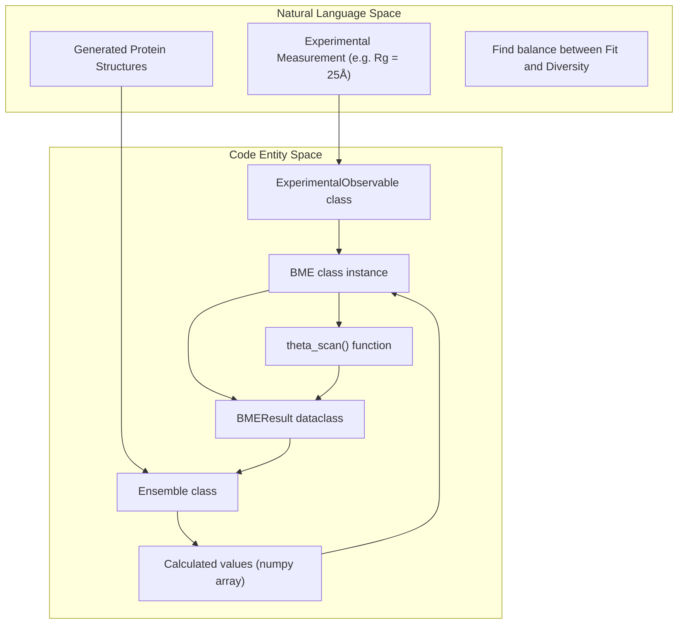
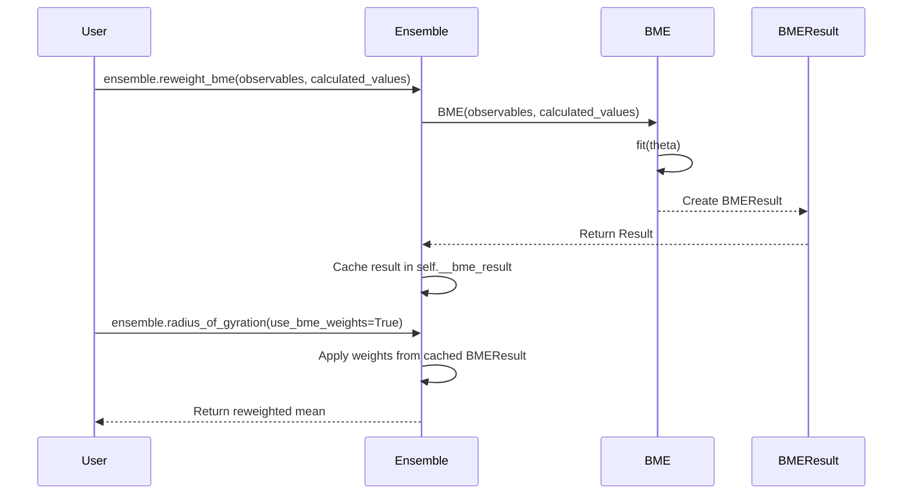

# BME Reweighting

> **Relevant source files**
> * [.gitignore](https://github.com/idptools/starling/blob/4b98d2fe/.gitignore)
> * [demos/bme_reweighting_example.ipynb](https://github.com/idptools/starling/blob/4b98d2fe/demos/bme_reweighting_example.ipynb)
> * [demos/theta_scan_rg.pdf](https://github.com/idptools/starling/blob/4b98d2fe/demos/theta_scan_rg.pdf)
> * [demos/theta_scan_rg.png](https://github.com/idptools/starling/blob/4b98d2fe/demos/theta_scan_rg.png)
> * [docs/usage/possible_issues.rst](https://github.com/idptools/starling/blob/4b98d2fe/docs/usage/possible_issues.rst)
> * [starling/inference/__init__.py](https://github.com/idptools/starling/blob/4b98d2fe/starling/inference/__init__.py)
> * [starling/structure/bme.py](https://github.com/idptools/starling/blob/4b98d2fe/starling/structure/bme.py)
> * [starling/structure/bme_utils.py](https://github.com/idptools/starling/blob/4b98d2fe/starling/structure/bme_utils.py)
> * [starling/structure/ensemble.py](https://github.com/idptools/starling/blob/4b98d2fe/starling/structure/ensemble.py)

Bayesian Maximum Entropy (BME) reweighting is a statistical framework used to refine structural ensembles by integrating experimental data. In STARLING, this is implemented as a post-processing step that adjusts the statistical weights of generated conformations to match experimental observables (e.g., Radius of Gyration, FRET, NMR) while minimizing the information-theoretic bias introduced to the original ensemble [starling/structure/bme.py L1-L10](https://github.com/idptools/starling/blob/4b98d2fe/starling/structure/bme.py#L1-L10)

The implementation allows for equality constraints, as well as upper and lower bounds, providing a principled way to balance experimental fitting with the preservation of ensemble diversity [starling/structure/bme.py L58-L74](https://github.com/idptools/starling/blob/4b98d2fe/starling/structure/bme.py#L58-L74)

## System Overview and Data Flow

The BME workflow typically starts with a generated `Ensemble` object. Observables are calculated for every frame in the ensemble, and these are compared against `ExperimentalObservable` targets to produce a `BMEResult` containing optimized weights.

### Conceptual to Code Mapping

| Concept | Code Entity | Role |
| --- | --- | --- |
| **Target Data** | `ExperimentalObservable` | Stores experimental value, uncertainty, and constraint type [starling/structure/bme_utils.py L24-L47](https://github.com/idptools/starling/blob/4b98d2fe/starling/structure/bme_utils.py#L24-L47) |
| **Optimization Engine** | `BME` | Performs the L-BFGS-B optimization of Lagrange multipliers [starling/structure/bme.py L108-L130](https://github.com/idptools/starling/blob/4b98d2fe/starling/structure/bme.py#L108-L130) |
| **Reweighting Logic** | `Ensemble.reweight_bme()` | High-level API to perform reweighting and cache results [starling/structure/ensemble.py L488-L540](https://github.com/idptools/starling/blob/4b98d2fe/starling/structure/ensemble.py#L488-L540) |
| **Selection Strategy** | `theta_scan` | Automates selection of the $\theta$ regularization parameter via L-curve analysis [starling/structure/bme_utils.py L270-L350](https://github.com/idptools/starling/blob/4b98d2fe/starling/structure/bme_utils.py#L270-L350) |
| **Output Container** | `BMEResult` | Holds optimized weights, final $\chi^2$, and diagnostic metrics [starling/structure/bme_utils.py L91-L110](https://github.com/idptools/starling/blob/4b98d2fe/starling/structure/bme_utils.py#L91-L110) |

**Sources:** [starling/structure/bme.py L12-L22](https://github.com/idptools/starling/blob/4b98d2fe/starling/structure/bme.py#L12-L22)

 [starling/structure/ensemble.py L110-L112](https://github.com/idptools/starling/blob/4b98d2fe/starling/structure/ensemble.py#L110-L112)

### BME Data Flow Diagram



**Sources:** [starling/structure/bme.py L31-L48](https://github.com/idptools/starling/blob/4b98d2fe/starling/structure/bme.py#L31-L48)

 [starling/structure/bme_utils.py L270-L285](https://github.com/idptools/starling/blob/4b98d2fe/starling/structure/bme_utils.py#L270-L285)

---

## Key Components

### ExperimentalObservable

This dataclass encapsulates a single experimental constraint. It supports three types of constraints defined in `VALID_CONSTRAINTS`: `"equality"`, `"upper"`, and `"lower"` [starling/structure/bme_utils.py L18](https://github.com/idptools/starling/blob/4b98d2fe/starling/structure/bme_utils.py#L18-L18)

* **Equality**: The ensemble average must match the value within the specified uncertainty.
* **Upper/Lower**: Enforces bounds on the ensemble average. The implementation uses specific Lagrange multiplier bounds to enforce these: `(0.0, None)` for upper and `(None, 0.0)` for lower [starling/structure/bme_utils.py L82-L85](https://github.com/idptools/starling/blob/4b98d2fe/starling/structure/bme_utils.py#L82-L85)

**Sources:** [starling/structure/bme_utils.py L24-L47](https://github.com/idptools/starling/blob/4b98d2fe/starling/structure/bme_utils.py#L24-L47)

### The BME Class

The `BME` class handles the core optimization logic. It minimizes a global objective function:
$$\mathcal{L}(\lambda) = \theta \Gamma(\lambda) + \chi^2(\lambda)$$
where $\Gamma$ is related to the partition function and $\theta$ is the regularization parameter [starling/structure/bme.py L214-L230](https://github.com/idptools/starling/blob/4b98d2fe/starling/structure/bme.py#L214-L230)

* **Initialization**: Sets up initial weights (uniform by default) and randomizes Lagrange multipliers ($\lambda$) [starling/structure/bme.py L143-L151](https://github.com/idptools/starling/blob/4b98d2fe/starling/structure/bme.py#L143-L151)
* **fit()**: Uses `scipy.optimize.minimize` with the `L-BFGS-B` method to find optimal $\lambda$ values [starling/structure/bme.py L290-L310](https://github.com/idptools/starling/blob/4b98d2fe/starling/structure/bme.py#L290-L310)
* **phi ($\phi$)**: A key metric representing the "effective fraction" of the ensemble remaining after reweighting, calculated as $\exp(-D_{KL})$ [starling/structure/bme_utils.py L126-L133](https://github.com/idptools/starling/blob/4b98d2fe/starling/structure/bme_utils.py#L126-L133)

**Sources:** [starling/structure/bme.py L108-L160](https://github.com/idptools/starling/blob/4b98d2fe/starling/structure/bme.py#L108-L160)

 [starling/structure/bme_utils.py L11-L15](https://github.com/idptools/starling/blob/4b98d2fe/starling/structure/bme_utils.py#L11-L15)

### Theta ($\theta$) Regularization and L-curve

The parameter `theta` controls the trade-off between fitting experimental data (low $\theta$) and staying close to the original ensemble (high $\theta$).

The `theta_scan` function automates the selection of an optimal $\theta$ by:

1. Performing reweighting across a range of $\theta$ values [starling/structure/bme_utils.py L290-L310](https://github.com/idptools/starling/blob/4b98d2fe/starling/structure/bme_utils.py#L290-L310)
2. Plotting the "L-curve": $\chi^2$ vs. $\phi$ (or $D_{KL}$) [starling/structure/bme_utils.py L350-L380](https://github.com/idptools/starling/blob/4b98d2fe/starling/structure/bme_utils.py#L350-L380)
3. Identifying the "elbow" of the curve where further fitting leads to a drastic loss in ensemble diversity [starling/structure/bme_utils.py L315-L325](https://github.com/idptools/starling/blob/4b98d2fe/starling/structure/bme_utils.py#L315-L325)

**Sources:** [starling/structure/bme_utils.py L270-L350](https://github.com/idptools/starling/blob/4b98d2fe/starling/structure/bme_utils.py#L270-L350)

---

## Integration with Ensemble

The `Ensemble` class provides the primary interface for BME via the `reweight_bme` method.

### Workflow Diagram



**Sources:** [starling/structure/ensemble.py L488-L540](https://github.com/idptools/starling/blob/4b98d2fe/starling/structure/ensemble.py#L488-L540)

 [starling/structure/ensemble.py L110-L112](https://github.com/idptools/starling/blob/4b98d2fe/starling/structure/ensemble.py#L110-L112)

### Diagnostics and Quality Control

The `BMEResult.diagnostics()` method provides critical feedback on the reweighting quality [starling/structure/bme_utils.py L137-L180](https://github.com/idptools/starling/blob/4b98d2fe/starling/structure/bme_utils.py#L137-L180)

:

* **neff_entropy**: The effective sample size based on Shannon entropy ($N \cdot \phi$).
* **neff_renyi2**: A more conservative effective sample size based on the participation ratio ($1 / \sum w_i^2$).
* **chi2_improvement**: The percentage reduction in $\chi^2$ error.
* **Warnings**: Triggered if $\phi$ drops below a threshold (default 0.5), indicating potential overfitting or a poor initial ensemble [starling/structure/bme_utils.py L200-L210](https://github.com/idptools/starling/blob/4b98d2fe/starling/structure/bme_utils.py#L200-L210)

**Sources:** [starling/structure/bme_utils.py L137-L210](https://github.com/idptools/starling/blob/4b98d2fe/starling/structure/bme_utils.py#L137-L210)

---

## Implementation Details

### Objective Function

The optimization minimizes the log-partition function like objective:

```python
# Simplified logic from BME._objective_functiondef objective(lambdas):    # Calculate weights for current lambdas    log_w = log_initial_w - (calculated_values @ lambdas) / theta    log_z = logsumexp(log_w)        # Calculate chi-squared    current_means = weights @ calculated_values    chi2 = sum(((current_means - exp_values) / uncertainties)**2)        return theta * log_z + 0.5 * chi2
```

**Sources:** [starling/structure/bme.py L214-L265](https://github.com/idptools/starling/blob/4b98d2fe/starling/structure/bme.py#L214-L265)

### Constraints Handling

During `fit()`, the `L-BFGS-B` optimizer respects the bounds provided by `ExperimentalObservable.get_bounds()`. This ensures that for an "upper" constraint, the Lagrange multiplier remains positive, only allowing the optimizer to penalize (push down) values that exceed the target [starling/structure/bme_utils.py L71-L86](https://github.com/idptools/starling/blob/4b98d2fe/starling/structure/bme_utils.py#L71-L86)

**Sources:** [starling/structure/bme.py L300-L305](https://github.com/idptools/starling/blob/4b98d2fe/starling/structure/bme.py#L300-L305)