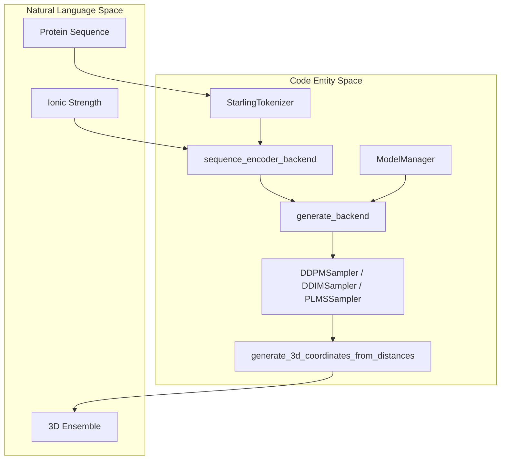
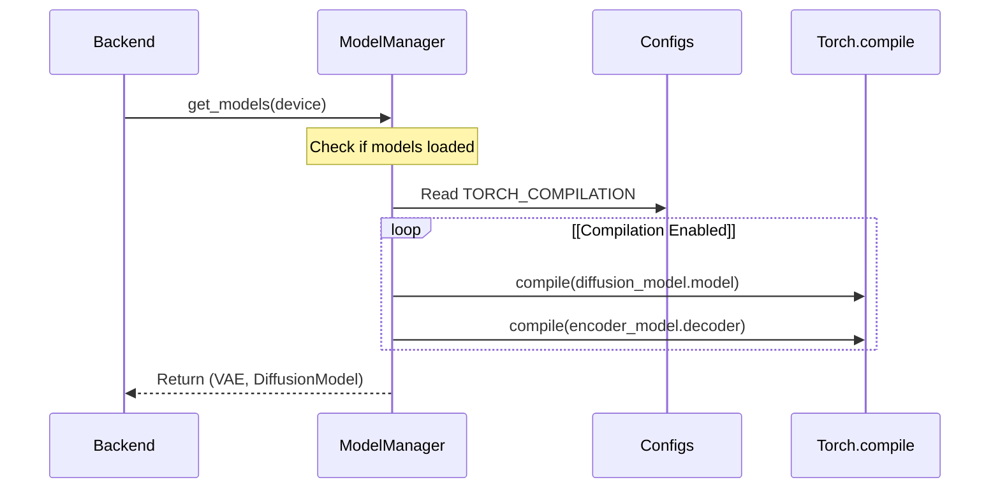

# Backend Generation: generate\_backend and sequence\_encoder\_backend

> **Relevant source files**
> - [hubconf\.py](https://github.com/idptools/starling/blob/4b98d2fe/hubconf.py)
> - [starling/data/ddpm\_loader\_tar\.py](https://github.com/idptools/starling/blob/4b98d2fe/starling/data/ddpm_loader_tar.py)
> - [starling/inference/generation\.py](https://github.com/idptools/starling/blob/4b98d2fe/starling/inference/generation.py)
> - [starling/inference/model\_loading\.py](https://github.com/idptools/starling/blob/4b98d2fe/starling/inference/model_loading.py)

 The backend generation layer in STARLING serves as the bridge between the high\-level API and the neural network components\. It manages the lifecycle of model inference, including sequence batching, latent space diffusion, and the final 3D reconstruction of protein ensembles\.

## System Overview and Data Flow

 The backend logic is primarily housed in `starling/inference/generation.py`\. It orchestrates the flow from raw sequences to 3D coordinates using a multi\-step pipeline: tokenization, embedding generation via the `SequenceEncoder`, sampling in latent space via the `DiffusionModel`, and decoding via the `VAE` decoder\.

### Sequence to Ensemble Flow

 The following diagram illustrates how high\-level system components map to specific code entities during the generation process\.

| Diagram: Backend Generation Entity Mapping |
| --- |

 **Sources:** [generation\.py L64-L79](https://github.com/idptools/starling/blob/4b98d2fe/starling/inference/generation.py#L64-L79) [generation\.py L214-L239](https://github.com/idptools/starling/blob/4b98d2fe/starling/inference/generation.py#L214-L239) [model\_loading\.py L16-L20](https://github.com/idptools/starling/blob/4b98d2fe/starling/inference/model_loading.py#L16-L20)

---

## Sequence Encoder Backend

 The `sequence_encoder_backend` function is responsible for transforming protein sequences into the high\-dimensional embeddings required by the diffusion model's cross\-attention mechanism [generation\.py L64-L79](https://github.com/idptools/starling/blob/4b98d2fe/starling/inference/generation.py#L64-L79)

### Key Features

 1. **Bucketing:** To minimize computational waste from padding, sequences can be grouped into length buckets \(defined by `bucket_size`\) [generation\.py L104-L109](https://github.com/idptools/starling/blob/4b98d2fe/starling/inference/generation.py#L104-L109)
2. **Tokenization:** Converts string sequences into integer tokens using the `StarlingTokenizer` unless `pretokenized` is set to `True` [generation\.py L123-L149](https://github.com/idptools/starling/blob/4b98d2fe/starling/inference/generation.py#L123-L149)
3. **Conditioning:** The `ionic_strength` is injected as a conditioning variable, converted to a tensor and broadcast across the batch [generation\.py L128](https://github.com/idptools/starling/blob/4b98d2fe/starling/inference/generation.py#L128-L128)
4. **Memory Management:** If `free_cuda_cache` is enabled, `torch.cuda.empty_cache()` is called after each batch to prevent fragmentation [generation\.py L110-L111](https://github.com/idptools/starling/blob/4b98d2fe/starling/inference/generation.py#L110-L111)

 **Sources:** [generation\.py L64-L122](https://github.com/idptools/starling/blob/4b98d2fe/starling/inference/generation.py#L64-L122) [generation\.py L152-L162](https://github.com/idptools/starling/blob/4b98d2fe/starling/inference/generation.py#L152-L162)

---

## Generate Backend

 The `generate_backend` function is the core execution loop for ensemble generation\. It coordinates the diffusion sampling process and the subsequent decoding of latent representations into distance maps [generation\.py L214-L239](https://github.com/idptools/starling/blob/4b98d2fe/starling/inference/generation.py#L214-L239)

### The Sampling Loop

 The function selects a sampler \(DDPM, DDIM, or PLMS\) and iterates through the reverse diffusion process\. The `ModelManager` provides the `DiffusionModel` and `VAE` instances [generation\.py L261-L285](https://github.com/idptools/starling/blob/4b98d2fe/starling/inference/generation.py#L261-L285)

| Stage | Action | Code Reference |
| --- | --- | --- |
| Initialization | Load models and prepare noise tensors | starling/inference/generation\.py261\-300 |
| Diffusion | Run p\_sample\_loop to generate latents | starling/inference/generation\.py330\-345 |
| Decoding | Pass latents through VAE\.decoder | starling/inference/generation\.py375\-385 |
| Post\-processing | Symmetrize maps and reconstruct 3D coords | starling/inference/generation\.py400\-420 |

### Symmetrization and Reconstruction

 Because the VAE decoder outputs a raw tensor, the backend applies `symmetrize_distance_map` to ensure the distance matrix is physically consistent \(replacing the lower triangle with the upper triangle and zeroing the diagonal\) [generation\.py L29-L61](https://github.com/idptools/starling/blob/4b98d2fe/starling/inference/generation.py#L29-L61)

 Finally, the `generate_3d_coordinates_from_distances` function uses Multidimensional Scaling \(MDS\) to convert the predicted inter\-residue distances into Cartesian coordinates [generation\.py L17-L20](https://github.com/idptools/starling/blob/4b98d2fe/starling/inference/generation.py#L17-L20)

 **Sources:** [generation\.py L214-L450](https://github.com/idptools/starling/blob/4b98d2fe/starling/inference/generation.py#L214-L450) [generation\.py L29-L61](https://github.com/idptools/starling/blob/4b98d2fe/starling/inference/generation.py#L29-L61)

---

## Model Management and Compilation

 The `ModelManager` singleton handles the lazy loading of weights and model compilation\.

| Diagram: Model Lifecycle and Compilation |
| --- |

 **Sources:** [model\_loading\.py L63-L100](https://github.com/idptools/starling/blob/4b98d2fe/starling/inference/model_loading.py#L63-L100) [model\_loading\.py L102-L130](https://github.com/idptools/starling/blob/4b98d2fe/starling/inference/model_loading.py#L102-L130)

### torch\.compile Integration

 STARLING supports PyTorch 2\.x compilation to accelerate inference\. The `ModelManager.compile()` method targets the `diffusion_model.model` \(the ViT backbone\) and the `encoder_model.decoder` [model\_loading\.py L109-L114](https://github.com/idptools/starling/blob/4b98d2fe/starling/inference/model_loading.py#L109-L114) This is a one\-time operation that significantly reduces the runtime of the diffusion sampling loop\.

 **Sources:** [model\_loading\.py L102-L130](https://github.com/idptools/starling/blob/4b98d2fe/starling/inference/model_loading.py#L102-L130) [configs\.py L1-L20](https://github.com/idptools/starling/blob/4b98d2fe/starling/configs.py#L1-L20)

---

## Memory and Resource Management

 Generating large ensembles is memory\-intensive\. The backend implements several strategies to maintain stability:

 - **GC Collection:** Explicit calls to `gc.collect()` and `torch.cuda.empty_cache()` are made between major stages [generation\.py L1-L4](https://github.com/idptools/starling/blob/4b98d2fe/starling/inference/generation.py#L1-L4)
- **Return Data Flag:** The `return_data` flag allows the backend to return an `Ensemble` object directly or persist results to disk to save RAM [generation\.py L236-L238](https://github.com/idptools/starling/blob/4b98d2fe/starling/inference/generation.py#L236-L238)
- **CPU Offloading:** The `return_on_cpu` parameter in `sequence_encoder_backend` ensures that large embedding dictionaries are stored in system RAM rather than GPU VRAM [generation\.py L112-L115](https://github.com/idptools/starling/blob/4b98d2fe/starling/inference/generation.py#L112-L115)

 **Sources:** [generation\.py L110-L115](https://github.com/idptools/starling/blob/4b98d2fe/starling/inference/generation.py#L110-L115) [generation\.py L430-L450](https://github.com/idptools/starling/blob/4b98d2fe/starling/inference/generation.py#L430-L450)

