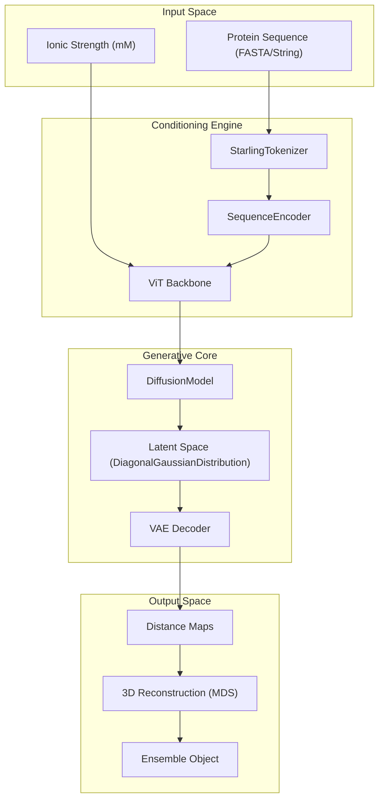
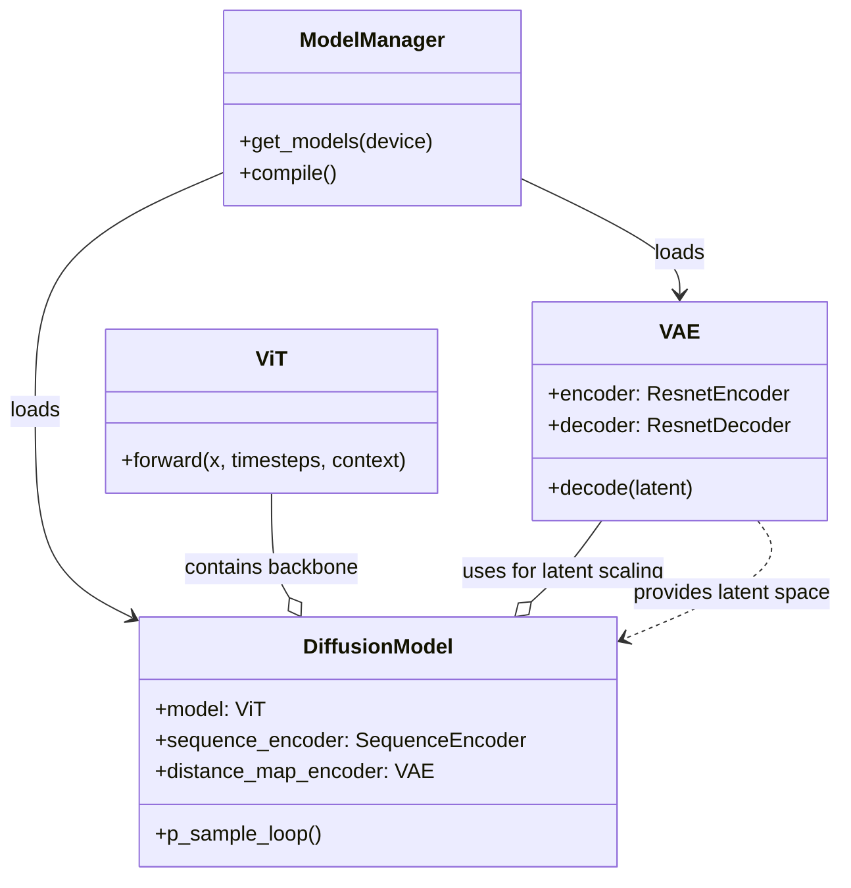

# Core Architecture

> **Relevant source files**
> * [hubconf.py](https://github.com/idptools/starling/blob/4b98d2fe/hubconf.py)
> * [starling/configs/vae_model/model.yaml](https://github.com/idptools/starling/blob/4b98d2fe/starling/configs/vae_model/model.yaml)
> * [starling/data/ddpm_loader_tar.py](https://github.com/idptools/starling/blob/4b98d2fe/starling/data/ddpm_loader_tar.py)
> * [starling/inference/model_loading.py](https://github.com/idptools/starling/blob/4b98d2fe/starling/inference/model_loading.py)
> * [starling/models/diffusion.py](https://github.com/idptools/starling/blob/4b98d2fe/starling/models/diffusion.py)
> * [starling/models/vae.py](https://github.com/idptools/starling/blob/4b98d2fe/starling/models/vae.py)
> * [starling/training/diffusion_train.py](https://github.com/idptools/starling/blob/4b98d2fe/starling/training/diffusion_train.py)

STARLING employs a two-stage generative pipeline to transform amino acid sequences into structural ensembles. The architecture decouples the learning of the protein conformational manifold from the sequence-specific conditioning logic.

1. **Stage 1: Variational Autoencoder (VAE)** — Compresses high-dimensional inter-residue distance maps into a low-dimensional latent space.
2. **Stage 2: Latent Diffusion Model (DDPM)** — Learns to generate these latent representations conditioned on protein sequences and environmental factors like ionic strength.

### System Overview and Data Flow

The following diagram illustrates the flow from a sequence input to the final ensemble generation, mapping high-level concepts to the internal code entities.

**Pipeline Data Flow**

**Sources:** [starling/models/diffusion.py L55-L188](https://github.com/idptools/starling/blob/4b98d2fe/starling/models/diffusion.py#L55-L188)

 [starling/models/vae.py L86-L151](https://github.com/idptools/starling/blob/4b98d2fe/starling/models/vae.py#L86-L151)

 [starling/inference/model_loading.py L48-L61](https://github.com/idptools/starling/blob/4b98d2fe/starling/inference/model_loading.py#L48-L61)

---

### 1. Variational Autoencoder (VAE)

The VAE serves as the foundation of the pipeline, responsible for manifold learning. It encodes inter-residue distance maps into a compressed latent representation, significantly reducing the dimensionality for the diffusion process.

* **Architecture:** Built using a ResNet-based encoder and decoder [starling/models/vae.py L157-L166](https://github.com/idptools/starling/blob/4b98d2fe/starling/models/vae.py#L157-L166)
* **Latent Space:** Parameterized via a `DiagonalGaussianDistribution` [starling/models/vae.py L15](https://github.com/idptools/starling/blob/4b98d2fe/starling/models/vae.py#L15-L15)
* **Loss Function:** Optimized using the Evidence Lower Bound (ELBO), combining reconstruction loss (MSE or NLL) with KLD regularization [starling/models/vae.py L108-L114](https://github.com/idptools/starling/blob/4b98d2fe/starling/models/vae.py#L108-L114)
* **Scheduling:** Features a `KLDWeightScheduler` to manage KLD warmup and cyclical annealing during training [starling/models/vae.py L21-L84](https://github.com/idptools/starling/blob/4b98d2fe/starling/models/vae.py#L21-L84)

For a detailed breakdown of the ResNet components and masking strategies, see [Variational Autoencoder (VAE)](/idptools/starling/2.1-variational-autoencoder-(vae)).

**Sources:** [starling/models/vae.py L86-L151](https://github.com/idptools/starling/blob/4b98d2fe/starling/models/vae.py#L86-L151)

 [starling/configs/vae_model/model.yaml L1-L17](https://github.com/idptools/starling/blob/4b98d2fe/starling/configs/vae_model/model.yaml#L1-L17)

---

### 2. Diffusion Model (DDPM)

The `DiffusionModel` performs the generative task within the VAE's latent space. It is a discrete-time denoising probabilistic model that learns to reverse a Gaussian noise process.

* **Backbone:** Uses a Vision Transformer (`ViT`) to predict noise at each timestep [starling/models/diffusion.py L135](https://github.com/idptools/starling/blob/4b98d2fe/starling/models/diffusion.py#L135-L135)
* **Conditioning:** Integrates sequence information via a `SequenceEncoder` and environmental variables (ionic strength) [starling/models/diffusion.py L136-L137](https://github.com/idptools/starling/blob/4b98d2fe/starling/models/diffusion.py#L136-L137)
* **Training Objective:** Implements standard diffusion loss with optional Min-SNR weighting for improved convergence [starling/models/diffusion.py L79-L80](https://github.com/idptools/starling/blob/4b98d2fe/starling/models/diffusion.py#L79-L80)
* **Scaling:** Automatically calculates a `latent_space_scaling_factor` to normalize the VAE latent space to unit variance, ensuring stable diffusion training [starling/models/diffusion.py L158-L160](https://github.com/idptools/starling/blob/4b98d2fe/starling/models/diffusion.py#L158-L160)

For details on the forward/reverse process and transformer conditioning, see [Diffusion Model (DDPM)](/idptools/starling/2.2-diffusion-model-(ddpm)).

**Sources:** [starling/models/diffusion.py L55-L188](https://github.com/idptools/starling/blob/4b98d2fe/starling/models/diffusion.py#L55-L188)

 [starling/training/diffusion_train.py L81-L112](https://github.com/idptools/starling/blob/4b98d2fe/starling/training/diffusion_train.py#L81-L112)

---

### 3. Model Loading and Infrastructure

The system uses a centralized management approach to handle the complexities of multi-model inference and hardware acceleration.

* **ModelManager:** A singleton class that handles lazy loading of weights from local paths or remote URLs [starling/inference/model_loading.py L16-L100](https://github.com/idptools/starling/blob/4b98d2fe/starling/inference/model_loading.py#L16-L100)
* **Torch Compilation:** Supports `torch.compile` for both the `DiffusionModel` backbone and the `VAE` decoder to accelerate inference [starling/inference/model_loading.py L102-L130](https://github.com/idptools/starling/blob/4b98d2fe/starling/inference/model_loading.py#L102-L130)
* **PyTorch Hub:** Provides a standard entrypoint in `hubconf.py` for easy integration into external workflows [hubconf.py L6-L18](https://github.com/idptools/starling/blob/4b98d2fe/hubconf.py#L6-L18)

For information on weight management and compilation settings, see [Model Loading and Inference Infrastructure](/idptools/starling/2.3-model-loading-and-inference-infrastructure).

**Sources:** [starling/inference/model_loading.py L1-L130](https://github.com/idptools/starling/blob/4b98d2fe/starling/inference/model_loading.py#L1-L130)

 [hubconf.py L1-L18](https://github.com/idptools/starling/blob/4b98d2fe/hubconf.py#L1-L18)

---

### Model Relationship Diagram

This diagram shows how the core classes interact during the inference lifecycle.

**Sources:** [starling/inference/model_loading.py L48-L61](https://github.com/idptools/starling/blob/4b98d2fe/starling/inference/model_loading.py#L48-L61)

 [starling/models/diffusion.py L135-L144](https://github.com/idptools/starling/blob/4b98d2fe/starling/models/diffusion.py#L135-L144)

 [starling/models/vae.py L157-L166](https://github.com/idptools/starling/blob/4b98d2fe/starling/models/vae.py#L157-L166)