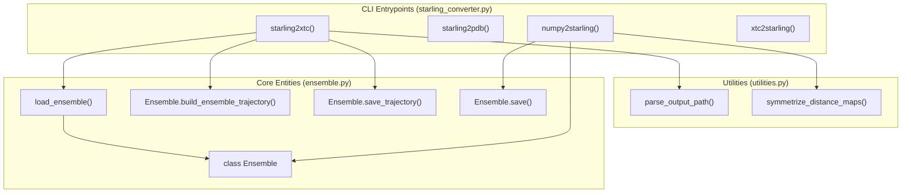
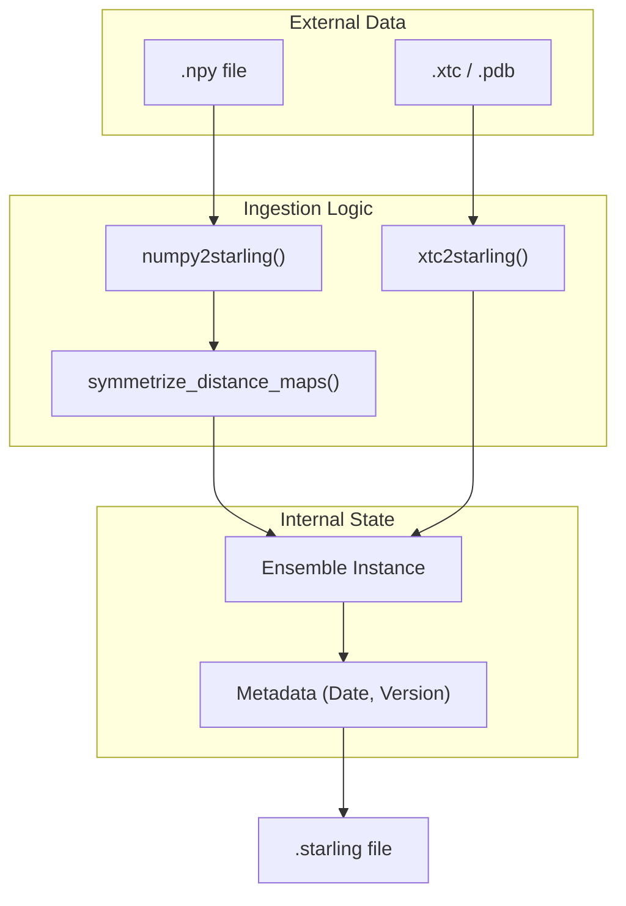

# Data Conversion CLI: starling\-converter Tools

> **Relevant source files**
> - [starling/scripts/starling\_converter\.py](https://github.com/idptools/starling/blob/4b98d2fe/starling/scripts/starling_converter.py)
> - [starling/structure/ensemble\.py](https://github.com/idptools/starling/blob/4b98d2fe/starling/structure/ensemble.py)
> - [starling/utilities\.py](https://github.com/idptools/starling/blob/4b98d2fe/starling/utilities.py)

 The `starling-converter` suite provides a comprehensive set of command\-line utilities for transforming STARLING ensemble data between various formats\. These tools follow a consistent **Load\-Transform\-Save** pattern, leveraging the `Ensemble` class for data manipulation and `soursop` for structural trajectory handling\.

## Overview of Entrypoints

 All conversion tools are defined in `starling/scripts/starling_converter.py` and are typically exposed as CLI commands after installation\.

| Command | Input | Output | Description |
| --- | --- | --- | --- |
| starling2xtc | \.starling | \.xtc \+ \.pdb | Generates 3D coordinates and saves as GROMACS trajectory\. |
| starling2pdb | \.starling | \.pdb | Generates 3D coordinates and saves as a multi\-model PDB\. |
| starling2numpy | \.starling | \.npy | Extracts distance maps as a raw NumPy array\. |
| starling2sequence | \.starling | stdout | Prints the amino acid sequence to the terminal\. |
| starling2info | \.starling | stdout | Prints metadata \(version, date, weights used, mean Rg\)\. |
| starling2starling | \.starling | \.starling | Performs error checking and filtering on an existing ensemble\. |
| numpy2starling | \.npy \+ seq | \.starling | Wraps raw distance maps into a STARLING ensemble object\. |
| xtc2starling | \.xtc \+ \.pdb | \.starling | Converts a coordinate trajectory back into distance maps\. |

 **Sources:**

 - `starling/scripts/starling_converter.py:14-306`\(\)

---

## Load\-Transform\-Save Pattern

 The converters follow a unified execution flow\. The system first parses the output path using `parse_output_path` [utilities\.py L89-L123](https://github.com/idptools/starling/blob/4b98d2fe/starling/utilities.py#L89-L123), then loads the data into an `Ensemble` object [ensemble\.py L42-L130](https://github.com/idptools/starling/blob/4b98d2fe/starling/structure/ensemble.py#L42-L130), performs requested transformations \(like 3D reconstruction\), and finally serializes the result\.

### Code Entity Space: Conversion Logic Flow

 The following diagram illustrates how the CLI functions map to the underlying `Ensemble` methods and utility functions\.

 **Sources:**

 - `starling/scripts/starling_converter.py:14-63`\(\)
- `starling/scripts/starling_converter.py:228-268`\(\)
- `starling/structure/ensemble.py:536-574`\(\)
- `starling/utilities.py:89-123`\(\)

---

## Structural Reconstruction \(starling2xtc / starling2pdb\)

 When converting to coordinate\-based formats \(`.xtc` or `.pdb`\), the tools check if 3D coordinates are already present\. If not, they trigger the MDS\-based reconstruction via `build_ensemble_trajectory` [ensemble\.py L536-L574](https://github.com/idptools/starling/blob/4b98d2fe/starling/structure/ensemble.py#L536-L574)\.

### Error Checking Workflow

 Both `starling2xtc` and `starling2pdb` support the `--remove-errors` flag\. This invokes `check_for_errors_trajectory` [ensemble\.py L246-L302](https://github.com/idptools/starling/blob/4b98d2fe/starling/structure/ensemble.py#L246-L302), which scans the generated coordinates for physical impossibilities \(e\.g\., $C\\alpha\-C\\alpha$ distances $< 2\.0$ Å or $\> 5\.0$ Å for adjacent residues\)\.

 **Key Implementation Details:**

 1. **Device Selection:** Users can specify `--device` \(cpu, cuda, mps\) to accelerate the MDS reconstruction process [starling\_converter\.py L33-L37](https://github.com/idptools/starling/blob/4b98d2fe/starling/scripts/starling_converter.py#L33-L37)\.
2. **Topology:** A $C\\alpha$\-only topology is automatically generated using `create_ca_topology_from_coords` [coordinates\.py L36-L39](https://github.com/idptools/starling/blob/4b98d2fe/starling/structure/coordinates.py#L36-L39)\.
3. **Persistence:** Data is saved using `Ensemble.save_trajectory`, which utilizes `soursop.sstrajectory.SSTrajectory` for writing binary formats [ensemble\.py L586-L639](https://github.com/idptools/starling/blob/4b98d2fe/starling/structure/ensemble.py#L586-L639)\.

 **Sources:**

 - `starling/scripts/starling_converter.py:14-112`\(\)
- `starling/structure/ensemble.py:246-302`\(\)
- `starling/structure/ensemble.py:536-574`\(\)

---

## Data Flow: numpy2starling and xtc2starling

 These tools allow external data \(from MD simulations or other models\) to be imported into the STARLING ecosystem for analysis or search indexing\.

### numpy2starling

 This tool takes a `.npy` file containing distance maps and a sequence string\.

 - It ensures maps are symmetrized using `symmetrize_distance_maps` [utilities\.py L10](https://github.com/idptools/starling/blob/4b98d2fe/starling/utilities.py#L10-L10)\.
- It validates that the sequence length matches the matrix dimensions [ensemble\.py L157-L165](https://github.com/idptools/starling/blob/4b98d2fe/starling/structure/ensemble.py#L157-L165)\.
- It produces a compressed `.starling` file \(using `pickle` and `lzma`\) [ensemble\.py L511-L534](https://github.com/idptools/starling/blob/4b98d2fe/starling/structure/ensemble.py#L511-L534)\.

### xtc2starling

 This tool extracts distance maps from a 3D trajectory\.

 - It uses `soursop.sstrajectory.SSTrajectory` to load the `.xtc` and `.pdb` topology [starling\_converter\.py L288-L290](https://github.com/idptools/starling/blob/4b98d2fe/starling/scripts/starling_converter.py#L288-L290)\.
- It calculates pairwise $C\\alpha$ distances for every frame\.
- The resulting distance maps are stored in a new `Ensemble` object\.

### System Mapping: Data Ingestion

 **Sources:**

 - `starling/scripts/starling_converter.py:228-306`\(\)
- `starling/structure/ensemble.py:77-130`\(\)
- `starling/utilities.py:307-331`\(\)

---

## Error Correction: starling2starling

 The `starling2starling` utility is specifically designed for cleaning up "badly behaved" sequences\. It performs a pass over the distance maps to identify frames that cannot be physically reconstructed into 3D space\.

 **Workflow:**

 1. Load the source `.starling` file\.
2. Call `Ensemble.check_for_errors(remove_errors=True)` [ensemble\.py L181-L244](https://github.com/idptools/starling/blob/4b98d2fe/starling/structure/ensemble.py#L181-L244)\.
3. This method checks for: - Adjacent $C\\alpha$ distances outside the $3\.8 \\pm 1\.2$ Å range\. - Non\-adjacent distances that are physically impossible \(steric clashes\)\.
4. Save the pruned ensemble to a new file\.

 **Sources:**

 - `starling/scripts/starling_converter.py:208-225`\(\)
- `starling/structure/ensemble.py:181-244`\(\)
