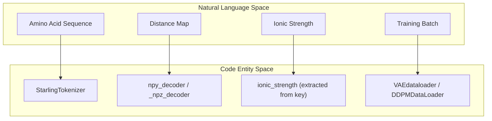
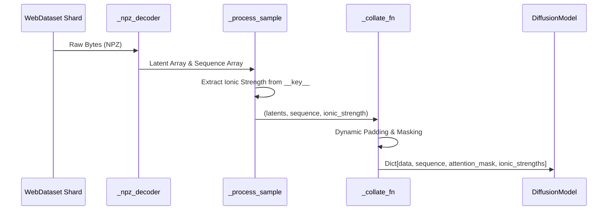

# Data Loading and Preprocessing

> **Relevant source files**
> * [hubconf.py](https://github.com/idptools/starling/blob/4b98d2fe/hubconf.py)
> * [starling/configs/dataloader/vae_dataloader.yaml](https://github.com/idptools/starling/blob/4b98d2fe/starling/configs/dataloader/vae_dataloader.yaml)
> * [starling/data/VAE_loader_tar.py](https://github.com/idptools/starling/blob/4b98d2fe/starling/data/VAE_loader_tar.py)
> * [starling/data/data_wrangler.py](https://github.com/idptools/starling/blob/4b98d2fe/starling/data/data_wrangler.py)
> * [starling/data/ddpm_loader_tar.py](https://github.com/idptools/starling/blob/4b98d2fe/starling/data/ddpm_loader_tar.py)
> * [starling/data/schedulers.py](https://github.com/idptools/starling/blob/4b98d2fe/starling/data/schedulers.py)
> * [starling/data/tokenizer.py](https://github.com/idptools/starling/blob/4b98d2fe/starling/data/tokenizer.py)
> * [starling/inference/model_loading.py](https://github.com/idptools/starling/blob/4b98d2fe/starling/inference/model_loading.py)
> * [starling/models/attention.py](https://github.com/idptools/starling/blob/4b98d2fe/starling/models/attention.py)
> * [starling/models/blocks.py](https://github.com/idptools/starling/blob/4b98d2fe/starling/models/blocks.py)
> * [starling/models/transformer.py](https://github.com/idptools/starling/blob/4b98d2fe/starling/models/transformer.py)
> * [starling/models/vae_components.py](https://github.com/idptools/starling/blob/4b98d2fe/starling/models/vae_components.py)
> * [starling/tests/test_tokenizer.py](https://github.com/idptools/starling/blob/4b98d2fe/starling/tests/test_tokenizer.py)

This page details the infrastructure used for high-performance data loading and preprocessing in STARLING. The system supports two primary training stages: the Variational Autoencoder (VAE) and the Latent Diffusion Model (DDPM). It utilizes `webdataset` for scalable streaming of large-scale protein ensemble data and a specialized tokenizer for amino acid sequences.

## Data Infrastructure Overview

STARLING implements a multi-stage data pipeline that bridges raw protein data (distance maps and sequences) to model-ready tensors. The pipeline is designed to handle massive datasets stored in sharded `.tar` formats or compressed `.h5` files.

### Natural Language to Code Entity Mapping

The following diagram maps high-level data concepts to their specific implementations in the codebase.

**Data Entity Association**

**Sources:** [starling/data/tokenizer.py L1-L47](https://github.com/idptools/starling/blob/4b98d2fe/starling/data/tokenizer.py#L1-L47)

 [starling/data/VAE_loader_tar.py L16-L50](https://github.com/idptools/starling/blob/4b98d2fe/starling/data/VAE_loader_tar.py#L16-L50)

 [starling/data/ddpm_loader_tar.py L20-L56](https://github.com/idptools/starling/blob/4b98d2fe/starling/data/ddpm_loader_tar.py#L20-L56)

## Tokenization and Sequence Handling

The `StarlingTokenizer` is a lightweight, byte-level tokenizer optimized for protein sequences. It maps 20 standard amino acids plus a padding token to integer IDs.

### StarlingTokenizer Implementation

The tokenizer uses `bytearray` translation tables for O(1) encoding and decoding performance [starling/data/tokenizer.py L50-L62](https://github.com/idptools/starling/blob/4b98d2fe/starling/data/tokenizer.py#L50-L62)

* **Vocab:** Maps characters `A, C, D, E, F, G, H, I, K, L, M, N, P, Q, R, S, T, V, W, Y` to IDs `1-20`.
* **Padding:** The character `"0"` and ID `0` are reserved for padding [starling/data/tokenizer.py L25-L47](https://github.com/idptools/starling/blob/4b98d2fe/starling/data/tokenizer.py#L25-L47)
* **Validation:** Unknown characters encountered during `encode` raise a `KeyError` [starling/data/tokenizer.py L71-L74](https://github.com/idptools/starling/blob/4b98d2fe/starling/data/tokenizer.py#L71-L74)
* **Post-processing:** During `decode`, all `0` tokens are automatically stripped to return the original sequence string [starling/data/tokenizer.py L89-L93](https://github.com/idptools/starling/blob/4b98d2fe/starling/data/tokenizer.py#L89-L93)

### Sequence Padding and Masking

In the training pipeline, sequences are dynamically padded to the maximum length within a batch [starling/data/ddpm_loader_tar.py L171-L175](https://github.com/idptools/starling/blob/4b98d2fe/starling/data/ddpm_loader_tar.py#L171-L175)

 An `attention_mask` is generated where `True` indicates a real residue and `False` indicates padding [starling/data/ddpm_loader_tar.py L177-L182](https://github.com/idptools/starling/blob/4b98d2fe/starling/data/ddpm_loader_tar.py#L177-L182)

**Sources:** [starling/data/tokenizer.py L1-L93](https://github.com/idptools/starling/blob/4b98d2fe/starling/data/tokenizer.py#L1-L93)

 [starling/data/ddpm_loader_tar.py L155-L191](https://github.com/idptools/starling/blob/4b98d2fe/starling/data/ddpm_loader_tar.py#L155-L191)

## VAE Data Pipeline

The `VAEdataloader` is responsible for loading distance maps for VAE training. It supports sharded WebDatasets (`.tar`, `.tar.gz`, `.tar.zst`) [starling/data/VAE_loader_tar.py L60-L63](https://github.com/idptools/starling/blob/4b98d2fe/starling/data/VAE_loader_tar.py#L60-L63)

### Ionic Strength and Sequence Filtering

A unique feature of the VAE loader is the `apply_filter` mechanism, which uses an `acceptance_probs.csv` file to rebalance the dataset based on sequence length [starling/data/VAE_loader_tar.py L29-L43](https://github.com/idptools/starling/blob/4b98d2fe/starling/data/VAE_loader_tar.py#L29-L43)

1. **Decoding:** `_npz_decoder` extracts the `array` from `.npz` files [starling/data/VAE_loader_tar.py L127-L136](https://github.com/idptools/starling/blob/4b98d2fe/starling/data/VAE_loader_tar.py#L127-L136)
2. **Filtering:** `_filter_sample` uses a random probability check against the `accept_prob_table` indexed by sequence length [starling/data/VAE_loader_tar.py L113-L125](https://github.com/idptools/starling/blob/4b98d2fe/starling/data/VAE_loader_tar.py#L113-L125)
3. **Batching:** Samples are batched and converted to tensors, typically maintaining a channel dimension `(B, 1, L, L)` [starling/data/VAE_loader_tar.py L144-L148](https://github.com/idptools/starling/blob/4b98d2fe/starling/data/VAE_loader_tar.py#L144-L148)

**Sources:** [starling/data/VAE_loader_tar.py L16-L165](https://github.com/idptools/starling/blob/4b98d2fe/starling/data/VAE_loader_tar.py#L16-L165)

 [starling/configs/dataloader/vae_dataloader.yaml L1-L11](https://github.com/idptools/starling/blob/4b98d2fe/starling/configs/dataloader/vae_dataloader.yaml#L1-L11)

## DDPM Data Pipeline

The `DDPMDataLoader` extends the infrastructure to include conditioning variables required for diffusion, specifically the sequence and ionic strength.

### Data Flow for Diffusion Conditioning

The pipeline extracts the ionic strength from the file metadata (the `__key__` in the WebDataset) and pairs the latent distance map with its corresponding sequence.

**DDPM Data Loading Logic**

**Sources:** [starling/data/ddpm_loader_tar.py L97-L153](https://github.com/idptools/starling/blob/4b98d2fe/starling/data/ddpm_loader_tar.py#L97-L153)

 [starling/data/ddpm_loader_tar.py L155-L191](https://github.com/idptools/starling/blob/4b98d2fe/starling/data/ddpm_loader_tar.py#L155-L191)

### Key Functions

* **`npy_decoder`**: Uses `io.BytesIO` to load numpy arrays directly from webdataset streams [starling/data/ddpm_loader_tar.py L16-L17](https://github.com/idptools/starling/blob/4b98d2fe/starling/data/ddpm_loader_tar.py#L16-L17)
* **`_process_sample`**: Extracts `distance_map.npz` (or latents) and `sequence.npz`, then parses the ionic strength from the filename (e.g., `..._150mM`) [starling/data/ddpm_loader_tar.py L138-L153](https://github.com/idptools/starling/blob/4b98d2fe/starling/data/ddpm_loader_tar.py#L138-L153)
* **`_collate_fn`**: Performs the final tensor conversion and ensures `ionic_strengths` are unsqueezed for the model's MLP conditioning [starling/data/ddpm_loader_tar.py L183](https://github.com/idptools/starling/blob/4b98d2fe/starling/data/ddpm_loader_tar.py#L183-L183)

**Sources:** [starling/data/ddpm_loader_tar.py L16-L191](https://github.com/idptools/starling/blob/4b98d2fe/starling/data/ddpm_loader_tar.py#L16-L191)

## Preprocessing Utilities

The `data_wrangler.py` module provides standalone utilities for manual data manipulation.

| Function | Purpose | Implementation Detail |
| --- | --- | --- |
| `one_hot_encode` | Converts amino acid strings to 3D one-hot tensors | Uses `aa_to_int` mapping [starling/data/data_wrangler.py L9-L55](https://github.com/idptools/starling/blob/4b98d2fe/starling/data/data_wrangler.py#L9-L55) |
| `MaxPad` | Pads 2D distance maps to a fixed square size | Uses `np.pad` with `constant_values=0` [starling/data/data_wrangler.py L58-L80](https://github.com/idptools/starling/blob/4b98d2fe/starling/data/data_wrangler.py#L58-L80) |
| `symmetrize` | Ensures a distance map is perfectly symmetric | Mirrors the upper triangle to the lower triangle [starling/data/data_wrangler.py L128-L141](https://github.com/idptools/starling/blob/4b98d2fe/starling/data/data_wrangler.py#L128-L141) |
| `load_hdf5_compressed` | Efficiently reads specific frames from H5 files | Supports `hdf5plugin` for compressed datasets [starling/data/data_wrangler.py L83-L106](https://github.com/idptools/starling/blob/4b98d2fe/starling/data/data_wrangler.py#L83-L106) |

**Sources:** [starling/data/data_wrangler.py L1-L141](https://github.com/idptools/starling/blob/4b98d2fe/starling/data/data_wrangler.py#L1-L141)