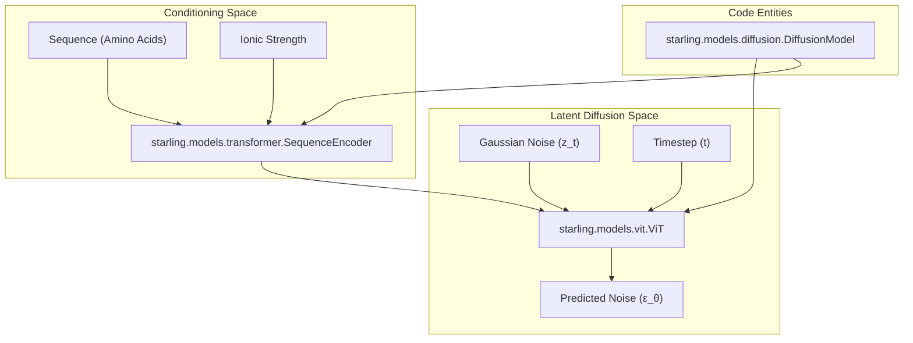
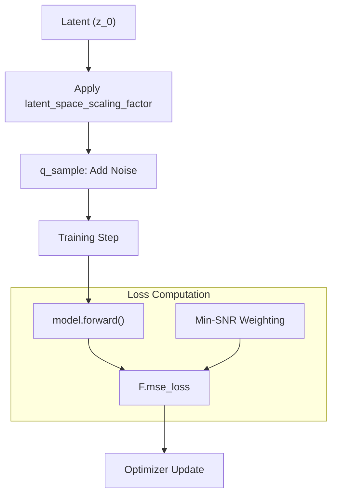

# Diffusion Model (DDPM)

> **Relevant source files**
> * [starling/configs/configs.yaml](https://github.com/idptools/starling/blob/4b98d2fe/starling/configs/configs.yaml)
> * [starling/configs/sequence_encoder/sequence_encoder.yaml](https://github.com/idptools/starling/blob/4b98d2fe/starling/configs/sequence_encoder/sequence_encoder.yaml)
> * [starling/data/data_wrangler.py](https://github.com/idptools/starling/blob/4b98d2fe/starling/data/data_wrangler.py)
> * [starling/models/attention.py](https://github.com/idptools/starling/blob/4b98d2fe/starling/models/attention.py)
> * [starling/models/blocks.py](https://github.com/idptools/starling/blob/4b98d2fe/starling/models/blocks.py)
> * [starling/models/diffusion.py](https://github.com/idptools/starling/blob/4b98d2fe/starling/models/diffusion.py)
> * [starling/models/transformer.py](https://github.com/idptools/starling/blob/4b98d2fe/starling/models/transformer.py)
> * [starling/models/vae_components.py](https://github.com/idptools/starling/blob/4b98d2fe/starling/models/vae_components.py)
> * [starling/models/vit.py](https://github.com/idptools/starling/blob/4b98d2fe/starling/models/vit.py)
> * [starling/training/diffusion_train.py](https://github.com/idptools/starling/blob/4b98d2fe/starling/training/diffusion_train.py)

The Diffusion Model in STARLING is a discrete-time Denoising Diffusion Probabilistic Model (DDPM) that operates within the latent space defined by the [Variational Autoencoder (VAE)](/idptools/starling/2.1-variational-autoencoder-(vae)). It is responsible for generating compressed distance map representations conditioned on protein sequences and environmental factors like ionic strength.

## Overview of the Diffusion Process

The `DiffusionModel` class, implemented in [starling/models/diffusion.py L55-L188](https://github.com/idptools/starling/blob/4b98d2fe/starling/models/diffusion.py#L55-L188)

 manages the transition between noise and structured latent representations. It utilizes a forward process to add noise to VAE latents and a learned reverse process to denoise them, guided by a Vision Transformer (ViT) backbone.

### Forward and Reverse Mathematics

The model supports multiple beta schedules to control the noise injection rate: `linear`, `cosine`, and `sigmoid` [starling/models/diffusion.py L65-L69](https://github.com/idptools/starling/blob/4b98d2fe/starling/models/diffusion.py#L65-L69)

 These schedules populate buffers such as `alphas_cumprod` and `sqrt_one_minus_alphas_cumprod` used during training and sampling [starling/models/diffusion.py L162-L184](https://github.com/idptools/starling/blob/4b98d2fe/starling/models/diffusion.py#L162-L184)

### Latent Space Scaling

To ensure the latent space has unit variance (as recommended in Rombach et al., 2021), the model initializes a `latent_space_scaling_factor` [starling/models/diffusion.py L158-L160](https://github.com/idptools/starling/blob/4b98d2fe/starling/models/diffusion.py#L158-L160)

 During the first training step, this factor is calculated by computing the standard deviation of the initial batch of latents across all distributed ranks [starling/models/diffusion.py L228-L243](https://github.com/idptools/starling/blob/4b98d2fe/starling/models/diffusion.py#L228-L243)

## Architecture and Conditioning

The diffusion process is driven by a `ViT` backbone that processes the latent "images" and is conditioned on sequence information via a `SequenceEncoder`.

### DDPM System Components

The following diagram illustrates the relationship between the core diffusion classes and the data flow.

**DDPM Architecture Flow**

Sources: [starling/models/diffusion.py L135-L137](https://github.com/idptools/starling/blob/4b98d2fe/starling/models/diffusion.py#L135-L137)

 [starling/models/vit.py L31-L95](https://github.com/idptools/starling/blob/4b98d2fe/starling/models/vit.py#L31-L95)

 [starling/models/transformer.py L236-L324](https://github.com/idptools/starling/blob/4b98d2fe/starling/models/transformer.py#L236-L324)

### Vision Transformer (ViT) Backbone

The `ViT` backbone treats the VAE latent as a single-channel image. It uses `PatchEmbed` to divide the latent into patches [starling/models/vit.py L9-L30](https://github.com/idptools/starling/blob/4b98d2fe/starling/models/vit.py#L9-L30)

 and processes them through a series of `DiTBlock` (Diffusion Transformer Blocks) [starling/models/vit.py L76-L79](https://github.com/idptools/starling/blob/4b98d2fe/starling/models/vit.py#L76-L79)

For details, see [Vision Transformer (ViT) Backbone and Transformer Blocks](/idptools/starling/2.2.1-vision-transformer-(vit)-backbone-and-transformer-blocks).

### Sequence and Ionic Strength Conditioning

The `SequenceEncoder` processes protein sequences using a transformer architecture [starling/models/transformer.py L236-L242](https://github.com/idptools/starling/blob/4b98d2fe/starling/models/transformer.py#L236-L242)

* **Ionic Strength**: This is treated as a continuous conditioning variable. It is concatenated with the sequence embeddings or processed through dropout during training to enable classifier-free guidance [starling/models/transformer.py L315-L320](https://github.com/idptools/starling/blob/4b98d2fe/starling/models/transformer.py#L315-L320)
* **Cross-Attention**: The `ViT` backbone interacts with the sequence embeddings through cross-attention layers within each transformer block [starling/models/vit.py L113-L114](https://github.com/idptools/starling/blob/4b98d2fe/starling/models/vit.py#L113-L114)

## Training Objectives

The model is trained to minimize the difference between the added noise and the predicted noise.

### Min-SNR Loss Weighting

To improve training stability and convergence, STARLING implements Min-SNR loss weighting [starling/models/diffusion.py L255-L271](https://github.com/idptools/starling/blob/4b98d2fe/starling/models/diffusion.py#L255-L271)

 This strategy weights the loss at different timesteps based on the Signal-to-Noise Ratio (SNR), capped by a gamma hyperparameter (default 5.0) [starling/models/diffusion.py L80](https://github.com/idptools/starling/blob/4b98d2fe/starling/models/diffusion.py#L80-L80)

### Training Logic Map

This diagram bridges the mathematical objectives to the specific implementation in the training loop.

**DDPM Training Loop Logic**

Sources: [starling/models/diffusion.py L202-L225](https://github.com/idptools/starling/blob/4b98d2fe/starling/models/diffusion.py#L202-L225)

 [starling/models/diffusion.py L255-L276](https://github.com/idptools/starling/blob/4b98d2fe/starling/models/diffusion.py#L255-L276)

## Configuration

The DDPM is configured via `starling/configs/diffusion/diffusion.yaml`. Key parameters include:

* `timesteps`: Total diffusion steps (default 1000) [starling/models/diffusion.py L77](https://github.com/idptools/starling/blob/4b98d2fe/starling/models/diffusion.py#L77-L77)
* `beta_scheduler`: The noise schedule type [starling/models/diffusion.py L76](https://github.com/idptools/starling/blob/4b98d2fe/starling/models/diffusion.py#L76-L76)
* `min_snr_loss`: Boolean flag to enable SNR weighting [starling/models/diffusion.py L79](https://github.com/idptools/starling/blob/4b98d2fe/starling/models/diffusion.py#L79-L79)

For detailed information on the internal transformer blocks and adaptive normalization, see the child page: [Vision Transformer (ViT) Backbone and Transformer Blocks](/idptools/starling/2.2.1-vision-transformer-(vit)-backbone-and-transformer-blocks).

Sources: [starling/models/diffusion.py L55-L280](https://github.com/idptools/starling/blob/4b98d2fe/starling/models/diffusion.py#L55-L280)

 [starling/models/vit.py L31-L122](https://github.com/idptools/starling/blob/4b98d2fe/starling/models/vit.py#L31-L122)

 [starling/models/transformer.py L236-L324](https://github.com/idptools/starling/blob/4b98d2fe/starling/models/transformer.py#L236-L324)

 [starling/training/diffusion_train.py L81-L112](https://github.com/idptools/starling/blob/4b98d2fe/starling/training/diffusion_train.py#L81-L112)