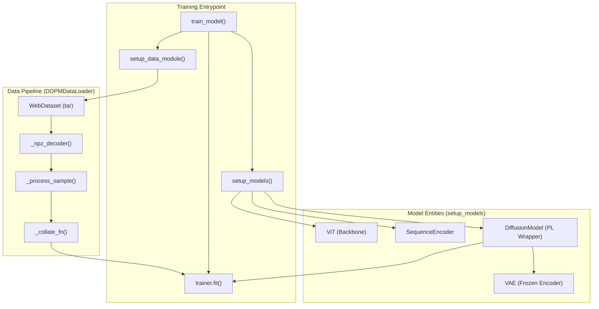
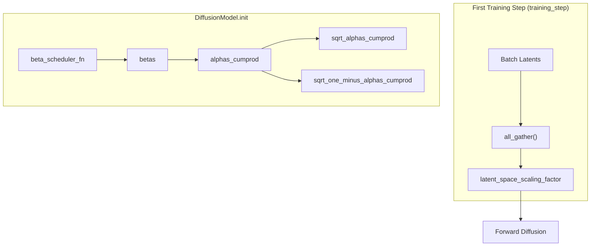

# Diffusion Model Training

> **Relevant source files**
> * [hubconf.py](https://github.com/idptools/starling/blob/4b98d2fe/hubconf.py)
> * [starling/configs/dataloader/dataloader.yaml](https://github.com/idptools/starling/blob/4b98d2fe/starling/configs/dataloader/dataloader.yaml)
> * [starling/configs/diffusion/diffusion.yaml](https://github.com/idptools/starling/blob/4b98d2fe/starling/configs/diffusion/diffusion.yaml)
> * [starling/configs/trainer/trainer.yaml](https://github.com/idptools/starling/blob/4b98d2fe/starling/configs/trainer/trainer.yaml)
> * [starling/data/argument_parser.py](https://github.com/idptools/starling/blob/4b98d2fe/starling/data/argument_parser.py)
> * [starling/data/ddpm_loader_tar.py](https://github.com/idptools/starling/blob/4b98d2fe/starling/data/ddpm_loader_tar.py)
> * [starling/inference/model_loading.py](https://github.com/idptools/starling/blob/4b98d2fe/starling/inference/model_loading.py)
> * [starling/models/diffusion.py](https://github.com/idptools/starling/blob/4b98d2fe/starling/models/diffusion.py)
> * [starling/training/config.yaml](https://github.com/idptools/starling/blob/4b98d2fe/starling/training/config.yaml)
> * [starling/training/diffusion_train.py](https://github.com/idptools/starling/blob/4b98d2fe/starling/training/diffusion_train.py)

The diffusion training pipeline in STARLING is responsible for training a Denoising Diffusion Probabilistic Model (DDPM) to generate protein distance map latents. The process involves a Vision Transformer (ViT) backbone conditioned on protein sequences and ionic strength, operating within the latent space of a pre-trained Variational Autoencoder (VAE).

## Training Entrypoint and Configuration

The primary entrypoint for training is the `train_model` function located in `starling/training/diffusion_train.py` [starling/training/diffusion_train.py L141-L198](https://github.com/idptools/starling/blob/4b98d2fe/starling/training/diffusion_train.py#L141-L198)

 It utilizes **Hydra** for configuration management, loading parameters from a hierarchical structure in `starling/configs/` [starling/training/diffusion_train.py L136-L140](https://github.com/idptools/starling/blob/4b98d2fe/starling/training/diffusion_train.py#L136-L140)

### Configuration Hierarchy

* **`trainer/trainer.yaml`**: Controls hardware settings (`cuda`, `num_nodes`), training duration (`num_epochs`), and precision (`bf16-mixed`) [starling/configs/trainer/trainer.yaml L1-L12](https://github.com/idptools/starling/blob/4b98d2fe/starling/configs/trainer/trainer.yaml#L1-L12)
* **`diffusion/diffusion.yaml`**: Defines diffusion-specific parameters like the `beta_scheduler` (e.g., "cosine"), `timesteps` (default 1000), and the path to the pre-trained `distance_map_encoder` [starling/configs/diffusion/diffusion.yaml L3-L12](https://github.com/idptools/starling/blob/4b98d2fe/starling/configs/diffusion/diffusion.yaml#L3-L12)
* **`dataloader/dataloader.yaml`**: Specifies the data source type (`tar` or `h5`) and associated paths [starling/configs/dataloader/dataloader.yaml L1-L16](https://github.com/idptools/starling/blob/4b98d2fe/starling/configs/dataloader/dataloader.yaml#L1-L16)

**Sources:** [starling/training/diffusion_train.py L136-L140](https://github.com/idptools/starling/blob/4b98d2fe/starling/training/diffusion_train.py#L136-L140)

 [starling/configs/trainer/trainer.yaml L1-L12](https://github.com/idptools/starling/blob/4b98d2fe/starling/configs/trainer/trainer.yaml#L1-L12)

 [starling/configs/diffusion/diffusion.yaml L3-L12](https://github.com/idptools/starling/blob/4b98d2fe/starling/configs/diffusion/diffusion.yaml#L3-L12)

 [starling/configs/dataloader/dataloader.yaml L1-L16](https://github.com/idptools/starling/blob/4b98d2fe/starling/configs/dataloader/dataloader.yaml#L1-L16)

---

## Data Module Setup

The `setup_data_module` function initializes the dataset based on the configuration [starling/training/diffusion_train.py L62-L79](https://github.com/idptools/starling/blob/4b98d2fe/starling/training/diffusion_train.py#L62-L79)

 STARLING supports two primary data formats:

1. **WebDataset (tar)**: Handled by `DDPMDataLoader`. This is the preferred method for large-scale multi-node training as it streams data from `.tar` or `.tar.zst` shards [starling/data/ddpm_loader_tar.py L20-L56](https://github.com/idptools/starling/blob/4b98d2fe/starling/data/ddpm_loader_tar.py#L20-L56)
2. **HDF5 (h5)**: A standard format for smaller, localized datasets [starling/training/diffusion_train.py L65-L69](https://github.com/idptools/starling/blob/4b98d2fe/starling/training/diffusion_train.py#L65-L69)

### Data Flow in DDPMDataLoader

The pipeline decodes `.npz` files containing latents, sequences, and ionic strength metadata [starling/data/ddpm_loader_tar.py L138-L153](https://github.com/idptools/starling/blob/4b98d2fe/starling/data/ddpm_loader_tar.py#L138-L153)

| Step | Function | Description |
| --- | --- | --- |
| **Decoding** | `_npz_decoder` | Uses `io.BytesIO` to load numpy arrays from raw bytes [starling/data/ddpm_loader_tar.py L129-L137](https://github.com/idptools/starling/blob/4b98d2fe/starling/data/ddpm_loader_tar.py#L129-L137) |
| **Processing** | `_process_sample` | Extracts `latents`, `sequence`, and `ionic_strength` from the decoded sample [starling/data/ddpm_loader_tar.py L138-L153](https://github.com/idptools/starling/blob/4b98d2fe/starling/data/ddpm_loader_tar.py#L138-L153) |
| **Collation** | `_collate_fn` | Pads sequences to the maximum length in the batch and generates `attention_mask` [starling/data/ddpm_loader_tar.py L155-L191](https://github.com/idptools/starling/blob/4b98d2fe/starling/data/ddpm_loader_tar.py#L155-L191) |

**Sources:** [starling/training/diffusion_train.py L62-L79](https://github.com/idptools/starling/blob/4b98d2fe/starling/training/diffusion_train.py#L62-L79)

 [starling/data/ddpm_loader_tar.py L20-L191](https://github.com/idptools/starling/blob/4b98d2fe/starling/data/ddpm_loader_tar.py#L20-L191)

---

## Model Architecture and Initialization

The model is initialized via `setup_models`, which instantiates three core components [starling/training/diffusion_train.py L81-L112](https://github.com/idptools/starling/blob/4b98d2fe/starling/training/diffusion_train.py#L81-L112)

:

1. **ViT (Vision Transformer)**: The backbone model used for denoising. In the training script, it is configured with 12 layers, a hidden dimension of 512, and 8 attention heads [starling/training/diffusion_train.py L88](https://github.com/idptools/starling/blob/4b98d2fe/starling/training/diffusion_train.py#L88-L88)
2. **SequenceEncoder**: Encodes the protein sequence into a representation that conditions the ViT via cross-attention [starling/training/diffusion_train.py L89](https://github.com/idptools/starling/blob/4b98d2fe/starling/training/diffusion_train.py#L89-L89)
3. **DiffusionModel**: The `pl.LightningModule` wrapper that manages the forward/reverse diffusion mathematics [starling/models/diffusion.py L55-L70](https://github.com/idptools/starling/blob/4b98d2fe/starling/models/diffusion.py#L55-L70)

### Latent Scaling Factor Initialization

Per Rombach et al. (2021), the latent space is normalized to unit variance. The `DiffusionModel` registers a `latent_space_scaling_factor` buffer [starling/models/diffusion.py L158-L160](https://github.com/idptools/starling/blob/4b98d2fe/starling/models/diffusion.py#L158-L160)

 During the first training step, the model calculates the standard deviation of the initial batch of latents across all distributed nodes using `all_gather` and updates this scaling factor to ensure stable training [starling/models/diffusion.py L207-L228](https://github.com/idptools/starling/blob/4b98d2fe/starling/models/diffusion.py#L207-L228)

### Fine-Tuning Logic

If `config.trainer.fine_tune` is set to `true`, the model loads weights from the specified checkpoint while allowing the optimizer to restart or continue based on the `pl.Trainer` configuration [starling/training/diffusion_train.py L98-L110](https://github.com/idptools/starling/blob/4b98d2fe/starling/training/diffusion_train.py#L98-L110)

**Sources:** [starling/training/diffusion_train.py L81-L112](https://github.com/idptools/starling/blob/4b98d2fe/starling/training/diffusion_train.py#L81-L112)

 [starling/models/diffusion.py L55-L228](https://github.com/idptools/starling/blob/4b98d2fe/starling/models/diffusion.py#L55-L228)

---

## System Entity Mapping

The following diagrams bridge the conceptual training pipeline with the specific code entities.

### Training Logic Overview

**Sources:** [starling/training/diffusion_train.py L62-L112](https://github.com/idptools/starling/blob/4b98d2fe/starling/training/diffusion_train.py#L62-L112)

 [starling/data/ddpm_loader_tar.py L20-L191](https://github.com/idptools/starling/blob/4b98d2fe/starling/data/ddpm_loader_tar.py#L20-L191)

### Diffusion Process Initialization

**Sources:** [starling/models/diffusion.py L158-L228](https://github.com/idptools/starling/blob/4b98d2fe/starling/models/diffusion.py#L158-L228)

---

## Distributed Training Configuration

STARLING is designed for multi-node distributed training using PyTorch Lightning. The `effective_batch_size` is calculated to ensure consistent gradient updates across different hardware configurations [starling/training/diffusion_train.py L157-L162](https://github.com/idptools/starling/blob/4b98d2fe/starling/training/diffusion_train.py#L157-L162)

$$EffectiveBatchSize = CUDA_Devices \times Num_Nodes \times Batch_Size_Per_GPU$$

### Trainer Settings

The `setup_trainer` function configures the `pl.Trainer` with the following key parameters [starling/training/diffusion_train.py L122-L133](https://github.com/idptools/starling/blob/4b98d2fe/starling/training/diffusion_train.py#L122-L133)

:

* **`accelerator="auto"`**: Automatically selects CUDA or CPU.
* **`precision="bf16-mixed"`**: Uses BFloat16 mixed precision for reduced memory footprint and faster computation on supported hardware (e.g., A100/H100 GPUs).
* **`gradient_clip_val`**: Prevents exploding gradients, typically set to 1.0.

**Sources:** [starling/training/diffusion_train.py L122-L162](https://github.com/idptools/starling/blob/4b98d2fe/starling/training/diffusion_train.py#L122-L162)

 [starling/configs/trainer/trainer.yaml L1-L7](https://github.com/idptools/starling/blob/4b98d2fe/starling/configs/trainer/trainer.yaml#L1-L7)