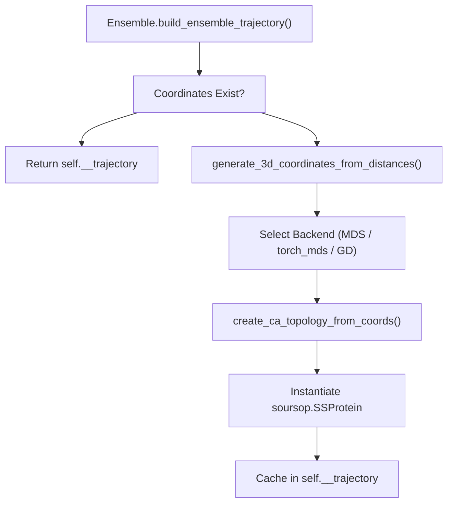
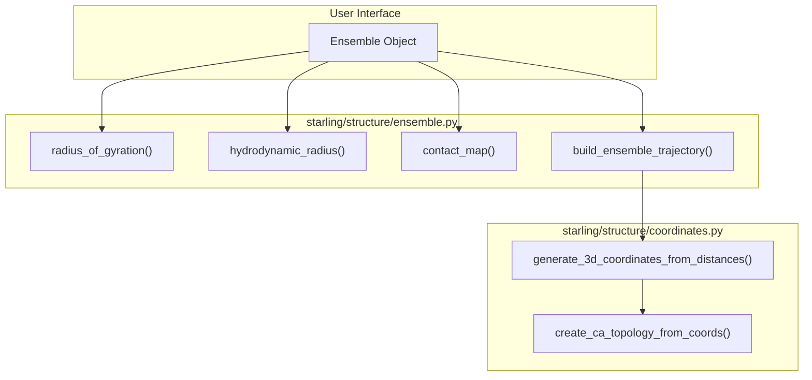

# Ensemble Analysis Methods

> **Relevant source files**
> * [demos/basic_usage.ipynb](https://github.com/idptools/starling/blob/4b98d2fe/demos/basic_usage.ipynb)
> * [demos/constraining_ensembles.ipynb](https://github.com/idptools/starling/blob/4b98d2fe/demos/constraining_ensembles.ipynb)
> * [demos/structural_ensemble.ipynb](https://github.com/idptools/starling/blob/4b98d2fe/demos/structural_ensemble.ipynb)
> * [starling/structure/coordinates.py](https://github.com/idptools/starling/blob/4b98d2fe/starling/structure/coordinates.py)
> * [starling/structure/ensemble.py](https://github.com/idptools/starling/blob/4b98d2fe/starling/structure/ensemble.py)

The `Ensemble` class serves as the primary data container and analysis engine within STARLING [starling/structure/ensemble.py L42-L75](https://github.com/idptools/starling/blob/4b98d2fe/starling/structure/ensemble.py#L42-L75)

 It is designed to store symmetrized distance maps and sequence information, providing lazy-evaluated methods for biophysical observables such as radius of gyration, hydrodynamic radius, and contact maps [starling/structure/ensemble.py L11-L15](https://github.com/idptools/starling/blob/4b98d2fe/starling/structure/ensemble.py#L11-L15)

## Core Data Structures and Initialization

An `Ensemble` instance is typically created via the `generate()` API or by loading a `.starling` file [starling/structure/ensemble.py L19-L22](https://github.com/idptools/starling/blob/4b98d2fe/starling/structure/ensemble.py#L19-L22)

 Upon initialization, it performs sanity checks to ensure distance maps are square, symmetrized, and match the provided sequence length [starling/structure/ensemble.py L151-L174](https://github.com/idptools/starling/blob/4b98d2fe/starling/structure/ensemble.py#L151-L174)

### Ensemble Internal State

| Attribute | Type | Description |
| --- | --- | --- |
| `__distance_maps` | `np.ndarray` | Shape `(n_conformations, n_res, n_res)` [starling/structure/ensemble.py L100](https://github.com/idptools/starling/blob/4b98d2fe/starling/structure/ensemble.py#L100-L100) |
| `sequence` | `str` | The amino acid sequence [starling/structure/ensemble.py L101](https://github.com/idptools/starling/blob/4b98d2fe/starling/structure/ensemble.py#L101-L101) |
| `__trajectory` | `SSProtein` | Optional `soursop` trajectory for 3D coordinates [starling/structure/ensemble.py L114-L121](https://github.com/idptools/starling/blob/4b98d2fe/starling/structure/ensemble.py#L114-L121) |
| `__rg_vals` | `list` | Cached Radius of Gyration values [starling/structure/ensemble.py L106](https://github.com/idptools/starling/blob/4b98d2fe/starling/structure/ensemble.py#L106-L106) |
| `__rh_vals` | `list` | Cached Hydrodynamic Radius values [starling/structure/ensemble.py L107](https://github.com/idptools/starling/blob/4b98d2fe/starling/structure/ensemble.py#L107-L107) |

**Sources:** [starling/structure/ensemble.py L77-L130](https://github.com/idptools/starling/blob/4b98d2fe/starling/structure/ensemble.py#L77-L130)

## Biophysical Analysis Methods

The `Ensemble` class implements several methods to derive structural properties directly from the distance maps.

### Radius of Gyration ($R_g$)

Calculated using the pairwise distance formula:
$$R_g = \sqrt{\frac{1}{2N^2} \sum_{i,j} r_{ij}^2}$$
The implementation in `radius_of_gyration()` computes this across all conformations [starling/structure/ensemble.py L348-L378](https://github.com/idptools/starling/blob/4b98d2fe/starling/structure/ensemble.py#L348-L378)

### Hydrodynamic Radius ($R_h$)

STARLING supports two modes for $R_h$ calculation via `hydrodynamic_radius()` [starling/structure/ensemble.py L380-L435](https://github.com/idptools/starling/blob/4b98d2fe/starling/structure/ensemble.py#L380-L435)

:

1. **Nygaard**: Uses the empirical scaling relationship derived by Nygaard et al. [starling/structure/ensemble.py L406](https://github.com/idptools/starling/blob/4b98d2fe/starling/structure/ensemble.py#L406-L406)
2. **Kirkwood-Riseman**: A more theoretical approach based on the Kirkwood-Riseman theory for polymer chains [starling/structure/ensemble.py L408](https://github.com/idptools/starling/blob/4b98d2fe/starling/structure/ensemble.py#L408-L408)

### Contact Maps and Pairwise Distances

* **`contact_map(threshold=8.0)`**: Returns a boolean mask of residue pairs within the specified Angstrom threshold [starling/structure/ensemble.py L437-L466](https://github.com/idptools/starling/blob/4b98d2fe/starling/structure/ensemble.py#L437-L466)
* **`rij(i, j)`**: Extracts the distribution of distances between residue $i$ and residue $j$ across the ensemble [starling/structure/ensemble.py L468-L500](https://github.com/idptools/starling/blob/4b98d2fe/starling/structure/ensemble.py#L468-L500)
* **`end_to_end_distance()`**: A convenience wrapper for `rij(0, n-1)` [starling/structure/ensemble.py L502-L523](https://github.com/idptools/starling/blob/4b98d2fe/starling/structure/ensemble.py#L502-L523)

**Sources:** [starling/structure/ensemble.py L348-L523](https://github.com/idptools/starling/blob/4b98d2fe/starling/structure/ensemble.py#L348-L523)

## 3D Trajectory Reconstruction

While STARLING primarily operates in distance-map space, it can reconstruct 3D Cartesian coordinates using Multidimensional Scaling (MDS).

### Reconstruction Workflow

The `build_ensemble_trajectory()` method triggers the reconstruction process [starling/structure/ensemble.py L654-L716](https://github.com/idptools/starling/blob/4b98d2fe/starling/structure/ensemble.py#L654-L716)

 It utilizes backends defined in `starling.structure.coordinates` [starling/structure/coordinates.py L1-L13](https://github.com/idptools/starling/blob/4b98d2fe/starling/structure/coordinates.py#L1-L13)

**Trajectory Generation Logic**

### MDS Backends

1. **Classical MDS**: Uses `sklearn.manifold.MDS` [starling/structure/coordinates.py L9](https://github.com/idptools/starling/blob/4b98d2fe/starling/structure/coordinates.py#L9-L9)
2. **torch_mds**: A batched SMACOF (Scaling by Majorizing a Complicated Function) implementation for GPUs [starling/structure/coordinates.py L123-L230](https://github.com/idptools/starling/blob/4b98d2fe/starling/structure/coordinates.py#L123-L230)
3. **Gradient Descent**: A PyTorch-based optimizer that minimizes the MSE between target and computed distances [starling/structure/coordinates.py L233-L356](https://github.com/idptools/starling/blob/4b98d2fe/starling/structure/coordinates.py#L233-L356)

**Sources:** [starling/structure/ensemble.py L654-L716](https://github.com/idptools/starling/blob/4b98d2fe/starling/structure/ensemble.py#L654-L716)

 [starling/structure/coordinates.py L123-L356](https://github.com/idptools/starling/blob/4b98d2fe/starling/structure/coordinates.py#L123-L356)

## Error Checking and Diagnostics

The `check_for_errors()` method scans the ensemble for physical inconsistencies [starling/structure/ensemble.py L181-L267](https://github.com/idptools/starling/blob/4b98d2fe/starling/structure/ensemble.py#L181-L267)

* **Logic**: It identifies frames where residue distances violate physical constraints (e.g., $C_\alpha - C_\alpha$ distances significantly deviating from ~3.8 Å for adjacent residues) [starling/structure/ensemble.py L185-L187](https://github.com/idptools/starling/blob/4b98d2fe/starling/structure/ensemble.py#L185-L187)
* **Filtering**: If `remove_errors=True`, the method prunes the `__distance_maps` array and invalidates the cached trajectory to ensure data integrity [starling/structure/ensemble.py L236-L258](https://github.com/idptools/starling/blob/4b98d2fe/starling/structure/ensemble.py#L236-L258)

**Sources:** [starling/structure/ensemble.py L181-L267](https://github.com/idptools/starling/blob/4b98d2fe/starling/structure/ensemble.py#L181-L267)

## Data Flow: Analysis to Visualization

This diagram maps the natural language request for analysis to the internal code entities.

**Analysis Data Flow**

**Sources:** [starling/structure/ensemble.py L348-L716](https://github.com/idptools/starling/blob/4b98d2fe/starling/structure/ensemble.py#L348-L716)

 [starling/structure/coordinates.py L359-L450](https://github.com/idptools/starling/blob/4b98d2fe/starling/structure/coordinates.py#L359-L450)