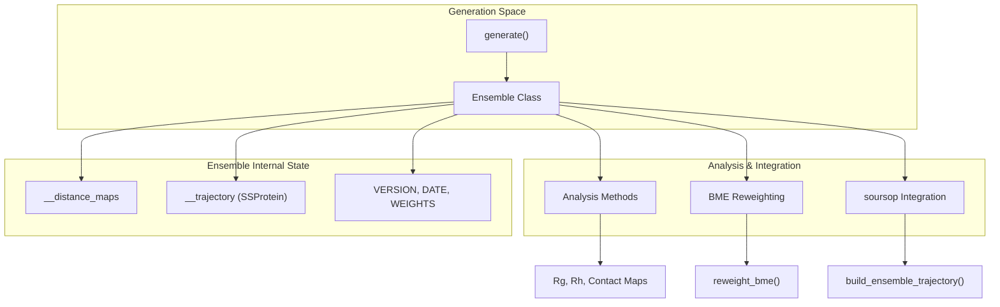
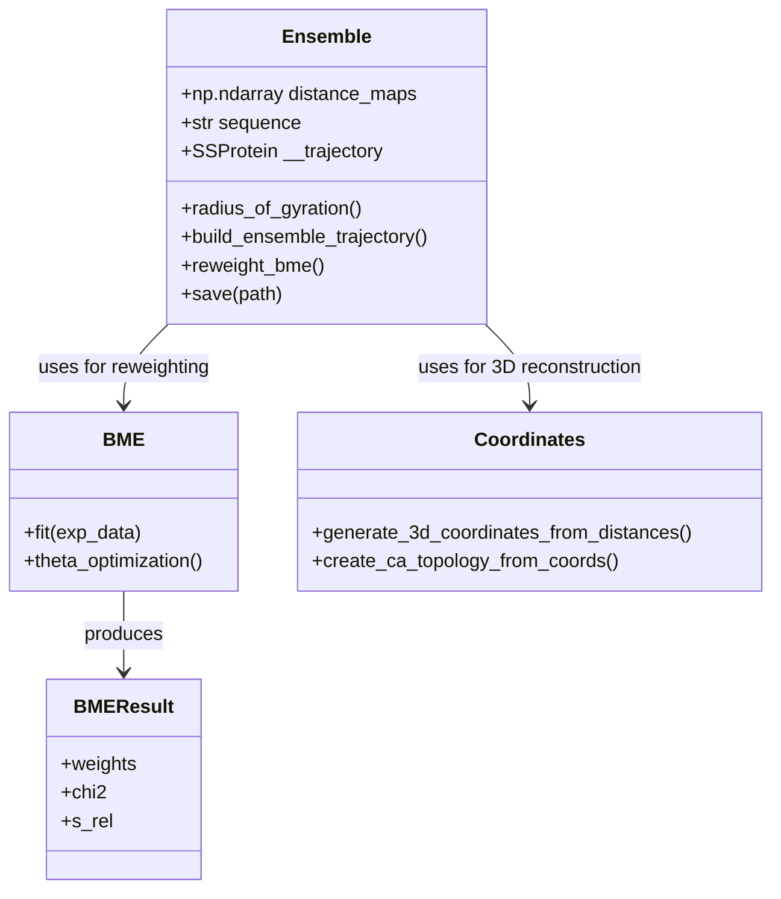

# Ensemble Data Structure

> **Relevant source files**
> * [starling/structure/ensemble.py](https://github.com/idptools/starling/blob/4b98d2fe/starling/structure/ensemble.py)
> * [starling/utilities.py](https://github.com/idptools/starling/blob/4b98d2fe/starling/utilities.py)

The `Ensemble` class is the central data container in STARLING, designed to store, analyze, and serialize protein conformational ensembles. It primarily wraps distance-map data generated by the diffusion model and provides a high-level interface for biophysical analysis and 3D coordinate reconstruction.

## The Ensemble Class

The `Ensemble` class [starling/structure/ensemble.py L42-L75](https://github.com/idptools/starling/blob/4b98d2fe/starling/structure/ensemble.py#L42-L75)

 acts as a bridge between raw distance maps and high-level biophysical observables. It is designed with **lazy computation** in mind: heavy operations like 3D coordinate reconstruction or hydrodynamic radius calculations are only performed when requested and are subsequently cached for performance.

### Key Components and Lifecycle

1. **Initialization**: An ensemble is typically created from a NumPy array of symmetrized distance maps and a sequence string [starling/structure/ensemble.py L77-L130](https://github.com/idptools/starling/blob/4b98d2fe/starling/structure/ensemble.py#L77-L130) .
2. **Validation**: During `__init__`, the class performs sanity checks to ensure distance maps are square, match the sequence length, and contain valid amino acids [starling/structure/ensemble.py L131-L180](https://github.com/idptools/starling/blob/4b98d2fe/starling/structure/ensemble.py#L131-L180) .
3. **Persistence**: Ensembles can be saved to and loaded from a custom `.starling` format, which uses compressed pickle files (via `lzma` or `gzip`) to store distance maps and metadata [starling/structure/ensemble.py L456-L545](https://github.com/idptools/starling/blob/4b98d2fe/starling/structure/ensemble.py#L456-L545) .

### Data Flow Overview

The following diagram illustrates how the `Ensemble` class integrates with the rest of the STARLING ecosystem.

Protein Ensemble Data Flow

**Sources:** [starling/structure/ensemble.py L42-L130](https://github.com/idptools/starling/blob/4b98d2fe/starling/structure/ensemble.py#L42-L130)

, [starling/structure/ensemble.py L456-L545](https://github.com/idptools/starling/blob/4b98d2fe/starling/structure/ensemble.py#L456-L545)

---

## Lazy Computation and Analysis

To minimize memory overhead, the `Ensemble` class delays the calculation of derived properties.

* **Biophysical Observables**: Methods like `radius_of_gyration()` and `hydrodynamic_radius()` compute values on-the-fly and cache them in private attributes like `__rg_vals` [starling/structure/ensemble.py L228-L265](https://github.com/idptools/starling/blob/4b98d2fe/starling/structure/ensemble.py#L228-L265) .
* **Error Checking**: The `check_for_errors()` method scans for unphysical distances (e.g., $C\alpha-C\alpha$ distances $< 2.0\text{\AA}$) and can optionally prune the ensemble [starling/structure/ensemble.py L181-L226](https://github.com/idptools/starling/blob/4b98d2fe/starling/structure/ensemble.py#L181-L226) .

For a complete reference of these methods, see **[Ensemble Analysis Methods](/idptools/starling/5.1-ensemble-analysis-methods)**.

**Sources:** [starling/structure/ensemble.py L181-L265](https://github.com/idptools/starling/blob/4b98d2fe/starling/structure/ensemble.py#L181-L265)

---

## 3D Coordinate Reconstruction

While STARLING operates natively in distance-map space, the `Ensemble` class facilitates the transition to 3D Cartesian space.

* **Integration with soursop**: The class can wrap a `soursop.ssprotein.SSProtein` object to provide seamless integration with the `soursop` trajectory analysis library [starling/structure/ensemble.py L30-L31](https://github.com/idptools/starling/blob/4b98d2fe/starling/structure/ensemble.py#L30-L31) .
* **MDS Reconstruction**: The `build_ensemble_trajectory()` method triggers Multi-Dimensional Scaling (MDS) to convert distance maps into 3D coordinates [starling/structure/ensemble.py L408-L454](https://github.com/idptools/starling/blob/4b98d2fe/starling/structure/ensemble.py#L408-L454) .

For details on the reconstruction backends (GPU SMACOF, Sklearn, etc.), see **[3D Coordinate Reconstruction (MDS)](/idptools/starling/5.2-3d-coordinate-reconstruction-(mds))**.

**Sources:** [starling/structure/ensemble.py L408-L454](https://github.com/idptools/starling/blob/4b98d2fe/starling/structure/ensemble.py#L408-L454)

, [starling/structure/coordinates.py L36-L39](https://github.com/idptools/starling/blob/4b98d2fe/starling/structure/coordinates.py#L36-L39)

---

## BME Reweighting

The `Ensemble` class provides built-in support for Bayesian Maximum Entropy (BME) reweighting. This allows users to refine the generated ensemble using experimental data (e.g., SAXS, NMR).

* **Reweighting API**: The `reweight_bme()` method interfaces with the `BME` class to calculate new weights for each conformation based on experimental observables [starling/structure/ensemble.py L348-L406](https://github.com/idptools/starling/blob/4b98d2fe/starling/structure/ensemble.py#L348-L406) .
* **Results**: Reweighting produces a `BMEResult` object containing optimized weights, $\chi^2$ values, and entropy metrics [starling/structure/bme.py L26-L76](https://github.com/idptools/starling/blob/4b98d2fe/starling/structure/bme.py#L26-L76) .

For a guide on applying BME, see **[BME Reweighting](/idptools/starling/5.3-bme-reweighting)**.

**Sources:** [starling/structure/ensemble.py L348-L406](https://github.com/idptools/starling/blob/4b98d2fe/starling/structure/ensemble.py#L348-L406)

, [starling/structure/bme.py L330-L410](https://github.com/idptools/starling/blob/4b98d2fe/starling/structure/bme.py#L330-L410)

---

## Code Entity Mapping

This diagram maps natural language concepts to the specific code entities within the `starling.structure` subpackage.

Entity Space Mapping

**Sources:** [starling/structure/ensemble.py L42-L75](https://github.com/idptools/starling/blob/4b98d2fe/starling/structure/ensemble.py#L42-L75)

, [starling/structure/bme.py L26-L76](https://github.com/idptools/starling/blob/4b98d2fe/starling/structure/bme.py#L26-L76)

, [starling/structure/coordinates.py L36-L39](https://github.com/idptools/starling/blob/4b98d2fe/starling/structure/coordinates.py#L36-L39)