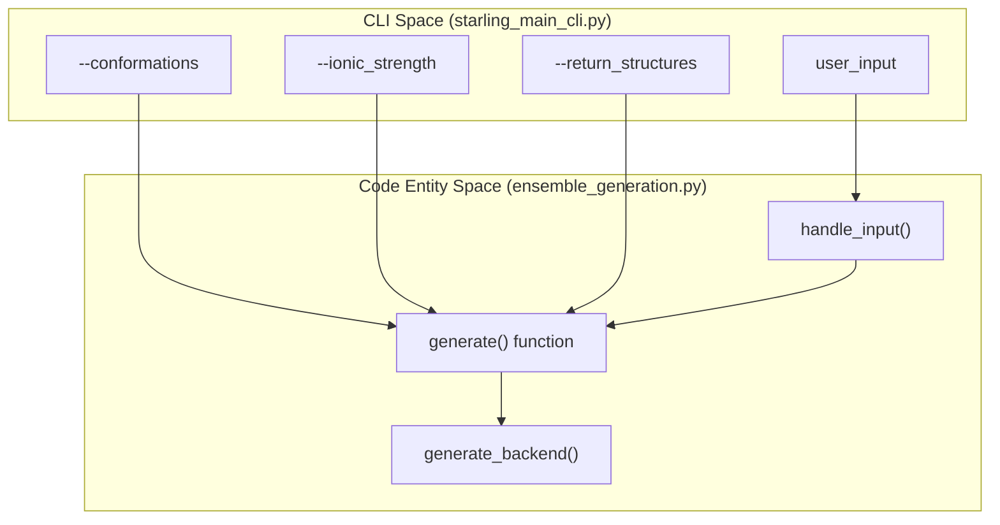
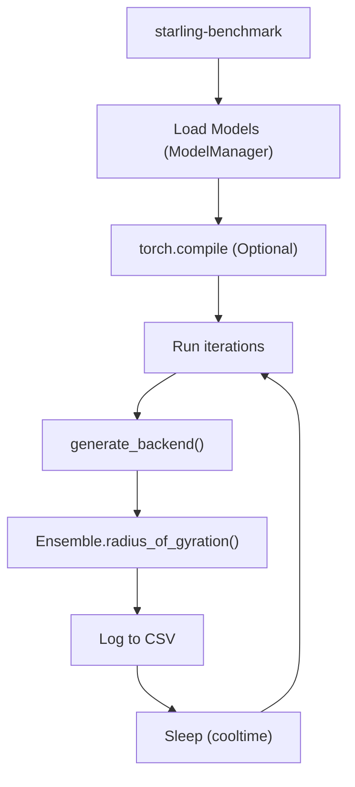

# Generation CLI: starling and starling\-benchmark

> **Relevant source files**
> - [changelog\.md](https://github.com/idptools/starling/blob/4b98d2fe/changelog.md?plain=1)
> - [docs/autosummary/starling\.structure\.ensemble\.Ensemble\.rst](https://github.com/idptools/starling/blob/4b98d2fe/docs/autosummary/starling.structure.ensemble.Ensemble.rst)
> - [docs/getting\_started\.rst](https://github.com/idptools/starling/blob/4b98d2fe/docs/getting_started.rst)
> - [docs/usage/cli\.rst](https://github.com/idptools/starling/blob/4b98d2fe/docs/usage/cli.rst)
> - [docs/usage/ensemble\_generation\.rst](https://github.com/idptools/starling/blob/4b98d2fe/docs/usage/ensemble_generation.rst)
> - [starling/frontend/ensemble\_generation\.py](https://github.com/idptools/starling/blob/4b98d2fe/starling/frontend/ensemble_generation.py)
> - [starling/scripts/starling\_main\_cli\.py](https://github.com/idptools/starling/blob/4b98d2fe/starling/scripts/starling_main_cli.py)

 This page provides a technical reference for the primary command\-line interfaces \(CLIs\) provided by the STARLING package\. These tools serve as the main entry points for generating protein ensembles and profiling model performance\.

## 1\. The `starling` CLI

 The `starling` command is the high\-level entry point for generating structural ensembles from protein sequences\. It acts as a wrapper around the `starling.frontend.ensemble_generation.generate` function [starling\_main\_cli\.py L185-L200](https://github.com/idptools/starling/blob/4b98d2fe/starling/scripts/starling_main_cli.py#L185-L200)

### 1\.1 Input Handling and Data Flow

 The CLI supports multiple input formats, which are parsed by `handle_input` [ensemble\_generation\.py L10-L140](https://github.com/idptools/starling/blob/4b98d2fe/starling/frontend/ensemble_generation.py#L10-L140)

| Input Type | Description | Implementation Details |
| --- | --- | --- |
| Raw String | A single amino acid sequence | Parsed as a single sequence entry starling/frontend/ensemble\_generation\.py107\-120 |
| FASTA File | Standard \.fasta or \.FASTA | Parsed via protfasta\.read\_fasta starling/frontend/ensemble\_generation\.py88\-90 |
| TSV File | \.tsv or \.in files | Expected format: name\\tsequence starling/frontend/ensemble\_generation\.py95\-105 |
| List/Dict | Programmatic inputs | Converted to a standard internal dictionary starling/frontend/ensemble\_generation\.py123\-134 |

### 1\.2 Core Command Arguments

 The CLI exposes parameters to control the diffusion process, hardware utilization, and output formats [starling\_main\_cli\.py L46-L156](https://github.com/idptools/starling/blob/4b98d2fe/starling/scripts/starling_main_cli.py#L46-L156)

 - **Generation Control**: - `-c`, `--conformations`: Total structures to sample \(default: 400\)\. - `-s`, `--steps`: Diffusion steps \(default: 25\)\. - `--ionic_strength`: Salt concentration in mM \(20, 150, or 300\)\.
- **Hardware/Performance**: - `-d`, `--device`: Target device \(`cpu`, `cuda`, `mps`\)\. - `-b`, `--batch_size`: Parallel samples per forward pass\. - `--num-cpus`: Max CPUs for MDS reconstruction\.
- **Output Management**: - `-o`, `--output_directory`: Path to save `.starling` and trajectory files\. - `-r`, `--return_structures`: Triggers 3D coordinate reconstruction \(MDS\)\.

### 1\.3 System Mapping: CLI to Backend

 The following diagram illustrates how CLI arguments map to the underlying Python backend entities\.

 **Diagram: CLI Argument to Code Entity Mapping**

 **Sources:** [starling\_main\_cli\.py L46-L201](https://github.com/idptools/starling/blob/4b98d2fe/starling/scripts/starling_main_cli.py#L46-L201) [ensemble\_generation\.py L10-L182](https://github.com/idptools/starling/blob/4b98d2fe/starling/frontend/ensemble_generation.py#L10-L182)

---

## 2\. The `starling-benchmark` Tool

 The `starling-benchmark` utility is designed for runtime profiling and hardware optimization\. It allows developers to measure the throughput of the diffusion models under varying loads [starling\_main\_cli\.py L211-L219](https://github.com/idptools/starling/blob/4b98d2fe/starling/scripts/starling_main_cli.py#L211-L219)

### 2\.1 Key Features

 - **Runtime Profiling**: Measures the total time for generation and 3D reconstruction [starling\_main\_cli\.py L270-L280](https://github.com/idptools/starling/blob/4b98d2fe/starling/scripts/starling_main_cli.py#L270-L280)
- **Rg Tracking**: Automatically calculates the Radius of Gyration for the generated ensemble to ensure physical consistency during benchmarks [starling\_main\_cli\.py L278-L279](https://github.com/idptools/starling/blob/4b98d2fe/starling/scripts/starling_main_cli.py#L278-L279)
- **Torch Compile Support**: Supports testing `torch.compile` \(via `compile=True`\) to measure speedups from kernel fusion and graph capture [starling\_main\_cli\.py L218](https://github.com/idptools/starling/blob/4b98d2fe/starling/scripts/starling_main_cli.py#L218-L218)
- **Cool\-down Periods**: Includes a `cooltime` parameter \(default 600s\) to allow GPU thermals to stabilize between heavy runs [starling\_main\_cli\.py L216](https://github.com/idptools/starling/blob/4b98d2fe/starling/scripts/starling_main_cli.py#L216-L216)

### 2\.2 Execution Flow

 The benchmark tool executes a sequence of generations, typically using Alpha\-Synuclein as the default test sequence [starling\_main\_cli\.py L208](https://github.com/idptools/starling/blob/4b98d2fe/starling/scripts/starling_main_cli.py#L208-L208)

 **Diagram: Benchmarking Execution Logic**

 **Sources:** [starling\_main\_cli\.py L211-L285](https://github.com/idptools/starling/blob/4b98d2fe/starling/scripts/starling_main_cli.py#L211-L285)

---

## 3\. Implementation Details

### 3\.1 MDS Reconstruction Control

 When `--return_structures` is enabled, the CLI passes `num_cpus_mds` and `num_mds_init` to the backend [starling\_main\_cli\.py L193-L194](https://github.com/idptools/starling/blob/4b98d2fe/starling/scripts/starling_main_cli.py#L193-L194) This controls the parallelization of the Multi\-Dimensional Scaling \(MDS\) algorithm used to convert distance maps into 3D coordinates [ensemble\_generation\.py L169-L170](https://github.com/idptools/starling/blob/4b98d2fe/starling/frontend/ensemble_generation.py#L169-L170)

### 3\.2 Information and Versioning

 The CLI provides two utility flags for environment inspection:

 - `--info`: Prints the locations of the VAE and DDPM weights currently in use, along with default configuration values from `starling.configs` [starling\_main\_cli\.py L23-L40](https://github.com/idptools/starling/blob/4b98d2fe/starling/scripts/starling_main_cli.py#L23-L40)
- `--version`: Outputs the current version string from `starling._version` [starling\_main\_cli\.py L162-L164](https://github.com/idptools/starling/blob/4b98d2fe/starling/scripts/starling_main_cli.py#L162-L164)

### 3\.3 Error Handling in CLI

 The CLI implements basic sanity checks before invoking the backend:

 1. **Device Check**: Validates that the requested device \(e\.g\., `cuda`, `mps`\) is available [starling\_main\_cli\.py L14](https://github.com/idptools/starling/blob/4b98d2fe/starling/scripts/starling_main_cli.py#L14-L14)
2. **Output Directory**: Verifies that the target directory for saving ensembles exists [starling\_main\_cli\.py L174-L179](https://github.com/idptools/starling/blob/4b98d2fe/starling/scripts/starling_main_cli.py#L174-L179)
3. **Sequence Cleaning**: The `clean_sequence` helper ensures only standard canonical amino acids are processed, converting to uppercase and raising errors for invalid residues [ensemble\_generation\.py L66-L74](https://github.com/idptools/starling/blob/4b98d2fe/starling/frontend/ensemble_generation.py#L66-L74)

 **Sources:** [starling\_main\_cli\.py L1-L201](https://github.com/idptools/starling/blob/4b98d2fe/starling/scripts/starling_main_cli.py#L1-L201) [ensemble\_generation\.py L10-L182](https://github.com/idptools/starling/blob/4b98d2fe/starling/frontend/ensemble_generation.py#L10-L182) [cli\.rst L9-L52](https://github.com/idptools/starling/blob/4b98d2fe/docs/usage/cli.rst#L9-L52)

