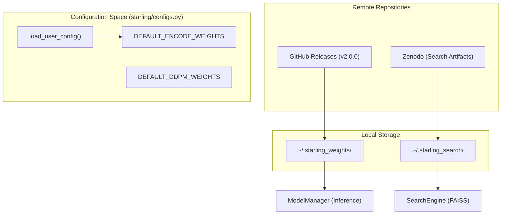
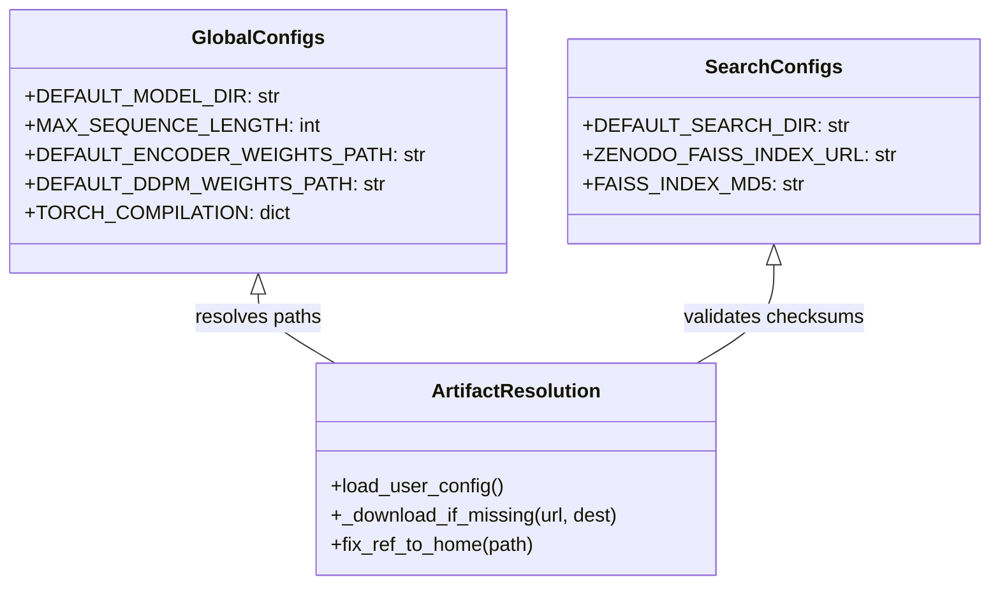

# Getting Started: Installation and Configuration

> **Relevant source files**
> * [changelog.md](https://github.com/idptools/starling/blob/4b98d2fe/changelog.md?plain=1)
> * [docs/autosummary/starling.search.search_engine.rst](https://github.com/idptools/starling/blob/4b98d2fe/docs/autosummary/starling.search.search_engine.rst)
> * [docs/autosummary/starling.structure.ensemble.Ensemble.rst](https://github.com/idptools/starling/blob/4b98d2fe/docs/autosummary/starling.structure.ensemble.Ensemble.rst)
> * [docs/getting_started.rst](https://github.com/idptools/starling/blob/4b98d2fe/docs/getting_started.rst)
> * [docs/requirements.txt](https://github.com/idptools/starling/blob/4b98d2fe/docs/requirements.txt)
> * [docs/usage/cli.rst](https://github.com/idptools/starling/blob/4b98d2fe/docs/usage/cli.rst)
> * [docs/usage/ensemble_generation.rst](https://github.com/idptools/starling/blob/4b98d2fe/docs/usage/ensemble_generation.rst)
> * [docs/usage/installation.rst](https://github.com/idptools/starling/blob/4b98d2fe/docs/usage/installation.rst)
> * [pyproject.toml](https://github.com/idptools/starling/blob/4b98d2fe/pyproject.toml)
> * [starling/configs.py](https://github.com/idptools/starling/blob/4b98d2fe/starling/configs.py)

This page provides a technical guide for setting up the STARLING environment, installing the package via multiple methods, and understanding the global configuration system that manages model weights and environment overrides.

## Installation

STARLING requires **Python >= 3.10** [pyproject.toml L22](https://github.com/idptools/starling/blob/4b98d2fe/pyproject.toml#L22-L22)

 It depends on several core scientific libraries including `numpy`, `torch`, `pytorch-lightning`, and `soursop` [pyproject.toml L23-L43](https://github.com/idptools/starling/blob/4b98d2fe/pyproject.toml#L23-L43)

### Standard Installation (PyPI)

For most users, the stable version can be installed directly from PyPI:

```
pip install idptools-starling
```

[docs/usage/installation.rst L26](https://github.com/idptools/starling/blob/4b98d2fe/docs/usage/installation.rst#L26-L26)

### Development Installation (GitHub)

To work with the latest features or contribute to development, clone the repository and install in editable mode:

```
git clone git@github.com:idptools/starling.gitcd starlingpip install .
```

[docs/usage/installation.rst L33-L37](https://github.com/idptools/starling/blob/4b98d2fe/docs/usage/installation.rst#L33-L37)

### GPU-Accelerated Search Setup

For high-performance similarity searches using FAISS with GPU support, manual installation via `conda` is required because `faiss-gpu` is not currently available as a standard pip wheel [docs/usage/installation.rst L42-L47](https://github.com/idptools/starling/blob/4b98d2fe/docs/usage/installation.rst#L42-L47)

1. **Create Environment**: `conda create -n starling python=3.11` [docs/usage/installation.rst L53](https://github.com/idptools/starling/blob/4b98d2fe/docs/usage/installation.rst#L53-L53)
2. **Install PyTorch (CUDA)**: `conda install -c pytorch -c nvidia pytorch pytorch-cuda=12.4` [docs/usage/installation.rst L62](https://github.com/idptools/starling/blob/4b98d2fe/docs/usage/installation.rst#L62-L62)
3. **Install FAISS-GPU**: `conda install -c pytorch "faiss-gpu=1.8.*" cuda-version=12.4` [docs/usage/installation.rst L72](https://github.com/idptools/starling/blob/4b98d2fe/docs/usage/installation.rst#L72-L72)
4. **Install STARLING**: `pip install --no-deps idptools-starling` [docs/usage/installation.rst L98](https://github.com/idptools/starling/blob/4b98d2fe/docs/usage/installation.rst#L98-L98)

**Sources:** [pyproject.toml L22-L43](https://github.com/idptools/starling/blob/4b98d2fe/pyproject.toml#L22-L43)

 [docs/usage/installation.rst L19-L103](https://github.com/idptools/starling/blob/4b98d2fe/docs/usage/installation.rst#L19-L103)

---

## Configuration System

STARLING utilizes a hierarchical configuration system defined in `starling/configs.py`. This system manages default hyperparameters, model weight locations, and artifact paths for the similarity search engine.

### Default Parameters

The system defines several hard-coded defaults that govern the behavior of the `generate()` function and the CLI:

| Parameter | Default Value | Description |
| --- | --- | --- |
| `DEFAULT_MODEL_DIR` | `~/.starling_weights` | Local directory for storing model checkpoints. |
| `MAX_SEQUENCE_LENGTH` | 380 | Hard limit for input protein sequence length. |
| `DEFAULT_NUMBER_CONFS` | 400 | Number of conformations sampled per ensemble. |
| `DEFAULT_STEPS` | 30 | Default number of diffusion steps. |
| `DEFAULT_SAMPLER` | `"ddim"` | Default sampling algorithm. |
| `DEFAULT_IONIC_STRENGTH` | 150 | Default solvent environment in mM. |

**Sources:** [starling/configs.py L8-L25](https://github.com/idptools/starling/blob/4b98d2fe/starling/configs.py#L8-L25)

### Configuration Loading Flow

The configuration is initialized in `starling/configs.py` and allows for user-level overrides via a local Python file or environment variables.

#### 1. User Override File

STARLING checks for a file at `~/.starling_weights/configs.py` (defined as `USER_CONFIG_PATH`) [starling/configs.py L43-L45](https://github.com/idptools/starling/blob/4b98d2fe/starling/configs.py#L43-L45)

 If present, the `load_user_config()` function dynamically imports this module and updates the global variables in `starling.configs` [starling/configs.py L54-L69](https://github.com/idptools/starling/blob/4b98d2fe/starling/configs.py#L54-L69)

#### 2. Environment Variables

Model weights and search artifacts can be redirected using environment variables, which take precedence over the default release URLs.

| Environment Variable | Role |
| --- | --- |
| `STARLING_ENCODER_PATH` | Path/URL to VAE weights. |
| `STARLING_DDPM_PATH` | Path/URL to Diffusion weights. |
| `STARLING_FAISS_INDEX_PATH` | Path to FAISS search index. |
| `STARLING_SEQSTORE_PATH` | Path to SQLite sequence store. |

**Sources:** [starling/configs.py L88-L91](https://github.com/idptools/starling/blob/4b98d2fe/starling/configs.py#L88-L91)

 [starling/configs.py L141-L143](https://github.com/idptools/starling/blob/4b98d2fe/starling/configs.py#L141-L143)

### Artifact Management

STARLING automatically handles the retrieval of model weights and search indices from GitHub Releases and Zenodo.

**Model Weights and Artifacts Data Flow**



**Sources:** [starling/configs.py L14-L15](https://github.com/idptools/starling/blob/4b98d2fe/starling/configs.py#L14-L15)

 [starling/configs.py L54-L69](https://github.com/idptools/starling/blob/4b98d2fe/starling/configs.py#L54-L69)

 [starling/configs.py L82-L85](https://github.com/idptools/starling/blob/4b98d2fe/starling/configs.py#L82-L85)

 [starling/configs.py L131-L156](https://github.com/idptools/starling/blob/4b98d2fe/starling/configs.py#L131-L156)

---

## Model Compilation and Performance

STARLING supports `torch.compile` to optimize inference performance, particularly for the ViT backbone in the diffusion model.

### Compilation Settings

The `TORCH_COMPILATION` dictionary in `starling/configs.py` controls the behavior of the PyTorch compiler:

* `enabled`: Set to `False` by default [starling/configs.py L28](https://github.com/idptools/starling/blob/4b98d2fe/starling/configs.py#L28-L28)
* `options`: Includes `mode` (e.g., `"reduce-overhead"`), `fullgraph`, and `backend` (defaulting to `"inductor"`) [starling/configs.py L29-L34](https://github.com/idptools/starling/blob/4b98d2fe/starling/configs.py#L29-L34)

Users can modify these settings programmatically using `starling.set_compilation_options(enabled=True)` to achieve up to ~40% runtime reduction on supported GPUs [docs/usage/ensemble_generation.rst L192-L195](https://github.com/idptools/starling/blob/4b98d2fe/docs/usage/ensemble_generation.rst#L192-L195)

**Sources:** [starling/configs.py L27-L35](https://github.com/idptools/starling/blob/4b98d2fe/starling/configs.py#L27-L35)

 [docs/usage/ensemble_generation.rst L182-L196](https://github.com/idptools/starling/blob/4b98d2fe/docs/usage/ensemble_generation.rst#L182-L196)

---

## Code Entity Mapping

The following diagram maps high-level configuration concepts to the specific code entities defined in `starling/configs.py`.

**Configuration to Code Entity Space**



**Sources:** [starling/configs.py L8-L22](https://github.com/idptools/starling/blob/4b98d2fe/starling/configs.py#L8-L22)

 [starling/configs.py L54](https://github.com/idptools/starling/blob/4b98d2fe/starling/configs.py#L54-L54)

 [starling/configs.py L74-L79](https://github.com/idptools/starling/blob/4b98d2fe/starling/configs.py#L74-L79)

 [starling/configs.py L131-L156](https://github.com/idptools/starling/blob/4b98d2fe/starling/configs.py#L131-L156)

 [starling/configs.py L200](https://github.com/idptools/starling/blob/4b98d2fe/starling/configs.py#L200-L200)