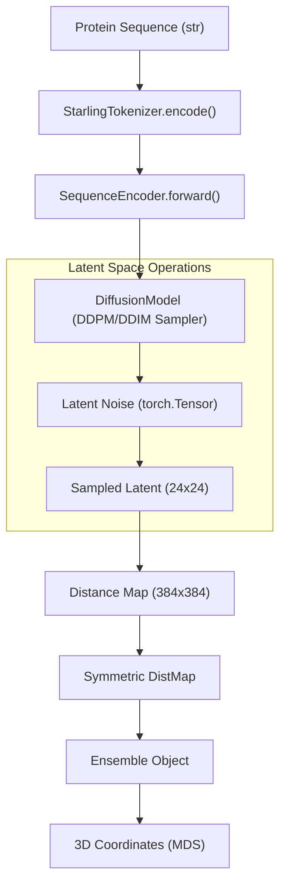
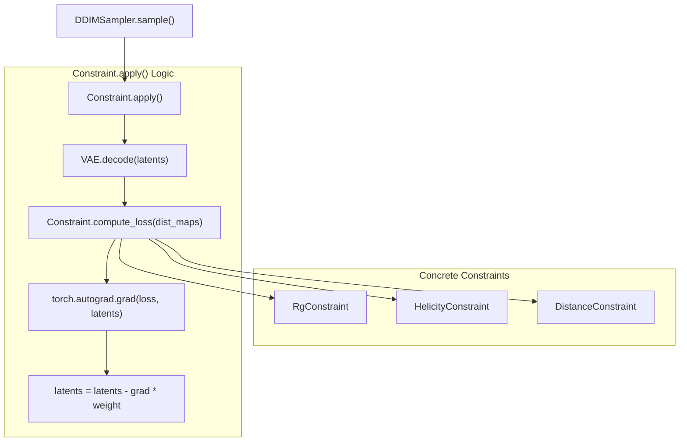

# Glossary

> **Relevant source files**
> * [pyproject.toml](https://github.com/idptools/starling/blob/4b98d2fe/pyproject.toml)
> * [starling/configs.py](https://github.com/idptools/starling/blob/4b98d2fe/starling/configs.py)
> * [starling/configs/vae_model/model.yaml](https://github.com/idptools/starling/blob/4b98d2fe/starling/configs/vae_model/model.yaml)
> * [starling/inference/constraints.py](https://github.com/idptools/starling/blob/4b98d2fe/starling/inference/constraints.py)
> * [starling/models/diffusion.py](https://github.com/idptools/starling/blob/4b98d2fe/starling/models/diffusion.py)
> * [starling/models/vae.py](https://github.com/idptools/starling/blob/4b98d2fe/starling/models/vae.py)
> * [starling/samplers/ddim_sampler.py](https://github.com/idptools/starling/blob/4b98d2fe/starling/samplers/ddim_sampler.py)
> * [starling/samplers/plms_sampler.py](https://github.com/idptools/starling/blob/4b98d2fe/starling/samplers/plms_sampler.py)
> * [starling/scripts/starling_pretokenize.py](https://github.com/idptools/starling/blob/4b98d2fe/starling/scripts/starling_pretokenize.py)
> * [starling/search/__init__.py](https://github.com/idptools/starling/blob/4b98d2fe/starling/search/__init__.py)
> * [starling/search/builder.py](https://github.com/idptools/starling/blob/4b98d2fe/starling/search/builder.py)
> * [starling/search/search_engine.py](https://github.com/idptools/starling/blob/4b98d2fe/starling/search/search_engine.py)
> * [starling/search/search_utils.py](https://github.com/idptools/starling/blob/4b98d2fe/starling/search/search_utils.py)
> * [starling/search/similarity_search.py](https://github.com/idptools/starling/blob/4b98d2fe/starling/search/similarity_search.py)
> * [starling/search/store.py](https://github.com/idptools/starling/blob/4b98d2fe/starling/search/store.py)
> * [starling/structure/ensemble.py](https://github.com/idptools/starling/blob/4b98d2fe/starling/structure/ensemble.py)
> * [starling/training/diffusion_train.py](https://github.com/idptools/starling/blob/4b98d2fe/starling/training/diffusion_train.py)

This page provides technical definitions and implementation details for core concepts, architectural components, and domain-specific terminology used within the STARLING codebase. It serves as a reference for engineers to map high-level protein physics and generative modeling concepts to specific classes and functions.

## Architectural Components

### VAE (Variational Autoencoder)

The first stage of the STARLING pipeline. It compresses high-dimensional protein distance maps (typically $384 \times 384$) into a compact, continuous latent space (typically $24 \times 24 \times 1$).

* **Implementation**: Defined in `VAE` class [starling/models/vae.py L86-L104](https://github.com/idptools/starling/blob/4b98d2fe/starling/models/vae.py#L86-L104) .
* **Encoder/Decoder**: Uses ResNet-based architectures (e.g., `Resnet18_Encoder`) [starling/models/vae.py L157-L166](https://github.com/idptools/starling/blob/4b98d2fe/starling/models/vae.py#L157-L166) .
* **Latent Distribution**: Parameterized via `DiagonalGaussianDistribution` [starling/models/vae.py L15](https://github.com/idptools/starling/blob/4b98d2fe/starling/models/vae.py#L15-L15) .

### Diffusion Model (DDPM)

The second stage of the pipeline. A Denoising Diffusion Probabilistic Model that learns to generate new samples within the VAE's latent space, conditioned on amino acid sequences and ionic strength.

* **Implementation**: `DiffusionModel` class [starling/models/diffusion.py L55-L70](https://github.com/idptools/starling/blob/4b98d2fe/starling/models/diffusion.py#L55-L70) .
* **Backbone**: Uses a Vision Transformer (`ViT`) to predict noise [starling/training/diffusion_train.py L88](https://github.com/idptools/starling/blob/4b98d2fe/starling/training/diffusion_train.py#L88-L88) .
* **Conditioning**: Uses a `SequenceEncoder` to process protein sequences into embeddings for the `ViT` cross-attention layers [starling/models/diffusion.py L136](https://github.com/idptools/starling/blob/4b98d2fe/starling/models/diffusion.py#L136-L136) .

### Sampler

The algorithm responsible for the reverse diffusion process (denoising).

* **DDIM (Denoising Diffusion Implicit Models)**: A deterministic/stochastic non-Markovian sampler that allows for faster generation by skipping timesteps [starling/samplers/ddim_sampler.py L19-L58](https://github.com/idptools/starling/blob/4b98d2fe/starling/samplers/ddim_sampler.py#L19-L58) .
* **PLMS (Pseudo Linear Multi-Step)**: An accelerated sampler using Adams-Bashforth methods [starling/samplers/plms_sampler.py L62-L72](https://github.com/idptools/starling/blob/4b98d2fe/starling/samplers/plms_sampler.py#L62-L72) .

## Domain Concepts

### Distance Map

A 2D matrix representing pairwise distances between all $C\alpha$ atoms in a protein chain.

* **Symmetrization**: Distance maps are enforced to be symmetric ($D_{ij} = D_{ji}$) and have a zero diagonal ($D_{ii} = 0$) using `symmetrize_distance_maps` [starling/inference/constraints.py L12-L38](https://github.com/idptools/starling/blob/4b98d2fe/starling/inference/constraints.py#L12-L38) .

### Latent Space Scaling Factor

A normalization constant used to scale VAE latents to unit variance before diffusion training, ensuring the diffusion model operates on a standardized distribution.

* **Buffer**: Stored as `latent_space_scaling_factor` in the `DiffusionModel` [starling/models/diffusion.py L158-L160](https://github.com/idptools/starling/blob/4b98d2fe/starling/models/diffusion.py#L158-L160) .

### Ionic Strength

A conditioning variable representing the salt concentration (in mM) of the environment, which influences the electrostatic interactions and compactness of IDPs.

* **Default**: 150 mM [starling/configs.py L23](https://github.com/idptools/starling/blob/4b98d2fe/starling/configs.py#L23-L23) .
* **Processing**: Injected into the `SequenceEncoder` to modulate sequence embeddings [starling/samplers/ddim_sampler.py L68-L70](https://github.com/idptools/starling/blob/4b98d2fe/starling/samplers/ddim_sampler.py#L68-L70) .

## Data Structures & Search

### Ensemble

The primary data container in STARLING, holding a collection of distance maps and the corresponding protein sequence.

* **Implementation**: `Ensemble` class [starling/structure/ensemble.py L42-L75](https://github.com/idptools/starling/blob/4b98d2fe/starling/structure/ensemble.py#L42-L75) .
* **Lazy Computation**: Biophysical properties like Radius of Gyration (`rg_vals`) are computed only when requested [starling/structure/ensemble.py L106-L107](https://github.com/idptools/starling/blob/4b98d2fe/starling/structure/ensemble.py#L106-L107) .

### Search Engine

A FAISS-backed system for finding similar protein ensembles based on sequence embeddings.

* **Implementation**: `SearchEngine` class [starling/search/search_engine.py L93-L134](https://github.com/idptools/starling/blob/4b98d2fe/starling/search/search_engine.py#L93-L134) .
* **Candidate**: A single search result containing a global ID (`gid`), score, and metadata [starling/search/search_utils.py L220-L228](https://github.com/idptools/starling/blob/4b98d2fe/starling/search/search_utils.py#L220-L228) .
* **SequenceStore**: An SQLite database mapping GIDs to raw sequences and metadata [starling/search/store.py L1-L10](https://github.com/idptools/starling/blob/4b98d2fe/starling/search/store.py#L1-L10) .

## Mapping: Natural Language to Code Space

### Pipeline Data Flow

This diagram maps the conceptual flow of "Sequence to Ensemble" to the specific classes and methods involved.

Title: STARLING Inference Data Flow

**Sources**: [starling/samplers/ddim_sampler.py L173-L214](https://github.com/idptools/starling/blob/4b98d2fe/starling/samplers/ddim_sampler.py#L173-L214)

, [starling/structure/ensemble.py L77-L104](https://github.com/idptools/starling/blob/4b98d2fe/starling/structure/ensemble.py#L77-L104)

, [starling/inference/constraints.py L12-L38](https://github.com/idptools/starling/blob/4b98d2fe/starling/inference/constraints.py#L12-L38)

.

### Constraint System Architecture

This diagram associates the concept of "Guided Diffusion" with the internal `Constraint` class hierarchy and the sampling loop.

Title: Constraint Application Lifecycle

**Sources**: [starling/inference/constraints.py L41-L94](https://github.com/idptools/starling/blob/4b98d2fe/starling/inference/constraints.py#L41-L94)

, [starling/inference/constraints.py L203-L230](https://github.com/idptools/starling/blob/4b98d2fe/starling/inference/constraints.py#L203-L230)

, [starling/samplers/ddim_sampler.py L218-L223](https://github.com/idptools/starling/blob/4b98d2fe/starling/samplers/ddim_sampler.py#L218-L223)

.

## Key Terms Summary Table

| Term | Code Pointer | Description |
| --- | --- | --- |
| **KLD Weight** | [starling/models/vae.py L21-L33](https://github.com/idptools/starling/blob/4b98d2fe/starling/models/vae.py#L21-L33) | The weight of the Kullback-Leibler Divergence in the VAE ELBO loss. |
| **MDS** | [starling/structure/coordinates.py L38-L39](https://github.com/idptools/starling/blob/4b98d2fe/starling/structure/coordinates.py#L38-L39) | Multidimensional Scaling; used to reconstruct 3D coordinates from distance maps. |
| **BME** | [starling/structure/bme.py L35](https://github.com/idptools/starling/blob/4b98d2fe/starling/structure/bme.py#L35-L35) | Bayesian Maximum Entropy; used to reweight ensembles based on experimental data. |
| **Gid** | [starling/search/search_utils.py L224](https://github.com/idptools/starling/blob/4b98d2fe/starling/search/search_utils.py#L224-L224) | Global Identifier; a unique integer index for a sequence in the `SequenceStore`. |
| **nprobe** | [starling/search/search_engine.py L25](https://github.com/idptools/starling/blob/4b98d2fe/starling/search/search_engine.py#L25-L25) | FAISS parameter defining how many clusters to search during ANN retrieval. |
| **FiLM** | [starling/models/vae.py L146-L148](https://github.com/idptools/starling/blob/4b98d2fe/starling/models/vae.py#L146-L148) | Feature-wise Linear Modulation; a conditioning technique used in ResNet blocks. |

**Sources**: [starling/models/vae.py L21-L151](https://github.com/idptools/starling/blob/4b98d2fe/starling/models/vae.py#L21-L151)

, [starling/structure/ensemble.py L1-L40](https://github.com/idptools/starling/blob/4b98d2fe/starling/structure/ensemble.py#L1-L40)

, [starling/search/search_engine.py L1-L154](https://github.com/idptools/starling/blob/4b98d2fe/starling/search/search_engine.py#L1-L154)

.