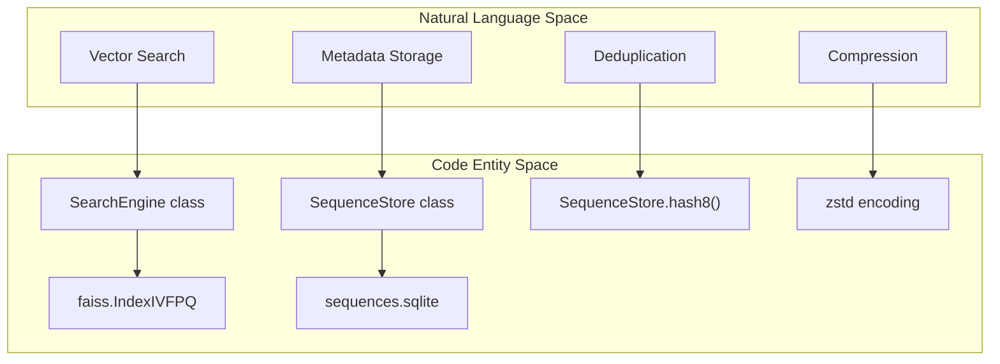
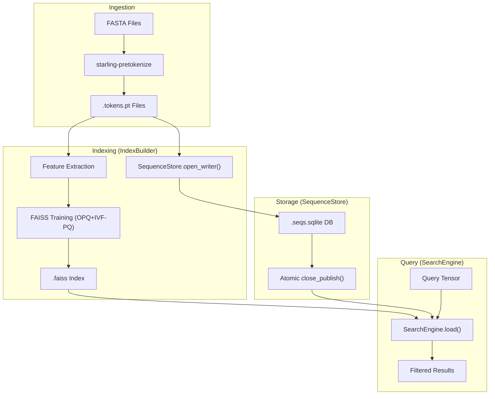

# Index Construction and SequenceStore

> **Relevant source files**
> * [starling/configs.py](https://github.com/idptools/starling/blob/4b98d2fe/starling/configs.py)
> * [starling/scripts/starling_pretokenize.py](https://github.com/idptools/starling/blob/4b98d2fe/starling/scripts/starling_pretokenize.py)
> * [starling/search/__init__.py](https://github.com/idptools/starling/blob/4b98d2fe/starling/search/__init__.py)
> * [starling/search/builder.py](https://github.com/idptools/starling/blob/4b98d2fe/starling/search/builder.py)
> * [starling/search/search_engine.py](https://github.com/idptools/starling/blob/4b98d2fe/starling/search/search_engine.py)
> * [starling/search/search_utils.py](https://github.com/idptools/starling/blob/4b98d2fe/starling/search/search_utils.py)
> * [starling/search/similarity_search.py](https://github.com/idptools/starling/blob/4b98d2fe/starling/search/similarity_search.py)
> * [starling/search/store.py](https://github.com/idptools/starling/blob/4b98d2fe/starling/search/store.py)

This page provides a technical reference for the STARLING search engine's indexing and storage subsystem. It covers the construction of high-performance FAISS indices, the SQLite-backed metadata storage, and the data encoding strategies used to manage billion-scale protein ensemble searches.

## Overview of Indexing Architecture

The STARLING search system is designed to handle massive datasets of protein sequence embeddings. It employs a two-tiered architecture:

1. **FAISS Index**: A vector database optimized for Approximate Nearest Neighbor (ANN) search using Product Quantization (PQ) and Inverted File (IVF) structures [starling/search/builder.py L10-L16](https://github.com/idptools/starling/blob/4b98d2fe/starling/search/builder.py#L10-L16) .
2. **SequenceStore**: A disk-resident SQLite database that stores raw sequences, headers, and metadata, allowing for efficient filtering and exact reranking without loading all sequences into memory [starling/search/store.py L9-L15](https://github.com/idptools/starling/blob/4b98d2fe/starling/search/store.py#L9-L15) .

### Code Entity Mapping: Indexing Subsystem

The following diagram maps high-level indexing concepts to the specific classes and files implementing them.

**Diagram: Indexing Architecture Mapping**



**Sources:** [starling/search/search_engine.py L93-L134](https://github.com/idptools/starling/blob/4b98d2fe/starling/search/search_engine.py#L93-L134)

, [starling/search/store.py L216-L230](https://github.com/idptools/starling/blob/4b98d2fe/starling/search/store.py#L216-L230)

, [starling/search/builder.py L5-L16](https://github.com/idptools/starling/blob/4b98d2fe/starling/search/builder.py#L5-L16)

.

---

## Index Construction with IndexBuilder

The `IndexBuilder` class manages the end-to-end pipeline of discovering sharded feature files and training a FAISS index.

### Shard Discovery and Feature Loading

The builder expects features to be stored in sharded `.pt` files following a specific directory structure [starling/search/builder.py L82-L90](https://github.com/idptools/starling/blob/4b98d2fe/starling/search/builder.py#L82-L90)

.

* **Discovery**: `IndexBuilder._discover_files` uses a regex (default: `uniref50_idrs_only_(\d{6})`) to extract shard IDs and verify file existence [starling/search/builder.py L136-L150](https://github.com/idptools/starling/blob/4b98d2fe/starling/search/builder.py#L136-L150) .
* **Feature Extraction**: `_extract_features_from_data` handles various input formats, including raw tensors and dictionaries of headers to tensors, ensuring all features are converted to `float32` [starling/search/builder.py L207-L230](https://github.com/idptools/starling/blob/4b98d2fe/starling/search/builder.py#L207-L230) .

### OPQ+IVF-PQ Training Pipeline

The `build_index` method implements a sophisticated training process [starling/search/builder.py L29-L39](https://github.com/idptools/starling/blob/4b98d2fe/starling/search/builder.py#L29-L39)

:

1. **OPQ (Optimized Product Quantization)**: If `use_opq=True`, a linear transformation is learned to rotate the data, minimizing quantization error [starling/search/builder.py L10-L16](https://github.com/idptools/starling/blob/4b98d2fe/starling/search/builder.py#L10-L16) .
2. **IVF (Inverted File)**: The space is partitioned into `nlist` clusters. Search is limited to the most relevant clusters (defined by `nprobe` at query time) [starling/search/builder.py L51-L56](https://github.com/idptools/starling/blob/4b98d2fe/starling/search/builder.py#L51-L56) .
3. **PQ (Product Quantization)**: Vectors are split into `m` sub-vectors, each quantized into `nbits` (usually 8) [starling/search/builder.py L57-L67](https://github.com/idptools/starling/blob/4b98d2fe/starling/search/builder.py#L57-L67) .

| Parameter | Role | Recommendation |
| --- | --- | --- |
| `sample_size` | Training vectors | 100-1000 per IVF cluster [starling/search/builder.py L45-L49](https://github.com/idptools/starling/blob/4b98d2fe/starling/search/builder.py#L45-L49) |
| `nlist` | IVF clusters | sqrt(N) to N/1000 [starling/search/builder.py L51-L54](https://github.com/idptools/starling/blob/4b98d2fe/starling/search/builder.py#L51-L54) |
| `m` | PQ subquantizers | Must divide vector dimension [starling/search/builder.py L57-L61](https://github.com/idptools/starling/blob/4b98d2fe/starling/search/builder.py#L57-L61) |
| `use_gpu` | Acceleration | Dramatically faster training [starling/search/builder.py L107](https://github.com/idptools/starling/blob/4b98d2fe/starling/search/builder.py#L107-L107) |

**Sources:** [starling/search/builder.py L41-L79](https://github.com/idptools/starling/blob/4b98d2fe/starling/search/builder.py#L41-L79)

, [starling/search/builder.py L153-L230](https://github.com/idptools/starling/blob/4b98d2fe/starling/search/builder.py#L153-L230)

.

---

## SequenceStore: Metadata and SQLite Schema

The `SequenceStore` provides indexed access to sequences using a single SQLite table [starling/search/store.py L20-L34](https://github.com/idptools/starling/blob/4b98d2fe/starling/search/store.py#L20-L34)

.

### Database Schema

```sql
CREATE TABLE sequences (    gid       INTEGER PRIMARY KEY,  -- Global ID matching FAISS index    len       INTEGER NOT NULL,     -- Sequence length for pre-filtering    hash8     INTEGER,              -- 8-byte hash for deduplication    seq       BLOB NOT NULL,        -- Encoded (possibly compressed) sequence    shard     INTEGER,              -- Source shard tracking    local_idx INTEGER,              -- Local index in shard    header    BLOB                  -- Encoded FASTA header);CREATE INDEX idx_len ON sequences(len);CREATE INDEX idx_hash8 ON sequences(hash8);
```

**Sources:** [starling/search/store.py L22-L34](https://github.com/idptools/starling/blob/4b98d2fe/starling/search/store.py#L22-L34)

.

### Blob Encoding and Zstd Compression

To save space, sequences and headers are stored as BLOBs with a 1-byte header flag [starling/search/store.py L89-L97](https://github.com/idptools/starling/blob/4b98d2fe/starling/search/store.py#L89-L97)

:

* `0x00`: Plain UTF-8 string.
* `0x01`: Zstd-compressed UTF-8 string.

The `encode_seq` and `decode_seq` static methods handle this transformation transparently [starling/search/store.py L143-L149](https://github.com/idptools/starling/blob/4b98d2fe/starling/search/store.py#L143-L149)

.

### Deduplication with hash8

During construction, an 8-byte hash is generated for each sequence using `SequenceStore.hash8(seq)` [starling/search/store.py L145](https://github.com/idptools/starling/blob/4b98d2fe/starling/search/store.py#L145-L145)

. This hash is used by the `ExactMatchFilter` during search to skip full sequence comparisons unless hashes match [starling/search/search_utils.py L129-L141](https://github.com/idptools/starling/blob/4b98d2fe/starling/search/search_utils.py#L129-L141)

.

---

## Data Flow: Construction to Search

The following diagram illustrates how data moves from raw FASTA files into the searchable index and how the `SequenceStore` is populated.

**Diagram: Construction Data Flow**



**Sources:** [starling/scripts/starling_pretokenize.py L8-L11](https://github.com/idptools/starling/blob/4b98d2fe/starling/scripts/starling_pretokenize.py#L8-L11)

, [starling/search/builder.py L91-L96](https://github.com/idptools/starling/blob/4b98d2fe/starling/search/builder.py#L91-L96)

, [starling/search/store.py L99-L109](https://github.com/idptools/starling/blob/4b98d2fe/starling/search/store.py#L99-L109)

, [starling/search/search_engine.py L156-L196](https://github.com/idptools/starling/blob/4b98d2fe/starling/search/search_engine.py#L156-L196)

.

---

## Reliability and Atomic Operations

STARLING implements patterns to ensure database integrity during heavy indexing tasks.

### Atomic Publish Pattern

The `SequenceStore` avoids corrupting active databases by building in a temporary file [starling/search/store.py L102-L107](https://github.com/idptools/starling/blob/4b98d2fe/starling/search/store.py#L102-L107)

.

1. `open_writer(path)` creates a unique `.tmp` file.
2. `insert_rows(rows)` performs bulk inserts using `executemany` for speed [starling/search/store.py L54-L55](https://github.com/idptools/starling/blob/4b98d2fe/starling/search/store.py#L54-L55) .
3. `close_publish()` performs a final `ANALYZE`, closes the connection, and uses `os.replace()` for an atomic move to the final destination [starling/search/store.py L57-L58](https://github.com/idptools/starling/blob/4b98d2fe/starling/search/store.py#L57-L58) .

### Read-Only Performance

When used for searching, `SearchEngine` opens the `SequenceStore` in an immutable, read-only mode [starling/search/store.py L113-L120](https://github.com/idptools/starling/blob/4b98d2fe/starling/search/store.py#L113-L120)

. This prevents locking issues and allows multiple concurrent search processes to access the same SQLite file without overhead.

**Sources:** [starling/search/store.py L99-L120](https://github.com/idptools/starling/blob/4b98d2fe/starling/search/store.py#L99-L120)

, [starling/search/search_engine.py L186-L196](https://github.com/idptools/starling/blob/4b98d2fe/starling/search/search_engine.py#L186-L196)

.