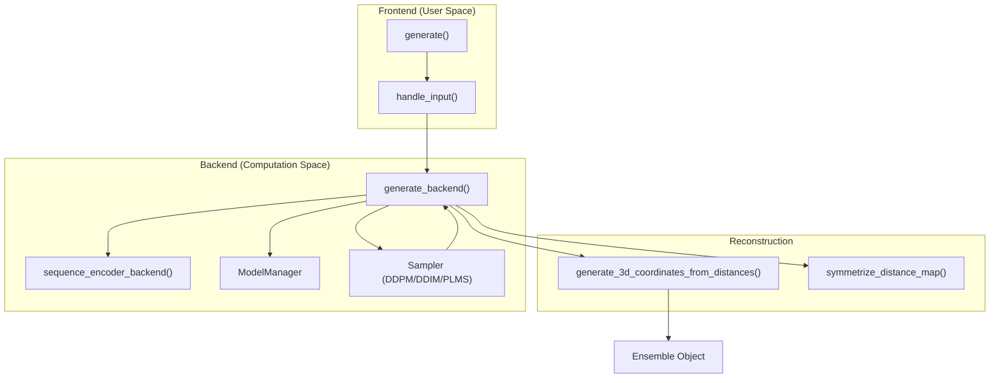
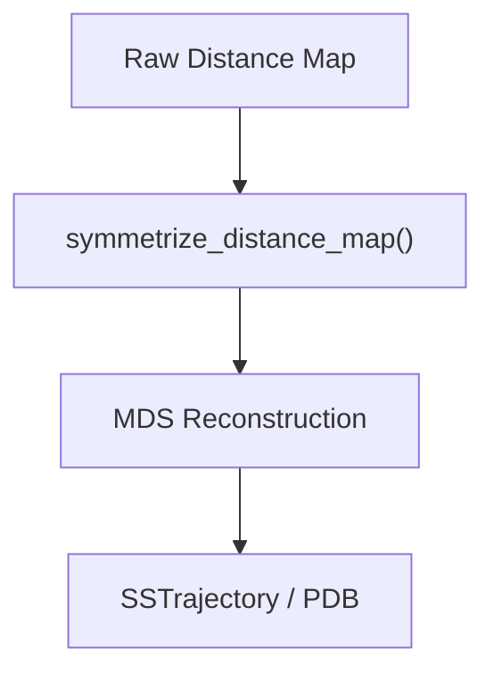

# Inference Pipeline

> **Relevant source files**
> * [starling/frontend/ensemble_generation.py](https://github.com/idptools/starling/blob/4b98d2fe/starling/frontend/ensemble_generation.py)
> * [starling/inference/generation.py](https://github.com/idptools/starling/blob/4b98d2fe/starling/inference/generation.py)

The STARLING inference pipeline is the end-to-end process that transforms a raw protein sequence into a structural ensemble. This pipeline orchestrates input validation, sequence encoding, diffusion-based sampling in latent space, decoding to distance maps, and final 3D coordinate reconstruction.

### Pipeline Overview

The transformation from sequence to ensemble follows a strictly defined path managed by the `generate()` [starling/frontend/ensemble_generation.py L160-L182](https://github.com/idptools/starling/blob/4b98d2fe/starling/frontend/ensemble_generation.py#L160-L182)

 entrypoint. The process is divided into a frontend validation stage and a backend execution stage to ensure memory efficiency and computational performance.

#### Data Flow Summary

1. **Frontend**: Normalizes inputs (FASTA, TSV, strings) and validates sequence lengths and residues.
2. **Encoding**: The `SequenceEncoder` transforms amino acid tokens into high-dimensional embeddings conditioned on ionic strength.
3. **Sampling**: A diffusion sampler (DDPM, DDIM, or PLMS) iteratively denoises a latent representation guided by the sequence embeddings and optional structural constraints.
4. **Decoding**: The VAE decoder transforms latents into $L \times L$ distance maps.
5. **Post-processing**: Distance maps are symmetrized, and 3D coordinates are reconstructed via Multidimensional Scaling (MDS).
6. **Persistence**: Data is wrapped in `Ensemble` objects and optionally saved to disk.

### System Mapping: API to Code Entities

The following diagram maps high-level pipeline stages to the specific functions and classes within the `starling` codebase.

**Pipeline Component Mapping**

**Sources:** [starling/frontend/ensemble_generation.py L10-L140](https://github.com/idptools/starling/blob/4b98d2fe/starling/frontend/ensemble_generation.py#L10-L140)

 [starling/frontend/ensemble_generation.py L160-L265](https://github.com/idptools/starling/blob/4b98d2fe/starling/frontend/ensemble_generation.py#L160-L265)

 [starling/inference/generation.py L64-L122](https://github.com/idptools/starling/blob/4b98d2fe/starling/inference/generation.py#L64-L122)

 [starling/inference/generation.py L255-L350](https://github.com/idptools/starling/blob/4b98d2fe/starling/inference/generation.py#L255-L350)

---

### 1. Frontend API

The frontend serves as the user-facing interface, handling the "dirty work" of parsing various input formats and ensuring the model receives valid data. It utilizes `handle_input()` [starling/frontend/ensemble_generation.py L10-L61](https://github.com/idptools/starling/blob/4b98d2fe/starling/frontend/ensemble_generation.py#L10-L61)

 to convert FASTA files, TSV files, or raw strings into a standardized `sequence_dict`.

Key responsibilities include:

* **Validation**: Enforcing `MAX_SEQUENCE_LENGTH` [starling/frontend/ensemble_generation.py L204-L207](https://github.com/idptools/starling/blob/4b98d2fe/starling/frontend/ensemble_generation.py#L204-L207)  and filtering non-canonical amino acids via `clean_sequence()` [starling/frontend/ensemble_generation.py L66-L74](https://github.com/idptools/starling/blob/4b98d2fe/starling/frontend/ensemble_generation.py#L66-L74)
* **Resource Management**: Selecting the appropriate `device` (CPU/CUDA) and managing batch sizes for GPU memory optimization.

For details, see [Frontend API: generate(), sequence_encoder(), and ensemble_encoder()](/idptools/starling/4.1-frontend-api:-generate()-sequence_encoder()-and-ensemble_encoder()).

**Sources:** [starling/frontend/ensemble_generation.py L10-L182](https://github.com/idptools/starling/blob/4b98d2fe/starling/frontend/ensemble_generation.py#L10-L182)

---

### 2. Backend Generation Loop

The backend is where the generative heavy lifting occurs. The `generate_backend()` [starling/inference/generation.py L255-L350](https://github.com/idptools/starling/blob/4b98d2fe/starling/inference/generation.py#L255-L350)

 function manages the lifecycle of the diffusion process. It lazily loads models using the `ModelManager` singleton [starling/inference/generation.py L23-L26](https://github.com/idptools/starling/blob/4b98d2fe/starling/inference/generation.py#L23-L26)

 to avoid redundant VRAM usage.

The backend performs:

* **Sequence Encoding**: Calling `sequence_encoder_backend()` [starling/inference/generation.py L64-L79](https://github.com/idptools/starling/blob/4b98d2fe/starling/inference/generation.py#L64-L79)  to generate conditioning embeddings.
* **Latent Sampling**: Running the `p_sample_loop` of the chosen sampler to generate latent tensors.
* **Decoding**: Passing latents through the VAE decoder to produce distance maps.

For details, see [Backend Generation: generate_backend and sequence_encoder_backend](/idptools/starling/4.2-backend-generation:-generate_backend-and-sequence_encoder_backend).

**Sources:** [starling/inference/generation.py L64-L350](https://github.com/idptools/starling/blob/4b98d2fe/starling/inference/generation.py#L64-L350)

---

### 3. Symmetrization and 3D Reconstruction

Distance maps generated by the VAE are not guaranteed to be perfectly symmetric or physically realizable in 3D space. The pipeline applies a `symmetrize_distance_map()` [starling/inference/generation.py L29-L61](https://github.com/idptools/starling/blob/4b98d2fe/starling/inference/generation.py#L29-L61)

 step, which enforces symmetry by mirroring the upper triangle to the lower triangle and zeroing the diagonal.

Final 3D coordinates are produced using `generate_3d_coordinates_from_distances()` [starling/structure/coordinates.py L19-L20](https://github.com/idptools/starling/blob/4b98d2fe/starling/structure/coordinates.py#L19-L20)

 This step typically uses Multidimensional Scaling (MDS) to find the $N \times 3$ coordinate matrix that best satisfies the predicted distances.

**Reconstruction Flow**

**Sources:** [starling/inference/generation.py L29-L61](https://github.com/idptools/starling/blob/4b98d2fe/starling/inference/generation.py#L29-L61)

 [starling/inference/generation.py L440-L470](https://github.com/idptools/starling/blob/4b98d2fe/starling/inference/generation.py#L440-L470)

---

### 4. Constrained Generation

STARLING supports "Guided Diffusion," where structural constraints (e.g., Radius of Gyration, specific residue distances, or secondary structure biases) are applied during the sampling process. This is implemented via a `constraint` parameter in the `generate()` function [starling/frontend/ensemble_generation.py L179](https://github.com/idptools/starling/blob/4b98d2fe/starling/frontend/ensemble_generation.py#L179-L179)

 which passes gradients from a potential function to the sampler at each denoising step.

For details, see [Constrained Generation](/idptools/starling/4.3-constrained-generation).

**Sources:** [starling/frontend/ensemble_generation.py L160-L182](https://github.com/idptools/starling/blob/4b98d2fe/starling/frontend/ensemble_generation.py#L160-L182)

 [starling/inference/generation.py L380-L410](https://github.com/idptools/starling/blob/4b98d2fe/starling/inference/generation.py#L380-L410)