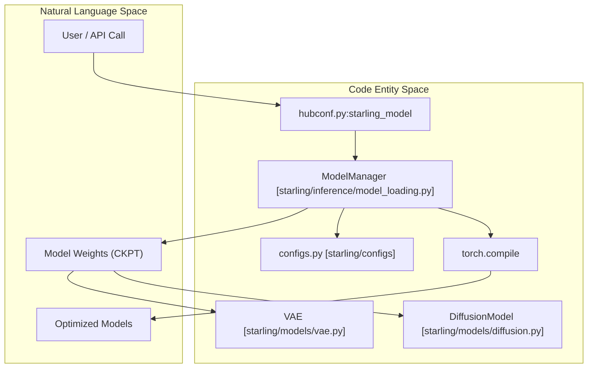
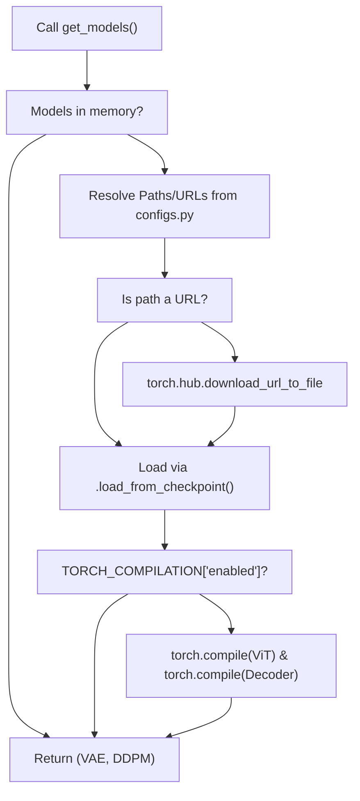

# Model Loading and Inference Infrastructure

> **Relevant source files**
> * [hubconf.py](https://github.com/idptools/starling/blob/4b98d2fe/hubconf.py)
> * [starling/configs.py](https://github.com/idptools/starling/blob/4b98d2fe/starling/configs.py)
> * [starling/data/ddpm_loader_tar.py](https://github.com/idptools/starling/blob/4b98d2fe/starling/data/ddpm_loader_tar.py)
> * [starling/inference/model_loading.py](https://github.com/idptools/starling/blob/4b98d2fe/starling/inference/model_loading.py)

This page details the infrastructure responsible for managing model lifecycles, weight acquisition, and inference-time optimizations. The system is built around a centralized manager that handles lazy loading, remote weight retrieval from GitHub/Zenodo, and optional `torch.compile` integration for high-performance sampling.

## ModelManager Singleton

The `ModelManager` class [starling/inference/model_loading.py L16-L17](https://github.com/idptools/starling/blob/4b98d2fe/starling/inference/model_loading.py#L16-L17)

 acts as the central orchestrator for the two primary neural components: the **VAE** (Encoder/Decoder) and the **Diffusion Model** (DDPM). It ensures that models are only instantiated when needed and provides a unified interface for loading weights from diverse sources.

### Lazy Loading and Initialization

The manager implements a lazy-loading pattern via `get_models()` [starling/inference/model_loading.py L63-L100](https://github.com/idptools/starling/blob/4b98d2fe/starling/inference/model_loading.py#L63-L100)

 When models are requested, the manager checks if they are already resident in memory; if not, it triggers the full loading and compilation sequence.

**Data Flow for Model Initialization:**

1. **Path Resolution**: The manager resolves local paths or URLs for both the Encoder and DDPM weights using defaults from `starling.configs` [starling/inference/model_loading.py L36-L40](https://github.com/idptools/starling/blob/4b98d2fe/starling/inference/model_loading.py#L36-L40)
2. **Weight Acquisition**: If a path starts with `http`, the `load_from_path_or_url` helper downloads the file to the local `torch.hub` cache [starling/inference/model_loading.py L24-L33](https://github.com/idptools/starling/blob/4b98d2fe/starling/inference/model_loading.py#L24-L33)
3. **Component Assembly**: * Instantiates a `SequenceEncoder` [starling/inference/model_loading.py L49](https://github.com/idptools/starling/blob/4b98d2fe/starling/inference/model_loading.py#L49-L49) * Loads the `DiffusionModel` using `load_from_checkpoint`, injecting a `ViT` backbone and the `SequenceEncoder` [starling/inference/model_loading.py L50-L56](https://github.com/idptools/starling/blob/4b98d2fe/starling/inference/model_loading.py#L50-L56) * Loads the `VAE` using `load_from_checkpoint` [starling/inference/model_loading.py L57-L60](https://github.com/idptools/starling/blob/4b98d2fe/starling/inference/model_loading.py#L57-L60)
4. **Compilation**: If enabled in configuration, the models are passed through the `compile()` method [starling/inference/model_loading.py L95-L97](https://github.com/idptools/starling/blob/4b98d2fe/starling/inference/model_loading.py#L95-L97)

### Sources:

* `starling/inference/model_loading.py:16-131`()
* `starling/configs.py:74-91`()

## Weight Management and URL Downloads

STARLING supports automatic weight downloading to facilitate ease of use. The system defaults to specific GitHub release versions but can be overridden via environment variables.

| Configuration Key | Default Value / URL | Purpose |
| --- | --- | --- |
| `DEFAULT_ENCODE_WEIGHTS` | `STARLING_v2.0.0_ViT_VAE_2025_10_14.ckpt` | Default VAE checkpoint name [starling/configs.py L14](https://github.com/idptools/starling/blob/4b98d2fe/starling/configs.py#L14-L14) |
| `GITHUB_ENCODER_URL` | `.../v2.0.0/STARLING_v2.0.0_ViT_VAE_2025_10_14.ckpt` | Remote VAE weight source [starling/configs.py L82-L84](https://github.com/idptools/starling/blob/4b98d2fe/starling/configs.py#L82-L84) |
| `GITHUB_DDPM_URL` | `.../v2.0.0/STARLING_v2.0.0_ViT_DDPM_2025_10_14.ckpt` | Remote DDPM weight source [starling/configs.py L85](https://github.com/idptools/starling/blob/4b98d2fe/starling/configs.py#L85-L85) |
| `STARLING_ENCODER_PATH` | Environment Variable | Override for local/remote VAE weights [starling/configs.py L88-L90](https://github.com/idptools/starling/blob/4b98d2fe/starling/configs.py#L88-L90) |

### Implementation Detail: load_from_path_or_url

This internal function in `ModelManager` leverages `torch.hub.download_url_to_file` to manage the local cache directory (typically `~/.cache/torch/hub/checkpoints/`) [starling/inference/model_loading.py L24-L33](https://github.com/idptools/starling/blob/4b98d2fe/starling/inference/model_loading.py#L24-L33)

### Sources:

* `starling/configs.py:8-25`()
* `starling/configs.py:81-91`()
* `starling/inference/model_loading.py:24-33`()

## Torch Compile Integration

To accelerate inference, STARLING integrates with `torch.compile`. This is particularly beneficial for the diffusion sampling loop, which requires multiple iterations of the ViT backbone.

### Compilation Logic

The `compile()` method [starling/inference/model_loading.py L102-L130](https://github.com/idptools/starling/blob/4b98d2fe/starling/inference/model_loading.py#L102-L130)

 applies `torch.compile` to specific sub-modules:

* `diffusion_model.model` (the ViT backbone) [starling/inference/model_loading.py L109-L111](https://github.com/idptools/starling/blob/4b98d2fe/starling/inference/model_loading.py#L109-L111)
* `encoder_model.decoder` (used to transform latents back to distance maps) [starling/inference/model_loading.py L112-L114](https://github.com/idptools/starling/blob/4b98d2fe/starling/inference/model_loading.py#L112-L114)

### Configuration Settings

Compilation behavior is controlled via the `TORCH_COMPILATION` dictionary in `configs.py` [starling/configs.py L27-L35](https://github.com/idptools/starling/blob/4b98d2fe/starling/configs.py#L27-L35)

:

* `enabled`: Boolean flag (default `False`).
* `options`: Dictionary passed to `torch.compile`, including `mode` (e.g., `reduce-overhead`), `fullgraph`, and `backend`.

### Sources:

* `starling/inference/model_loading.py:102-131`()
* `starling/configs.py:26-35`()

## PyTorch Hub Entrypoint

The `hubconf.py` file allows users to load STARLING models directly using the standard PyTorch Hub API without manually cloning the repository.

### Function: starling_model

This entrypoint [hubconf.py L6-L18](https://github.com/idptools/starling/blob/4b98d2fe/hubconf.py#L6-L18)

 provides a simplified interface:

1. It instantiates a `ModelManager`.
2. It calls `model_manager.get_models(device=device)`.
3. It returns the tuple `(encoder_model, diffusion_model)`.

**Usage Example:**

```javascript
import torchencoder, diffusion = torch.hub.load('idptools/starling', 'starling_model', device='cuda')
```

### Sources:

* `hubconf.py:1-19`()

## Infrastructure Architecture Diagrams

### System Entity Mapping: Inference Setup

This diagram bridges the conceptual "Loading" phase to the specific classes and files involved.



**Sources:** `hubconf.py:6-18`(), `starling/inference/model_loading.py:16-100`(), `starling/configs.py:74-91`()

### Data Flow: Weight Acquisition and Compilation

This diagram illustrates the logic flow inside `ModelManager.get_models`.



**Sources:** `starling/inference/model_loading.py:21-61`(), `starling/inference/model_loading.py:63-100`(), `starling/inference/model_loading.py:102-130`()