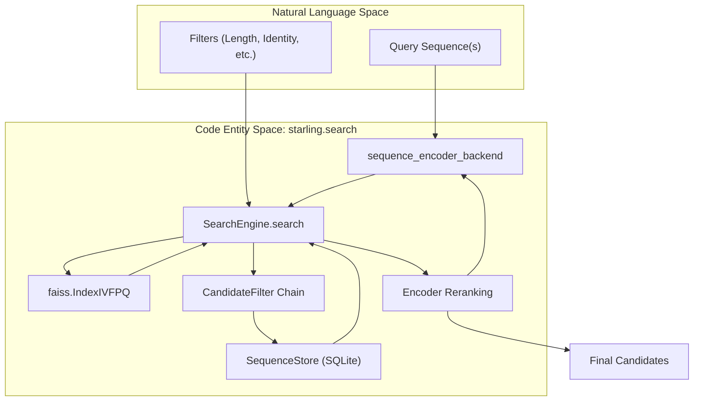
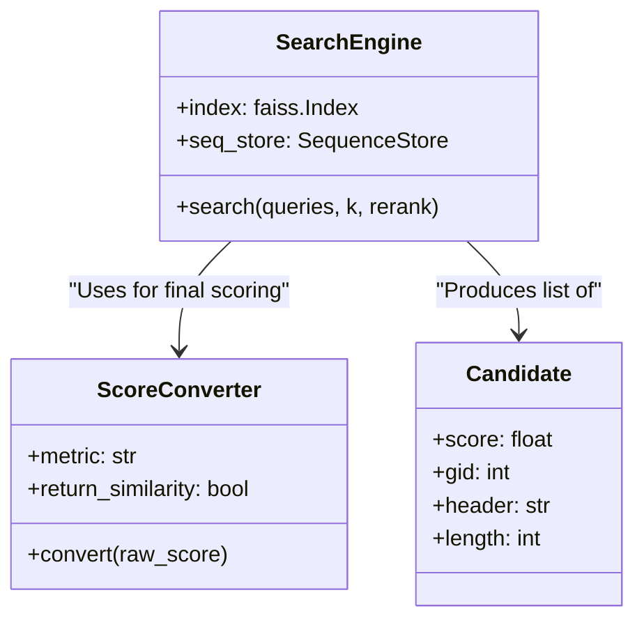

# Querying and Filtering

> **Relevant source files**
> * [starling/inference/benchmark_mds.py](https://github.com/idptools/starling/blob/4b98d2fe/starling/inference/benchmark_mds.py)
> * [starling/inference/generation.py](https://github.com/idptools/starling/blob/4b98d2fe/starling/inference/generation.py)
> * [starling/scripts/starling_pretokenize.py](https://github.com/idptools/starling/blob/4b98d2fe/starling/scripts/starling_pretokenize.py)
> * [starling/scripts/starling_search.py](https://github.com/idptools/starling/blob/4b98d2fe/starling/scripts/starling_search.py)
> * [starling/search/__init__.py](https://github.com/idptools/starling/blob/4b98d2fe/starling/search/__init__.py)
> * [starling/search/builder.py](https://github.com/idptools/starling/blob/4b98d2fe/starling/search/builder.py)
> * [starling/search/search_engine.py](https://github.com/idptools/starling/blob/4b98d2fe/starling/search/search_engine.py)
> * [starling/search/search_utils.py](https://github.com/idptools/starling/blob/4b98d2fe/starling/search/search_utils.py)
> * [starling/search/similarity_search.py](https://github.com/idptools/starling/blob/4b98d2fe/starling/search/similarity_search.py)
> * [starling/search/store.py](https://github.com/idptools/starling/blob/4b98d2fe/starling/search/store.py)

Similarity search in STARLING enables high-performance retrieval of protein sequences and ensembles based on embedding distance. The `SearchEngine` provides a unified interface for Approximate Nearest Neighbor (ANN) search, multi-level filtering (length, identity, exact matches), and high-precision reranking using the diffusion model's sequence encoder.

## Search Pipeline Overview

The search process follows a multi-stage execution flow designed to maximize recall while minimizing expensive sequence alignments and GPU transfers.

### Data Flow Diagram

The following diagram illustrates the transition from a user query sequence to the final filtered and reranked results.

**Search Engine Execution Flow**



**Sources:** [starling/search/search_engine.py L93-L134](https://github.com/idptools/starling/blob/4b98d2fe/starling/search/search_engine.py#L93-L134)

 [starling/search/search_engine.py L228-L360](https://github.com/idptools/starling/blob/4b98d2fe/starling/search/search_engine.py#L228-L360)

 [starling/search/store.py L215-L230](https://github.com/idptools/starling/blob/4b98d2fe/starling/search/store.py#L215-L230)

---

## Candidate Discovery and Length Pre-filtering

The search begins by generating query embeddings via `sequence_encoder_backend` [starling/inference/generation.py L64-L79](https://github.com/idptools/starling/blob/4b98d2fe/starling/inference/generation.py#L64-L79)

 These embeddings are then passed to `SearchEngine.search` [starling/search/search_engine.py L228](https://github.com/idptools/starling/blob/4b98d2fe/starling/search/search_engine.py#L228-L228)

### Length Gating

To optimize performance, STARLING supports **Length Gating** using FAISS `IDSelectorBatch`. If `length_min` or `length_max` are provided:

1. The `SequenceStore` queries its SQLite `idx_len` index to retrieve all Global IDs (GIDs) within the specified length range [starling/search/store.py L32](https://github.com/idptools/starling/blob/4b98d2fe/starling/search/store.py#L32-L32)
2. These GIDs are wrapped in a `faiss.IDSelectorBatch` [starling/search/search_engine.py L330-L336](https://github.com/idptools/starling/blob/4b98d2fe/starling/search/search_engine.py#L330-L336)
3. The FAISS index restricts the ANN search exclusively to these GIDs, significantly reducing the search space and improving accuracy for length-constrained queries.

### Overfetching

Because post-search filters (like sequence identity) may prune results, the engine uses an `overfetch` factor to retrieve more candidates than requested (`k`) [starling/search/search_engine.py L198-L212](https://github.com/idptools/starling/blob/4b98d2fe/starling/search/search_engine.py#L198-L212)

**Sources:** [starling/search/search_engine.py L324-L340](https://github.com/idptools/starling/blob/4b98d2fe/starling/search/search_engine.py#L324-L340)

 [starling/search/store.py L77-L79](https://github.com/idptools/starling/blob/4b98d2fe/starling/search/store.py#L77-L79)

---

## CandidateFilter Chain

After the initial ANN retrieval, candidates are passed through a chain of `CandidateFilter` objects [starling/search/search_utils.py L165-L177](https://github.com/idptools/starling/blob/4b98d2fe/starling/search/search_utils.py#L165-L177)

 Filters are ordered by computational cost, where the most expensive (alignment-based identity) occurs last.

| Filter Class | Purpose | Data Source |
| --- | --- | --- |
| `ValidGidFilter` | Removes invalid/empty results from FAISS | FAISS GID |
| `L2DistanceFilter` | Prunes by distance threshold | FAISS Score |
| `CosineSimFilter` | Prunes by similarity threshold | FAISS Score |
| `LengthFilter` | Enforces specific length ranges | `SequenceStore` metadata |
| `ExactMatchFilter` | Removes sequences identical to query | `SequenceStore` + `hash8` |
| `SequenceIdentityFilter` | Prunes by sequence identity percentage | `SequenceStore` + Alignment |

### Exact Match and Identity Filtering

The `ExactMatchFilter` utilizes an 8-byte hash (`hash8`) stored in the `SequenceStore` for O(1) initial comparison before falling back to a full sequence string comparison [starling/search/search_utils.py L129-L141](https://github.com/idptools/starling/blob/4b98d2fe/starling/search/search_utils.py#L129-L141)

 The `SequenceIdentityFilter` performs local or global alignment to enforce diversity in search results [starling/search/search_utils.py L143-L163](https://github.com/idptools/starling/blob/4b98d2fe/starling/search/search_utils.py#L143-L163)

**Sources:** [starling/search/search_utils.py L72-L82](https://github.com/idptools/starling/blob/4b98d2fe/starling/search/search_utils.py#L72-L82)

 [starling/search/search_engine.py L388-L420](https://github.com/idptools/starling/blob/4b98d2fe/starling/search/search_engine.py#L388-L420)

---

## Reranking and Score Conversion

### Encoder Reranking

While the FAISS index uses compressed vectors (Product Quantization), the `SearchEngine` can optionally perform **Reranking** for higher precision [starling/search/search_engine.py L438-L460](https://github.com/idptools/starling/blob/4b98d2fe/starling/search/search_engine.py#L438-L460)

1. The engine fetches raw sequences for the top-N candidates from the `SequenceStore`.
2. These sequences are passed back to `sequence_encoder_backend` to generate full-precision embeddings.
3. Distances are re-calculated using the exact embeddings, and candidates are re-sorted.

### Score Conversion

The `ScoreConverter` utility standardizes outputs regardless of the underlying metric [starling/search/search_utils.py L18-L33](https://github.com/idptools/starling/blob/4b98d2fe/starling/search/search_utils.py#L18-L33)

* **Cosine Metric:** FAISS returns inner products. `ScoreConverter` can return these as similarities $[0, 1]$ or distances $(1 - \text{similarity})$.
* **L2 Metric:** FAISS returns squared L2 distances. `ScoreConverter` passes these through as distances.

**Metric Handling Logic**



**Sources:** [starling/search/search_utils.py L219-L230](https://github.com/idptools/starling/blob/4b98d2fe/starling/search/search_utils.py#L219-L230)

 [starling/search/search_engine.py L438-L460](https://github.com/idptools/starling/blob/4b98d2fe/starling/search/search_engine.py#L438-L460)

 [starling/inference/generation.py L64-L79](https://github.com/idptools/starling/blob/4b98d2fe/starling/inference/generation.py#L64-L79)

---

## CLI Usage

The `starling_search` script provides a command-line interface for these operations [starling/scripts/starling_search.py L1-L7](https://github.com/idptools/starling/blob/4b98d2fe/starling/scripts/starling_search.py#L1-L7)

### Building an Index

To build an index with sequence metadata, the sequences must first be processed by `starling-pretokenize` [starling/scripts/starling_pretokenize.py L1-L11](https://github.com/idptools/starling/blob/4b98d2fe/starling/scripts/starling_pretokenize.py#L1-L11)

 The `IndexBuilder` then creates the `.faiss` index and the `.seqs.sqlite` store [starling/search/builder.py L80-L96](https://github.com/idptools/starling/blob/4b98d2fe/starling/search/builder.py#L80-L96)

### Querying via CLI

The `query` command supports all filtering parameters:

```
starling_search query --index myindex.faiss \    --seq "MKTLLIL..." \    --k 20 \    --length-min 50 --length-max 200 \    --exclude-exact \    --rerank
```

The results are written to CSV or JSONL, including the metadata retrieved from the `SequenceStore` [starling/scripts/starling_search.py L108-L157](https://github.com/idptools/starling/blob/4b98d2fe/starling/scripts/starling_search.py#L108-L157)

**Sources:** [starling/scripts/starling_search.py L69-L105](https://github.com/idptools/starling/blob/4b98d2fe/starling/scripts/starling_search.py#L69-L105)

 [starling/search/builder.py L152-L190](https://github.com/idptools/starling/blob/4b98d2fe/starling/search/builder.py#L152-L190)