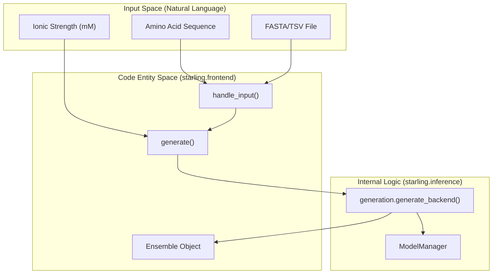
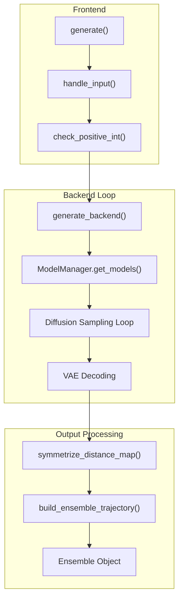

# Quick Start: Generating Ensembles

> **Relevant source files**
> * [changelog.md](https://github.com/idptools/starling/blob/4b98d2fe/changelog.md?plain=1)
> * [demos/basic_usage.ipynb](https://github.com/idptools/starling/blob/4b98d2fe/demos/basic_usage.ipynb)
> * [demos/constraining_ensembles.ipynb](https://github.com/idptools/starling/blob/4b98d2fe/demos/constraining_ensembles.ipynb)
> * [demos/structural_ensemble.ipynb](https://github.com/idptools/starling/blob/4b98d2fe/demos/structural_ensemble.ipynb)
> * [docs/autosummary/starling.structure.ensemble.Ensemble.rst](https://github.com/idptools/starling/blob/4b98d2fe/docs/autosummary/starling.structure.ensemble.Ensemble.rst)
> * [docs/getting_started.rst](https://github.com/idptools/starling/blob/4b98d2fe/docs/getting_started.rst)
> * [docs/usage/cli.rst](https://github.com/idptools/starling/blob/4b98d2fe/docs/usage/cli.rst)
> * [docs/usage/ensemble_generation.rst](https://github.com/idptools/starling/blob/4b98d2fe/docs/usage/ensemble_generation.rst)
> * [starling/frontend/ensemble_generation.py](https://github.com/idptools/starling/blob/4b98d2fe/starling/frontend/ensemble_generation.py)
> * [starling/scripts/starling_main_cli.py](https://github.com/idptools/starling/blob/4b98d2fe/starling/scripts/starling_main_cli.py)

This page provides a practical guide for generating protein structural ensembles using STARLING. It covers the high-level `generate()` interface available via both the Python API and the Command Line Interface (CLI), detailing input/output formats and key sampling parameters.

### Overview of Ensemble Generation

The core entry point for ensemble generation is the `generate()` function. It orchestrates a two-stage generative pipeline: a Latent Diffusion Model (DDPM/DDIM) produces distance maps in a compressed latent space, which are then decoded by a Variational Autoencoder (VAE) and reconstructed into 3D coordinates using Multidimensional Scaling (MDS) [starling/frontend/ensemble_generation.py L160-L182](https://github.com/idptools/starling/blob/4b98d2fe/starling/frontend/ensemble_generation.py#L160-L182)

#### Data Flow: Sequence to Ensemble

The following diagram maps the transition from natural language inputs (sequences) to code entities and final data structures.

**Diagram: Natural Language to Code Entity Mapping**



Sources: [starling/frontend/ensemble_generation.py L10-L105](https://github.com/idptools/starling/blob/4b98d2fe/starling/frontend/ensemble_generation.py#L10-L105)

 [starling/frontend/ensemble_generation.py L160-L265](https://github.com/idptools/starling/blob/4b98d2fe/starling/frontend/ensemble_generation.py#L160-L265)

 [starling/inference/generation.py L1-L50](https://github.com/idptools/starling/blob/4b98d2fe/starling/inference/generation.py#L1-L50)

---

### Using the Python API

The `generate()` function is the primary high-level interface. It handles input normalization, sequence validation, and delegates to the backend sampling loops.

#### Input Formats

The `handle_input()` utility processes various formats into a standard `name: sequence` dictionary [starling/frontend/ensemble_generation.py L10-L61](https://github.com/idptools/starling/blob/4b98d2fe/starling/frontend/ensemble_generation.py#L10-L61)

:

* **String**: A single amino acid sequence.
* **List**: A list of sequences (automatically named `sequence_1`, `sequence_2`, etc.).
* **Dictionary**: A mapping of custom names to sequences.
* **Files**: Path to a `.fasta`, `.tsv`, or `.in` file [starling/frontend/ensemble_generation.py L79-L105](https://github.com/idptools/starling/blob/4b98d2fe/starling/frontend/ensemble_generation.py#L79-L105)

#### Basic Usage Example

```javascript
import starling # Single sequence generationsequence = "MDVFMKGLSKAKEGVVAAAEKTKQGVAEAAGKTKEGVLYVGSKTKEGVVHGVATVAEKTKEQVTNVGGAVVTGVTAVAQKTVEGAGSIAAATGFVKKDQLGKNEEGAPQEGILEDMPVDPDNEAYEMPSEEGYQDYEPEA"ensemble = starling.generate(sequence, conformations=100, return_single_ensemble=True) # Accessing propertiesprint(f"Mean Rg: {ensemble.radius_of_gyration(return_mean=True)} Å")ensemble.save("my_ensemble.starling")
```

Sources: [starling/frontend/ensemble_generation.py L160-L182](https://github.com/idptools/starling/blob/4b98d2fe/starling/frontend/ensemble_generation.py#L160-L182)

 [demos/basic_usage.ipynb L59-L63](https://github.com/idptools/starling/blob/4b98d2fe/demos/basic_usage.ipynb#L59-L63)

 [docs/getting_started.rst L58-L69](https://github.com/idptools/starling/blob/4b98d2fe/docs/getting_started.rst#L58-L69)

#### Key Parameters

| Parameter | Default | Description |
| --- | --- | --- |
| `conformations` | 400 | Number of structures to generate in the ensemble. |
| `steps` | 30 | Number of diffusion refinement steps. |
| `ionic_strength` | 150 | Solvent condition in mM (supports 20, 150, 300). |
| `sampler` | "ddim" | Sampling algorithm ("ddpm", "ddim", "plms"). |
| `device` | None | Hardware target (e.g., "cuda:0", "cpu", "mps"). |
| `return_structures` | False | If True, triggers 3D coordinate reconstruction (MDS). |

Sources: [starling/frontend/ensemble_generation.py L160-L182](https://github.com/idptools/starling/blob/4b98d2fe/starling/frontend/ensemble_generation.py#L160-L182)

 [starling/configs.py L1-L50](https://github.com/idptools/starling/blob/4b98d2fe/starling/configs.py#L1-L50)

---

### Using the Command Line Interface (CLI)

STARLING provides a `starling` command for shell-based generation. It mirrors the Python `generate()` function arguments [starling/scripts/starling_main_cli.py L45-L156](https://github.com/idptools/starling/blob/4b98d2fe/starling/scripts/starling_main_cli.py#L45-L156)

#### CLI Examples

**Generate from a string:**

```
starling "ACDEFGHIKLMNPQRSTVWY" -c 100 --outname my_prot -r
```

**Generate from a FASTA file with specific ionic strength:**

```
starling input.fasta --ionic_strength 20 --output_directory ./results
```

Sources: [starling/scripts/starling_main_cli.py L50-L132](https://github.com/idptools/starling/blob/4b98d2fe/starling/scripts/starling_main_cli.py#L50-L132)

 [docs/usage/cli.rst L9-L23](https://github.com/idptools/starling/blob/4b98d2fe/docs/usage/cli.rst#L9-L23)

#### Benchmarking

The `starling-benchmark` tool allows users to profile performance on their specific hardware [starling/scripts/starling_main_cli.py L211-L230](https://github.com/idptools/starling/blob/4b98d2fe/starling/scripts/starling_main_cli.py#L211-L230)

:

```
starling-benchmark --device cuda:0 --batch_size 64 --steps 25
```

Sources: [starling/scripts/starling_main_cli.py L211-L230](https://github.com/idptools/starling/blob/4b98d2fe/starling/scripts/starling_main_cli.py#L211-L230)

 [docs/usage/cli.rst L40-L51](https://github.com/idptools/starling/blob/4b98d2fe/docs/usage/cli.rst#L40-L51)

---

### Implementation Details

The `generate()` function performs several validation steps before invoking the `generate_backend()` [starling/frontend/ensemble_generation.py L240-L330](https://github.com/idptools/starling/blob/4b98d2fe/starling/frontend/ensemble_generation.py#L240-L330)

:

1. **Sequence Validation**: Checks for non-canonical amino acids and enforces a maximum length of 380 residues [starling/frontend/ensemble_generation.py L66-L74](https://github.com/idptools/starling/blob/4b98d2fe/starling/frontend/ensemble_generation.py#L66-L74)
2. **Device Setup**: Auto-detects available accelerators (CUDA, MPS) if `device` is not specified [starling/scripts/starling_main_cli.py L36](https://github.com/idptools/starling/blob/4b98d2fe/starling/scripts/starling_main_cli.py#L36-L36)
3. **Batching**: Organizes sequences into batches based on `batch_size` to optimize GPU memory utilization [starling/frontend/ensemble_generation.py L260-L280](https://github.com/idptools/starling/blob/4b98d2fe/starling/frontend/ensemble_generation.py#L260-L280)
4. **Reconstruction**: If `return_structures` is True, it invokes the MDS-based coordinate builder [starling/frontend/ensemble_generation.py L285-L300](https://github.com/idptools/starling/blob/4b98d2fe/starling/frontend/ensemble_generation.py#L285-L300)

**Diagram: Internal Execution Flow**



Sources: [starling/frontend/ensemble_generation.py L10-L182](https://github.com/idptools/starling/blob/4b98d2fe/starling/frontend/ensemble_generation.py#L10-L182)

 [starling/inference/generation.py L1-L100](https://github.com/idptools/starling/blob/4b98d2fe/starling/inference/generation.py#L1-L100)

 [starling/structure/ensemble.py L1-L50](https://github.com/idptools/starling/blob/4b98d2fe/starling/structure/ensemble.py#L1-L50)

---

### Output Formats

STARLING generates several output types depending on the parameters:

* **`.starling`**: A serialized `Ensemble` object containing metadata and distance maps [starling/structure/ensemble.py L30-L35](https://github.com/idptools/starling/blob/4b98d2fe/starling/structure/ensemble.py#L30-L35)
* **`.pdb` / `.xtc`**: 3D coordinate trajectories, generated only if `return_structures=True` or requested via conversion tools [docs/usage/cli.rst L29-L38](https://github.com/idptools/starling/blob/4b98d2fe/docs/usage/cli.rst#L29-L38)
* **`.npy`**: Raw distance maps exported as NumPy arrays [docs/usage/cli.rst L72](https://github.com/idptools/starling/blob/4b98d2fe/docs/usage/cli.rst#L72-L72)

#### Removing Unphysical Frames

When generating trajectories, the `--remove-errors` flag (or `Ensemble.check_for_errors_trajectory(remove_errors=True)`) can be used to filter out frames where residues are separated by distances exceeding physical bond length limits [changelog.md L19-L24](https://github.com/idptools/starling/blob/4b98d2fe/changelog.md?plain=1#L19-L24)

 [starling/utilities.py L11-L17](https://github.com/idptools/starling/blob/4b98d2fe/starling/utilities.py#L11-L17)

Sources: [docs/usage/cli.rst L53-L82](https://github.com/idptools/starling/blob/4b98d2fe/docs/usage/cli.rst#L53-L82)

 [changelog.md L19-L24](https://github.com/idptools/starling/blob/4b98d2fe/changelog.md?plain=1#L19-L24)

 [starling/structure/ensemble.py L21](https://github.com/idptools/starling/blob/4b98d2fe/starling/structure/ensemble.py#L21-L21)