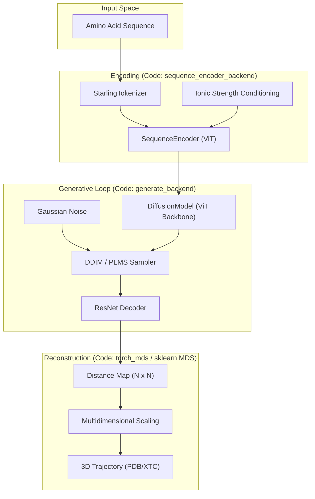
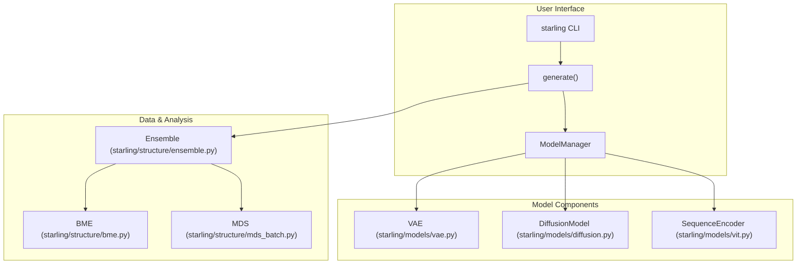

# STARLING Overview

> **Relevant source files**
> * [README.md](https://github.com/idptools/starling/blob/4b98d2fe/README.md?plain=1)
> * [docs/index.rst](https://github.com/idptools/starling/blob/4b98d2fe/docs/index.rst)
> * [docs/usage/ensemble.rst](https://github.com/idptools/starling/blob/4b98d2fe/docs/usage/ensemble.rst)
> * [docs/usage/sequence_encoder.rst](https://github.com/idptools/starling/blob/4b98d2fe/docs/usage/sequence_encoder.rst)
> * [pyproject.toml](https://github.com/idptools/starling/blob/4b98d2fe/pyproject.toml)
> * [starling/__init__.py](https://github.com/idptools/starling/blob/4b98d2fe/starling/__init__.py)
> * [starling/configs.py](https://github.com/idptools/starling/blob/4b98d2fe/starling/configs.py)
> * [starling_logo-1.png](https://github.com/idptools/starling/blob/4b98d2fe/starling_logo-1.png)

STARLING (**conSTruction of intrinsically disordered proteins ensembles efficiently via multi-dimensional Generative models**) is a high-performance machine learning framework designed to predict conformational ensembles of intrinsically disordered proteins (IDPs) and regions (IDRs) directly from their amino acid sequences.

By utilizing a two-stage generative architecture—combining a Variational Autoencoder (VAE) with a Latent Diffusion Model (DDPM)—STARLING can generate thousands of physically plausible protein conformations in seconds [README.md L19-L27](https://github.com/idptools/starling/blob/4b98d2fe/README.md?plain=1#L19-L27)

## System Architecture

The STARLING pipeline operates by encoding amino acid sequences into a latent space, generating diverse latent representations via diffusion, and decoding those representations into pairwise distance maps. These maps are then reconstructed into 3D Cartesian coordinates.

### Logic Flow: Sequence to Ensemble

The following diagram illustrates the transformation of data from a raw sequence string to a complete `Ensemble` object.

**Diagram: Data Transformation Pipeline**

**Sources:** [starling/frontend/ensemble_generation.py L8-L9](https://github.com/idptools/starling/blob/4b98d2fe/starling/frontend/ensemble_generation.py#L8-L9)

 [starling/inference/model_loading.py L20-L40](https://github.com/idptools/starling/blob/4b98d2fe/starling/inference/model_loading.py#L20-L40)

 [starling/structure/ensemble.py L4-L20](https://github.com/idptools/starling/blob/4b98d2fe/starling/structure/ensemble.py#L4-L20)

---

## Key Concepts

### 1. Latent Diffusion for IDPs

Unlike traditional molecular dynamics, STARLING does not simulate physics over time. Instead, it uses a Diffusion Model to denoise random Gaussian noise into latent representations that correspond to valid protein topologies. These latents are decoded by a VAE into distance maps, ensuring the generated ensembles capture the heterogeneous nature of disordered proteins.

### 2. Sequence Conditioning and Ionic Strength

The generation process is conditioned on the protein sequence using a Vision Transformer (ViT)-based `SequenceEncoder`. Furthermore, STARLING explicitly models environmental conditions by accepting **Ionic Strength** (e.g., 20, 150, or 300 mM) as a conditioning variable, allowing the model to predict how ensembles expand or collapse in different salt concentrations [starling/configs.py L23-L24](https://github.com/idptools/starling/blob/4b98d2fe/starling/configs.py#L23-L24)

### 3. The Ensemble Data Structure

The `Ensemble` class is the primary container for STARLING outputs. It stores distance maps and metadata lazily, only calculating 3D coordinates or biophysical properties (like Radius of Gyration or Hydrodynamic Radius) when requested by the user [docs/usage/ensemble.rst L4-L30](https://github.com/idptools/starling/blob/4b98d2fe/docs/usage/ensemble.rst#L4-L30)

---

## Major Subsystems

### Inference & Generation

The frontend provides a simple `generate()` function that abstracts away the complexities of model loading and batching. It manages the `ModelManager` singleton to handle lazy weight downloading and `torch.compile` optimizations [starling/__init__.py L8-L11](https://github.com/idptools/starling/blob/4b98d2fe/starling/__init__.py#L8-L11)

 [starling/configs.py L27-L35](https://github.com/idptools/starling/blob/4b98d2fe/starling/configs.py#L27-L35)

* For details, see [Quick Start: Generating Ensembles](/idptools/starling/1.2-quick-start:-generating-ensembles).

### 3. Structural Reconstruction (MDS)

Because the generative model outputs distance maps, STARLING includes a high-performance 3D reconstruction engine. It supports both CPU-based `sklearn` MDS and GPU-accelerated `torch_mds` for converting these maps into PDB/XTC trajectories [starling/configs.py L19-L20](https://github.com/idptools/starling/blob/4b98d2fe/starling/configs.py#L19-L20)

### 4. Search and Indexing

STARLING includes a FAISS-based search engine that allows users to query large databases of protein sequences to find those with similar ensemble-aware embeddings [starling/configs.py L128-L156](https://github.com/idptools/starling/blob/4b98d2fe/starling/configs.py#L128-L156)

---

## Code Entity Map

This diagram maps high-level system components to their specific implementations in the codebase.

**Diagram: System Component Mapping**

**Sources:** [pyproject.toml L53-L64](https://github.com/idptools/starling/blob/4b98d2fe/pyproject.toml#L53-L64)

 [starling/inference/model_loading.py L10-L70](https://github.com/idptools/starling/blob/4b98d2fe/starling/inference/model_loading.py#L10-L70)

 [starling/structure/ensemble.py L1-L100](https://github.com/idptools/starling/blob/4b98d2fe/starling/structure/ensemble.py#L1-L100)

---

## Getting Started

To begin using STARLING, you can install it via PyPI or clone the repository for development.

* **Installation:** `pip install idptools-starling` [README.md L54](https://github.com/idptools/starling/blob/4b98d2fe/README.md?plain=1#L54-L54)
* **Basic Usage:** `starling "ACDEF..." -c 400 -r` [README.md L73-L77](https://github.com/idptools/starling/blob/4b98d2fe/README.md?plain=1#L73-L77)

For detailed setup instructions, including environment configuration and weight management, see **[Getting Started: Installation and Configuration](/idptools/starling/1.1-getting-started:-installation-and-configuration)**.

For a guide on generating your first ensemble via the Python API, see **[Quick Start: Generating Ensembles](/idptools/starling/1.2-quick-start:-generating-ensembles)**.

**Sources:** [README.md L40-L86](https://github.com/idptools/starling/blob/4b98d2fe/README.md?plain=1#L40-L86)

 [pyproject.toml L7-L43](https://github.com/idptools/starling/blob/4b98d2fe/pyproject.toml#L7-L43)