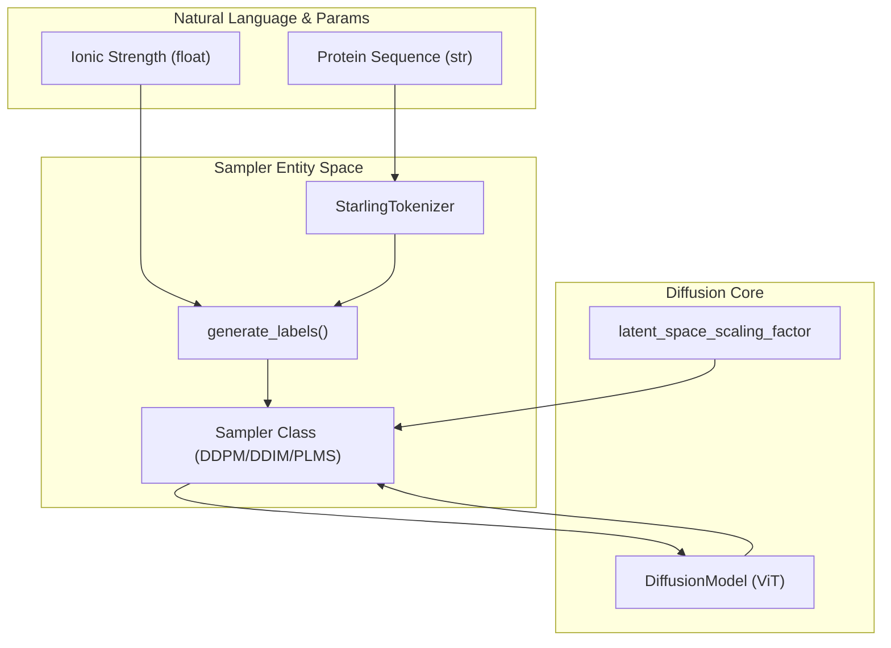
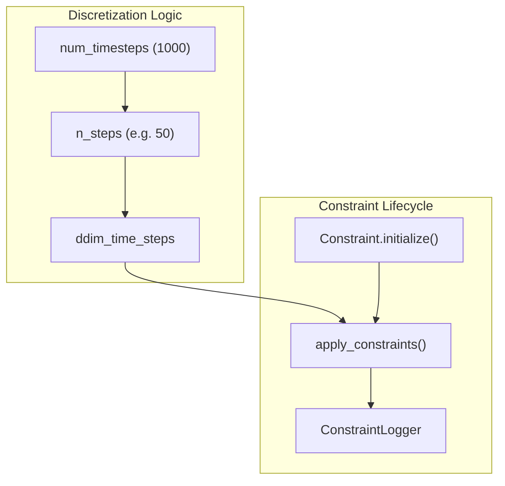

# Sampling Algorithms

> **Relevant source files**
> * [starling/frontend/__init__.py](https://github.com/idptools/starling/blob/4b98d2fe/starling/frontend/__init__.py)
> * [starling/samplers/__init__.py](https://github.com/idptools/starling/blob/4b98d2fe/starling/samplers/__init__.py)
> * [starling/samplers/ddim_sampler.py](https://github.com/idptools/starling/blob/4b98d2fe/starling/samplers/ddim_sampler.py)
> * [starling/samplers/ddpm_sampler.py](https://github.com/idptools/starling/blob/4b98d2fe/starling/samplers/ddpm_sampler.py)
> * [starling/samplers/plms_sampler.py](https://github.com/idptools/starling/blob/4b98d2fe/starling/samplers/plms_sampler.py)
> * [starling/structure/__init__.py](https://github.com/idptools/starling/blob/4b98d2fe/starling/structure/__init__.py)
> * [starling/tests/test_sequence_encoder_backend.py](https://github.com/idptools/starling/blob/4b98d2fe/starling/tests/test_sequence_encoder_backend.py)
> * [starling/tests/test_sequence_encoder_backend_integration.py](https://github.com/idptools/starling/blob/4b98d2fe/starling/tests/test_sequence_encoder_backend_integration.py)

Sampling algorithms in STARLING are responsible for the reverse diffusion process, transforming Gaussian noise into structured protein distance map latents. The codebase provides three distinct strategies, ranging from the standard stochastic Markovian process to accelerated non-Markovian and multi-step solvers.

The samplers operate on the latent space defined by the VAE and are conditioned on sequence embeddings and ionic strength values. Each sampler implements a `sample` method that manages the denoising loop, integrates with the `Constraint` framework, and produces distance maps ready for 3D reconstruction.

### Algorithm Selection Logic

The choice of sampler typically involves a trade-off between sampling speed and the fidelity of the generated ensemble.

| Sampler | Strategy | Steps (Typical) | Best For |
| --- | --- | --- | --- |
| **DDPM** | Stochastic Markovian | 1000 | Maximum diversity, standard reference. |
| **DDIM** | Deterministic/Stochastic | 10 - 100 | Fast generation, deterministic mapping. |
| **PLMS** | Multi-step Adams-Bashforth | 10 - 50 | High-quality accelerated sampling. |

---

## Sampler Architecture and Data Flow

All samplers interact with the `DiffusionModel` to obtain noise predictions and use the `StarlingTokenizer` to process input sequences. They share a common pattern for conditioning the model using `sequence2labels` [starling/samplers/ddpm_sampler.py L86-L88](https://github.com/idptools/starling/blob/4b98d2fe/starling/samplers/ddpm_sampler.py#L86-L88)

### Sampling Data Flow Diagram

This diagram illustrates how the `Sampler` classes bridge the gap between user inputs (Sequence/Ionic Strength) and the internal `DiffusionModel` (ViT backbone).

**Sources:** [starling/samplers/ddpm_sampler.py L44-L90](https://github.com/idptools/starling/blob/4b98d2fe/starling/samplers/ddpm_sampler.py#L44-L90)

 [starling/samplers/ddim_sampler.py L102-L124](https://github.com/idptools/starling/blob/4b98d2fe/starling/samplers/ddim_sampler.py#L102-L124)

 [starling/samplers/plms_sampler.py L124-L147](https://github.com/idptools/starling/blob/4b98d2fe/starling/samplers/plms_sampler.py#L124-L147)

---

## DDPM Sampler

The `DDPMSampler` implements the standard Denoising Diffusion Probabilistic Model process. It follows a Markovian chain where each step $t-1$ depends only on step $t$. It is the most computationally expensive but serves as the baseline for ensemble quality.

* **Key Method:** `p_sample_loop` [starling/samplers/ddpm_sampler.py L150-L178](https://github.com/idptools/starling/blob/4b98d2fe/starling/samplers/ddpm_sampler.py#L150-L178)  orchestrates the full sequence of $T$ steps.
* **Step Logic:** `p_sample` [starling/samplers/ddpm_sampler.py L92-L149](https://github.com/idptools/starling/blob/4b98d2fe/starling/samplers/ddpm_sampler.py#L92-L149)  calculates the predicted mean and injects posterior variance noise.
* **Use Case:** Use this when computational time is not a constraint and you require the most faithful reproduction of the training distribution.

For details, see [DDPM Sampler](/idptools/starling/3.1-ddpm-sampler).

**Sources:** [starling/samplers/ddpm_sampler.py L44-L230](https://github.com/idptools/starling/blob/4b98d2fe/starling/samplers/ddpm_sampler.py#L44-L230)

---

## Accelerated Samplers: DDIM and PLMS

STARLING provides two accelerated samplers that significantly reduce the number of required function evaluations (NFE) by discretizing the diffusion process into fewer steps.

### DDIM (Denoising Diffusion Implicit Models)

The `DDIMSampler` allows for non-Markovian sampling, enabling deterministic generation when `ddim_eta` is set to 0.0 [starling/samplers/ddim_sampler.py L27-L52](https://github.com/idptools/starling/blob/4b98d2fe/starling/samplers/ddim_sampler.py#L27-L52)

 It supports different discretization schedules such as `uniform` or `quad` [starling/samplers/ddim_sampler.py L73-L81](https://github.com/idptools/starling/blob/4b98d2fe/starling/samplers/ddim_sampler.py#L73-L81)

### PLMS (Pseudo Linear Multi-Step)

The `PLMSSampler` uses an Adams-Bashforth multi-step method to improve the accuracy of the denoising trajectory at higher speeds [starling/samplers/plms_sampler.py L62-L72](https://github.com/idptools/starling/blob/4b98d2fe/starling/samplers/plms_sampler.py#L62-L72)

 It includes features like `dynamic_thresholding_fn` [starling/samplers/plms_sampler.py L26-L46](https://github.com/idptools/starling/blob/4b98d2fe/starling/samplers/plms_sampler.py#L26-L46)

 to prevent latent collapse during accelerated sampling.

### Discretization and Constraint Interaction

This diagram shows how accelerated samplers map the full training timesteps to a reduced inference schedule while maintaining hooks for physical constraints.

**Sources:** [starling/samplers/ddim_sampler.py L72-L101](https://github.com/idptools/starling/blob/4b98d2fe/starling/samplers/ddim_sampler.py#L72-L101)

 [starling/samplers/ddim_sampler.py L194-L207](https://github.com/idptools/starling/blob/4b98d2fe/starling/samplers/ddim_sampler.py#L194-L207)

 [starling/samplers/plms_sampler.py L89-L110](https://github.com/idptools/starling/blob/4b98d2fe/starling/samplers/plms_sampler.py#L89-L110)

For details, see [Accelerated Samplers: DDIM and PLMS](/idptools/starling/3.2-accelerated-samplers:-ddim-and-plms).

---

## Constraint Integration

All samplers support guided diffusion through the `constraint` parameter in their `sample` methods. When a constraint is provided:

1. It is initialized with the VAE encoder and latent scaling factors [starling/samplers/ddpm_sampler.py L201-L208](https://github.com/idptools/starling/blob/4b98d2fe/starling/samplers/ddpm_sampler.py#L201-L208)
2. A `ConstraintLogger` is instantiated to track potential energy and gradients across timesteps [starling/samplers/ddpm_sampler.py L197-L200](https://github.com/idptools/starling/blob/4b98d2fe/starling/samplers/ddpm_sampler.py#L197-L200)
3. Gradients from physical priors (e.g., `RgConstraint`, `DistanceConstraint`) are applied to the latents during the denoising loop to steer the generation toward specific conformational properties.

**Sources:** [starling/samplers/ddpm_sampler.py L10-L15](https://github.com/idptools/starling/blob/4b98d2fe/starling/samplers/ddpm_sampler.py#L10-L15)

 [starling/samplers/ddim_sampler.py L11-L16](https://github.com/idptools/starling/blob/4b98d2fe/starling/samplers/ddim_sampler.py#L11-L16)

 [starling/samplers/plms_sampler.py L11-L16](https://github.com/idptools/starling/blob/4b98d2fe/starling/samplers/plms_sampler.py#L11-L16)