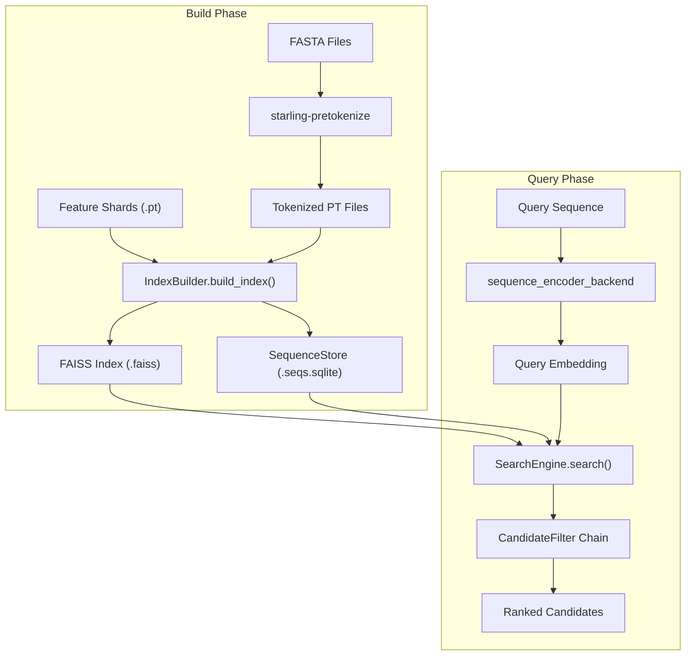
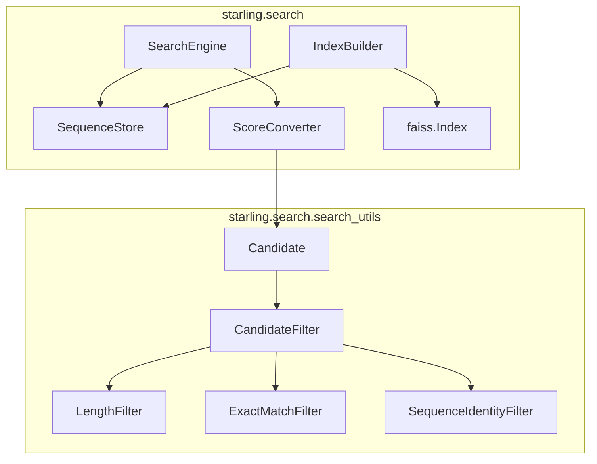

# Search Engine

> **Relevant source files**
> * [starling/configs.py](https://github.com/idptools/starling/blob/4b98d2fe/starling/configs.py)
> * [starling/inference/benchmark_mds.py](https://github.com/idptools/starling/blob/4b98d2fe/starling/inference/benchmark_mds.py)
> * [starling/scripts/starling_pretokenize.py](https://github.com/idptools/starling/blob/4b98d2fe/starling/scripts/starling_pretokenize.py)
> * [starling/scripts/starling_search.py](https://github.com/idptools/starling/blob/4b98d2fe/starling/scripts/starling_search.py)
> * [starling/search/__init__.py](https://github.com/idptools/starling/blob/4b98d2fe/starling/search/__init__.py)
> * [starling/search/builder.py](https://github.com/idptools/starling/blob/4b98d2fe/starling/search/builder.py)
> * [starling/search/search_engine.py](https://github.com/idptools/starling/blob/4b98d2fe/starling/search/search_engine.py)
> * [starling/search/search_utils.py](https://github.com/idptools/starling/blob/4b98d2fe/starling/search/search_utils.py)
> * [starling/search/similarity_search.py](https://github.com/idptools/starling/blob/4b98d2fe/starling/search/similarity_search.py)
> * [starling/search/store.py](https://github.com/idptools/starling/blob/4b98d2fe/starling/search/store.py)

The STARLING Search Engine provides a high-performance similarity search system for protein ensembles. Built on top of **FAISS** (Facebook AI Similarity Search), it enables billion-scale Approximate Nearest Neighbor (ANN) lookups, multi-level metadata filtering, and exact sequence reranking. The system bridges the gap between latent embedding space and raw sequence data by coupling FAISS indexes with a compressed SQLite-backed metadata store.

### System Overview

The search infrastructure is composed of three primary software layers:

1. **Storage Layer**: Consists of the serialized FAISS index (e.g., `.faiss`) and the `SequenceStore` (SQLite), which holds raw sequences, headers, and pre-computed hashes [starling/search/store.py L22-L34](https://github.com/idptools/starling/blob/4b98d2fe/starling/search/store.py#L22-L34)
2. **Engine Layer**: The `SearchEngine` class coordinates ANN lookups, length-based pre-filtering, and a chain of `CandidateFilter` objects [starling/search/search_engine.py L94-L100](https://github.com/idptools/starling/blob/4b98d2fe/starling/search/search_engine.py#L94-L100)
3. **Tooling Layer**: CLI tools like `starling-search` and `starling-pretokenize` for index construction and querying [starling/scripts/starling_search.py L27-L33](https://github.com/idptools/starling/blob/4b98d2fe/starling/scripts/starling_search.py#L27-L33)

### Component Interaction

The following diagram illustrates the flow from raw sequence data to a searchable index and the subsequent query process.

**Search System Data Flow**

**Sources:** [starling/search/builder.py L22-L39](https://github.com/idptools/starling/blob/4b98d2fe/starling/search/builder.py#L22-L39)

 [starling/search/search_engine.py L9-L15](https://github.com/idptools/starling/blob/4b98d2fe/starling/search/search_engine.py#L9-L15)

 [starling/scripts/starling_pretokenize.py L2-L11](https://github.com/idptools/starling/blob/4b98d2fe/starling/scripts/starling_pretokenize.py#L2-L11)

---

### Key Entities and Architecture

The search system relies on specific classes to manage the lifecycle of an index.

| Entity | File Path | Role |
| --- | --- | --- |
| `SearchEngine` | [starling/search/search_engine.py L93](https://github.com/idptools/starling/blob/4b98d2fe/starling/search/search_engine.py#L93-L93) | Main interface for executing queries and applying filters. |
| `IndexBuilder` | [starling/search/builder.py L152](https://github.com/idptools/starling/blob/4b98d2fe/starling/search/builder.py#L152-L152) | Orchestrates FAISS training (OPQ+IVF-PQ) and shard discovery. |
| `SequenceStore` | [starling/search/store.py L215](https://github.com/idptools/starling/blob/4b98d2fe/starling/search/store.py#L215-L215) | Manages SQLite storage for sequences with zstd compression. |
| `Candidate` | [starling/search/search_utils.py L220](https://github.com/idptools/starling/blob/4b98d2fe/starling/search/search_utils.py#L220-L220) | Data container for a single search hit (score, gid, meta). |
| `CandidateFilter` | [starling/search/search_utils.py L212](https://github.com/idptools/starling/blob/4b98d2fe/starling/search/search_utils.py#L212-L212) | Abstract base class for post-ANN filtering logic. |

**Code Entity Space Mapping**

**Sources:** [starling/search/search_engine.py L72-L83](https://github.com/idptools/starling/blob/4b98d2fe/starling/search/search_engine.py#L72-L83)

 [starling/search/builder.py L124-L127](https://github.com/idptools/starling/blob/4b98d2fe/starling/search/builder.py#L124-L127)

 [starling/search/search_utils.py L72-L81](https://github.com/idptools/starling/blob/4b98d2fe/starling/search/search_utils.py#L72-L81)

---

### Core Functionality

#### Index Construction and SequenceStore

The construction process involves training a FAISS index using Optimized Product Quantization (OPQ) and Inverted File (IVF) clusters. This allows the system to scale to millions of protein sequences while maintaining a small memory footprint by compressing vectors to Product Quantization (PQ) codes [starling/search/builder.py L10-L16](https://github.com/idptools/starling/blob/4b98d2fe/starling/search/builder.py#L10-L16)

 Simultaneously, a `SequenceStore` is built to provide O(log N) access to metadata like sequence length and 8-byte hashes for deduplication [starling/search/store.py L9-L16](https://github.com/idptools/starling/blob/4b98d2fe/starling/search/store.py#L9-L16)

For details, see [Index Construction and SequenceStore](/idptools/starling/8.1-index-construction-and-sequencestore).

#### Querying and Filtering

Querying is a two-stage process. First, an ANN search retrieves coarse candidates from the FAISS index. Second, these candidates are passed through a chain of filters (e.g., `LengthFilter`, `ExactMatchFilter`) to ensure they meet user-specified constraints [starling/search/search_engine.py L9-L13](https://github.com/idptools/starling/blob/4b98d2fe/starling/search/search_engine.py#L9-L13)

 The system also supports reranking, where top candidates are re-scored using the full encoder for higher precision [starling/search/search_engine.py L38-L39](https://github.com/idptools/starling/blob/4b98d2fe/starling/search/search_engine.py#L38-L39)

For details, see [Querying and Filtering](/idptools/starling/8.2-querying-and-filtering).

---

### CLI Tools

The search engine is primarily accessed via two command-line utilities:

* **`starling-pretokenize`**: Processes FASTA files into tokenized `.pt` files required for building the sequence store [starling/scripts/starling_pretokenize.py L2-L6](https://github.com/idptools/starling/blob/4b98d2fe/starling/scripts/starling_pretokenize.py#L2-L6)
* **`starling-search`**: A unified tool for building new indexes (`build` command) and querying existing ones (`query` command) [starling/scripts/starling_search.py L27-L33](https://github.com/idptools/starling/blob/4b98d2fe/starling/scripts/starling_search.py#L27-L33)

**Sources:** [starling/scripts/starling_pretokenize.py L44-L55](https://github.com/idptools/starling/blob/4b98d2fe/starling/scripts/starling_pretokenize.py#L44-L55)

 [starling/scripts/starling_search.py L47-L105](https://github.com/idptools/starling/blob/4b98d2fe/starling/scripts/starling_search.py#L47-L105)