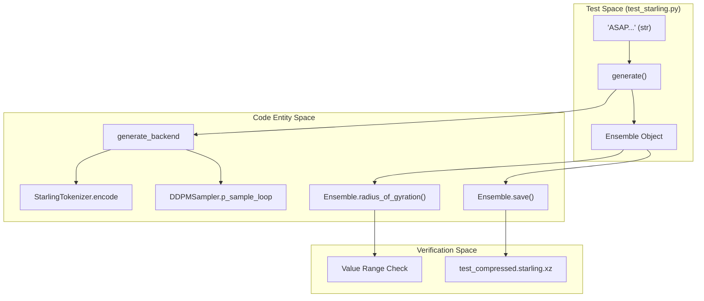
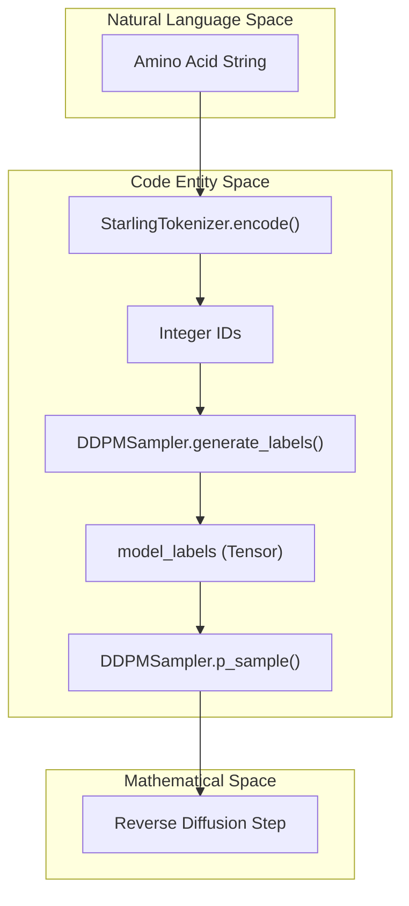

# Test Suite

> **Relevant source files**
> * [starling/data/tokenizer.py](https://github.com/idptools/starling/blob/4b98d2fe/starling/data/tokenizer.py)
> * [starling/samplers/ddpm_sampler.py](https://github.com/idptools/starling/blob/4b98d2fe/starling/samplers/ddpm_sampler.py)
> * [starling/tests/.gitignore](https://github.com/idptools/starling/blob/4b98d2fe/starling/tests/.gitignore)
> * [starling/tests/outdata/readme.md](https://github.com/idptools/starling/blob/4b98d2fe/starling/tests/outdata/readme.md?plain=1)
> * [starling/tests/test_sequence_encoder_backend.py](https://github.com/idptools/starling/blob/4b98d2fe/starling/tests/test_sequence_encoder_backend.py)
> * [starling/tests/test_sequence_encoder_backend_integration.py](https://github.com/idptools/starling/blob/4b98d2fe/starling/tests/test_sequence_encoder_backend_integration.py)
> * [starling/tests/test_starling.py](https://github.com/idptools/starling/blob/4b98d2fe/starling/tests/test_starling.py)
> * [starling/tests/test_tokenizer.py](https://github.com/idptools/starling/blob/4b98d2fe/starling/tests/test_tokenizer.py)

The STARLING test suite provides a multi-layered verification framework, ranging from low-level unit tests for tokenization to end-to-end integration tests that exercise the full generative pipeline and 3D reconstruction. The infrastructure is built on `pytest` and utilizes a dedicated `outdata` directory for ephemeral artifacts produced during test execution.

## Test Infrastructure Overview

The test suite is organized to validate both the correctness of individual components and the stability of the end-to-end `generate` API.

| Test File | Scope | Key Components Tested |
| --- | --- | --- |
| `test_tokenizer.py` | Unit | `StarlingTokenizer` encoding/decoding and vocab consistency. |
| `test_sequence_encoder_backend.py` | Unit (Mocked) | `sequence_encoder_backend` batching and file I/O logic. |
| `test_sequence_encoder_backend_integration.py` | Integration | End-to-end sequence encoding using real model weights. |
| `test_starling.py` | End-to-End | `generate()`, `load_ensemble()`, `Ensemble` analysis, and serialization. |

### The outdata Directory

The `starling/tests/outdata/` directory serves as a sandbox for tests that require file persistence, such as `Ensemble.save()` or `sequence_encoder_backend(output_directory=...)` [starling/tests/test_starling.py L24-L25](https://github.com/idptools/starling/blob/4b98d2fe/starling/tests/test_starling.py#L24-L25)

 It is configured via `.gitignore` to exclude all generated artifacts except for its own documentation [starling/tests/.gitignore L1-L2](https://github.com/idptools/starling/blob/4b98d2fe/starling/tests/.gitignore#L1-L2)

## Unit Testing: Tokenization

The `StarlingTokenizer` is verified for byte-level translation accuracy. Tests ensure that the 20 standard amino acids map correctly to integer IDs and that the `decode` method successfully strips padding tokens (ID `0`).

**Key Verification Logic:**

* **Roundtrip Consistency:** Validates that `decode(encode(seq)) == seq` [starling/tests/test_tokenizer.py L6-L15](https://github.com/idptools/starling/blob/4b98d2fe/starling/tests/test_tokenizer.py#L6-L15)
* **Padding Handling:** Ensures that leading/trailing `0` IDs are removed during decoding [starling/tests/test_tokenizer.py L18-L25](https://github.com/idptools/starling/blob/4b98d2fe/starling/tests/test_tokenizer.py#L18-L25)
* **Error Handling:** Confirms that unknown characters (e.g., 'Z') or lowercase inputs raise a `KeyError` [starling/tests/test_tokenizer.py L28-L31](https://github.com/idptools/starling/blob/4b98d2fe/starling/tests/test_tokenizer.py#L28-L31)  [starling/tests/test_tokenizer.py L58-L62](https://github.com/idptools/starling/blob/4b98d2fe/starling/tests/test_tokenizer.py#L58-L62)

**Sources:** [starling/data/tokenizer.py L1-L93](https://github.com/idptools/starling/blob/4b98d2fe/starling/data/tokenizer.py#L1-L93)

 [starling/tests/test_tokenizer.py L1-L66](https://github.com/idptools/starling/blob/4b98d2fe/starling/tests/test_tokenizer.py#L1-L66)

## Backend Testing: Sequence Encoding

Testing the `sequence_encoder_backend` involves verifying how sequences are batched and processed by the `SequenceEncoder` model.

### Mocked Backend Tests

`test_sequence_encoder_backend.py` uses a `_DummyModelManager` and `_DummyDiffusion` to simulate model behavior without requiring heavy weight files or GPUs [starling/tests/test_sequence_encoder_backend.py L7-L31](https://github.com/idptools/starling/blob/4b98d2fe/starling/tests/test_sequence_encoder_backend.py#L7-L31)

 This allows for rapid testing of:

* **Batching Logic:** Verifying that sequences of different lengths are correctly handled in batches [starling/tests/test_sequence_encoder_backend.py L38-L64](https://github.com/idptools/starling/blob/4b98d2fe/starling/tests/test_sequence_encoder_backend.py#L38-L64)
* **Remainder Batches:** Ensuring the backend correctly processes the final partial batch when the total number of sequences is not a multiple of `batch_size` [starling/tests/test_sequence_encoder_backend.py L66-L81](https://github.com/idptools/starling/blob/4b98d2fe/starling/tests/test_sequence_encoder_backend.py#L66-L81)
* **Persistence:** Validating that `.pt` files are correctly written to the `output_directory` [starling/tests/test_sequence_encoder_backend.py L83-L102](https://github.com/idptools/starling/blob/4b98d2fe/starling/tests/test_sequence_encoder_backend.py#L83-L102)

### Integration Tests

`test_sequence_encoder_backend_integration.py` provides an optional path for testing against real model weights. It is triggered by setting the `STARLING_RUN_INTEGRATION` environment variable to `1` [starling/tests/test_sequence_encoder_backend_integration.py L24-L25](https://github.com/idptools/starling/blob/4b98d2fe/starling/tests/test_sequence_encoder_backend_integration.py#L24-L25)

 It verifies that the resulting embeddings are non-degenerate (variance > 0) and have the correct dimensionality [starling/tests/test_sequence_encoder_backend_integration.py L53-L62](https://github.com/idptools/starling/blob/4b98d2fe/starling/tests/test_sequence_encoder_backend_integration.py#L53-L62)

**Sources:** [starling/tests/test_sequence_encoder_backend.py L1-L124](https://github.com/idptools/starling/blob/4b98d2fe/starling/tests/test_sequence_encoder_backend.py#L1-L124)

 [starling/tests/test_sequence_encoder_backend_integration.py L1-L62](https://github.com/idptools/starling/blob/4b98d2fe/starling/tests/test_sequence_encoder_backend_integration.py#L1-L62)

## End-to-End Testing: Generation and Ensembles

The primary regression test, `test_starling.py`, exercises the high-level `generate()` API and the resulting `Ensemble` objects.

### Generation Workflow

The tests verify that `generate()` produces the requested number of conformations and that the physical properties (Radius of Gyration, End-to-End distance) of the generated ensembles fall within expected statistical ranges for the given sequences [starling/tests/test_starling.py L114-L127](https://github.com/idptools/starling/blob/4b98d2fe/starling/tests/test_starling.py#L114-L127)

### Serialization and Compression

A significant portion of the suite is dedicated to the `Ensemble.save()` and `load_ensemble()` cycle. It tests:

* **Uncompressed Saving:** Standard `.starling` files [starling/tests/test_starling.py L43-L46](https://github.com/idptools/starling/blob/4b98d2fe/starling/tests/test_starling.py#L43-L46)
* **Lossy Compression:** Using `reduce_precision=True` (default) with `lzma` (`.xz`) or `gzip` formats, checking that physical observables remain close within a tolerance (e.g., `atol=0.1`) [starling/tests/test_starling.py L53-L68](https://github.com/idptools/starling/blob/4b98d2fe/starling/tests/test_starling.py#L53-L68)
* **Lossless Compression:** Using `reduce_precision=False` to ensure bit-perfect recovery of distances [starling/tests/test_starling.py L74-L89](https://github.com/idptools/starling/blob/4b98d2fe/starling/tests/test_starling.py#L74-L89)

### Data Flow: Sequence to Ensemble Test

The following diagram bridges the Natural Language space (sequences) to the Code Entity space (classes and methods) as exercised in `test_starling.py`.

**Diagram: End-to-End Generation Test Flow**

**Sources:** [starling/tests/test_starling.py L33-L154](https://github.com/idptools/starling/blob/4b98d2fe/starling/tests/test_starling.py#L33-L154)

 [starling/inference/generation.py L1-L200](https://github.com/idptools/starling/blob/4b98d2fe/starling/inference/generation.py#L1-L200)

 [starling/samplers/ddpm_sampler.py L150-L216](https://github.com/idptools/starling/blob/4b98d2fe/starling/samplers/ddpm_sampler.py#L150-L216)

## Internal Sampler Verification

While `test_starling.py` tests the output, the `DDPMSampler` class contains the logic for conditioning the diffusion process. The test suite indirectly verifies `DDPMSampler.generate_labels` and `DDPMSampler.p_sample` through the end-to-end generation calls.

**Diagram: Sampler Conditioning Logic**

**Sources:** [starling/samplers/ddpm_sampler.py L67-L90](https://github.com/idptools/starling/blob/4b98d2fe/starling/samplers/ddpm_sampler.py#L67-L90)

 [starling/samplers/ddpm_sampler.py L92-L149](https://github.com/idptools/starling/blob/4b98d2fe/starling/samplers/ddpm_sampler.py#L92-L149)