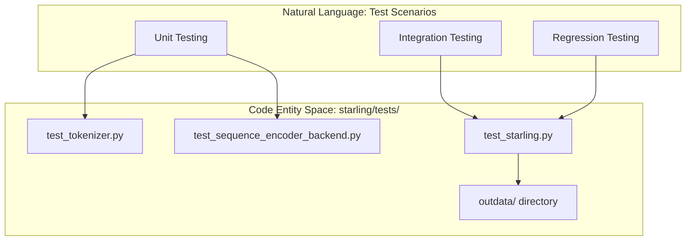
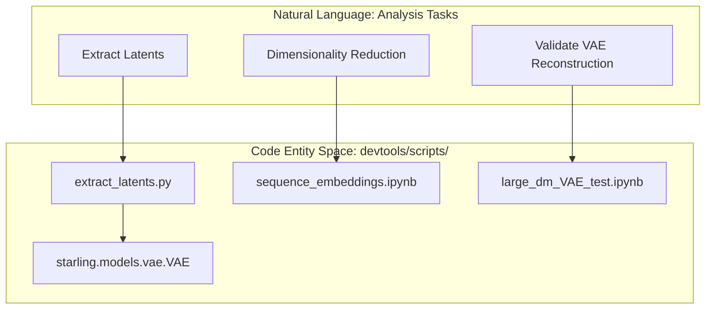

# Testing and Development Tools

> **Relevant source files**
> * [demos/basic_usage.ipynb](https://github.com/idptools/starling/blob/4b98d2fe/demos/basic_usage.ipynb)
> * [demos/constraining_ensembles.ipynb](https://github.com/idptools/starling/blob/4b98d2fe/demos/constraining_ensembles.ipynb)
> * [demos/structural_ensemble.ipynb](https://github.com/idptools/starling/blob/4b98d2fe/demos/structural_ensemble.ipynb)
> * [devtools/scripts/.ipynb_checkpoints/large_dm_VAE_test-checkpoint.ipynb](https://github.com/idptools/starling/blob/4b98d2fe/devtools/scripts/.ipynb_checkpoints/large_dm_VAE_test-checkpoint.ipynb)
> * [devtools/scripts/extract_latents.py](https://github.com/idptools/starling/blob/4b98d2fe/devtools/scripts/extract_latents.py)
> * [devtools/scripts/large_dm_VAE_test.ipynb](https://github.com/idptools/starling/blob/4b98d2fe/devtools/scripts/large_dm_VAE_test.ipynb)
> * [devtools/scripts/latent_PCA.ipynb](https://github.com/idptools/starling/blob/4b98d2fe/devtools/scripts/latent_PCA.ipynb)
> * [devtools/scripts/sequence_embeddings.ipynb](https://github.com/idptools/starling/blob/4b98d2fe/devtools/scripts/sequence_embeddings.ipynb)
> * [starling/data/tokenizer.py](https://github.com/idptools/starling/blob/4b98d2fe/starling/data/tokenizer.py)
> * [starling/samplers/ddpm_sampler.py](https://github.com/idptools/starling/blob/4b98d2fe/starling/samplers/ddpm_sampler.py)
> * [starling/tests/.gitignore](https://github.com/idptools/starling/blob/4b98d2fe/starling/tests/.gitignore)
> * [starling/tests/outdata/readme.md](https://github.com/idptools/starling/blob/4b98d2fe/starling/tests/outdata/readme.md?plain=1)
> * [starling/tests/test_sequence_encoder_backend.py](https://github.com/idptools/starling/blob/4b98d2fe/starling/tests/test_sequence_encoder_backend.py)
> * [starling/tests/test_sequence_encoder_backend_integration.py](https://github.com/idptools/starling/blob/4b98d2fe/starling/tests/test_sequence_encoder_backend_integration.py)
> * [starling/tests/test_starling.py](https://github.com/idptools/starling/blob/4b98d2fe/starling/tests/test_starling.py)
> * [starling/tests/test_tokenizer.py](https://github.com/idptools/starling/blob/4b98d2fe/starling/tests/test_tokenizer.py)

This page provides an overview of the STARLING test suite, developer scripts, and demonstration notebooks. These tools are designed to ensure model reliability, facilitate research-level analysis of latent spaces, and provide users with practical examples of ensemble generation and reweighting.

## Test Suite

The STARLING test suite consists of unit tests for core components and end-to-end integration tests that exercise the full generative pipeline. Tests are organized to validate everything from basic amino acid tokenization to complex coordinate reconstruction via MDS.

* **Unit Tests**: Focus on individual components like the `StarlingTokenizer` [starling/data/tokenizer.py L1](https://github.com/idptools/starling/blob/4b98d2fe/starling/data/tokenizer.py#L1-L1)  and `sequence_encoder_backend` [starling/inference/generation.py L1](https://github.com/idptools/starling/blob/4b98d2fe/starling/inference/generation.py#L1-L1)
* **Integration Tests**: Validate the interaction between the VAE and Diffusion models, often requiring real model weights to be present.
* **Regression Tests**: Ensure that ensemble statistics (e.g., Radius of Gyration, End-to-End distance) remain consistent across code changes [starling/tests/test_starling.py L124-L126](https://github.com/idptools/starling/blob/4b98d2fe/starling/tests/test_starling.py#L124-L126)

### Test Organization

| Test File | Focus Area | Key Symbols Validated |
| --- | --- | --- |
| `test_starling.py` | End-to-end generation & I/O | `generate`, `Ensemble`, `load_ensemble` |
| `test_tokenizer.py` | Amino acid mapping | `StarlingTokenizer.encode`, `decode` |
| `test_sequence_encoder_backend.py` | Latent conditioning logic | `sequence_encoder_backend` |
| `test_sequence_encoder_backend_integration.py` | Real model weight loading | `ModelManager`, `DEFAULT_ENCODER_WEIGHTS_PATH` |

For detailed instructions on running tests and a reference for the `outdata` directory, see [Test Suite](/idptools/starling/9.1-test-suite).

**Sources:** [starling/tests/test_starling.py L1-L154](https://github.com/idptools/starling/blob/4b98d2fe/starling/tests/test_starling.py#L1-L154)

 [starling/tests/test_tokenizer.py L1-L66](https://github.com/idptools/starling/blob/4b98d2fe/starling/tests/test_tokenizer.py#L1-L66)

 [starling/tests/test_sequence_encoder_backend.py L1-L124](https://github.com/idptools/starling/blob/4b98d2fe/starling/tests/test_sequence_encoder_backend.py#L1-L124)

 [starling/tests/test_sequence_encoder_backend_integration.py L1-L62](https://github.com/idptools/starling/blob/4b98d2fe/starling/tests/test_sequence_encoder_backend_integration.py#L1-L62)

---

## Developer Tools and Demo Notebooks

STARLING includes a variety of scripts and notebooks in the `devtools/scripts/` and `demos/` directories. These are intended for developers performing deep analysis of the model's latent space or for users learning the API.

### Latent Analysis and Extraction

Tools like `extract_latents.py` allow for the bulk processing of distance maps through the `VAE` encoder to generate latent vectors for downstream analysis, such as Principal Component Analysis (PCA) [devtools/scripts/extract_latents.py L30-L64](https://github.com/idptools/starling/blob/4b98d2fe/devtools/scripts/extract_latents.py#L30-L64)

### Educational Demos

The `demos/` directory contains interactive Jupyter notebooks that walk through common use cases:

* **Basic Usage**: Generating distance maps and using the `Ensemble` object [demos/basic_usage.ipynb L8-L20](https://github.com/idptools/starling/blob/4b98d2fe/demos/basic_usage.ipynb#L8-L20)
* **Structural Ensembles**: Reconstructing 3D trajectories and visualizing them with Matplotlib [demos/structural_ensemble.ipynb L8-L14](https://github.com/idptools/starling/blob/4b98d2fe/demos/structural_ensemble.ipynb#L8-L14)
* **Constrained Generation**: Applying `DistanceConstraint`, `RgConstraint`, or `HelicityConstraint` to bias the sampling process [demos/constraining_ensembles.ipynb L8-L20](https://github.com/idptools/starling/blob/4b98d2fe/demos/constraining_ensembles.ipynb#L8-L20)

### Bridging NL Space to Code Space

The following diagrams illustrate how high-level development tasks map to specific code entities within the STARLING repository.

**Diagram: Testing Infrastructure Data Flow**

**Sources:** [starling/tests/test_starling.py L22-L24](https://github.com/idptools/starling/blob/4b98d2fe/starling/tests/test_starling.py#L22-L24)

 [starling/tests/test_tokenizer.py L6-L15](https://github.com/idptools/starling/blob/4b98d2fe/starling/tests/test_tokenizer.py#L6-L15)

 [starling/tests/test_sequence_encoder_backend.py L45-L53](https://github.com/idptools/starling/blob/4b98d2fe/starling/tests/test_sequence_encoder_backend.py#L45-L53)

**Diagram: Developer Workflow for Latent Analysis**

**Sources:** [devtools/scripts/extract_latents.py L82-L118](https://github.com/idptools/starling/blob/4b98d2fe/devtools/scripts/extract_latents.py#L82-L118)

 [devtools/scripts/sequence_embeddings.ipynb L21-L22](https://github.com/idptools/starling/blob/4b98d2fe/devtools/scripts/sequence_embeddings.ipynb#L21-L22)

 [devtools/scripts/large_dm_VAE_test.ipynb L13-L16](https://github.com/idptools/starling/blob/4b98d2fe/devtools/scripts/large_dm_VAE_test.ipynb#L13-L16)

For a full guide to the available scripts and how to use the demo notebooks, see [Developer Tools and Demo Notebooks](/idptools/starling/9.2-developer-tools-and-demo-notebooks).

**Sources:** [devtools/scripts/extract_latents.py L1-L118](https://github.com/idptools/starling/blob/4b98d2fe/devtools/scripts/extract_latents.py#L1-L118)

 [demos/basic_usage.ipynb L1-L180](https://github.com/idptools/starling/blob/4b98d2fe/demos/basic_usage.ipynb#L1-L180)

 [demos/structural_ensemble.ipynb L1-L180](https://github.com/idptools/starling/blob/4b98d2fe/demos/structural_ensemble.ipynb#L1-L180)

 [demos/constraining_ensembles.ipynb L1-L180](https://github.com/idptools/starling/blob/4b98d2fe/demos/constraining_ensembles.ipynb#L1-L180)