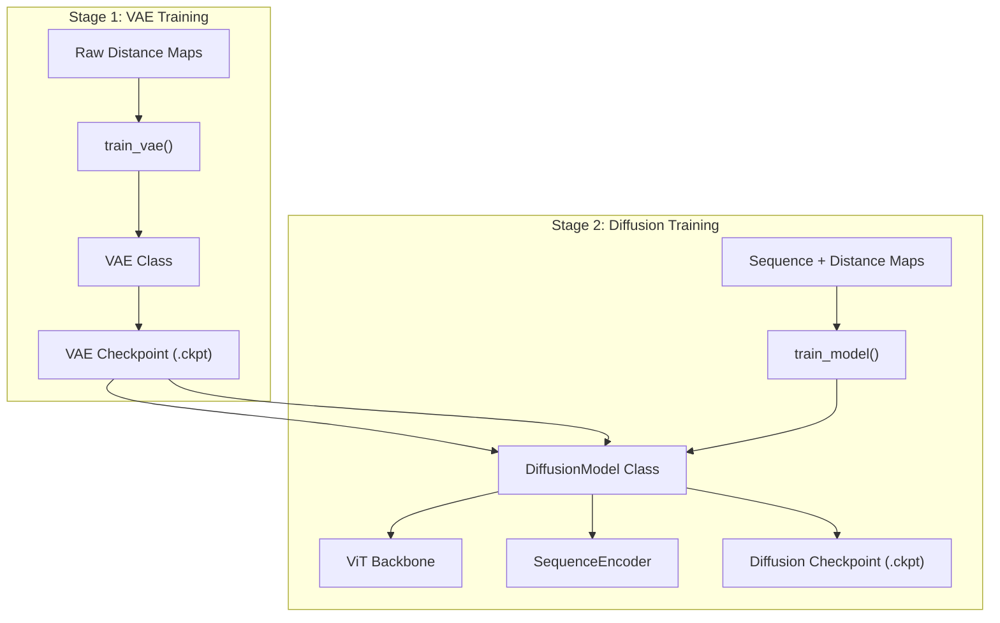

# Training

> **Relevant source files**
> * [starling/configs/trainer/vae_trainer.yaml](https://github.com/idptools/starling/blob/4b98d2fe/starling/configs/trainer/vae_trainer.yaml)
> * [starling/configs/vae_configs.yaml](https://github.com/idptools/starling/blob/4b98d2fe/starling/configs/vae_configs.yaml)
> * [starling/models/diffusion.py](https://github.com/idptools/starling/blob/4b98d2fe/starling/models/diffusion.py)
> * [starling/training/__init__.py](https://github.com/idptools/starling/blob/4b98d2fe/starling/training/__init__.py)
> * [starling/training/diffusion_train.py](https://github.com/idptools/starling/blob/4b98d2fe/starling/training/diffusion_train.py)
> * [starling/training/vae_train.py](https://github.com/idptools/starling/blob/4b98d2fe/starling/training/vae_train.py)

STARLING utilizes a two-stage training pipeline to learn the generative mapping from protein sequences to structural ensembles. The process first trains a **Variational Autoencoder (VAE)** to compress distance maps into a low-dimensional latent space, followed by a **Latent Diffusion Model (DDPM)** that learns to generate these latents conditioned on protein sequences and physical parameters like ionic strength.

The training infrastructure is built on **PyTorch Lightning** for distributed orchestration, **Hydra** for hierarchical configuration management, and **Weights & Biases (WandB)** for experiment tracking.

### Training Workflow and System Mapping

The following diagram illustrates how high-level training concepts map to specific code entities and the data flow between the two stages.

**Training System Data Flow**

**Sources:** [starling/training/vae_train.py L106-L191](https://github.com/idptools/starling/blob/4b98d2fe/starling/training/vae_train.py#L106-L191)

 [starling/training/diffusion_train.py L136-L190](https://github.com/idptools/starling/blob/4b98d2fe/starling/training/diffusion_train.py#L136-L190)

 [starling/models/diffusion.py L138-L144](https://github.com/idptools/starling/blob/4b98d2fe/starling/models/diffusion.py#L138-L144)

---

### Shared Infrastructure

Both training pipelines share a common infrastructure designed for scalability and reproducibility:

* **PyTorch Lightning:** Manages the training loop, distributed data parallel (DDP) strategy, and precision (e.g., `bf16-mixed`) [starling/training/vae_train.py L172-L184](https://github.com/idptools/starling/blob/4b98d2fe/starling/training/vae_train.py#L172-L184)  [starling/training/diffusion_train.py L123-L133](https://github.com/idptools/starling/blob/4b98d2fe/starling/training/diffusion_train.py#L123-L133)
* **Hydra Configuration:** Configurations are split into `dataloader`, `trainer`, and `model` groups, allowing modular overrides via CLI or YAML files [starling/configs/vae_configs.yaml L1-L5](https://github.com/idptools/starling/blob/4b98d2fe/starling/configs/vae_configs.yaml#L1-L5)
* **Experiment Tracking:** `WandbLogger` is integrated into both entrypoints to track losses, learning rates, and model gradients [starling/training/vae_train.py L168-L170](https://github.com/idptools/starling/blob/4b98d2fe/starling/training/vae_train.py#L168-L170)  [starling/training/diffusion_train.py L115-L119](https://github.com/idptools/starling/blob/4b98d2fe/starling/training/diffusion_train.py#L115-L119)
* **Checkpointing:** The `ModelCheckpoint` callback automatically saves the "last" state and the "best" model based on `epoch_val_loss` [starling/training/vae_train.py L35-L48](https://github.com/idptools/starling/blob/4b98d2fe/starling/training/vae_train.py#L35-L48)  [starling/training/diffusion_train.py L39-L52](https://github.com/idptools/starling/blob/4b98d2fe/starling/training/diffusion_train.py#L39-L52)

---

### VAE Training (Stage 1)

The VAE training stage focuses on learning a robust latent representation of protein distance maps. The `train_vae` entrypoint supports training from scratch, resuming from a `last.ckpt`, or fine-tuning existing weights with new hyperparameters [starling/training/vae_train.py L106-L116](https://github.com/idptools/starling/blob/4b98d2fe/starling/training/vae_train.py#L106-L116)

Key features include:

* **Factory Setup:** The `setup_vae_model` function uses Hydra's `instantiate` to build the VAE architecture [starling/training/vae_train.py L79-L98](https://github.com/idptools/starling/blob/4b98d2fe/starling/training/vae_train.py#L79-L98)
* **Effective Batch Size:** The dataloader automatically calculates the effective batch size based on the number of GPUs and nodes to ensure consistent gradient updates across distributed setups [starling/training/vae_train.py L151-L154](https://github.com/idptools/starling/blob/4b98d2fe/starling/training/vae_train.py#L151-L154)

For details on VAE loss functions, KLD scheduling, and configuration, see **[VAE Training](/idptools/starling/6.1-vae-training)**.

**Sources:** [starling/training/vae_train.py L79-L191](https://github.com/idptools/starling/blob/4b98d2fe/starling/training/vae_train.py#L79-L191)

 [starling/configs/trainer/vae_trainer.yaml L1-L12](https://github.com/idptools/starling/blob/4b98d2fe/starling/configs/trainer/vae_trainer.yaml#L1-L12)

---

### Diffusion Model Training (Stage 2)

Once a VAE is trained, its encoder is frozen and used to project distance maps into latents for the Diffusion Model. The `train_model` script orchestrates the training of the `ViT` backbone and `SequenceEncoder` [starling/training/diffusion_train.py L81-L112](https://github.com/idptools/starling/blob/4b98d2fe/starling/training/diffusion_train.py#L81-L112)

Key features include:

* **Latent Scaling:** The `DiffusionModel` registers a `latent_space_scaling_factor` buffer, which is used to normalize the VAE latent space to unit variance, improving diffusion stability [starling/models/diffusion.py L156-L160](https://github.com/idptools/starling/blob/4b98d2fe/starling/models/diffusion.py#L156-L160)
* **Conditioning:** The model is trained to denoise latents conditioned on sequence embeddings and ionic strength values [starling/models/diffusion.py L71-L75](https://github.com/idptools/starling/blob/4b98d2fe/starling/models/diffusion.py#L71-L75)
* **SNR Weighting:** Supports `min_snr_loss` to balance the loss across different diffusion timesteps [starling/models/diffusion.py L79-L80](https://github.com/idptools/starling/blob/4b98d2fe/starling/models/diffusion.py#L79-L80)

For details on the diffusion process, ViT architecture, and multi-node setup, see **[Diffusion Model Training](/idptools/starling/6.2-diffusion-model-training)**.

**Sources:** [starling/training/diffusion_train.py L81-L112](https://github.com/idptools/starling/blob/4b98d2fe/starling/training/diffusion_train.py#L81-L112)

 [starling/models/diffusion.py L55-L187](https://github.com/idptools/starling/blob/4b98d2fe/starling/models/diffusion.py#L55-L187)

---

### Data Loading and Preprocessing

Training requires high-throughput data access. STARLING supports two primary data formats:

1. **HDF5 (.h5):** Standard for local, high-speed access to structured datasets [starling/training/vae_train.py L61-L65](https://github.com/idptools/starling/blob/4b98d2fe/starling/training/vae_train.py#L61-L65)
2. **WebDataset (.tar):** Optimized for distributed training on cloud filesystems or large clusters, utilizing a sharded pipeline [starling/training/vae_train.py L66-L72](https://github.com/idptools/starling/blob/4b98d2fe/starling/training/vae_train.py#L66-L72)

The preprocessing pipeline handles sequence tokenization via the `StarlingTokenizer`, distance map symmetrization, and the generation of attention masks for the `SequenceEncoder`.

For details on the data pipeline and supported formats, see **[Data Loading and Preprocessing](/idptools/starling/6.3-data-loading-and-preprocessing)**.

**Sources:** [starling/training/vae_train.py L58-L76](https://github.com/idptools/starling/blob/4b98d2fe/starling/training/vae_train.py#L58-L76)

 [starling/training/diffusion_train.py L62-L78](https://github.com/idptools/starling/blob/4b98d2fe/starling/training/diffusion_train.py#L62-L78)