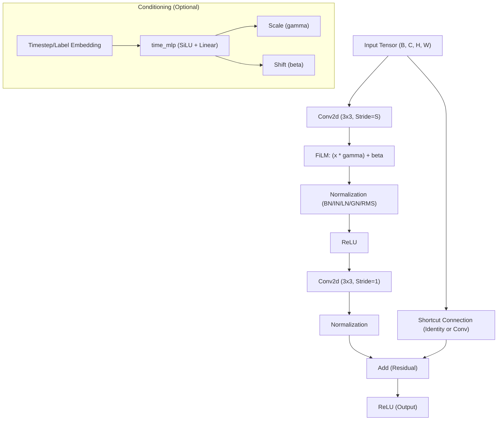
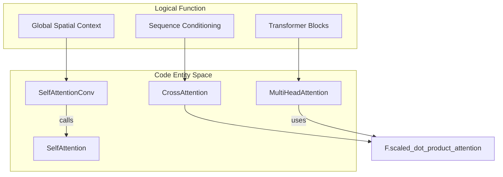

# VAE Building Blocks: ResNet Components and Attention

> **Relevant source files**
> - [starling/data/data\_wrangler\.py](https://github.com/idptools/starling/blob/4b98d2fe/starling/data/data_wrangler.py)
> - [starling/models/attention\.py](https://github.com/idptools/starling/blob/4b98d2fe/starling/models/attention.py)
> - [starling/models/blocks\.py](https://github.com/idptools/starling/blob/4b98d2fe/starling/models/blocks.py)
> - [starling/models/normalization\.py](https://github.com/idptools/starling/blob/4b98d2fe/starling/models/normalization.py)
> - [starling/models/transformer\.py](https://github.com/idptools/starling/blob/4b98d2fe/starling/models/transformer.py)
> - [starling/models/vae\_components\.py](https://github.com/idptools/starling/blob/4b98d2fe/starling/models/vae_components.py)

 This page provides a technical reference for the primitive neural building blocks used within the STARLING Variational Autoencoder \(VAE\)\. These components handle spatial processing of distance maps, normalization, conditioning, and attention\-based refinement\.

## ResNet Components

 The VAE architecture relies on specialized Residual Blocks for both the encoder and decoder\. These blocks are designed to handle 2D spatial data \(distance maps\) and can optionally incorporate conditioning information\.

### ResBlockEncBasic

 The `ResBlockEncBasic` is the fundamental building block for the `ResNet_Encoder` [vae\_components\.py L13-L21](https://github.com/idptools/starling/blob/4b98d2fe/starling/models/vae_components.py#L13-L21) It follows the standard ResNet\-18/34 design, consisting of two convolutional layers with a residual connection [blocks\.py L131-L166](https://github.com/idptools/starling/blob/4b98d2fe/starling/models/blocks.py#L131-L166)

 - **Structure**: Two $3 \\times 3$ \(default\) convolutions\. The first convolution can perform spatial downsampling via the `stride` parameter [blocks\.py L180-L186](https://github.com/idptools/starling/blob/4b98d2fe/starling/models/blocks.py#L180-L186)
- **Conditioning**: Supports FiLM\-style conditioning via a `time_mlp` if a `timestep` dimension is provided [blocks\.py L195-L199](https://github.com/idptools/starling/blob/4b98d2fe/starling/models/blocks.py#L195-L199)

### ResBlockDecBasic

 The `ResBlockDecBasic` is used in the `ResNet_Decoder` [vae\_components\.py L108-L117](https://github.com/idptools/starling/blob/4b98d2fe/starling/models/vae_components.py#L108-L117) It is designed to mirror the encoder's structure but uses `ResizeConv2d` for upsampling to avoid checkerboard artifacts [blocks\.py L246-L281](https://github.com/idptools/starling/blob/4b98d2fe/starling/models/blocks.py#L246-L281)

 - **Upsampling**: If `stride > 1`, the block utilizes `ResizeConv2d` to increase spatial dimensions [blocks\.py L302-L311](https://github.com/idptools/starling/blob/4b98d2fe/starling/models/blocks.py#L302-L311)
- **Contraction**: The block typically reduces channel depth \(contraction\) as it increases spatial resolution [blocks\.py L247-L248](https://github.com/idptools/starling/blob/4b98d2fe/starling/models/blocks.py#L247-L248)

### ResizeConv2d

 A replacement for `ConvTranspose2d`, this module uses `F.interpolate` followed by a standard `Conv2d` [blocks\.py L65-L104](https://github.com/idptools/starling/blob/4b98d2fe/starling/models/blocks.py#L65-L104) This approach is mathematically preferred for generating smooth distance maps without grid\-like artifacts [blocks\.py L79-L82](https://github.com/idptools/starling/blob/4b98d2fe/starling/models/blocks.py#L79-L82)

 **ResNet Block Data Flow**

 **Sources:** [blocks\.py L131-L244](https://github.com/idptools/starling/blob/4b98d2fe/starling/models/blocks.py#L131-L244) [blocks\.py L65-L128](https://github.com/idptools/starling/blob/4b98d2fe/starling/models/blocks.py#L65-L128)

---

## Normalization Strategies

 STARLING implements a flexible normalization interface supporting multiple strategies, selectable via string configuration in the VAE factory functions [vae\_components\.py L26-L31](https://github.com/idptools/starling/blob/4b98d2fe/starling/models/vae_components.py#L26-L31)

| Type | Class/Function | Description |
| --- | --- | --- |
| BatchNorm | nn\.BatchNorm2d | Standard batch\-wise normalization\. |
| InstanceNorm | nn\.InstanceNorm2d | Normalization per sample and per channel\. |
| LayerNorm | LayerNorm | Custom implementation supporting channels\_first format \(B, C, H, W\) by permuting dimensions starling/models/blocks\.py9\-41 |
| RMSNorm | RMSNorm | Root Mean Square Layer Normalization, scaling by the square root of the channel dimension starling/models/normalization\.py6\-12 |
| GroupNorm | nn\.GroupNorm | Normalizes groups of channels; STARLING defaults to 32 groups starling/models/blocks\.py190 |
| AdaLayerNorm | AdaLayerNorm | Adaptive Layer Norm used in Transformers, where scale and shift are predicted from a conditioning vector starling/models/transformer\.py103\-137 |

 **Sources:** [blocks\.py L9-L41](https://github.com/idptools/starling/blob/4b98d2fe/starling/models/blocks.py#L9-L41) [normalization\.py L6-L12](https://github.com/idptools/starling/blob/4b98d2fe/starling/models/normalization.py#L6-L12) [transformer\.py L103-L137](https://github.com/idptools/starling/blob/4b98d2fe/starling/models/transformer.py#L103-L137)

---

## Attention Mechanisms

 The VAE and Diffusion backbones utilize several attention variants for spatial and sequence\-based conditioning\.

### MultiHeadAttention

 A generic implementation supporting both self\-attention and cross\-attention [attention\.py L11-L38](https://github.com/idptools/starling/blob/4b98d2fe/starling/models/attention.py#L11-L38) It uses `torch.nn.functional.scaled_dot_product_attention` for optimized computation \(FlashAttention where available\) [attention\.py L74](https://github.com/idptools/starling/blob/4b98d2fe/starling/models/attention.py#L74-L74)

### SelfAttentionConv

 A specialized attention block for 2D feature maps\. It treats spatial locations as tokens and computes attention across the height and width dimensions [attention\.py L162-L185](https://github.com/idptools/starling/blob/4b98d2fe/starling/models/attention.py#L162-L185)

 - **Input**: \(B, C, H, W\)
- **Mechanism**: Flattens spatial dimensions to \(B, H\*W, C\), applies Multi\-Head Attention, and reshapes back to \(B, C, H, W\) [attention\.py L221-L236](https://github.com/idptools/starling/blob/4b98d2fe/starling/models/attention.py#L221-L236)

### CrossAttention

 Used primarily in the Diffusion model's `SequenceEncoder` to condition the 2D latents on 1D amino acid sequences [attention\.py L82-L120](https://github.com/idptools/starling/blob/4b98d2fe/starling/models/attention.py#L82-L120) It performs normalization on both query and context inputs before projection [attention\.py L129-L130](https://github.com/idptools/starling/blob/4b98d2fe/starling/models/attention.py#L129-L130)

 **Attention Entity Mapping**

 **Sources:** [attention\.py L11-L160](https://github.com/idptools/starling/blob/4b98d2fe/starling/models/attention.py#L11-L160) [attention\.py L162-L240](https://github.com/idptools/starling/blob/4b98d2fe/starling/models/attention.py#L162-L240)

---

## Conditioning and Encodings

### FiLM \(Feature\-wise Linear Modulation\)

 Integrated into `ResBlockEncBasic` and `ResBlockDecBasic`\. It modulates feature maps by applying a learned affine transformation \(scale and shift\) derived from an external vector \(e\.g\., timestep or class label\) [blocks\.py L218-L220](https://github.com/idptools/starling/blob/4b98d2fe/starling/models/blocks.py#L218-L220)

### SinusoidalPosEmb

 Generates sinusoidal embeddings for timestep encoding in the diffusion process [transformer\.py L15-L30](https://github.com/idptools/starling/blob/4b98d2fe/starling/models/transformer.py#L15-L30) It maps a scalar time value to a high\-dimensional vector using varying frequencies of sine and cosine functions [transformer\.py L51-L57](https://github.com/idptools/starling/blob/4b98d2fe/starling/models/transformer.py#L51-L57)

 **Sources:** [blocks\.py L218-L220](https://github.com/idptools/starling/blob/4b98d2fe/starling/models/blocks.py#L218-L220) [transformer\.py L15-L58](https://github.com/idptools/starling/blob/4b98d2fe/starling/models/transformer.py#L15-L58)

