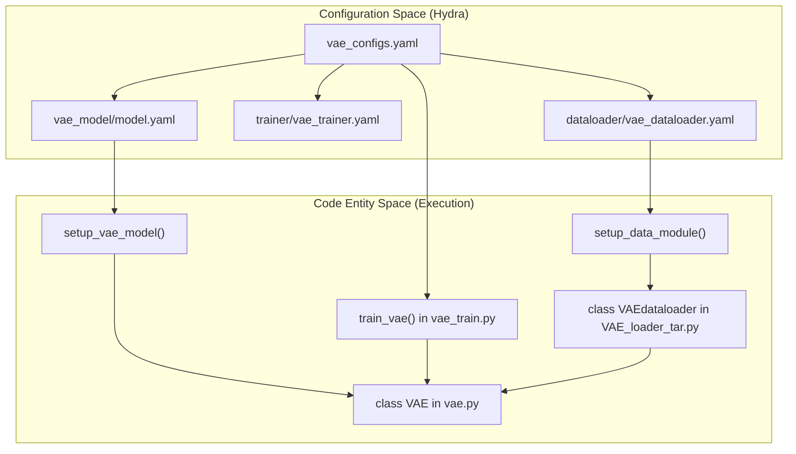
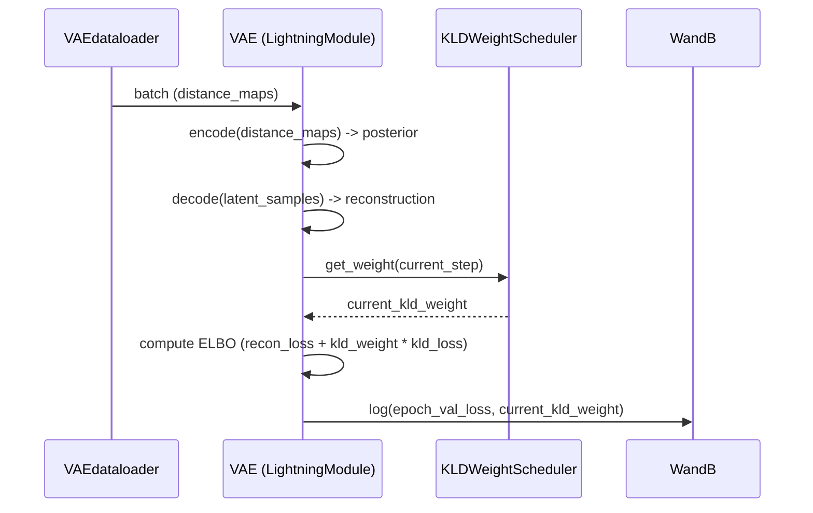

# VAE Training

> **Relevant source files**
> * [starling/configs/dataloader/vae_dataloader.yaml](https://github.com/idptools/starling/blob/4b98d2fe/starling/configs/dataloader/vae_dataloader.yaml)
> * [starling/configs/trainer/vae_trainer.yaml](https://github.com/idptools/starling/blob/4b98d2fe/starling/configs/trainer/vae_trainer.yaml)
> * [starling/configs/vae_configs.yaml](https://github.com/idptools/starling/blob/4b98d2fe/starling/configs/vae_configs.yaml)
> * [starling/configs/vae_model/model.yaml](https://github.com/idptools/starling/blob/4b98d2fe/starling/configs/vae_model/model.yaml)
> * [starling/data/VAE_loader_tar.py](https://github.com/idptools/starling/blob/4b98d2fe/starling/data/VAE_loader_tar.py)
> * [starling/data/argument_parser.py](https://github.com/idptools/starling/blob/4b98d2fe/starling/data/argument_parser.py)
> * [starling/models/vae.py](https://github.com/idptools/starling/blob/4b98d2fe/starling/models/vae.py)
> * [starling/training/config.yaml](https://github.com/idptools/starling/blob/4b98d2fe/starling/training/config.yaml)
> * [starling/training/vae_train.py](https://github.com/idptools/starling/blob/4b98d2fe/starling/training/vae_train.py)

The Variational Autoencoder (VAE) training pipeline is responsible for learning a compressed latent representation of protein distance maps. This stage is critical for the subsequent Diffusion model training, as it defines the latent space where diffusion occurs. The pipeline is built on PyTorch Lightning and utilizes Hydra for configuration management, supporting large-scale distributed training on protein conformational data.

### Training Entrypoint and Data Flow

The primary entrypoint for VAE training is the `train_vae` function located in `starling/training/vae_train.py` [starling/training/vae_train.py L106-L191](https://github.com/idptools/starling/blob/4b98d2fe/starling/training/vae_train.py#L106-L191)

 This script orchestrates the instantiation of the model, the data module, and the PyTorch Lightning `Trainer`.

**System Architecture and Data Flow**
The following diagram illustrates the relationship between the configuration files, the training script, and the core VAE classes.

"VAE Training Architecture"

Sources: [starling/training/vae_train.py L101-L191](https://github.com/idptools/starling/blob/4b98d2fe/starling/training/vae_train.py#L101-L191)

 [starling/configs/vae_configs.yaml L1-L5](https://github.com/idptools/starling/blob/4b98d2fe/starling/configs/vae_configs.yaml#L1-L5)

 [starling/models/vae.py L86-L104](https://github.com/idptools/starling/blob/4b98d2fe/starling/models/vae.py#L86-L104)

### Configuration Hierarchy

Training is driven by a hierarchical Hydra configuration defined in `starling/configs/vae_configs.yaml` [starling/configs/vae_configs.yaml L1-L5](https://github.com/idptools/starling/blob/4b98d2fe/starling/configs/vae_configs.yaml#L1-L5)

| Config Component | File Path | Key Responsibilities |
| --- | --- | --- |
| **Model** | `vae_model/model.yaml` | Architecture (ResNet type), latent dimensions, loss types (`mse`/`nll`), and KLD scheduling [starling/configs/vae_model/model.yaml L1-L17](https://github.com/idptools/starling/blob/4b98d2fe/starling/configs/vae_model/model.yaml#L1-L17) |
| **Trainer** | `trainer/vae_trainer.yaml` | GPU/Node counts, precision (`bf16-mixed`), checkpoint paths, and fine-tuning flags [starling/configs/trainer/vae_trainer.yaml L1-L12](https://github.com/idptools/starling/blob/4b98d2fe/starling/configs/trainer/vae_trainer.yaml#L1-L12) |
| **Dataloader** | `dataloader/vae_dataloader.yaml` | Dataset paths, batch size, and worker configuration for `tar` or `h5` backends [starling/configs/dataloader/vae_dataloader.yaml L1-L17](https://github.com/idptools/starling/blob/4b98d2fe/starling/configs/dataloader/vae_dataloader.yaml#L1-L17) |

### VAE Model Initialization and Fine-Tuning

The `setup_vae_model` function in `vae_train.py` handles the logic for creating a new model or loading weights from an existing checkpoint [starling/training/vae_train.py L79-L98](https://github.com/idptools/starling/blob/4b98d2fe/starling/training/vae_train.py#L79-L98)

* **Fresh Training**: If `fine_tune` is `false` and no checkpoint is provided, the model is instantiated from the Hydra config [starling/training/vae_train.py L96](https://github.com/idptools/starling/blob/4b98d2fe/starling/training/vae_train.py#L96-L96)
* **Fine-Tuning**: If `fine_tune` is `true`, the model is first instantiated with the current configuration, and then weights are loaded from the checkpoint via `load_state_dict` [starling/training/vae_train.py L83-L93](https://github.com/idptools/starling/blob/4b98d2fe/starling/training/vae_train.py#L83-L93)
* **Resuming**: If `fine_tune` is `false` but a checkpoint exists, the `Trainer.fit` method handles resuming the full training state (optimizer, epoch count) [starling/training/vae_train.py L141-L148](https://github.com/idptools/starling/blob/4b98d2fe/starling/training/vae_train.py#L141-L148)  [starling/training/vae_train.py L187-L191](https://github.com/idptools/starling/blob/4b98d2fe/starling/training/vae_train.py#L187-L191)

Sources: [starling/training/vae_train.py L79-L98](https://github.com/idptools/starling/blob/4b98d2fe/starling/training/vae_train.py#L79-L98)

 [starling/training/vae_train.py L187-L191](https://github.com/idptools/starling/blob/4b98d2fe/starling/training/vae_train.py#L187-L191)

### Distributed Training and Batch Size

Effective batch size is calculated to ensure consistency across distributed environments. For the `tar` (WebDataset) loader, the effective batch size is determined by:
`effective_batch_size = cfg.trainer.cuda * cfg.trainer.num_nodes * cfg.dataloader.tar.batch_size` [starling/training/vae_train.py L152-L154](https://github.com/idptools/starling/blob/4b98d2fe/starling/training/vae_train.py#L152-L154)

The `VAEdataloader` uses this value to calculate the number of training and validation batches per epoch, which is required for `webdataset` to provide a consistent epoch length [starling/data/VAE_loader_tar.py L47-L49](https://github.com/idptools/starling/blob/4b98d2fe/starling/data/VAE_loader_tar.py#L47-L49)

Sources: [starling/training/vae_train.py L152-L156](https://github.com/idptools/starling/blob/4b98d2fe/starling/training/vae_train.py#L152-L156)

 [starling/data/VAE_loader_tar.py L47-L49](https://github.com/idptools/starling/blob/4b98d2fe/starling/data/VAE_loader_tar.py#L47-L49)

### KLD Weight Scheduling

The VAE employs a `KLDWeightScheduler` to manage the trade-off between reconstruction accuracy and latent space regularity (the KL divergence term in the ELBO loss) [starling/models/vae.py L21-L84](https://github.com/idptools/starling/blob/4b98d2fe/starling/models/vae.py#L21-L84)

* **Cyclical Annealing**: The default scheduler type is `cyclical` [starling/models/vae.py L55](https://github.com/idptools/starling/blob/4b98d2fe/starling/models/vae.py#L55-L55)  It divides the total training steps into cycles (defaulting to 5 cycles, each 20% of total steps) [starling/models/vae.py L57](https://github.com/idptools/starling/blob/4b98d2fe/starling/models/vae.py#L57-L57)
* **Warmup**: Within each cycle, the weight ramps linearly from 0 to `max_weight` during the `warmup_fraction` of the cycle [starling/models/vae.py L60-L67](https://github.com/idptools/starling/blob/4b98d2fe/starling/models/vae.py#L60-L67)

"VAE Training Logic and Loss Calculation"

Sources: [starling/models/vae.py L21-L84](https://github.com/idptools/starling/blob/4b98d2fe/starling/models/vae.py#L21-L84)

 [starling/models/vae.py L236-L267](https://github.com/idptools/starling/blob/4b98d2fe/starling/models/vae.py#L236-L267)

 [starling/training/vae_train.py L168-L169](https://github.com/idptools/starling/blob/4b98d2fe/starling/training/vae_train.py#L168-L169)

### Checkpoint and Experiment Management

The pipeline integrates with **Weights & Biases (WandB)** for experiment tracking.

* **Initialization**: `wandb_init` is called on `rank_zero` to prevent duplicate runs in distributed settings [starling/training/vae_train.py L19-L21](https://github.com/idptools/starling/blob/4b98d2fe/starling/training/vae_train.py#L19-L21)
* **Callbacks**: The `ModelCheckpoint` callback is configured to monitor `epoch_val_loss` and save the best model as well as a `last.ckpt` for resiliency [starling/training/vae_train.py L128-L138](https://github.com/idptools/starling/blob/4b98d2fe/starling/training/vae_train.py#L128-L138)
* **Logging**: The `LearningRateMonitor` tracks scheduler behavior across steps [starling/training/vae_train.py L180](https://github.com/idptools/starling/blob/4b98d2fe/starling/training/vae_train.py#L180-L180)

Sources: [starling/training/vae_train.py L19-L21](https://github.com/idptools/starling/blob/4b98d2fe/starling/training/vae_train.py#L19-L21)

 [starling/training/vae_train.py L128-L138](https://github.com/idptools/starling/blob/4b98d2fe/starling/training/vae_train.py#L128-L138)

 [starling/training/vae_train.py L168-L184](https://github.com/idptools/starling/blob/4b98d2fe/starling/training/vae_train.py#L168-L184)