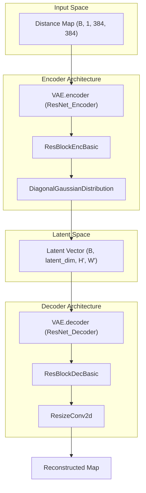

# Variational Autoencoder (VAE)

> **Relevant source files**
> * [starling/configs/vae_model/model.yaml](https://github.com/idptools/starling/blob/4b98d2fe/starling/configs/vae_model/model.yaml)
> * [starling/data/data_wrangler.py](https://github.com/idptools/starling/blob/4b98d2fe/starling/data/data_wrangler.py)
> * [starling/data/distributions.py](https://github.com/idptools/starling/blob/4b98d2fe/starling/data/distributions.py)
> * [starling/data/positional_encodings.py](https://github.com/idptools/starling/blob/4b98d2fe/starling/data/positional_encodings.py)
> * [starling/models/attention.py](https://github.com/idptools/starling/blob/4b98d2fe/starling/models/attention.py)
> * [starling/models/blocks.py](https://github.com/idptools/starling/blob/4b98d2fe/starling/models/blocks.py)
> * [starling/models/normalization.py](https://github.com/idptools/starling/blob/4b98d2fe/starling/models/normalization.py)
> * [starling/models/transformer.py](https://github.com/idptools/starling/blob/4b98d2fe/starling/models/transformer.py)
> * [starling/models/vae.py](https://github.com/idptools/starling/blob/4b98d2fe/starling/models/vae.py)
> * [starling/models/vae_components.py](https://github.com/idptools/starling/blob/4b98d2fe/starling/models/vae_components.py)

The Variational Autoencoder (VAE) in STARLING serves as the foundational generative component that learns a compressed latent representation of protein distance maps. By encoding high-dimensional distance matrices into a low-dimensional, regularized latent space, the VAE enables the subsequent diffusion process to operate efficiently on latents rather than raw pixel-space coordinates [starling/models/vae.py L106-L114](https://github.com/idptools/starling/blob/4b98d2fe/starling/models/vae.py#L106-L114)

## Architecture Overview

The VAE architecture is based on a symmetric ResNet design, supporting both **ResNet-18** and **ResNet-34** backbones [starling/models/vae.py L157-L166](https://github.com/idptools/starling/blob/4b98d2fe/starling/models/vae.py#L157-L166)

 It processes input distance maps (typically $384 \times 384$) through an encoder to produce distribution parameters, which are then sampled and passed through a decoder to reconstruct the original map [starling/models/vae.py L125-L132](https://github.com/idptools/starling/blob/4b98d2fe/starling/models/vae.py#L125-L132)

### Data Flow and Component Mapping

The following diagram illustrates the transformation from raw distance map data to the latent space and back, mapping logical stages to specific code entities.

**Diagram: VAE Data Flow and Code Mapping**

**Sources:** [starling/models/vae.py L157-L166](https://github.com/idptools/starling/blob/4b98d2fe/starling/models/vae.py#L157-L166)

 [starling/models/vae_components.py L13-L21](https://github.com/idptools/starling/blob/4b98d2fe/starling/models/vae_components.py#L13-L21)

 [starling/models/vae_components.py L108-L117](https://github.com/idptools/starling/blob/4b98d2fe/starling/models/vae_components.py#L108-L117)

 [starling/data/distributions.py L5-L30](https://github.com/idptools/starling/blob/4b98d2fe/starling/data/distributions.py#L5-L30)

## Latent Space Parameterization

The latent space is parameterized using the `DiagonalGaussianDistribution` class. The encoder outputs a tensor that is split into `mean` and `logvar` components [starling/data/distributions.py L20-L21](https://github.com/idptools/starling/blob/4b98d2fe/starling/data/distributions.py#L20-L21)

* **Numerical Stability**: Log-variance is clamped between -30.0 and 20.0 to prevent gradient explosion [starling/data/distributions.py L25](https://github.com/idptools/starling/blob/4b98d2fe/starling/data/distributions.py#L25-L25)
* **Sampling**: Uses the reparameterization trick ($z = \mu + \sigma \odot \epsilon$) via the `sample()` method [starling/data/distributions.py L47-L48](https://github.com/idptools/starling/blob/4b98d2fe/starling/data/distributions.py#L47-L48)
* **Deterministic Mode**: Supports returning the `mode` (mean) for inference tasks where stochasticity is not desired [starling/data/distributions.py L78-L87](https://github.com/idptools/starling/blob/4b98d2fe/starling/data/distributions.py#L78-L87)

**Sources:** [starling/data/distributions.py L5-L87](https://github.com/idptools/starling/blob/4b98d2fe/starling/data/distributions.py#L5-L87)

## ELBO Loss and KLD Scheduling

The model is trained using the Evidence Lower Bound (ELBO), combining a reconstruction loss with a Kullback-Leibler Divergence (KLD) regularization term [starling/models/vae.py L108-L112](https://github.com/idptools/starling/blob/4b98d2fe/starling/models/vae.py#L108-L112)

| Loss Component | Implementation | Description |
| --- | --- | --- |
| **Reconstruction** | `mse` or `nll` | Measures how well the decoder recovers the input map [starling/models/vae.py L133-L134](https://github.com/idptools/starling/blob/4b98d2fe/starling/models/vae.py#L133-L134) |
| **KLD** | `DiagonalGaussianDistribution.kl` | Penalizes deviation of the latent distribution from a standard normal prior [starling/data/distributions.py L50-L67](https://github.com/idptools/starling/blob/4b98d2fe/starling/data/distributions.py#L50-L67) |
| **Weighting** | `KLDWeightScheduler` | Manages the trade-off between reconstruction and regularization [starling/models/vae.py L21-L27](https://github.com/idptools/starling/blob/4b98d2fe/starling/models/vae.py#L21-L27) |

### KLD Scheduling Strategies

To avoid "posterior collapse" (where the model ignores the latent space), STARLING implements a `KLDWeightScheduler` with two primary modes:

1. **Linear**: Gradually increases the KLD weight from 0 to `max_weight` over a warmup period [starling/models/vae.py L50-L54](https://github.com/idptools/starling/blob/4b98d2fe/starling/models/vae.py#L50-L54)
2. **Cyclical**: Periodically resets and ramps up the weight to encourage the model to utilize the latent space more effectively across multiple phases of training [starling/models/vae.py L55-L67](https://github.com/idptools/starling/blob/4b98d2fe/starling/models/vae.py#L55-L67)

**Sources:** [starling/models/vae.py L21-L84](https://github.com/idptools/starling/blob/4b98d2fe/starling/models/vae.py#L21-L84)

 [starling/data/distributions.py L50-L76](https://github.com/idptools/starling/blob/4b98d2fe/starling/data/distributions.py#L50-L76)

## Implementation Details

### Masking and Symmetrization

Distance maps represent pairwise distances between residues. Since protein sequences vary in length, inputs are padded to a fixed dimension (e.g., 384) using `MaxPad` [starling/data/data_wrangler.py L58-L80](https://github.com/idptools/starling/blob/4b98d2fe/starling/data/data_wrangler.py#L58-L80)

 The VAE logic ensures that reconstruction loss is only calculated on the valid (non-padded) regions. Post-generation, the `symmetrize` utility is used to ensure the predicted distance maps maintain physical consistency ($d_{ij} = d_{ji}$) [starling/data/data_wrangler.py L128-L141](https://github.com/idptools/starling/blob/4b98d2fe/starling/data/data_wrangler.py#L128-L141)

### Torch.compile Support

The VAE is designed for high-performance inference and training. It supports `torch.compile` via the `compile_mode` parameter, typically set to `max-autotune` [starling/models/vae.py L102](https://github.com/idptools/starling/blob/4b98d2fe/starling/models/vae.py#L102-L102)

 Precision is further optimized using `torch.set_float32_matmul_precision("high")` [starling/models/vae.py L18](https://github.com/idptools/starling/blob/4b98d2fe/starling/models/vae.py#L18-L18)

### Building Blocks

The VAE relies on specialized convolutional blocks to manage spatial dimensions:

* **Encoder**: Uses `ResBlockEncBasic` with strided convolutions for downsampling [starling/models/blocks.py L131-L166](https://github.com/idptools/starling/blob/4b98d2fe/starling/models/blocks.py#L131-L166)
* **Decoder**: Uses `ResBlockDecBasic` combined with `ResizeConv2d` (interpolation + convolution) to avoid checkerboard artifacts common in standard transposed convolutions [starling/models/blocks.py L65-L128](https://github.com/idptools/starling/blob/4b98d2fe/starling/models/blocks.py#L65-L128)

For a deep dive into these primitives, see [VAE Building Blocks: ResNet Components and Attention](/idptools/starling/2.1.1-vae-building-blocks:-resnet-components-and-attention).

**Sources:** [starling/models/vae.py L18-L102](https://github.com/idptools/starling/blob/4b98d2fe/starling/models/vae.py#L18-L102)

 [starling/data/data_wrangler.py L58-L141](https://github.com/idptools/starling/blob/4b98d2fe/starling/data/data_wrangler.py#L58-L141)

 [starling/models/blocks.py L65-L166](https://github.com/idptools/starling/blob/4b98d2fe/starling/models/blocks.py#L65-L166)