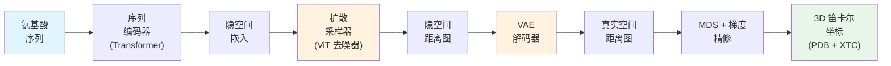

---
slug:1-overview
blog_type:normal
---


**STARLING**（con**ST**ruction of intrinsic**A**lly diso**R**dered proteins ensembles efficient**L**y v**I**a multi-dime**N**sional **G**enerative models，即基于多维生成模型高效构建本质无序蛋白质系综）是一种隐空间概率去噪扩散模型，用于预测本质无序蛋白质（IDP）和本质无序区域（IDR）的粗粒化构象系综。STARLING 由 Holehouse 实验室开发，能将氨基酸序列转换为结构多样的 3D 构象系综——在 GPU 上仅需数秒，在 CPU 上仅需数分钟——从而实现对无序蛋白质物理特性的快速计算表征。

来源: [README.md](/README.md#L1-L27), [starling/__init__.py](/starling/__init__.py#L1-L14)

---

## STARLING 解决了什么问题？

本质无序蛋白质缺乏稳定的折叠结构，而是分布在一个广阔的相互转换的构象系综中。对这些系综的实验表征通常十分困难，且往往只能间接进行（例如 SAXS、NMR 化学位移、FRET）。传统的分子动力学模拟虽然可以对这些系综进行采样，但需要微秒到毫秒级的时间尺度——这在常规使用中计算成本过高。**STARLING 弥合了这一鸿沟**，利用深度生成模型仅从序列出发*直接预测*构象系综，在单步 MD 模拟所需的时间内即可生成数百个结构。

来源: [README.md](/README.md#L16-L27)

---

## STARLING 的工作原理 — 端到端流程

从宏观上看，STARLING 实现了一个**两阶段的隐空间扩散流程**，将 1D 氨基酸序列转换为一组 3D 蛋白质构象：



| 阶段 | 组件 | 输入 → 输出 | 模型架构 |
|-------|-----------|----------------|-------------------|
| **1. 编码** | 序列编码器 | 氨基酸字符串 → 上下文嵌入 (512维) | 12层 Transformer，8个注意力头 |
| **2. 隐空间扩散** | DDIM/DDPM 采样器 + ViT 去噪器 | 噪声 + 上下文 → 隐空间距离图 | 带有 DiT 块的 Vision Transformer，patch 大小为 3 |
| **3. 解码** | VAE 解码器 | 隐空间图 → 真实空间距离图 | 基于 ResNet 的 VAE (编码器/解码器) |
| **4. 重建** | MDS + 梯度下降 | 距离图 → 3D Cα 坐标 | 多起点度量 MDS + torch.optim 精修 |

该流程是**条件生成**的：序列编码器生成每个蛋白质的上下文向量，引导扩散过程为该特定序列生成物理上真实的距离图。离子强度（溶剂条件）作为额外的条件变量被包含在内。

来源: [starling/inference/model_loading.py](/starling/inference/model_loading.py#L16-L61), [starling/models/vit.py](/starling/models/vit.py#L31-L78), [starling/models/vae.py](/starling/models/vae.py#L86-L151), [starling/samplers/ddim_sampler.py](/starling/samplers/ddim_sampler.py#L19-L58), [starling/structure/coordinates.py](/starling/structure/coordinates.py#L1-L80)

---

## 核心功能

除基本的系综生成外，STARLING 还提供四项主要功能：

| 功能 | 描述 | 入口 |
|------------|-------------|-------------|
| **系综生成** | 从序列生成 N 个构象，可选输出 3D 结构 | `starling.generate()` 或 `starling` CLI |
| **约束引导采样** | 在生成过程中使用 Rg、端到端距离或螺旋度约束引导扩散 | `generate()` 中的 `constraint` 参数 |
| **BME 重加权** | 使用贝叶斯最大熵根据实验可观测值（SAXS、NMR、FRET）对系综进行重加权 | `ensemble.reweight_bme()` |
| **相似性搜索** | 基于预构建的约 100 万蛋白质嵌入数据库，通过 FAISS 驱动的 ANN 搜索 | `starling.search.SearchEngine` |

<CgxTip>`generate()` 函数是 Python API 和 CLI 使用的统一入口点。它处理输入解析、序列验证、模型加载、扩散采样、距离图解码以及可选的 3D 重建——所有这些均在一次调用中完成。</CgxTip>

来源: [starling/frontend/ensemble_generation.py](/starling/frontend/ensemble_generation.py#L160-L260), [starling/inference/constraints.py](/starling/inference/constraints.py#L41-L78), [starling/structure/bme.py](/starling/structure/bme.py#L1-L48), [starling/search/search_engine.py](/starling/search/search_engine.py#L1-L59)

---

## 项目架构

`starling` 包被组织为职责明确的分离子系统：

```
starling/
├── frontend/          # 面向用户的高层 API
│   ├── ensemble_generation.py   ← generate() 及输入处理
│   └── starling_viz.py         ← 可视化辅助工具
├── inference/         # 推理编排
│   ├── generation.py           ← 后端: 编码器 → 采样器 → 解码器 → MDS
│   ├── model_loading.py        ← 延迟加载的 ModelManager 单例
│   ├── constraints.py          ← 约束引导采样 (Rg, 距离, 螺旋度)
│   └── benchmark_mds.py        ← 性能分析
├── models/            # 神经网络架构
│   ├── transformer.py          ← SequenceEncoder, DiTBlock, SinusoidalPosEmb
│   ├── vit.py                  ← 带有 patch 嵌入的 Vision Transformer 去噪器
│   ├── vae.py                  ← 变分自编码器 (ResNet 编码器/解码器)
│   ├── diffusion.py            ← DiffusionModel: q_sample, 噪声调度
│   └── attention.py            ← 自/交叉注意力模块
├── samplers/          # 扩散采样策略
│   ├── ddim_sampler.py         ← DDIM (快速, 确定性)
│   ├── ddpm_sampler.py         ← DDPM (随机基线)
│   └── plms_sampler.py         ← PLMS (伪线性多步)
├── structure/         # 推理后结构工具
│   ├── ensemble.py             ← Ensemble 对象 (距离图 + 分析)
│   ├── coordinates.py          ← MDS + 梯度下降 3D 重建
│   └── bme.py                  ← 贝叶斯最大熵重加权
├── search/            # 相似性搜索基础设施
│   ├── search_engine.py        ← FAISS 驱动的 SearchEngine
│   ├── builder.py              ← 索引构建
│   └── store.py                ← 基于 SQLite 的序列存储
├── data/              # 数据处理工具
│   ├── tokenizer.py            ← StarlingTokenizer (字节级氨基酸编码)
│   ├── schedulers.py           ← Beta 调度 (余弦, 线性, S型)
│   └── distributions.py        ← 用于 VAE 的 DiagonalGaussianDistribution
├── configs/           # YAML 模型配置文件
├── configs.py         ← 全局默认值, 路径, 用户配置覆盖
└── scripts/           # CLI 入口点
    ├── starling_main_cli.py
    ├── starling_converter.py
    └── starling_search.py
```

来源: [starling/__init__.py](/starling/__init__.py#L1-L14), [starling/configs.py](/starling/configs.py#L1-L35)

---

## 模型规格

STARLING v2.0.0 提供了两个预训练检查点，两者均在首次使用时延迟加载并在此会话生命周期内缓存：

| 模型 | 检查点 | 架构 | 作用 |
|-------|-----------|--------------|------|
| **序列编码器** | `STARLING_v2.0.0_ViT_VAE_2025_10_14.ckpt` | VAE (基于 ResNet) | 将距离图编码至/解码自隐空间；提供条件嵌入 |
| **扩散模型** | `STARLING_v2.0.0_ViT_DDPM_2025_10_14.ckpt` | 封装 ViT(12层, 512维, 8头) 的 DiffusionModel | 基于序列上下文条件对隐空间距离图进行去噪 |

模型在首次运行时从 GitHub Releases 自动下载，并缓存在 `~/.starling_weights/` 中。可以通过 `encoder_path` / `ddpm_path` 参数或 `STARLING_ENCODER_PATH` / `STARLING_DDPM_PATH` 环境变量提供自定义检查点。CUDA 工作负载可选使用 `torch.compile()` 加速。

来源: [starling/configs.py](/starling/configs.py#L14-L15), [starling/inference/model_loading.py](/starling/inference/model_loading.py#L16-L131)

---

## 关键设计决策

| 决策 | 依据 |
|----------|-----------|
| **隐空间扩散**（而非像素空间） | 通过 VAE 压缩距离图降低了扩散模型必须学习的维度，从而实现更快的采样和更高质量的输出。这遵循了隐空间扩散模型范式（Rombach 等人，2021）。 |
| **Vision Transformer 去噪器**（而非 U-Net） | 带有 DiT 块的 ViT 提供了卓越的全局感受野，能够捕捉距离图中长程残基-残基的相关性。 |
| **MDS + 梯度精修**用于 3D 重建 | 距离图无法完美嵌入 3D 空间。多起点 MDS 提供初始猜测；在距离匹配损失上进行梯度下降精修坐标以最小化畸变。 |
| **延迟单例 ModelManager** | 模型仅加载一次并在多次 `generate()` 调用中复用，避免了重复的 GPU 显存分配和权重下载。 |
| **用户可配置的默认值** | `~/.starling_weights/` 中的 `configs.py` 文件可以覆盖任何全局默认值，无需修改代码即可实现用户级自定义。 |

来源: [starling/inference/model_loading.py](/starling/inference/model_loading.py#L63-L100), [starling/models/diffusion.py](/starling/models/diffusion.py#L55-L63), [starling/configs.py](/starling/configs.py#L54-L69)

---

## 安装与快速验证

STARLING 要求 **Python ≥ 3.10**，并在 PyPI 上以 `idptools-starling` 分发：

```bash
conda create -n starling python=3.11 -y && conda activate starling
pip install idptools-starling
starling --help    # 验证安装
```

我们还提供 Docker 镜像和 Google Colab 笔记本，以实现零安装使用。该包包含类型标记（`py.typed`），支持 CPU、CUDA 和 Apple MPS 后端，并具备自动设备选择功能。

来源: [README.md](/README.md#L40-L67), [starling/configs.py](/starling/configs.py#L17-L24)

---

## STARLING 是什么 — 以及不是什么

| ✅ STARLING 是 | ❌ STARLING 不是 |
|---|---|
| 面向 IDP/IDR 的**序列到系综**预测器 | 折叠蛋白质结构预测器（请使用 AlphaFold/EsmFold） |
| **粗粒化**（仅 Cα）构象采样器 | 全原子分子动力学引擎 |
| 生成统计多样系综的**生成模型** | 确定性的单结构预言机 |
| 已在长达 **380 个残基**的序列上验证 | 为任意长蛋白质或多链复合物设计 |
| 通过 BME 重加权实现**实验整合**的工具 | 替代严谨的生物物理实验设计的工具 |

来源: [starling/configs.py](/starling/configs.py#L23), [starling/structure/ensemble.py](/starling/structure/ensemble.py#L42-L75)

---

## 接下来去哪

文档的组织方式将带你从初次使用走向深入的技术理解：

1. **[快速开始](2-quick-start)** — 在 5 分钟内运行你的第一个系综
2. **[CLI 参考](3-cli-reference)** — 完整的命令行工具文档
3. **[架构概览](4-architecture-overview)** — 详细的系统设计与数据流
4. **[序列编码器](5-sequence-encoder)** → **[VAE 隐空间](6-vae-latent-space)** → **[扩散模型设计](7-diffusion-model-design)** → **[采样策略](8-sampling-strategies)** — 生成流程，逐阶段解析
5. **[系综对象 API](9-ensemble-object-api)** → **[距离图到 3D 坐标](10-distance-map-to-3d-coordinates)** → **[BME 重加权](11-bme-reweighting)** — 处理生成的系综
6. **[约束类型](12-constraint-types)** → **[约束引导采样](13-constraint-guided-sampling)** — 使用先验引导生成
7. **[相似性搜索](16-similarity-search)** — 在 FAISS 索引中查找相关序列