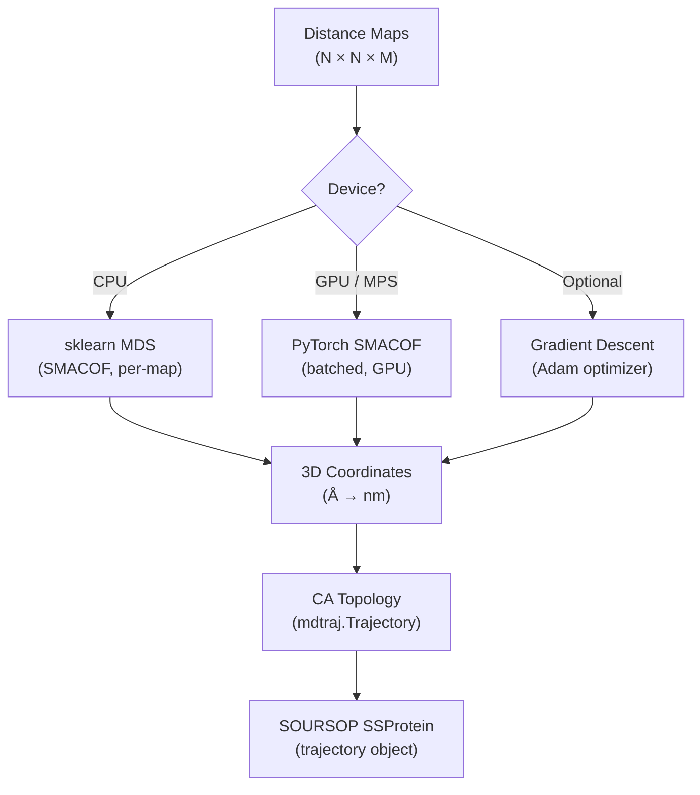
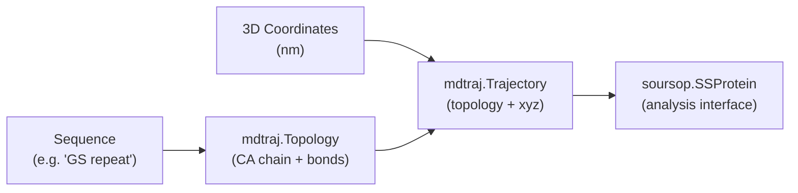

---
slug:10-distance-map-to-3d-coordinates
blog_type:normal
---


STARLING 的生成流水线生成**成对距离图**——残基间 Cα–Cα 距离的对称 N×N 矩阵——而非显式的 3D 结构。将这些距离图转换回笛卡尔坐标是关键的**嵌入步骤**，它 bridging了模型的潜在输出与物理上可实现的蛋白质构象。本页解释了数学基础、STARLING 提供的三种重建算法，以及 `Ensemble` 对象如何编排完整的距离到结构工作流。

## 嵌入问题

距离图 **D** ∈ ℝ^(N×N) 编码了 N 个残基之间的所有成对距离。恢复坐标 **X** ∈ ℝ^(N×3) 使得 ‖xᵢ − xⱼ‖ ≈ Dᵢⱼ 是**多维缩放 (MDS)** 的一个实例——距离矩阵操作的逆运算。该问题是欠定的（**X** 的任何旋转、反射或平移都会产生相同的 **D**），但出于结构生物学目的，任何有效的嵌入都足够了，因为像 Rg 和 Rh 这样的可观测量是旋转不变的。

关键挑战在于，从扩散模型采样的距离图可能不是完美的**欧几里得**的——可能存在对三角不等式的微小违反——因此嵌入算法必须对近似距离矩阵具有鲁棒性。STARLING 通过三种互补的方法解决这个问题，每种方法在速度、准确性和硬件要求上都有不同的权衡。



来源: [coordinates.py](starling/structure/coordinates.py#L502-L581), [ensemble.py](starling/structure/ensemble.py#L729-L807)

## 重建算法

### 通过 scikit-learn 的 SMACOF (CPU 路径)

默认的 CPU 方法委托给 `sklearn.manifold.MDS`，并设置 `dissimilarity="precomputed"`，它实现了 **SMACOF**（通过复杂函数主缩放 Scaling by MAjorizing a COmplicated Function）算法。SMACOF 迭代地最小化**应力**函数：

**Stress(X) = Σᵢ<ⱼ (‖xᵢ − xⱼ‖ − Dᵢⱼ)²**

每个距离图在顺序循环中独立嵌入。独立重启次数 (`n_init`) 和并行 CPU 核心数 (`n_jobs`) 是可配置的，默认值取自 `configs.DEFAULT_MDS_NUM_INIT` (4) 和 `configs.DEFAULT_CPU_COUNT_MDS` (`n_init` 和 `os.cpu_count()` 中的较小值)。

| 参数 | 默认值 | 效果 |
|-----------|---------|--------|
| `n_components` | 3 | 固定为 3D 嵌入 |
| `dissimilarity` | `"precomputed"` | 输入是距离矩阵，而非原始特征 |
| `n_init` | 4 | 更多重启 → 找到全局最小值的机会更大，但速度更慢 |
| `n_jobs` | `min(n_init, cpu_count)` | 跨重启的并行度 |
| `normalized_stress` | `"auto"` | 在不同 scikit-learn 版本间保持行为一致 |

来源: [coordinates.py](starling/structure/coordinates.py#L255-L307), [configs.py](starling/configs.py#L19-L20)

### 通过 PyTorch 的 SMACOF (GPU / MPS 路径)

当 GPU 设备可用时，STARLING 使用完全在 PyTorch 中构建的自定义**批量 SMACOF 实现**。这通过批量张量操作并行处理所有构象，避免了 scikit-learn 路径的 Python 循环开销。

核心迭代遵循标准的 SMACOF Guttman 变换：在每一步中，构造一个权重矩阵 **B**，其中非对角线元素 Bᵢⱼ = −Dᵢⱼ / ‖xᵢ − xⱼ‖，对角线设置为保证行和为零。更新规则为 **X_new = (1/N) · B · X**，随后进行居中处理。通过应力跟踪收敛，并在 `|stress_old − stress_new| < tol` 时提前停止。批量公式使用 `torch.bmm` 进行矩阵乘法，并使用 `torch.where` 掩码避免更新批次内已收敛的样本。

| 参数 | 默认值 | 效果 |
|-----------|---------|--------|
| `batch_size` | 100 | 每次 GPU 批次的图数量 |
| `n_iter` | 300 | 每批次的最大 SMACOF 迭代次数 |
| `tol` | 1e-4 | 应力变化的收敛容差 |
| `device` | `"cuda"` | 计算设备 |
| `progress_bar` | `True` | 显示批次的 tqdm 进度条 |

<CgxTip>在 Apple MPS 上，由于不支持的操作（特别是 macOS ≤ 14 上的 `nonzero` 操作）的回退，PyTorch SMACOF 路径可能比 CPU **慢 1.5–2 倍**。当指定 `device="cpu"` 时，`generate_3d_coordinates_from_distances` 中的调度器会自动路由到 CPU sklearn 路径。如果你在 Apple Silicon 上遇到减速，请显式传递 `device="cpu"` 给 `build_ensemble_trajectory`。</CgxTip>

来源: [coordinates.py](starling/structure/coordinates.py#L123-L252), [coordinates.py](starling/structure/coordinates.py#L550-L579)

### 梯度下降 (替代方法)

第三种方法使用 **Adam 优化的梯度下降**来最小化目标距离矩阵与从当前坐标估计计算出的成对距离之间的 MSE。损失仅在矩阵上三角部分计算（以避免重复计算）：

**L(X) = MSE(D_upper, ‖X‖_upper)**

坐标使用**增量链**初始化——每个残基沿随机方向放置在距前一个残基 3.8 Å（标准 Cα–Cα 键长）处——而不是纯随机位置。这种基于物理信息的初始化为优化器提供了更好的起点，减少了收敛所需的迭代次数。

| 参数 | 默认值 | 效果 |
|-----------|---------|--------|
| `num_iterations` | 5000 | 梯度下降步数 |
| `learning_rate` | 1e-3 | Adam 优化器步长 |
| `device` | `"cuda:0"` | 计算设备 |
| `verbose` | `True` | 每 100 次迭代打印一次损失 |

<CgxTip>MPS 不支持 `float64` 张量。辅助函数 `get_tensor_dtype` 在 MPS 设备上自动向下转型为 `float32`。在实践中，MPS 上的梯度下降目前比 CPU 慢——提供此支持是为了在未来 Apple 提升 MPS 性能时保持兼容性。</CgxTip>

来源: [coordinates.py](starling/structure/coordinates.py#L310-L380), [coordinates.py](starling/structure/coordinates.py#L100-L120), [coordinates.py](starling/structure/coordinates.py#L15-L42)

## 方法调度逻辑

父函数 `generate_3d_coordinates_from_distances` 作为所有重建的**单一入口点**。它根据解析的设备字符串选择算法：

| 设备 | 算法 | 理由 |
|--------|-----------|-----------|
| `"cpu"` | sklearn MDS (顺序) | 无 GPU 开销；sklearn 的 SMACOF 对单个图优化良好 |
| `"cuda"` / `"mps"` | PyTorch SMACOF (批量) | 利用整个集成体的 GPU 并行性 |

两条路径在返回前都将输出从埃 (Å) 转换为纳米 (nm)（除以 `configs.CONVERT_ANGSTROM_TO_NM = 10`），确保与 mdtraj 基于纳米的坐标约定兼容。

来源: [coordinates.py](starling/structure/coordinates.py#L502-L581), [configs.py](starling/configs.py#L21)

## 拓扑构建

一旦获得 3D 坐标，STARLING 通过 `create_ca_topology_from_coords` 构建一个**仅含 Cα 的骨架拓扑**。此函数构造一个 `mdtraj.Topology`，包含一条链、每个氨基酸一个残基（使用来自 `configs.AA_ONE_TO_THREE` 的一对三字母代码映射），以及每个残基一个 Cα 碳原子。相邻的 Cα 原子形成化学键，产生用于下游分析的最小但有效的拓扑。

然后，生成的 `mdtraj.Trajectory` 通过 `SSTrajectory(TRJ=traj).proteinTrajectoryList[0]` 被封装进 **SOURSOP `SSProtein`** 对象，它提供了贯穿 STARLING 使用的丰富分析接口（距离图、回转半径、PDB/XTC I/O）。



来源: [coordinates.py](starling/structure/coordinates.py#L426-L481), [ensemble.py](starling/structure/ensemble.py#L802-L806)

## 系综集成

`Ensemble` 对象通过两个访问点提供了到距离-坐标重建的最高层接口：

### `build_ensemble_trajectory()`

此方法显式触发重建，并完全控制算法参数：

```python
ensemble.build_ensemble_trajectory(
    batch_size=100,          # GPU 批次大小
    num_cpus_mds=4,          # sklearn MDS 的 CPU 核心数
    num_mds_init=4,          # 独立的 MDS 重启次数
    device=None,             # None → 自动检测 (如果可用则使用 GPU)
    force_recompute=False,   # 重新使用缓存的轨迹？
    progress_bar=True,       # 显示 tqdm 进度条
)
```

轨迹是**惰性计算并缓存**的——除非设置 `force_recompute=True`，否则后续调用将返回缓存的 `SSProtein` 对象。设备通过 `utilities.check_device()` 解析，它按 CUDA → MPS → CPU 的优先级顺序自动检测。

### `trajectory` 属性

如果尚未构建轨迹，访问 `ensemble.trajectory` 将使用默认值自动调用 `build_ensemble_trajectory()`。这使得常见情况——简单地检查或保存结构——无需任何配置：

```python
ensemble = generate("GSrepeat30", conformations=200, return_single_ensemble=True)
# 首次使用时访问 .trajectory 会触发重建
traj = ensemble.trajectory
```

来源: [ensemble.py](starling/structure/ensemble.py#L729-L837), [utilities.py](starling/utilities.py#L148-L245)

## 质量验证

重建质量可以在两个层面进行评估：

### 距离图验证 (`check_for_errors`)

在重建之前扫描原始距离图以查找**物理上不可能的**残基间距离。相隔 |i − j| 个位置的一对残基之间的距离不能超过 |i − j| × 键长——违反此规则表明图已损坏或采样不佳。

### 轨迹验证 (`check_for_errors_trajectory`)

重建后，此方法从 3D 坐标重新提取 Cα–Cα 距离图，并检查相同的物理违反情况。这可以捕获**重建伪影**——即尽管源距离图有效，但 MDS 嵌入引入了非物理几何的情况。两种方法都支持 `remove_errors=True` 以修剪坏帧，保持距离图和轨迹同步。

来源: [ensemble.py](starling/structure/ensemble.py#L181-L342)

## 重建质量比较

| 算法 | 速度 (200 构象, 60 残基) | 需要 GPU | 批量处理 | 对非欧几里得 D 的鲁棒性 |
|-----------|---------------------------|--------------|------------------|-------------------------------|
| sklearn MDS | 中等 (顺序) | 否 | 否 (按图循环) | 高 (经过充分测试的 SMACOF) |
| PyTorch SMACOF | 快 (并行) | 是 | 是 (批量) | 高 (相同算法) |
| 梯度下降 | 慢 (多次迭代) | 可选 | 否 | 中等 (存在局部极小值风险) |

对于生产使用，推荐默认使用 **CUDA 上的 PyTorch SMACOF**。梯度下降方法主要用于调试或作为参考实现，因为它提供了 SMACOF 无法以相同方式暴露的显式逐迭代损失跟踪。

来源: [coordinates.py](starling/structure/coordinates.py#L123-L380)

## 保存重建的结构

一旦坐标嵌入完成，`Ensemble` 提供两条导出路径：

- **`save_trajectory(filename_prefix, pdb_trajectory=False)`** ——将 3D 系综写入 PDB 拓扑文件 + XTC 轨迹（默认），或者在 `pdb_trajectory=True` 时作为单个多模型 PDB。这仅保存结构数据，不保存源距离图。
- **`save(filename_prefix)`** ——以 `.starling` 格式持久化完整的 STARLING 对象（距离图 + 轨迹 + 元数据），可选压缩 (gzip/lzma) 和精度降低 (float16)。

来源: [ensemble.py](starling/structure/ensemble.py#L839-L916)

## 下一步

- 了解 `Ensemble` 对象如何将距离图和坐标封装在一起：[Ensemble Object API](9-ensemble-object-api)
- 理解贝叶斯最大熵重加权如何改善系综-实验一致性：[BME Reweighting](11-bme-reweighting)
- 探索约束如何引导采样以生成更易于嵌入的距离图：[Constraint-Guided Sampling](13-constraint-guided-sampling)