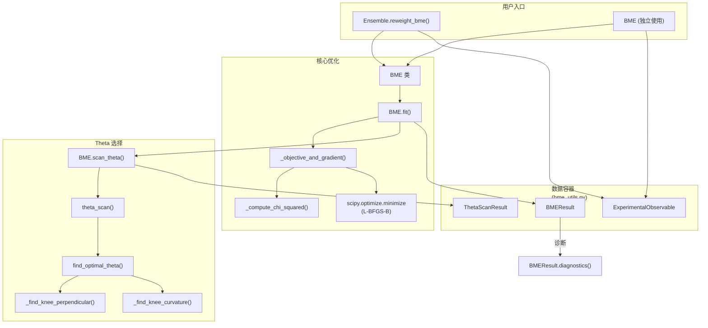

---
slug:11-bme-reweighting
blog_type:normal
---


贝叶斯最大熵（BME）重新加权是一个基于原则的框架，用于根据实验可观测量来细化生成系综。BME 并非丢弃或重新生成构象，而是分配**逐帧优化权重**，使计算出的系综平均值与实验数据保持一致，同时最小化对先验分布的扰动——这一约束通过相对熵（KL 散度）来衡量。这使其成为 STARLING 无监督生成流水线与生物物理验证定量需求之间的天然桥梁。

来源: [bme.py](starling/structure/bme.py#L1-L85), [bme_utils.py](starling/structure/bme_utils.py#L1-L18)

## 数学基础

BME 目标函数旨在寻找权重分布 **w**，使其在匹配实验可观测量条件下，最小化相对于先验权重 $w_0$ 的相对熵 $D_{KL}(w \| w_0)$。通过拉格朗日对偶性，这转化为关于乘子 $\boldsymbol{\lambda}$ 的无约束优化问题：

$$\gamma(\boldsymbol{\lambda}) = \log Z(\boldsymbol{\lambda}) + \boldsymbol{\lambda}^T \mathbf{F}^{exp} + \frac{\theta}{2} \sum_i \lambda_i^2 \sigma_i^2$$

其中 $Z(\boldsymbol{\lambda})$ 是配分函数，$\mathbf{F}^{exp}$ 是实验值，$\sigma_i^2$ 是实验方差，$\theta$ 是控制偏差-方差权衡的正则化强度。重新加权后的概率为：

$$w_i = \frac{w_{0,i} \exp\!\bigl(-\boldsymbol{\lambda}^T \mathbf{O}_i^{calc}\bigr)}{Z(\boldsymbol{\lambda})}$$

梯度 $\nabla_\lambda \gamma = \mathbf{F}^{exp} + \theta \boldsymbol{\Sigma}^2 \boldsymbol{\lambda} - \langle\mathbf{O}^{calc}\rangle_w$ 驱动 L-BFGS-B 优化，并通过解析计算的雅可比矩阵（`jac=True`）实现高效收敛。目标和梯度均按 $1/\theta$ 缩放以保证数值稳定性。

来源: [bme.py](starling/structure/bme.py#L233-L305)

## 架构概述

BME 系统由两个模块组织而成，职责划分明确——优化逻辑位于 `bme.py`，数据容器及工具函数位于 `bme_utils.py`：



来源: [bme.py](starling/structure/bme.py#L108-L122), [bme_utils.py](starling/structure/bme_utils.py#L24-L86), [ensemble.py](starling/structure/ensemble.py#L35-L39)

## 约束类型

每个实验可观测量都带有一个**约束类型**，决定了如何对偏离实验值的偏差进行惩罚。这对于编码不对称的物理知识至关重要——例如，SAXS 导出的回转半径是等式约束，而仅设定距离上限的 FRET 效率则应使用不等式约束。

| 约束 | 拉格朗日界限 | 惩罚逻辑 | 用例 |
|---|---|---|---|
| `"equality"` | $\lambda \in (-\infty, +\infty)$ | 始终惩罚 $\|F_{calc} - F_{exp}\|$ | 源自 SAXS 的 Rg，源自 NMR 的 Rh |
| `"upper"` | $\lambda \geq 0$ | 仅在 $F_{calc} > F_{exp}$ 时惩罚 | 最大端到端距离 |
| `"lower"` | $\lambda \leq 0$ | 仅在 $F_{calc} < F_{exp}$ 时惩罚 | 最小紧致度 |

$\lambda$ 的边界由 L-BFGS-B 优化器强制执行：`"upper"` 约束的正 $\lambda$ 会将计算值向下推，而 `"lower"` 约束的负 $\lambda$ 会将其向上推。等式约束允许 $\lambda$ 值不受限制。

来源: [bme_utils.py](starling/structure/bme_utils.py#L24-L85), [bme.py](starling/structure/bme.py#L187-L231)

## Theta 参数

正则化参数 $\theta$ 控制着 BME 重新加权中的基本权衡。**较小的 $\theta$** 允许优化器激进地重新加权帧以拟合实验，产生较低的 $\chi^2$，但可能会将权重集中在少数构象上（有效样本量低）。**较大的 $\theta$** 强烈正则化至先验分布，保持了系综的多样性，但可能导致 $\chi^2$ 居高不下。

系综帧的有效比例由下式量化：

$$\Phi = \exp(-D_{KL}) = \exp\!\Bigl(-\sum_i w_i \log \frac{w_i}{w_{0,i}}\Bigr)$$

其中 $\Phi = 1$ 表示未进行重新加权（保留所有先验权重），$\Phi \to 0$ 表示极端集中。默认值 $\theta = 0.5$ 提供了一个适中的起点，但推荐的工作流是通过 L 曲线分析进行**自动 theta 选择**。

来源: [bme_utils.py](starling/structure/bme_utils.py#L11-L12), [bme.py](starling/structure/bme.py#L466-L476)

## 自动 Theta 选择

当 `auto_theta=True`（默认值）时，`BME.fit()` 会执行一次 **theta 扫描**——在对数间隔的 $\theta$ 值网格上拟合 BME 模型——并通过 L 曲线拐点检测选择最优点。L 曲线绘制了 $\chi^2$（拟合质量）与 KL 散度（系综畸变）的关系，拐点代表最大曲率的位置，在此处进一步提升拟合质量将以不成比例的系综多样性损失为代价。

有两种拐点查找方法可供选择：

| 方法 | 算法 | 特征 |
|---|---|---|
| `"perpendicular"` | 距连接 L 曲线端点直线的最大垂直距离 | 稳健、直观；经典的拐点检测 |
| `"curvature"` | 通过三点公式计算最大 Menger 曲率 | 对局部曲率更敏感；能检测细微拐点 |

扫描会生成包含每个 $\theta$ 完整诊断信息的 `ThetaScanResult`，可通过 `ThetaScanResult.plot()` 目视检查 L 曲线，并通过 `ThetaScanResult.print_summary()` 生成摘要报告。

来源: [bme_utils.py](starling/structure/bme_utils.py#L470-L601), [bme_utils.py](starling/structure/bme_utils.py#L604-L683), [bme.py](starling/structure/bme.py#L307-L398)

## 系综集成（推荐路径）

BME 重新加权的主要接口是 `Ensemble` 类，它会缓存 BME 结果并将优化后的权重透明地传播到所有可观测量计算方法。一旦调用 `reweight_bme()`，后续任何带有 `use_bme_weights=True` 的调用都会自动应用缓存的权重：

```python
from starling import generate
import numpy as np
from starling.structure.bme import ExperimentalObservable

# 生成或加载系综
ensemble = generate("GS"*30, conformations=200)

# 计算每一帧的计算可观测量
rg_values = ensemble.radius_of_gyration()
ete_values = ensemble.end_to_end_distance()
calculated = np.column_stack([rg_values, ete_values])

# 定义实验约束
obs_rg = ExperimentalObservable(23.0, 2.0, name="Rg", constraint="equality")
obs_ete = ExperimentalObservable(55.0, 5.0, name="End-to-end", constraint="upper")

# 执行 BME 重新加权（默认自动 theta）
result = ensemble.reweight_bme([obs_rg, obs_ete], calculated)

# 所有的可观测量方法均接受 use_bme_weights=True
reweighted_rg = ensemble.radius_of_gyration(return_mean=True, use_bme_weights=True)
reweighted_ete = ensemble.end_to_end_distance(return_mean=True, use_bme_weights=True)
reweighted_rij = ensemble.rij(5, 15, return_mean=True, use_bme_weights=True)
```

`Ensemble` 类将 BME 实例和结果作为私有缓存（`__bme`、`__bme_result`）存储，确保一致地应用权重而无需在每次调用时重新拟合。诸如 `radius_of_gyration()`、`end_to_end_distance()`、`local_radius_of_gyration()` 和 `rij()` 等方法均支持 `use_bme_weights` 标志。

来源: [bme.py](starling/structure/bme.py#L26-L47), [ensemble.py](starling/structure/ensemble.py#L110-L112), [ensemble.py](starling/structure/ensemble.py#L344-L383)

## 独立使用 BME

对于 `Ensemble` 类之外的工作流——或者将 BME 应用于 STARLING 未直接支持的自定义可观测量时——`BME` 类可以独立使用：

```python
from starling.structure.bme import BME, ExperimentalObservable
import numpy as np

# 定义可观测量
obs_rg = ExperimentalObservable(value=25.0, uncertainty=2.0, name="Rg")
obs_ete = ExperimentalObservable(value=70.0, uncertainty=5.0,
                                  constraint="upper", name="End-to-end")

# 计算值：形状为 (n_frames, n_observables)
calculated = np.random.randn(1000, 2) * 2 + np.array([24, 65])

# 创建并以手动 theta 拟合
bme = BME([obs_rg, obs_ete], calculated, theta=0.5)
result = bme.fit(verbose=True)

# 将权重应用于来自相同帧的任何可观测量
reweighted_means = bme.predict(calculated)

# 或运行 theta 扫描以获取最优正则化
scan = bme.scan_theta(theta_range=(0.01, 10.0), n_points=15, method="curvature")
scan.print_summary()
fig = scan.plot(show=True)
```

`predict()` 方法使用拟合后的权重计算加权平均值，适用于将 BME 权重投影到未参与拟合过程的可观测量上（例如，交叉验证可观测量）。

来源: [bme.py](starling/structure/bme.py#L49-L84), [bme.py](starling/structure/bme.py#L620-L679)

## BMEResult 诊断

`BMEResult` 数据类提供了丰富的诊断接口，用于评估重新加权的质量。`diagnostics()` 方法计算两种互补的有效样本量度量：

| 指标 | 公式 | 敏感性 |
|---|---|---|
| $N_{eff}^{(S)}$（基于熵） | $N \cdot \Phi = N \cdot e^{-D_{KL}}$ | 标准 BME 度量；捕获整体信息损失 |
| $N_{eff}^{(2)}$（Rényi-2） | $1 / \sum_i w_i^2$ | 对少数主导权重更敏感；始终 $\leq N_{eff}^{(S)}$ |

诊断系统会在以下情况生成**结构化警告**：(1) $\Phi < 0.5$ 表示系综多样性显著损失，(2) $N_{eff}^{(2)} < 0.1N$ 表明权重极度集中，(3) 权重范围超过 3 个数量级，或 (4) 最终 $\chi^2 > 2 \times n_{observables}$ 表明实验拟合不佳。可通过 `print_diagnostics()` 获取格式化报告：

```python
result = ensemble.reweight_bme(observables, calculated)
result.print_diagnostics(warn_threshold=0.5)
```

来源: [bme_utils.py](starling/structure/bme_utils.py#L92-L300)

## API 参考

### 核心类

| 类 | 模块 | 用途 |
|---|---|---|
| `ExperimentalObservable` | `bme_utils` | 数据类：`(value, uncertainty, constraint, name)` |
| `BME` | `bme` | 优化器：通过 scipy 拟合拉格朗日乘子 |
| `BMEResult` | `bme_utils` | 结果容器：权重、$\chi^2$、$\Phi$、诊断 |
| `ThetaScanResult` | `bme_utils` | 扫描容器：逐 $\theta$ 指标、最优选择 |

### 关键方法

| 方法 | 所属对象 | 描述 |
|---|---|---|
| `BME.fit(theta, auto_theta, ...)` | `BME` | 执行重新加权；若 `auto_theta=True` 则自动选择 $\theta$ |
| `BME.scan_theta(theta_range, ...)` | `BME` | 扫描 $\theta$ 网格并返回 `ThetaScanResult` |
| `BME.predict(calculated_values)` | `BME` | 应用拟合权重计算加权平均值 |
| `BMEResult.diagnostics(warn_threshold)` | `BMEResult` | 计算 N_eff、权重统计、警告 |
| `BMEResult.print_diagnostics()` | `BMEResult` | 格式化的诊断报告 |
| `ThetaScanResult.plot()` | `ThetaScanResult` | L 曲线 + 权重分布可视化 |
| `ThetaScanResult.print_summary()` | `ThetaScanResult` | 格式化的扫描摘要 |

### 常量

| 常量 | 值 | 用途 |
|---|---|---|
| `DEFAULT_THETA` | 0.5 | 未指定正则化参数时的回退值 |
| `DEFAULT_MAX_ITERATIONS` | 50000 | scipy 优化器迭代上限 |
| `DEFAULT_OPTIMIZER` | `"L-BFGS-B"` | 支持 `jac=True` 的有界优化器 |
| `LAMBDA_INIT_SCALE` | 1e-3 | 随机拉格朗日初始化的标准差 |
| `MIN_WEIGHT_THRESHOLD` | 1e-50 | 权重的数值下限 |

<CgxTip>拟合后务必检查 `BMEResult.diagnostics()`——较低的 $\Phi$（有效比例）意味着重新加权的系综实际上由一小部分帧主导，这可能表明实验约束不兼容或 $\theta$ 过小。使用 `scan_theta()` 可视化 L 曲线，并验证所选 $\theta$ 位于合理的拐点处。</CgxTip>

<CgxTip>混合使用等式和不等式约束时，请注意不等式约束（`"upper"` / `"lower"`）仅在计算出的系综平均值违反边界时才会激活。如果未加权的系综已满足某一不等式约束，其拉格朗日乘子将保持为零，该约束将有效退出优化过程。</CgxTip>

来源: [bme.py](starling/structure/bme.py#L108-L685), [bme_utils.py](starling/structure/bme_utils.py#L1-L684)

## 后续步骤

- 关于托管 `reweight_bme()` 的 Ensemble API，请参阅 [Ensemble 对象 API](9-ensemble-object-api)
- 关于约束类型的理论与使用模式，请参阅 [约束类型](12-constraint-types)
- 关于在重新加权前生成系综的完整生成流水线，请参阅 [采样策略](8-sampling-strategies)