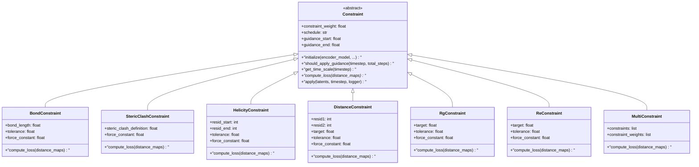
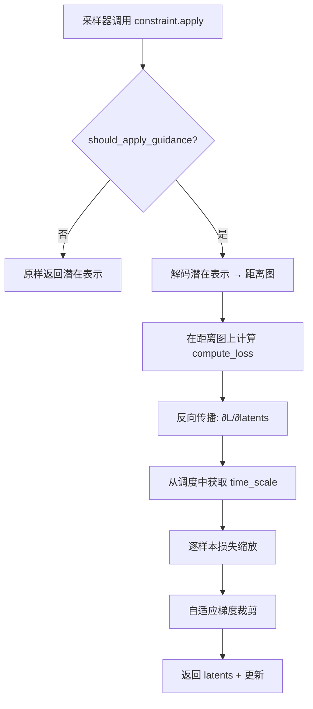

---
slug:12-constraint-types
blog_type:normal
---


STARLING 提供了一个基于梯度的约束系统，用于在潜在空间中引导扩散采样过程，从而实现满足生物物理先验的系综生成。每个约束都在解码后的距离图上定义损失，通过 VAE 解码器进行反向传播，并在每个去噪步骤中对潜在表示应用缩放后的梯度更新。本页编目了所有内置约束、其物理意义以及控制其行为的参数。

## 平底谐势

STARLING 中的每个约束都共享相同的数学核心：一个**平底谐势**。该势并非对偏离目标值的任何偏差都进行惩罚，而是定义了一个*容差带*，在此容差带内损失精确为零。只有超过容差的偏差才会产生二次惩罚：

$$L = \frac{1}{2} k \cdot \text{ReLU}(|x - x_{\text{target}}| - \epsilon)^2$$

其中 *k* 为 `force_constant`，*x* 为当前值，*x*_target 为约束目标，*ε* 为 `tolerance`。此设计对于蛋白质结构至关重要：微小的涨落是物理上预期的，对它们进行惩罚会使系综受到过度约束。`tolerance` 参数定义了平区（势阱的“底”）的宽度，而 `force_constant` 控制了超出该区域后势壁的陡度。

来源: [constraints.py](starling/inference/constraints.py#L284-L326), [constraints.py](starling/inference/constraints.py#L439-L468)

## 约束类层次结构

所有约束均继承自抽象 `Constraint` 基类，该基类提供了调度、梯度计算、自适应裁剪和逐样本损失缩放的共享机制。具体子类仅需实现 `compute_loss`。



`Constraint` 基类携带的参数控制着引导应用*何时*以及*多强*，而每个子类则添加领域特定参数（目标距离、残基索引等），并实现在解码后的距离图上操作的 `compute_loss` 方法。

来源: [constraints.py](starling/inference/constraints.py#L41-L282)

## 约束参考

下表总结了每种约束类型及其独特参数和所控制的物理量。

| 约束 | 关键参数 | 物理目标 | 损失计算范围 |
|---|---|---|---|
| **BondConstraint** | `bond_length=3.81`, `tolerance=0.0`, `force_constant=2.0` | Cα–Cα 键长 (Å) | 距离图的第一超对角线 |
| **StericClashConstraint** | `steric_clash_definition=5.0`, `force_constant=2.0` | 最小非键合距离 (Å) | 上三角 (偏移 ≥ 2) |
| **HelicityConstraint** | `resid_start`, `resid_end`, `tolerance=0.0`, `force_constant=2.0` | 理想 α-螺旋距离模式 | 子矩阵 `[resid_start:resid_end, resid_start:resid_end]` |
| **DistanceConstraint** | `resid1`, `resid2`, `target`, `tolerance=0.0`, `force_constant=2.0` | 两残基间的成对距离 (Å) | 单个元素 `dm[resid1, resid2]` |
| **RgConstraint** | `target`, `tolerance=0.0`, `force_constant=2.0` | 回转半径 (Å) | 完整距离图 (全局属性) |
| **ReConstraint** | `target`, `tolerance=0.0`, `force_constant=2.0` | 端到端距离 (Å) | 单个元素 `dm[0, N-1]` |
| **MultiConstraint** | `constraints` (列表) | 任意约束的加权组合 | 按子约束聚合 |

来源: [constraints.py](starling/inference/constraints.py#L284-L646)

### BondConstraint

惩罚 Cα–Cα 虚拟键长偏离 **3.81 Å** 的理想值（标准肽主链距离）。损失在距离图的第一超对角线上计算（即所有 *d(i, i+1)* 对）。`bond_length` 的默认值 3.81 Å 反映了多肽链中连续 Cα 原子间的物理距离；`tolerance` 参数允许键长在平底势阱内涨落，随后才激活谐惩罚。

```python
from starling.inference.constraints import BondConstraint

# 要求键长在 3.81 ± 0.5 Å 范围内
bond = BondConstraint(bond_length=3.81, tolerance=0.5, force_constant=2.0)
```

来源: [constraints.py](starling/inference/constraints.py#L284-L326)

### StericClashConstraint

通过惩罚距离低于 `steric_clash_definition`（默认 **5.0 Å**）的非键合残基对，防止物理上不可能的空间位阻冲突。仅考虑偏移 ≥ 2 的上三角部分（即 *d(i, j)*，其中 *j ≥ i + 2*），排除了键合邻居和对角线。该损失采用单侧谐波：仅对*低于*阈值的距离进行惩罚，对更大的分离无惩罚。

```python
from starling.inference.constraints import StericClashConstraint

# 惩罚任何距离小于 5.0 Å 的非键合对
steric = StericClashConstraint(steric_clash_definition=5.0, force_constant=2.0)
```

来源: [constraints.py](starling/inference/constraints.py#L329-L378)

### HelicityConstraint

通过将距离图与理想螺旋参考进行比较，在指定的残基范围内强制执行 α-螺旋几何结构。该参考由 `helix_dm()` 以固定的 384 个位置生成，然后掩码至 `[resid_start, resid_end]` 子区域。只有子区域的上三角（偏移 ≥ 1）对损失有贡献。此约束对于在无序区域中对已知螺旋片段的蛋白质进行建模特别有用。

```python
from starling.inference.constraints import HelicityConstraint

# 对残基 150–160（0 索引）强制螺旋性
helix = HelicityConstraint(resid_start=150, resid_end=160, tolerance=0.0, force_constant=2.0)
```

来源: [constraints.py](starling/inference/constraints.py#L381-L436), [utilities.py](starling/utilities.py#L1-L20)

### DistanceConstraint

最灵活的约束：将任意两个残基之间的成对距离固定为目标值。这直接编码了实验观测结果，如 FRET 距离、交联数据或 NMR 距离约束。损失由单个元素 `distance_maps[:, :, resid1, resid2]` 计算得出。

```python
from starling.inference.constraints import DistanceConstraint

# 约束残基 10 和 100 相距 30 Å
dist = DistanceConstraint(resid1=10, resid2=100, target=30.0, tolerance=1.0, force_constant=2.0)
```

来源: [constraints.py](starling/inference/constraints.py#L439-L468)

### RgConstraint

约束整个结构的**回转半径**，这是一种全局紧致度度量。Rg 直接由距离图计算，无需转换为 3D 坐标，使用恒等式：*Rg = √(Σd_ij² / 2N²)*。此方法计算效率高，且在距离图上可微。典型用例包括匹配源自 SAXS 的 Rg 值，或探索 IDP 的紧致度景观。

```python
from starling.inference.constraints import RgConstraint

# 目标 Rg 为 40 Å，使用较弱的力常数
rg = RgConstraint(target=40.0, tolerance=2.0, force_constant=0.1)
```

<CgxTip>与 `DistanceConstraint` 等局部约束相比，请为 `RgConstraint` 和 `ReConstraint` 使用较低的 `force_constant`（如 0.1–0.5）。全局属性会同时响应许多距离图条目，因此有效梯度幅度要大得多。在全局约束上使用高力常数会使采样轨迹失稳。</CgxTip>

来源: [constraints.py](starling/inference/constraints.py#L471-L543)

### ReConstraint

约束**端到端距离**——即第一个和最后一个 Cα 原子之间的距离。这是在 `distance_maps[:, :, 0, sequence_length-1]` 处的单元素查找，使其成为计算代价最低的约束。与 Rg 一样，它是链的全局属性，因此建议使用较弱的力常数。

```python
from starling.inference.constraints import ReConstraint

# 目标端到端距离为 100 Å
re = ReConstraint(target=100.0, tolerance=5.0, force_constant=1.0)
```

来源: [constraints.py](starling/inference/constraints.py#L546-L570)

### MultiConstraint

将多个约束组合到一个优化步骤中，将每个约束自身的 `constraint_weight` 作为相对缩放因子应用。`MultiConstraint` 将 `initialize()` 委托给每个子约束，并对加权的逐批次损失求和。这是同时强制执行多个约束的机制，例如同时执行目标 Rg *和*特定残基间距离。

```python
from starling.inference.constraints import (
    DistanceConstraint, RgConstraint, MultiConstraint
)

combined = MultiConstraint(constraints=[
    DistanceConstraint(resid1=10, resid2=100, target=30, constraint_weight=1.0),
    RgConstraint(target=40, force_constant=0.1, constraint_weight=0.5),
])
```

来源: [constraints.py](starling/inference/constraints.py#L573-L646)

## 共享调度和引导参数

除了约束特定参数外，每个 `Constraint` 都继承了调度控制，用于确定在扩散轨迹*何时*激活引导及其强度*如何*随时间变化。



`apply` 方法编排了完整的引导流程：将当前潜在表示解码为距离图，计算约束损失，反向传播至潜在表示，按时间调度和逐样本损失进行缩放，裁剪梯度，并返回更新后的潜在表示。

| 参数 | 默认值 | 用途 |
|---|---|---|
| `constraint_weight` | `1.0` | 梯度更新的总乘性权重 |
| `schedule` | `"cosine"` | 随时间变化的强度：`"cosine"`、`"bell_shaped"` 或 `"linear"` |
| `guidance_start` | `0.0` | 引导窗口的归一化起点（0 = 噪声，1 = 干净） |
| `guidance_end` | `1.0` | 引导窗口的归一化终点 |
| `verbose` | `True` | 启用 `ConstraintLogger` 输出 |

来源: [constraints.py](starling/inference/constraints.py#L41-L114), [constraints.py](starling/inference/constraints.py#L203-L282)

### 调度函数

`schedule` 参数选择引导强度在去噪轨迹上的变化方式。扩散过程从高时间步（噪声）运行到低时间步（干净）。`guidance_start` 和 `guidance_end` 参数在此轨迹内定义了一个激活引导的窗口，使用*逆向*分数（因此 `guidance_start=0.0` 意味着“从去噪开始就进行引导”）。

| 调度 | 公式 | 行为 |
|---|---|---|
| `"cosine"` | cos²(t/total · π/2) | 早期强引导，平滑递减至末尾为零 |
| `"bell_shaped"` | sin(t̃π) · exp(-(t̃-0.6)²/0.1) | 逐渐增强，在去噪约 60% 处达到峰值，然后衰减 |
| `"linear"` (回退) | 1 - t/total | 从全强度线性衰减至零 |

**余弦调度**是默认设置，适用于大多数场景——它在潜在表示仍粗糙的早期应用强校正，然后让模型自行细化结构。当你希望避免干扰初始粗略布局或最终的精细化处理时，**钟形调度**可能更受青睐，它将引导集中在轨迹的中段。

来源: [constraints.py](starling/inference/constraints.py#L116-L157), [constraints.py](starling/inference/constraints.py#L274-L282)

### 自适应梯度裁剪

`apply` 方法包含两种稳定机制。**逐样本损失缩放**根据每个样本的相对损失幅度（箝位至最大系数 2.0）对其梯度进行加权，从而使已满足约束的样本获得较小的更新。**自适应梯度裁剪**将每个样本的梯度范数上限设定为 1.0，防止任何单个样本受到破坏性的巨大更新。这些机制自动运行，无需用户配置。

来源: [constraints.py](starling/inference/constraints.py#L226-L254)

## 约束如何与采样集成

约束被注入到 DDIM 采样循环中。在每个去噪步骤之后，采样器会检查是否提供了约束，如果提供了，则在当前潜在表示上调用 `constraint.apply(x, step, logger)`。约束将潜在表示解码为距离图，计算损失，并返回梯度扰动的潜在表示。这在引导窗口内的每个时间步（步骤 0 除外）都会发生，在整个去噪过程中产生朝向约束目标的持续压力。

<CgxTip>约束引导的采样比无约束生成慢得多，因为每次 `apply` 调用都需要完整的 VAE 解码和反向传播。对于具有激活约束的 10 步 DDIM 运行，预计大约额外增加 10 次通过解码器的前向+反向传播。使用更少的 `steps` 或更窄的 `guidance_start`/`guidance_end` 窗口可缓解此开销。</CgxTip>

来源: [ddim_sampler.py](starling/samplers/ddim_sampler.py#L194-L229), [ddim_sampler.py](starling/samplers/ddim_sampler.py#L127-L137)

## ConstraintLogger

`ConstraintLogger` 提供对采样期间约束应用情况的实时监控。它显示一个带有每个激活约束当前损失和梯度范数的 `tqdm` 进度条，并在每个扩散步骤进行更新。当将约束传递给 `sample()` 时，采样器会自动创建并管理它，但也可在自定义采样循环中手动使用。

| 日志方法 | 用途 |
|---|---|
| `setup()` | 初始化进度条 |
| `update(timestep, constraint_name, metrics)` | 记录某步的指标 |
| `close()` | 清理进度条 |

来源: [constraints.py](starling/inference/constraints.py#L649-L720)

## 下一步

现在你已了解每种约束类型及其参数，接下来请通过[约束引导采样](13-constraint-guided-sampling)中的完整采样流水线学习如何在实践中应用它们。若要将约束与实验数据结合，请参阅 [BME 重加权](11-bme-reweighting)。