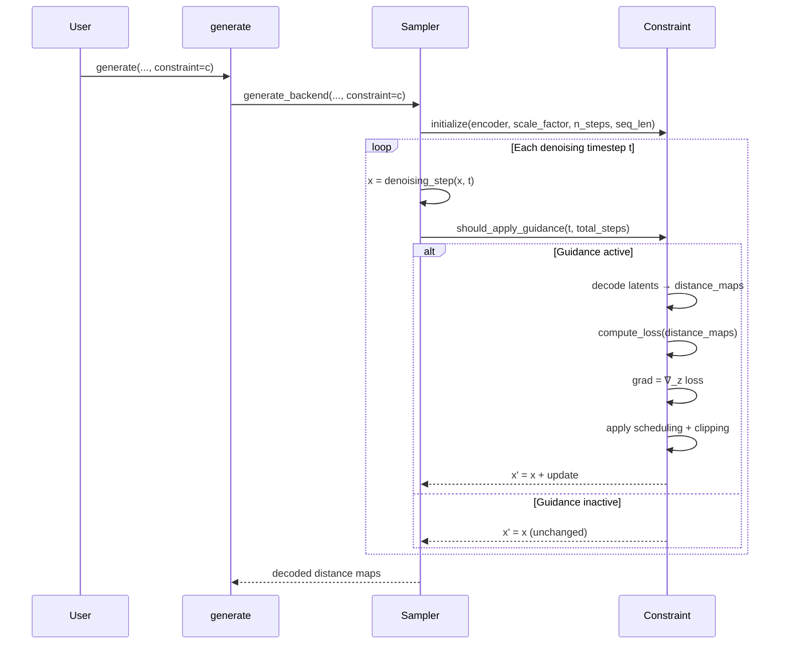

---
slug:13-constraint-guided-sampling
blog_type:normal
---


STARLING 中的约束引导采样通过在每个时间步注入基于梯度的校正，将扩散去噪过程导向生物物理上合理的结构。约束并非事后过滤或拒绝采样，而是在**生成循环内部**运作，修改潜在表示，使得解码后的距离图在采样完成前即满足用户指定的结构属性。

## 引导机制

在每个去噪步骤中，采样器生成一个中间潜在变量 **z**。当约束处于激活状态时，STARLING 临时开启 **z** 的自动求导，通过 VAE 对其进行解码以获得距离图 **D**，计算约束损失 ℒ(**D**)，并求梯度 ∇_z ℒ。随后，潜在变量按如下方式更新：

> **z′** = **z** − w · s(t) · ℓ(**D**) · clip(∇_z ℒ)

其中 **w** 为 `constraint_weight`，**s(t)** 是随时间变化的调度函数，**ℓ(D)** 是逐样本的损失缩放因子，用于防止对已满足约束的样本进行过度校正。梯度范数按样本独立裁剪至最大值 1.0，以确保在异构批次中的稳定性。

关键的设计洞察在于，引导是在**潜在空间**中施加的，而非距离图空间。这意味着梯度必须通过 VAE 解码器进行反向传播，从而将约束信号与生成模型的内部表示相耦合。DDPM 模型上存储的 `latent_space_scaling_factor` 会在解码前对潜在变量进行归一化，以保持梯度的数值条件良好。

来源: [constraints.py](starling/inference/constraints.py#L203-L272)

## 调度与时间门控

约束影响在整个去噪轨迹上并非均匀分布。三种机制控制着引导施加的*时机*和*强度*：

| 机制 | 参数 | 描述 |
|---|---|---|
| **引导窗口** | `guidance_start`, `guidance_end` | 逆向过程中约束处于激活状态的归一化比例。默认值 `[0.0, 1.0]` 表示在所有步骤中均施加约束。 |
| **时间调度** | `schedule` | `"cosine"`（默认）按 cos²(πt/2T) 衰减；`"bell_shaped"` 在采样进程 60% 处达到峰值；`"linear"` 线性衰减。 |
| **自适应裁剪阈值** | (内部) | 初始值为 2.0，通过余弦调度衰减至 1.0，允许在早期潜在变量噪声较大时进行更大幅度的校正。 |

引导窗口使用*逆向*比例 (1 − t/T)，因此 `guidance_start=0.0` 对应去噪的起始阶段（噪声最大的状态），`guidance_end=1.0` 对应最后一步。例如，你可以通过设置 `guidance_start=0.7`，将约束的应用推迟到采样的最后 30% 阶段。

来源: [constraints.py](starling/inference/constraints.py#L96-L183)

## 约束类型及其损失函数

所有约束子类均使用**平底谐波势**实现 `compute_loss(distance_maps) → (per_batch_loss, mean_loss)`：excess = ReLU(|deviation| − tolerance)，loss = ½ · k · excess²。容差创建了一个死区，在该区内已满足的约束不产生梯度。

### BondConstraint

惩罚相邻 Cα–Cα 距离偏离理想键长（默认 3.81 Å）的程度。作用于距离图的第一副对角线。

```python
from starling.inference.constraints import BondConstraint
bond = BondConstraint(bond_length=3.81, tolerance=1.0, force_constant=2.0)
```

### StericClashConstraint

惩罚距离低于 `steric_clash_definition`（默认 5.0 Å）的非相邻残基对（|i − j| ≥ 2）。使用上三角掩码以避免重复计算和自接触。

```python
from starling.inference.constraints import StericClashConstraint
steric = StericClashConstraint(steric_clash_definition=5.0, force_constant=2.0)
```

### HelicityConstraint

通过将解码距离与理想螺旋参考距离图进行比较，在残基范围内强制执行 α 螺旋几何结构。参考图由 `helix_dm(L=384)` 生成，并且距离依赖的权重矩阵 (1/(d_ref + ε)) 对短程接触赋予更高权重。掩码将损失限制在指定残基窗口的上三角部分。

```python
from starling.inference.constraints import HelicityConstraint
helix = HelicityConstraint(resid_start=10, resid_end=25, tolerance=0.5, force_constant=2.0)
```

### DistanceConstraint

将两个特定残基之间的成对距离约束为目标值。非常适合用于编码实验 FRET 测量或交联质谱数据。

```python
from starling.inference.constraints import DistanceConstraint
fret = DistanceConstraint(resid1=5, resid2=50, target=25.0, tolerance=2.0, force_constant=2.0)
```

### RgConstraint

约束直接从距离图计算的回转半径：Rg = √(Σd²_ij / 2N²)。无需 3D 坐标——计算仅在成对距离上进行。

```python
from starling.inference.constraints import RgConstraint
rg = RgConstraint(target=18.0, tolerance=1.0, force_constant=2.0)
```

### ReConstraint

将端到端距离（残基 0 到残基 N）约束为目标值，控制整体链的伸展或压缩。

```python
from starling.inference.constraints import ReConstraint
re = ReConstraint(target=40.0, tolerance=3.0, force_constant=2.0)
```

来源: [constraints.py](starling/inference/constraints.py#L284-L570)

## 组合多个约束

`MultiConstraint` 将任意约束列表聚合到单个优化步骤中。每个子约束保留其自身的 `constraint_weight`、`guidance_start` 和 `guidance_end`，允许对相对强度和激活窗口进行细粒度控制。组合损失是所有逐约束损失的加权和。

```python
from starling.inference.constraints import MultiConstraint, RgConstraint, HelicityConstraint

combined = MultiConstraint(
    constraints=[
        RgConstraint(target=18.0, tolerance=1.0, force_constant=2.0, constraint_weight=1.5),
        HelicityConstraint(resid_start=5, resid_end=20, tolerance=0.5, force_constant=2.0, constraint_weight=1.0),
    ],
    schedule="cosine",
)
```

<CgxTip>当组合具有不同物理单位（距离为 Å，Rg 为 Ų）的约束时，请调整 `constraint_weight` 以使每个约束的损失贡献具有相近的数量级。监控 `ConstraintLogger` 的输出（每步的 loss、grad_norm）以诊断失衡。</CgxTip>

来源: [constraints.py](starling/inference/constraints.py#L573-L646)

## 与采样循环的集成

约束通过高层 `generate()` 函数和低层采样器 `sample()` / `p_sample_loop()` 方法上的 `constraint` 参数注入到去噪循环中。初始化链按如下顺序进行：



在前端层面，约束被直接传递至后端：

```python
from starling.frontend.ensemble_generation import generate
from starling.inference.constraints import RgConstraint

ensemble = generate(
    "MIEQKLKAEEKSEKRQKIAEKQAQKQKEQAQKI",
    conformations=500,
    constraint=RgConstraint(target=15.0, tolerance=1.0),
    return_single_ensemble=True,
)
```

采样器在循环开始前自动初始化约束，为其提供编码器模型、潜在缩放因子、总步数和序列长度。`ConstraintLogger` 在采样期间以辅助进度条的形式显示实时诊断信息（损失和梯度范数）。

来源: [ensemble_generation.py](starling/frontend/ensemble_generation.py#L160-L393), [ddpm_sampler.py](starling/samplers/ddpm_sampler.py#L150-L200), [ddim_sampler.py](starling/samplers/ddim_sampler.py#L127-L199)

## 逐样本自适应缩放

在同一批次中，不同样本满足约束的程度可能各不相同。`apply()` 方法将**逐样本损失缩放**计算为 ℓ_i = loss_i / mean(loss)，并裁剪至最大值 2.0。这确保了已接近目标的样本接受较小的校正，而异常值则接受成比例的较大推动，从而防止批次均值掩盖个体违规现象。

结合逐样本梯度范数裁剪（每个样本的更新独立缩放至最大 L2 范数 1.0），这种双层自适应机制使得约束引导在异构批次中具备鲁棒性，无需手动进行逐样本调优。

来源: [constraints.py](starling/inference/constraints.py#L226-L254)

## 参数参考

| 参数 | 默认值 | 作用域 | 描述 |
|---|---|---|---|
| `constraint_weight` | 1.0 | 所有约束 | 梯度更新的全局乘数 |
| `schedule` | `"cosine"` | 所有约束 | 时间调度：`"cosine"`、`"bell_shaped"` 或 `"linear"` |
| `guidance_start` | 0.0 | 所有约束 | 引导窗口的归一化起点（0 = 噪声最大） |
| `guidance_end` | 1.0 | 所有约束 | 引导窗口的归一化终点（1 = 最干净） |
| `tolerance` | 0.0 | 逐类型 | 激活惩罚前的平底宽度 (Å) |
| `force_constant` | 2.0 | 逐类型 | 谐波势强度 k |
| `bond_length` | 3.81 | BondConstraint | 目标 Cα–Cα 键长 (Å) |
| `steric_clash_definition` | 5.0 | StericClashConstraint | 允许的最小非键合距离 (Å) |
| `resid_start`, `resid_end` | — | HelicityConstraint | 强制螺旋的残基范围 |
| `resid1`, `resid2`, `target` | — | DistanceConstraint | 残基对及目标距离 (Å) |
| `target` | — | RgConstraint, ReConstraint | 目标值 (Å) |

来源: [constraints.py](starling/inference/constraints.py#L41-L78)

## 后续步骤

- 在 [约束类型](12-constraint-types) 中查看约束类型的完整目录及其生物物理动机。
- 在 [BME 重加权](11-bme-reweighting) 中了解约束引导的系综如何与 BME 重加权交互。
- 在 [VAE 潜在空间](6-vae-latent-space) 中理解约束运作所在的潜在空间。