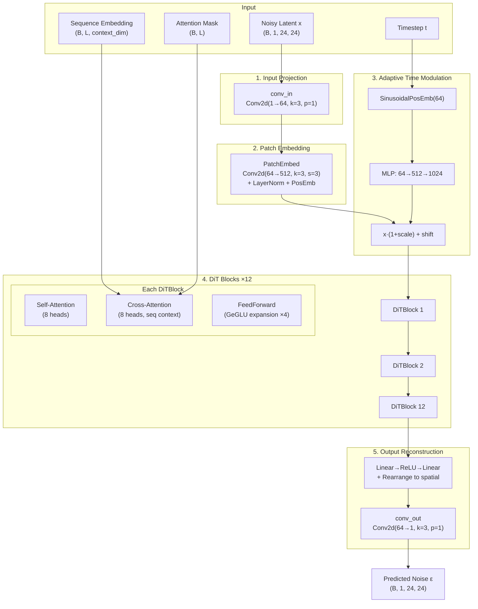
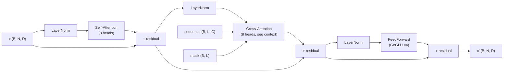

---
slug:14-vision-transformer-denoiser
blog_type:normal
---


**Vision Transformer Denoiser**（ViT Denoiser）是 Starling 潜扩散管道中的核心神经网络，负责预测每个扩散时间步的噪声。与图像扩散模型中普遍采用的传统 U-Net 去噪器不同，Starling 采用了基于分块的 Vision Transformer 架构，该架构通过自注意力机制对潜距离图的空间分块进行推理，同时通过交叉注意力机制关注蛋白质序列嵌入。此设计使去噪器能够在单次注意力操作中捕获整个距离图上的**长距离空间相关性**——这是蛋白质结构生成中的一项关键能力，因为在序列中相距较远的残基在 3D 空间中可能彼此邻近。

来源: [vit.py](starling/models/vit.py#L1-L123), [transformer.py](starling/models/transformer.py#L1-L385), [attention.py](starling/models/attention.py#L1-L361)

## 架构概述

ViT Denoiser 将含噪潜表示（形状为 `B×1×24×24`）转换为具有相同形状的噪声预测，其条件依赖于扩散时间步和蛋白质序列嵌入。数据流经五个不同阶段：**输入投影**、**分块化**、**自适应时间调制**、**DiT 块堆叠**和**输出重建**。



来源: [vit.py](starling/models/vit.py#L31-L122), [transformer.py](starling/models/transformer.py#L296-L339)

## 分块嵌入

`PatchEmbed` 模块将中间特征图转换为适合 Transformer 处理的分块 token 序列。**步幅卷积**同时作为分块提取和投影机制——每个 `patch_size × patch_size` 的空间区域在单次操作中被线性投影到 `embed_dim` 维，避免了简单展平带来的信息损失。投影之后，`LayerNorm` 稳定了 token 表示，而**可学习的位置嵌入**（形状为 `1 × num_tokens × embed_dim`）注入了空间感知能力。在默认 `patch_size=3` 和 24×24 空间分辨率下，token 序列长度为 `(24/3)² = 64` 个 token。

| 参数 | 值 | 推导 |
|-----------|-------|------------|
| 输入通道数 | 64 (BASE) | `conv_in` 的输出 |
| 分块大小 | 3 | 分块化 Conv2d 的核大小与步幅 |
| 嵌入维度 | 512 | 与序列编码器输出匹配 |
| token 数量 | 64 | `(24 × 24) / 3²` |
| 位置嵌入 | 可学习 | `nn.Parameter`，形状 `(1, 64, 512)` |

来源: [vit.py](starling/models/vit.py#L9-L28)

## 通过自适应调制进行时间步条件化

时间步信息通过受 DiT（基于 Transformer 的可扩展扩散模型）启发的**自适应缩放与平移**机制注入。连续的时间步首先被编码为正弦位置嵌入，随后通过一个带有 SiLU 激活函数的两层 MLP 扩展，以生成 `2 × embed_dim` 的条件向量。该向量被拆分为 **scale** 和 **shift** 参数，用于调制每个分块 token：

```
scale, shift = time_mlp(t).chunk(2, dim=-1)
x = x * (1 + scale) + shift
```

这种仿射调制仅在 Transformer 堆叠之前应用一次，作为一种高效的全局条件化机制。它向所有后续注意力层传达当前潜变量“有多嘈杂”，而无需逐层条件化的开销。正弦编码使用基础频率 `θ = 10000`，这与标准 Transformer 位置编码约定一致。

来源: [vit.py](starling/models/vit.py#L62-L110), [transformer.py](starling/models/transformer.py#L15-L58)

## DiTBlock：自注意力、交叉注意力、前馈网络

12 个 `DiTBlock` 层均遵循**预归一化残差架构**，包含三个子层：自注意力、交叉注意力和前馈网络。自注意力层使每个空间分块 token 能够关注所有其他分块 token，从而捕获整个距离图上的全局空间相关性。交叉注意力层随后以蛋白质序列嵌入为条件对这些空间表示进行调制——每个分块 token 查询序列上下文（以序列编码器输出的键和值作为来源），使去噪器能够学习哪些序列区域会影响哪些空间区域。前馈网络使用 **GeGLU** 激活函数（门控 GELU），该函数先投影到 `4 × embed_dim` 再降维还原，从而提供非线性变换能力。



来源: [transformer.py](starling/models/transformer.py#L296-L339), [attention.py](starling/models/attention.py#L11-L79)

## 多头注意力实现

`MultiHeadAttention` 模块通过 `context_dim` 参数为自注意力和交叉注意力实现了统一接口——当 `context_dim` 与 `embed_dim` 不同时，键和值投影从 `context_dim` 映射到 `embed_dim`（交叉注意力）；否则，它们在 `embed_dim` 内部映射（自注意力）。该实现利用了 PyTorch 的 **`F.scaled_dot_product_attention`** (≥2.0)，该函数在可用时会自动分派至 FlashAttention 或显存高效注意力内核。注意力掩码同时支持查询和上下文掩码，两者通过外积逻辑组合生成 `(B, num_heads, N, S)` 的布尔掩码，以防止注意力关注变长蛋白质序列中的填充 token。

| 属性 | 自注意力 | 交叉注意力 |
|----------|---------------|-----------------|
| 查询来源 | 分块 token | 分块 token |
| 键/值来源 | 分块 token | 序列 token |
| 查询维度 | 512 | 512 |
| 上下文维度 | 512 | 512 |
| 头数 | 8 | 8 |
| 头维度 | 64 | 64 |
| 掩码 | 无（固定 64 个 token） | 序列掩码（变长） |

来源: [attention.py](starling/models/attention.py#L11-L79), [attention.py](starling/models/attention.py#L82-L159)

## 输出重建

输出路径与输入路径的顺序相反：`out_projection` 模块首先通过一个带 ReLU 的两层 MLP 将每个 token 从 `embed_dim` 映射回 `BASE × patch_size²`，然后使用 einops 的 `Rearrange` 操作并显式指定 `(h, w, p1, p2, c)` 维度解包，将 token 序列**重排**为空间特征图。这重建出 `(B, 64, 24, 24)` 的中间特征图。最后的 `conv_out`（具有 64 个输入通道 → 1 个输出通道、核大小为 3、填充为 1 的 Conv2d）在原始 24×24 分辨率下生成单通道噪声预测。

来源: [vit.py](starling/models/vit.py#L80-L94), [vit.py](starling/models/vit.py#L117-L121)

## 默认配置

ViT Denoiser 在扩散训练期间以固定配置实例化。下表列举了训练管道中使用的每个架构参数及其默认值。

| 参数 | 默认值 | 描述 |
|-----------|---------|-------------|
| `num_layers` | 12 | 堆叠的 DiTBlock 层数 |
| `embed_dim` | 512 | Transformer 中的 token 嵌入维度 |
| `num_heads` | 8 | 每个自/交叉注意力层的注意力头数 |
| `context_dim` | 512 | 序列编码器输出维度（交叉注意力的键/值） |
| `patch_size` | 3 | 分块化时的空间分块大小 |
| `BASE` | 64 | conv_in / conv_out 的内部通道维度 |
| 空间分辨率 | 24×24 | 固定的潜空间大小（单通道） |
| token 数量 | 64 | 每个样本 `(24 / 3)²` 个分块 |
| FFN 扩展 | 4× | GeGLU 前馈网络隐藏维度乘数 |

训练管道中的实例化使用 `ViT(12, 512, 8, 512)`，其中 `context_dim` 等于 `embed_dim`，因为序列编码器（配置为 12 层、512 嵌入维度、8 个头）在相同维度空间中产生输出。

来源: [diffusion_train.py](starling/training/diffusion_train.py#L81-L112), [sequence_encoder.yaml](starling/configs/sequence_encoder/sequence_encoder.yaml#L1-L3)

## 前向传播签名

ViT 去噪器的前向方法接受四个输入并返回一个输出：

```python
def forward(self, x, timestep, sequence, mask) -> torch.Tensor:
```

| 参数 | 形状 | 类型 | 描述 |
|----------|-------|------|-------------|
| `x` | `(B, 1, 24, 24)` | `torch.Tensor` | 含噪潜距离图 |
| `timestep` | `(B, 1)` | `torch.Tensor` | 扩散时间步（连续） |
| `sequence` | `(B, L, 512)` | `torch.Tensor` | 序列编码器输出（上下文） |
| `mask` | `(B, L)` | `torch.Tensor` | 用于填充的布尔注意力掩码 |
| **返回值** | `(B, 1, 24, 24)` | `torch.Tensor` | 预测的噪声 ε(x_t, t, seq) |

在 `DiffusionModel` 训练循环中，ViT 的调用方式为 `self.model(x_noised, t, labels, mask)`，其中 `labels` 是预计算的序列编码器输出，`x_noised` 是时间步 `t` 处前向扩散后的潜编码。

来源: [vit.py](starling/models/vit.py#L96-L122), [diffusion.py](starling/models/diffusion.py#L296-L302)

## 与扩散管道的关系

ViT Denoiser 在**潜扩散**框架内运行。外部 `DiffusionModel` 模块处理前向扩散过程（通过 `q_sample` 向 VAE 编码的距离图添加噪声）、损失计算（预测噪声与真实噪声之间的 MSE，可选带有 min-SNR 加权）以及反向采样轨迹。去噪器本身纯粹是一个**噪声预测网络**——它接收一个含噪潜变量并估计其中的噪声分量，采样器随后使用该估计进行迭代去噪。序列条件化首先流经 `SequenceEncoder`，生成 ViT 交叉注意力层所消费的 `(B, L, 512)` 上下文张量。

<CgxTip>ViT 去噪器取代了扩散模型中通常使用的传统 U-Net 架构。关键的架构优势在于，自注意力机制能够同时对所有 64 个分块 token 进行操作——每个分块都可以直接关注其他任何分块，而无论空间距离如何。这对于蛋白质距离图尤为重要，因为在去噪过程中必须联合解析长距离残基接触（在序列中相距较远但在 3D 空间中相近）。</CgxTip>

<CgxTip>自适应时间调制（`x * (1 + scale) + shift`）仅在 Transformer 堆叠之前应用一次，而非像完整的 AdaLN-Zero DiT 那样逐层应用。这是一种设计权衡：它减少了参数量和计算量，同时仍提供强时间步条件化，但可能会限制去噪器在不同 Transformer 深度上表现出高度依赖时间步的行为的能力。</CgxTip>

来源: [diffusion.py](starling/models/diffusion.py#L55-L187), [diffusion.py](starling/models/diffusion.py#L253-L326)

## 后续步骤

- 了解去噪器如何被加载、编译和部署用于推理：[模型加载与编译](15-model-loading-and-compilation)
- 探索使用此去噪器驱动反向扩散的采样算法：[采样策略](8-sampling-strategies)
- 查看生成交叉注意力上下文的序列编码器：[序列编码器](5-sequence-encoder)
- 回顾封装此去噪器的完整扩散模型设计：[扩散模型设计](7-diffusion-model-design)